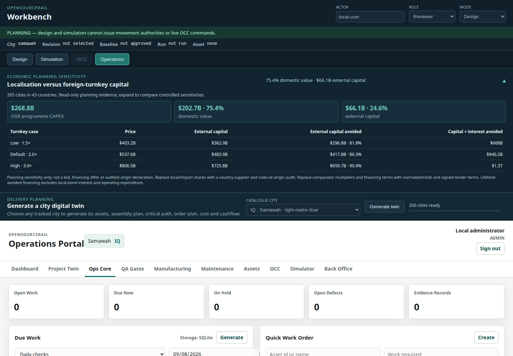
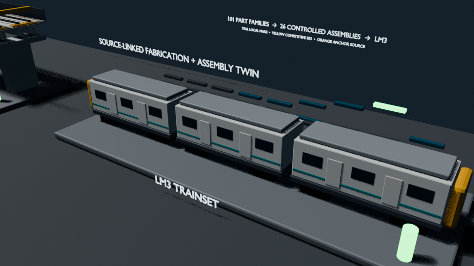
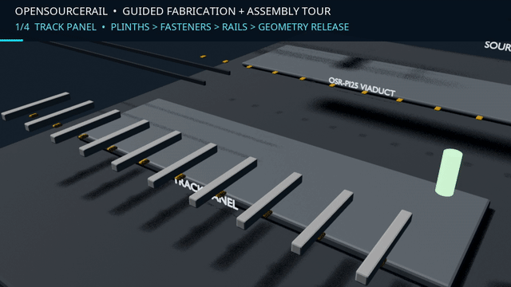

# OpenSourceRail

OpenSourceRail is an open-source, deterministic urban-rail platform with a different economic model: retain design authority, software, fabrication, integration, operations and maintenance capability in-country instead of importing a closed foreign-turnkey system. GIS, CAD/IFC, simulation, cost and assurance share one Git-reviewable model.

> [!IMPORTANT]
> Repository outputs are planning and engineering-screening evidence—not bids,
> construction releases, safety certificates, approvals or endorsements.

The current survey, supplier, drawing, embedded-hardware, physical-test and
approval gaps are consolidated in the [reviewed roadmap](docs/ROADMAP.md#reviewed-open-work).
Useful CAD, IFC, PDF, image and animation artifacts remain tracked in GitHub;
CI enforces a simple 50 MiB per-file ceiling rather than removing them from the
public package.


**Start here:** [complete PDF book](OpenSourceRail-Book.pdf), [one-page overview](docs/open-source-rail-overview.html), or `./install.sh` then `./osr`.

The public evidence scope covers **265 cities in 43 developing countries**. One European comparison model in the 266-model engineering catalogue is retained only for technical inspection and excluded from public evidence and examples.

## The Economic Case

The developing-world model places **about $203B—roughly 75% of programme value—in domestic activity**. Specialist imports are modeled at roughly one quarter. Comparative foreign-turnkey savings vary materially with procurement, financing and localisation assumptions, so exact sensitivity results stay in the reproducible [portfolio calculation](docs/portfolio-summary.md), not the headline claim. These are planning scenarios—not bids, audited origin claims or financing offers.

The route keeps civil works, vehicle structures, GFRP panels, interiors, wiring, software, integration and maintenance local where qualified. Specialist products use [27 real supplier/research-family anchors](design/component-catalogue/catalog/buildable-trainset/supplier-anchors.md); every bought-in row has a fit gap and anchor-or-local-equivalent rule. Operators can localise progressively without silently changing safety assumptions, retaining skills and maintainable assets while reducing foreign-currency exposure.

## Feature Highlights

OpenSourceRail is three connected products at deliberately different maturity:

| Product | v0.3 maturity | Safe starting use |
|---|---|---|
| Design & Delivery Platform | Serious demonstration | City GIS, alignment, cost, IFC, procurement, schedule and project twin |
| Train + Infrastructure Reference System | Engineering development | Local-manufacture planning, supplier RFQs, prototype and civil option studies |
| Open GoA 4 Control System | R&D / pre-certification | Simulation, shadow mode, formal review and HIL—not live railway command |

The first adoptable product is the non-safety owner/operator stack: simulator, Ops Core, asset register, QA, maintenance and evidence portal for an existing workshop, depot or pilot corridor. See the [adoption boundary](docs/first-adoptable-product.md).

| Capability | Current implementation |
|---|---|
| Deterministic city generation | Reproducible network, station, fleet, energy, engineering, finance and operations packages under [cities/catalogue/](cities/catalogue/README.md). |
| Generatable project digital twin | Every city regeneration joins its assets, BOM, finite-resource CPM, critical path, manufacturer candidate IDs and selection states, supplier/order-by plan, schedule of values, monthly local/import cash requirements, QA gates and construction-state timeline in one revisioned model. The compact summary is kept on GitHub; issued orders, deliveries, invoices, payments and actual progress persist separately in Ops Core. |
| Integrated Workbench | [City Studio, simulation, OCC training and Ops Core](docs/workbench/README.md) share city, actor, immutable revision, approved baseline, run and selected-asset context without merging authority boundaries. |
| Interactive network and service planning | Edit lines, stations and alignment over 16 switchable local GIS layers; inspect roads, buildings, water, existing rail, demand, buildability, places and engineering assets; plan OD demand and service by line/day/time; compile content-addressed revisions for Git review. |
| Software in the loop | One deterministic simulation connects train, station, energy, wayside, point/crossing, regenerative-braking and depot components to OCC evidence. |
| Independent operations cross-check | OSR publishes per-line reference journey times and compares them with a scenario-bound SUMO model using the actual opportunity-charging dwells. [Samawah](cities/catalogue/west-asia/Iraq/Samawah/engineering/simulation/operations-crosscheck.md) and [Mosul](cities/catalogue/west-asia/Iraq/Mosul/engineering/simulation/operations-crosscheck.md) pass the automatic running-time screen; junction-conflict evidence and authority acceptance remain explicitly open. |
| Civil BIM, GIS and field evidence | Generate OSR-ALN, GIS, IFC4.3, IDS/BCF, quantities, classifications and 4D construction review through the [Bonsai civil workflow](docs/civil/bonsai-ifc-workflow.md). The [reusable civil release register](design/component-catalogue/catalog/buildable-civil/reusable-type-release-register.md) gives all 19 federation types one accountable path through six packages and nine non-issued drawing briefs. City Studio issues the [survey/site brief](cities/catalogue/west-asia/Iraq/Samawah/engineering/survey/field-evidence-brief.md); deterministic gates cover control, ground, [alignments](cities/catalogue/west-asia/Iraq/Samawah/engineering/survey/surveyed-alignment-readiness.md), [route fit](cities/catalogue/west-asia/Iraq/Samawah/engineering/survey/route-station-fit-readiness.md), [drainage/foundations](cities/catalogue/west-asia/Iraq/Samawah/engineering/survey/drainage-ground-readiness.md), and [per-asset structural release](cities/catalogue/west-asia/Iraq/Samawah/engineering/survey/structural-release-readiness.md), with authority acceptance kept separate. |
| Station and civil product geometry | All seven controlled station archetypes have [native FreeCAD and geometric IFC4.3 assemblies](docs/stations/README.md), covering all 45 station product families. The 4,384 native station shapes provide installed/exploded states, coordinate-bearing train/track/optional-PSD/edge interfaces, the synchronized LM3 lifting/bogie-change bay, and other maintenance zones; a [bidirectional register](design/component-catalogue/catalog/buildable-stations/station-product-reconciliation.md) rejects orphan IDs across BOM, traveler, drawing definition, FreeCAD and IFC. Nine [factory/release packages](design/component-catalogue/catalog/buildable-stations/factory-release-work-packages.md), 18 [drawing-definition seeds](design/component-catalogue/catalog/buildable-stations/factory-drawings/index.md) and 29 [reference defaults](design/component-catalogue/catalog/buildable-stations/default-product-specifications.md) cover reusable definition, supplier configuration and deployment-specific scope while keeping all release evidence open. The civil catalogue also includes turnout operating/detection hardware, depot services and reusable bearing, expansion-joint, walkway/service and approach-transition interfaces. |
| Station engineering screens | The tracked [station systems report](engineering/analysis/stations/screening-summary.md) runs OpenSees canopy gravity/uplift, JuPedSim normal/degraded/egress and per-bay SWMM drainage across all seven variants. EnergyPlus/FDS retain the failed enclosed depot baselines and screen the proposed separated open energy compound plus N+1 cooled controls room; six [deployment work packages](engineering/analysis/stations/mitigation-work-packages.md) keep supplier, site, fire-strategy and approval evidence open. |
| Buildable modular trainset | The controlled [`LM3-FA-001` first-article baseline](design/component-catalogue/catalog/buildable-trainset/first-article-baseline.json) controls 120 product rows and 26 assembly nodes, including dedicated chassis/body modules, front glass/lamp fitout, roof/HVAC/PV fairings, interior service panels, recovery interfaces and [simplified exterior finishes](design/component-catalogue/catalog/buildable-trainset/exterior-finish-system.md). Git includes [120 separate native FreeCAD parts and 26 tested assemblies](design/component-catalogue/models/cad/README.md), matching [split IFC4.3 files](engineering/models/bim/reference/README.md), 619 geometric primitives, nine timed methods, 30 tooling/mould families, 16 [factory packages](design/component-catalogue/catalog/buildable-trainset/factory-release-work-packages.md), 29 [drawing-definition seeds](design/component-catalogue/catalog/buildable-trainset/factory-drawings/index.md) and shop travelers. The package-level [factory readiness register](design/component-catalogue/catalog/buildable-trainset/factory-release-readiness.md) keeps all 16 packages open until controlled drawings, exact product revisions, tooling, verification and approvals exist. All 62 locally made rows now have controlled drawing ownership as well as geometry/routes; all 120 rows have [mass responsibilities](design/component-catalogue/catalog/buildable-trainset/mass-closure-ledger.md), while supplier, production-solid, weighing and physical-test closure remains open in the [public work packages](design/component-catalogue/catalog/buildable-trainset/first-article-work-packages.md). |
| Automatic cost propagation | CAD-indexed quantities feed the civil rate contract, city CAPEX, finance, IFC properties, national briefs and the developing-world [portfolio summary](docs/portfolio-summary.md). |
| Operations and assurance | Authenticated city-scoped roles, managed photos/files, server-attested inspections and independent handback, controlled document revisions, NCR closeout, verified backups and acceptance evidence remain linked to source artifacts. |
| Deterministic browser testing | Pinned Playwright acceptance verifies the integrated browser applications, adapters, engineering jobs and restart persistence. |

## Generate A City Delivery Twin

The city model is not limited to a route drawing or cost total. Regeneration creates a linked planning baseline that answers **what must be built, what must be ordered, when it is required, which work is critical, and when local and foreign-currency cash is needed**:

```text
city GIS + design + fleet
          ↓
asset register → BOM demand → supplier/order-by plan
          ↓             ↓
finite-resource CPM → schedule of values → monthly cash requirements
          ↓
IFC/visualization state timeline + QA/work orders + recorded actuals
```

Use **Workbench → Generate a city digital twin** to select any catalogue city, regenerate it and open the result without a shell. Each city publishes a compact [`engineering/project-twin/summary.json`](cities/catalogue/west-asia/Iraq/Samawah/engineering/project-twin/summary.json); its reproducible operations bundle contains the complete task, procurement, cashflow and visualization records. Open **Workbench → Operations → Project Twin** to inspect the baseline and turn a planned requirement into a persisted draft purchase order. These are planning candidates—not issued contracts or construction releases—until the city records approval and actual commercial data.

The model uses about **$0.9M per 3-car light-metro trainset** as a local
factory-gate planning target (LM3 build record: $885k) and **$60k per supported vehicle/car module** for one shared country factory. Homologation, supplier
qualification, first-of-class engineering, warranty and deployment are
separate gates and cannot be compared directly with an OEM delivered price.

## Current System

| City Studio | Civil IFC coordination | Any-city project digital twin |
|---|---|---|
|  |  |  |

| Trainset assembly | Simulation | Fabrication and civil sequence |
|---|---|---|
|  |  |  |

Review the full [88-second product assembly](engineering/models/digital-twins/fabrication-assembly/fabrication-assembly-digital-twin.mp4) and [48-second civil IFC sequence](engineering/models/bim/reference/civil-construction-sequence.mp4).

## Find Your Way

Use this only human-facing front door instead of browsing the generated file inventory.

| I want to… | Go here |
|---|---|
| Understand the whole system | [Architecture](docs/ARCHITECTURE.md) and [software diagrams](docs/software-architecture-diagrams.md) |
| Design a city, line, station or service | [Workbench](docs/workbench/README.md) and [City Studio](docs/city-studio.md) |
| Explore a country or city | [City catalogue](cities/catalogue/README.md); each local page contains only local evidence |
| Review costs or the portfolio | [Cost model](docs/cost-model.md) and [developing-world portfolio](docs/portfolio-summary.md) |
| Review trains, civil works or stations | [LM3 trainset](docs/rolling-stock/light-metro-3car/README.md), [civil](docs/civil/README.md) and [stations](docs/stations/README.md) |
| Review software, control electronics or operations | [Simulation coverage](docs/simulation-software-coverage.md), [control electronics](control-electronics/README.md) and [operations](docs/operations/README.md) |
| Review safety, certification or open gaps | [Certification](docs/certification/README.md), [safety case](docs/safety-case/README.md) and [roadmap](docs/ROADMAP.md) |
| Understand the deployable signalling boundary | [Conservative pilot signalling profile](docs/certification/pilot-signalling-profile.md) and [safety-controller selection gate](control-electronics/safety-controller-selection.md) |
| Contribute or make a release | [Contributing](CONTRIBUTING.md) and [release checklist](docs/releases.md) |
| Share a short non-technical summary | [Generated one-page overview](docs/open-source-rail-overview.html) |
| Read the complete documentation | [Complete PDF book](OpenSourceRail-Book.pdf); rebuild it with `./osr book` |

## Run The Platform

### One-command Linux setup

On Debian, Ubuntu, Mint, Fedora, RHEL, Rocky, AlmaLinux, CentOS, openSUSE or
Arch Linux, install the entire platform with one command:

```bash
./install.sh
```

It first reports what is already installed. Declining the installation makes
no changes; accepting installs only missing native libraries and keeps Rust,
Node.js, Python, uv, Trunk and browser tools under your home folder. It then
asks whether to add the larger FreeCAD, Blender/Bonsai, QGIS, CloudCompare,
SUMO, RTKLIB, EnergyPlus and FDS applications, and whether to start the GUI. There are
no setup options or environment variables to configure.

After setup, one command regenerates the shared design and cost data, product
catalogues, browser and native applications, BOMs, IFC4.3 reference packages,
the root PDF book, and documentation checks:

```bash
./osr build
```

It uses the checked-in city models and therefore does not silently reroute all
265 public city plans from changing internet data. Route changes are made in
City Studio or regenerated explicitly with their source locks.

Run the integrated Workbench:

```bash
./osr
```

Open <http://127.0.0.1:8090/>. The local development server is not an
authenticated public deployment.

Run the deterministic simulator:

```bash
./osr sim --duration 3600 --status-every 300
```

Disposable generated applications remain under `build/frontend/`, native
executables under `target/release/`, and other local job output under `build/`.
The public review set is deliberately outside those temporary trees: the
[reader book](OpenSourceRail-Book.pdf), tracked
[CAD assemblies](design/component-catalogue/models/cad/) and
[BIM coordination package](engineering/models/bim/reference/) are available
directly from GitHub.

## Evidence And Revision Model

```text
city/project sources
        ↓
validated candidate + source locks
        ↓
immutable Git-reviewable revision
        ↓
GIS / OSR-ALN / IFC / CAD / cost / simulation artifacts
        ↓
approval evidence → training/operations baseline
```

Planning and training views cannot emit live OCC commands. A revision hash is
not an approval; approval records are append-only and must reference independent
review evidence. Generated city packages still require survey, calibrated
demand, utility and ground data, supplier selection, first-article testing,
competent engineering review and national authorization.

## Source Of Truth

Change the source in the middle column and regenerate the output on the right.
Generated files are review evidence, not parallel inputs.

| Concern | Edit here | Derived or explanatory material |
|---|---|---|
| System boundaries and decisions | [`docs/ARCHITECTURE.md`](docs/ARCHITECTURE.md) and accepted [`docs/rfcs/`](docs/rfcs/README.md) | Diagrams, guides and component summaries |
| Software and simulation behaviour | [`crates/`](crates/README.md) plus their tests | WASM applications, simulation traces and coverage reports |
| GIS ingestion, city synthesis and scenario generation | [`design/city-generation/`](design/city-generation/README.md) | Published city catalogue and simulator inputs |
| Shared planning assumptions | [`lib/templates/`](lib/templates/) and [`lib/recipes/`](lib/recipes/) | City designs, finance, energy and engineering evidence |
| City catalogue membership | [`lib/city-batches/world-sample.toml`](lib/city-batches/world-sample.toml) | [`cities/catalogue/`](cities/catalogue/README.md) catalogue and national briefs |
| Interactive city revisions | [`cities/workspaces/`](cities/workspaces/README.md) | Content-addressed candidates and exported city packages |
| Mechanical, station and reusable civil-component geometry | [`design/component-catalogue/src/osr_mech/`](design/component-catalogue/src/osr_mech/) | FreeCAD review assemblies, BOMs, travelers, civil release register and screenshots |
| LM3 bought-in component candidates | [`lib/templates/trainset-cots-candidates.toml`](lib/templates/trainset-cots-candidates.toml) | Generated manufacturer register, first-article work packages and city-twin order candidates |
| Survey, GIS and railway alignment | Accepted deployment GIS plus OSR-ALN project sources | QGIS layers, GeoPackages, corridor exports and IFC alignment references |
| Federated civil BIM | Parametric component geometry plus approved alignment and engineering inputs | IFC4.3 generated by [`civil_bonsai_ifc.py`](engineering/interchange/civil_bonsai_ifc.py), checked with IfcOpenShell and reviewed in Bonsai |
| Civil rates and city costs | [`lib/templates/civil-cost-calibration.toml`](lib/templates/civil-cost-calibration.toml), geometry and reviewed assumptions | Generated rate contract, [cost model](docs/cost-model.md) and city CAPEX |
| Control-electronics integration | [`control-electronics/`](control-electronics/README.md) and governing RFCs | Electronics BOMs, wiring packs and release evidence |
| Project controls, operations and safety requirements | [`lib/templates/manufacturing-schedule.toml`](lib/templates/manufacturing-schedule.toml), [`docs/operations/`](docs/operations/README.md), [`docs/certification/`](docs/certification/README.md) and [`engineering/assurance/formal/`](engineering/assurance/formal/README.md) | Per-city CPM/order/cashflow twin, portal data, safety-case views and acceptance reports |

The [artifact policy](docs/repository-artifact-policy.md) defines what Git keeps.
The generated [Markdown inventory](docs/INDEX.md) is for search and CI only; it
does not define architecture, status or reading order.

## Verification

```bash
./osr test
```

See [CONTRIBUTING.md](CONTRIBUTING.md), [GOVERNANCE.md](GOVERNANCE.md),
[CHANGELOG.md](CHANGELOG.md) and the [release checklist](docs/releases.md).

## License

Software is Apache 2.0; control-electronics and open physical designs use
CERN-OHL-S v2; documentation is CC-BY-SA 4.0.

See [LICENSE.md](LICENSE.md) and [LICENSES/](LICENSES/README.md) for full texts.
