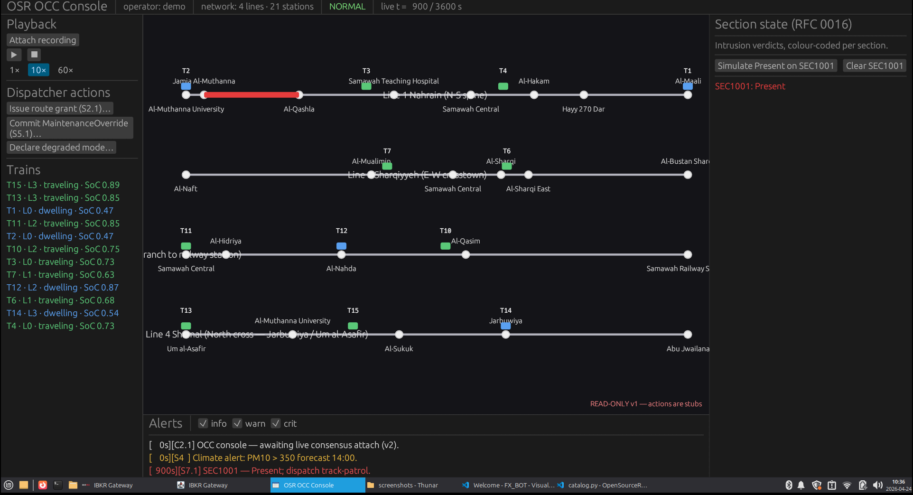
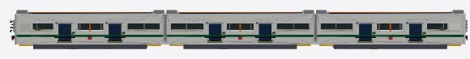
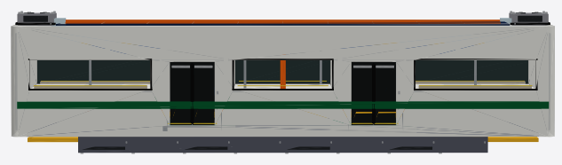
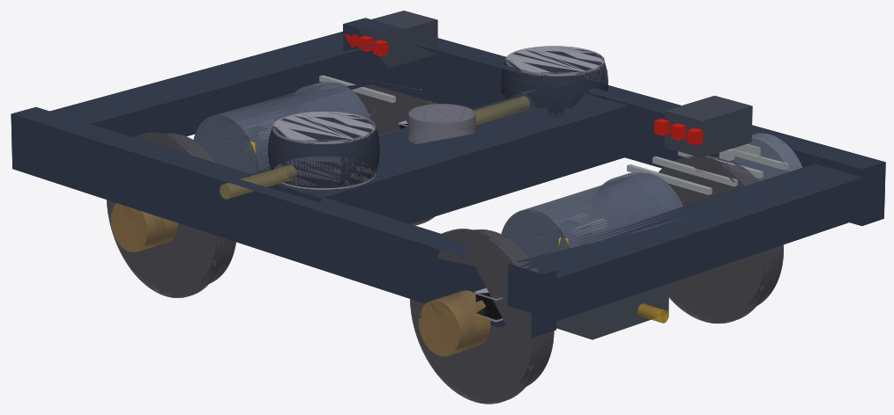
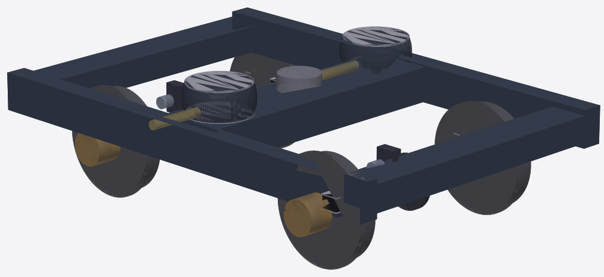
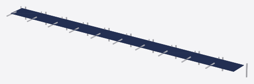
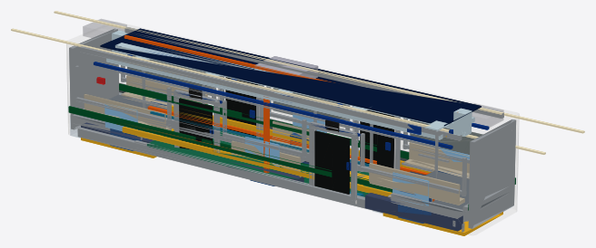

# OpenSourceRail


> An open-source technology stack for designing, building, and operating rail
> systems — built for the developing world, built to be owned by the countries
> that deploy it.

**Current milestone:** [**v0.1**](CHANGELOG.md) — first publishable
snapshot. The software + documentation surface is complete enough for
a deployment partner to start with. See [CHANGELOG.md](CHANGELOG.md)
for what's ready, what needs external hands (KiCad capture, civil
survey, regulator engagement, operator review), and how to engage.

**Status:** 56 Rust crates (747 tests passing, 0 failing) plus two Python
sidecars (`design-py` for GIS + network synthesis, `mechanical-py` for
parametric mechanical + civil + station components under build123d).
Deployments ship as **GoA 4 (Unattended, driverless)** from day one
per [RFC 0015](docs/rfcs/0015-driverless-operation.md) — the driver
cab is replaced by a nose-cone obstacle-detection sensor suite
(ultrasonic safety belt + solid-state LIDAR + mmWave radar + stereo
camera) on a dedicated T-OBS ECU, with **wayside track-intrusion
detection** ([RFC 0016](docs/rfcs/0016-wayside-track-intrusion.md))
covering the proactive half of the safety envelope between trains.
The Samawah four-line reference scenario
([RFC 0003](docs/rfcs/0003-samawah-reference-deployment.md)) runs end-to-end,
and the design pipeline now synthesises multi-line networks for arbitrary
cities directly from OpenStreetMap — **including road-snapped corridors**
computed by networkx shortest-path on the OSM graph.


*Samawah reference deployment — **auto-planned** end-to-end by
`osr_planner` (linear-logic algorithm, 2026-04-24) against real
OSM data. Four lines, 29 stations, 45 km of double-track, 7
interchanges, **100 % transfer reachability**, 84.8 % anchor-
weighted coverage:
**Line 1** (blue, 11 stations, 12 km): south-bank residential →
hospital cluster → city centre → northern neighbourhoods;
**Line 2** (orange, 11 stations, 11 km): SE residential →
central interchange → NW residential;
**Line 3** (green, 11 stations, 13 km): east rail corridor →
centre → west residential (Abu Jwailana);
**Line 4** (magenta, 8 stations, 9 km): intercity **Samawah
Railway Station** feeder through SW residential pocket into
the centre. Every station sits on an OSM anchor cluster
(weight-averaged within 500 m); every polyline follows the
arterial graph (trunk / primary / secondary / tertiary —
residential streets excluded by construction so no zigzag).
Lines extend generously 2.5 km past the last anchor into
suburban fringe for future growth. Regenerate end-to-end with
`./scripts/regenerate-samawah.sh`.*

Twenty-one RFCs cover the full system from software
architecture through rail civil engineering to driverless operation; the
operations rulebook ([RFC 0013](docs/rfcs/0013-operations-rulebook.md)) is
drafted across four shipping role families (dispatcher / station-staff /
maintenance / control-centre) plus a historical driver section retained
for GoA 2 legacy fleets. Most of the
[RFC 0005](docs/rfcs/0005-sbc-software-architecture.md) crate map is in tree:

- **Onboard safety chain (SIL-4):** position fusion → ATP → brake + obstacle-
  detect (GoA 4 driverless) + derailment + fire + door-control, all pure
  functions, integrated into the simulator as a per-tick shadow stack. Zero
  spurious emergencies under nominal service. `osr-vigilance` and `osr-dmi`
  are kept in tree under the `goa2-cab` feature flag for legacy fleets but
  disabled by default.
- **Operator GUIs (RFC 0018), feature-complete + WASM:** two
  pure-Rust egui apps sharing
  [`osr-gui-shared`](crates/osr-gui-shared/) for rendering, both
  targeting native + browser (WebAssembly via trunk).

  [`osr-sim-gui`](crates/osr-sim-gui/) is the designer's workbench —
  load a scenario, run the sim once, then play back the resulting
  [`SimTimeline`](crates/osr-sim/src/timeline.rs) with scrubber +
  0.5×/1×/10×/60× speeds. Trains animate along the strip coloured
  by phase; click-to-inspect sidebar shows `station_m`, SoC, and
  last event; scrolling event log filters by kind; active faults
  surface as timestamped badges over the map.

  

  [`osr-occ-gui`](crates/osr-occ-gui/) is the dispatcher console —
  per-section `IntrusionState` overlay, train roster panel, alert
  feed with info/warn/crit filters, and **validated action
  modals** for S2.1 route grant, S5.1 `MaintenanceOverride`, and
  RFC 0013 §5 degraded-mode declaration. v1 is read-only; v3 of
  the RFC wires live consensus + RFC 0017 signed envelopes for
  revenue use.

  
- **Onboard obstacle detection (SIL-4, RFC 0015):** `osr-obstacle-detect`
  fuses a multi-physics sensor suite — 4× ultrasonic (close-range safety
  belt, 0.2–20 m), solid-state LIDAR (5–200 m primary 3D, affordable
  Chinese Livox / RoboSense / Leishen-class units), mmWave radar (all-
  weather validation), stereo camera (classification only) — into an
  `ObstacleVerdict` per tick: `Clear` / `RestrictedSpeed` (40 km/h cap,
  LIDAR degraded) / `CrawlOnly` (15 km/h cap, soft obstacle) /
  `EmergencyBrake`. **Two sensor packs per trainset, one at each end**;
  either nose can lead on a given run. Five SIL-4 properties O1–O5 with
  Kani harnesses + 8 proptests; 2oo2 peer cross-check fail-restrictive.
  The sim now **injects sensor faults on a scenario schedule** (LIDAR
  offline, radar offline, ultrasonic channel stale, peer disagreement —
  per-train or fleet-wide) and the shadow stack produces the expected
  verdicts end-to-end; see [`designs/west-asia/Iraq/Samawah/samawah-obstacle-fault.toml`](designs/west-asia/Iraq/Samawah/samawah-obstacle-fault.toml).
  Wayside intrusion injection likewise — [`designs/west-asia/Iraq/Samawah/samawah-wayside-intrusion.toml`](designs/west-asia/Iraq/Samawah/samawah-wayside-intrusion.toml)
  stages Present/Unknown verdicts on specific sections and the
  interlocking's gate (d) holds MA without any train entering.
- **Wayside track-intrusion detection (SIL-4, RFC 0016):**
  `osr-intrusion-detect` on the W-SBC fuses fence-line contact
  sensors, ROW-mounted solid-state LIDAR, ROW-mounted mmWave radar,
  and CCTV classifier into a per-section `IntrusionVerdict` —
  `Clear` / `Unknown` / `Present`. Fail-restrictive: a stale sensor
  yields `Unknown`, not `Clear`. The verdict flows into the consensus
  log as `EntryPayload::SectionIntrusion`, and
  `osr-interlocking::section_available_to` gate (d) withholds MA on
  any section whose verdict is not `Clear` (sections with no verdict
  are treated as "not instrumented" — backwards-compatible for
  partially-wired deployments). Five SIL-4 properties I1–I5 with
  Kani harnesses + 6 proptests; GSN goals G20–G24 close against real
  evidence. Complements the onboard obstacle-detect — wayside is
  proactive (before a train enters), onboard is reactive.
- **Integrator crate + feature-gated legacy stack:**
  [`osr-trainset-image`](crates/osr-trainset-image/) aggregates the
  onboard stack into one versioned deployment unit. Default build is
  **GoA 4 (Unattended)** per RFC 0015; `--features goa2-cab` opts in
  to legacy cabbed fleets by pulling `osr-dmi` + `osr-vigilance` into
  the image. `cab_profile()` is a compile-time witness for which
  profile the image was built with.
- **Parametric rolling stock in mechanical-py (RFC 0015 cabless):**
  sensor cowl, symmetric car body with door cutouts, 2-axle bogie
  simplified block, and the four published trainset families
  (`tram-2car`, `light-metro-3car`, `metro-4car`, `metro-6car`) all
  parametric on consist + track geometry. Every trainset fits
  inside its RFC 0008 §1 platform length with ≥ 1 m stopping margin.
  STEP artifacts round-trip into Revit / Tekla / Civil 3D.

  

  *Light-metro-3car reference trainset: three 22 m cars coupled end-
  to-end with a sensor cowl at each end. Every car is a welded-
  aluminium monocoque with rounded vertical corners, large bonded
  side glazing, three double-leaf sliding doors per side, a painted
  livery band at window-sill height, an underframe skirt between
  the bogies, a rooftop HVAC plus auxiliary plant, and **side-wall
  traction-battery strakes** (RFC 0021 bustle-wall pattern — Na-ion
  cells under the longitudinal bench seats, centre aisle stays
  clear at low-floor level-boarding height). No cab, no windscreen,
  no pantograph, no directionality — either end leads.*

  

  *Single-car side elevation showing the design features: rounded
  200 mm vertical-corner radius, four side windows (light-blue
  laminated glazing shown), three inset double-leaf doors in
  contrasting dark-blue livery, the livery band running full length
  at window-sill height, the dark underframe skirt, and the
  rooftop HVAC + two auxiliary boxes.*

  

  

  *Detailed bogie CAD per [RFC 0022](docs/rfcs/0022-bogie-traction-drive.md).
  **Motor bogie** (top): 2-axle Bo-Bo pivoting bogie with axle-hung
  PMSM traction motors (180 kW continuous / 320 kW peak per axle),
  single-stage 6.5:1 parallel-spur gearboxes, chevron rubber-metal
  primary suspension, air-spring secondary suspension, 760 mm forged
  wheels, one axle-mounted brake disc per axle. **Trailer bogie**
  (bottom): same frame + wheelsets + suspension SKU with the motor-
  gearbox drivetrains omitted — one single bogie pattern scales
  across every consist family with per-family motorisation.*
- **Onboard traction & power:** `osr-traction` + `osr-bms` + `osr-regen` +
  `osr-aux-power`, with signed-current sign convention enforced at the seam.
- **Onboard systems:** `osr-tcms`, `osr-hvac`, `osr-lighting`, `osr-dmi`,
  `osr-pis-onboard`, `osr-hot-axle`, `osr-odometry`, `osr-event-recorder`,
  `osr-tcn` (IEC 61375-style TSN trainbus, mock transport).
- **Wayside core:** `osr-interlocking` (MA computer) on top of `osr-consensus`
  (a Rust refinement of the TLA+ SMRaft spec, proptest-verified against all 5
  safety invariants; the sim can drive MA through a real 3-node Raft cluster
  via `--use-consensus`). `osr-wayside-points` controls power switches with
  dual-redundant sensor fusion and fail-restrictive Unknown detection.
- **Wayside infrastructure (Phase 2d):** `osr-balise`, `osr-level-crossing`
  (SIL-4 five-state barrier controller), `osr-hot-axle-wayside` (SIL-4 HABD),
  `osr-energy-site` (PV + battery + grid-tie dispatch).
- **Stations & fare:** `osr-psd` (platform screen doors), `osr-station-scada`,
  `osr-pis-station`, `osr-afc` (HMAC-signed account-based tokens), `osr-tvm`.
- **Back office:** `osr-occ` (dispatcher), `osr-historian` (ring-buffered
  per-metric storage with decimation), `osr-analytics`, `osr-t2g`.
- **Simulator:** multi-day runs, time-of-day dispatch, PV + trackside storage
  + grid tie energy model, fault injection, shadow onboard stack. Every
  section entry is gated by `osr-interlocking::section_available_to`
  against a synthesised log — the MA computer is the sim's only source of
  occupancy (RFC 0004 M5). Scenarios in TOML so anyone can design their
  own city.
- **Differential Python reference interpreter:** `tools/reference-ma/` —
  an independent stdlib-only Python twin of `osr-interlocking`. Every
  proptest run of `crates/osr-interlocking/tests/differential.rs`
  serialises a random log prefix, computes the MA in both Rust and
  Python, and asserts byte-identical JSON. Coverage extends to ring
  lines, switch observations, route grants, and speed restrictions.
  Catches bugs in either implementation (RFC 0004 M4).
- **GSN safety-case compiler:** `osr-safety-case` loads the TOML
  claim files in `docs/safety-case/gsn/` (19 goals, 5 strategies, 50
  solutions today — the G1/G2/G3 MA-computer claims, plus G4/G5
  covering every SIL-4 onboard and wayside evaluator, plus a
  regression guard for the 5-node Raft fix) and CI fails if any
  goal no longer traces to evidence. Adding a safety-relevant claim
  without linking it to a Kani harness / proptest / sim run breaks
  the build (RFC 0005 §4.9).
- **Kani harnesses on every SIL-4 evaluator:** ATP A1–A7, brake
  B1–B5, vigilance V1–V6, odometry O1–O5, wayside-points W1–W6, plus
  the MA computer's P1–P5 (scaled to a 3-section network with a
  mutation-style P4 companion) — the full pure-function surface of
  the onboard and wayside safety chains has bounded formal proofs in
  tree to match every proptest property.
- **Real network transport for TCN:** `osr-tcn::UdpTcn` — drop-in
  API replacement for the in-memory mock, running on commodity UDP
  (one datagram per message, 5-byte header, ≤ 1400-byte payload).
  Moves the on-train bus from simulator-only to multi-host bench
  without dragging in TSN hardware. Full TSN stays ahead on the
  RFC 0006 roadmap (v3).
- **Automatic design generation:** `design-py` (Overpass + raster synthesis) +
  `osr-routing` (cost/demand Dijkstra on a 20 m grid) + `osr-design` (emitter)
  compose a full multi-line network — corridor geometry, station placement,
  civil-class inference (at-grade / elevated / bridge — no tunnels per
  [RFC 0011](docs/rfcs/0011-civil-infrastructure-design-standard.md)),
  **rolling-stock + track-geometry + station-archetype selection under the
  RFC 0008/0009/0010 compatibility matrix** — from nothing but a bounding box
  and a population. Terminals are detected at line endpoints; interchanges
  are detected where two lines' stations land within 200 m of each other;
  every station gets a derived platform length consistent with the chosen
  consist family. Scales to a 500-city batch with a GeoNames-driven scanner
  that excludes any city already operating metro, tram, or light-rail.

- **Parametric mechanical + civil + station catalogue:** `mechanical-py`
  ships build123d assemblies for every non-trivial physical piece of
  the system — UIC 54E1 / 60E1 rail, EN 13230 B70-class sleeper,
  Pandrol-style fastener, precast U-girder (20/25/30 m), precast L-unit
  platform edge, and a prefab-bolt-together steel portal-frame bay
  with a factory-bonded solar-roof sandwich panel that composes into
  a full canopy by `(archetype, consist)`. `osr-mech-export`
  regenerates 33 STEP artifacts under `catalog/` that round-trip into
  Revit, Tekla, Civil 3D, and FreeCAD — deployment partners keep
  their existing structural tooling while the repository stays the
  canonical source. Design bias throughout: **prefab, bolt-together,
  no on-site welding, no wet concrete except pad footings** — a
  `standard` station canopy is ~11 t of steel in two lorry-loads,
  erected in 3–5 days.

  

  *Standard archetype canopy for a light-metro-3car consist: 13 × 6 m
  portal bays in hot-dip galvanised steel, topped by a factory-bonded
  sandwich panel that integrates the PV surface. One canopy covers the
  full platform — no separate station building, no catenary.*

- **OSR-ALN civil-tool bridge (RFC 0009 v3):**
  [`tools/osr-aln-convert/`](tools/osr-aln-convert/) is a
  stdlib-only Python converter from **LandXML 1.2** to
  [OSR-ALN TOML](docs/civil/osr-aln-format.md) — one CLI
  (`landxml-to-osr-aln`) covers Civil 3D, Bentley OpenRail,
  Trimble Business Center, and QGIS rail-path plugin exports.
  Reads tangents, circular curves, spirals, vertical PVIs +
  circular vertical curves, and station pin-points; emits
  placeholders for civil class + cant (not carried by
  LandXML). A companion `osr-aln-validate` CLI enforces the
  format spec's 8 hard gates + 3 soft gates against the
  deployment's design.toml (per-preset curve radius, gradient,
  cant maxima; civil-span contiguity; station-id cross-check;
  no tunnels). 21 passing tests. **Worked reference alignments
  for both Samawah lines** ship at
  [`docs/civil/west-asia/Iraq/Samawah/samawah-line1.aln.toml`](docs/civil/west-asia/Iraq/Samawah/samawah-line1.aln.toml)
  (13 km radial, 12 stations, 3 cant sections) and
  [`docs/civil/west-asia/Iraq/Samawah/samawah-line2.aln.toml`](docs/civil/west-asia/Iraq/Samawah/samawah-line2.aln.toml)
  (16 km ring, 10 stations, 4 cant sections, `is_ring = true`) —
  both pass every hard gate. This is the last-mile piece that
  lets a civil engineer import a real survey into the project.
- **EN 62267 type-certification pre-submission pack** at
  [`docs/certification/`](docs/certification/) — system
  description + SRS (SR-01..SR-24) + hazard log (17 hazards
  across 7 classes) + evidence register + clause-by-clause
  EN 62267 compliance matrix. Every safety requirement traces to
  a Kani harness / proptest / GSN goal / rulebook rule.
  Ready for an independent safety assessor (deployment-partner
  scope).
- **Consensus-log message authentication (SIL-2, RFC 0017):**
  `osr-crypto` now ships ed25519 sign + verify primitives alongside
  the existing HMAC-SHA256; `osr-secbus` wraps them with a per-
  deployment `KeyRegistry` and a `SignedBytes` envelope that carries
  issuer + signature alongside the opaque entry bytes. Verification
  happens before deserialisation so a hostile payload can't exploit a
  parser bug pre-auth. Three SIL-2 properties S1–S3 with Kani harnesses
  + 5 proptests; GSN goals G25–G27 close against real evidence.

Still to come: KiCad schematics and gerbers for the [RFC 0007](docs/rfcs/0007-hardware-reference-designs.md)
host classes (v2 specs at [`hardware/*/schematics/v2-spec/`](hardware/)
— the board nets, pinouts, safety-critical routing rules, and power
budgets are locked; KiCad capture and PCB layout are the v3
deliverable), cybersecurity (`osr-secbus`), full TSN replacement for the
UDP TCN transport, and per-tool converter scripts for the
[OSR-ALN alignment interchange format](docs/civil/osr-aln-format.md)
(Civil 3D / OpenRail / Trimble / QGIS).

---

## Why this project exists

Urban rail is the most efficient way to move people through a growing city,
and developing nations badly need more of it. But the global rail market is
dominated by a handful of vendors — Alstom, Siemens, Hitachi, CRRC, Thales —
whose turnkey systems lock countries into decades of imports, specialized
foreign labor, and capital flight.

OpenSourceRail is a complete, permissively licensed alternative, aimed at
national railway authorities and domestic engineering firms in target regions
(sub-Saharan Africa, MENA, South and Southeast Asia, most of Latin America).
The project succeeds when an operator in one of those markets can build and
run a modern rail network with imported content limited to raw steel, copper,
and specialty items that genuinely cannot be made locally — everything else is
produced by the people who will run the railway.

## What's different

OpenSourceRail is not a reimplementation of existing vendor practice in open
code. The architecture actively deprecates legacy approaches where cleaner
ones exist. The headline bets:

- **Catenary-free.** Trains run on onboard sodium-ion or LFP batteries with
  opportunity charging at stations. Eliminates the single largest capex line
  on new-build rail (€1–3M/km of catenary) and a major copper-theft target.
  [ARCHITECTURE §4 D7](docs/ARCHITECTURE.md) ·
  [RFC 0002](docs/rfcs/0002-energy-sizing.md)
- **Solar-first energy.** PV on station canopies, depot roofs, and along the
  right-of-way the railway already owns — netting positive daily generation
  against demand in the target climates.
- **Distributed train control, not centralized.** Wayside nodes run a formally
  verified consensus protocol maintaining authoritative track state. Replaces
  €10–50M centralized zone controllers with commodity SBCs at <€5k/site.
  [RFC 0001](docs/rfcs/0001-track-state-consensus.md) ·
  [TLA+ spec](formal/tla/SMRaft.tla)
- **Commodity SBCs + Rust, end to end.** One language from the SIL-4 safety
  kernel to the dispatcher web UI. Industrial PLCs, proprietary trainbuses,
  and Windows-based SCADA are out of the default design.
- **TSN Ethernet trainbus, not MVB/WTB.** Off-the-shelf switches, deterministic
  traffic, Rust stack.
- **Account-based fare, not smart cards.** Mobile money + QR + optional NFC;
  target markets have already leapfrogged card infrastructure.
- **Machine-checkable safety case.** GSN-structured, version-controlled,
  regenerated on every commit, linked to formal proofs and test evidence.

Each deviation from established rail practice is justified against a concrete
criterion: cost, simplicity, local manufacturability, or workforce transfer.
Not novelty for its own sake.

## Scope

Eight subsystems; treat as a system-of-systems:

| Domain | What it covers |
|---|---|
| D1. Operations & Dispatch | Timetable, incident management, event-sourced platform |
| D2. Train Control | Interlocking, movement authority, ATP — the SIL-4 core |
| D3. Communications | 5G + LoRa radio, TSN wayside backbone |
| D4. Passenger Services | Fare, info displays, announcements |
| D5. Rolling Stock | Unified Rust ECUs, TSN trainbus, onboard battery + inverter |
| D6. Infrastructure | Switches, track geometry, level crossings |
| D7. Energy | PV generation, trackside storage, station charging |
| D8. Depot & Maintenance | CBM, work orders, depot microgrid |

Full description: [docs/ARCHITECTURE.md](docs/ARCHITECTURE.md).

## Repository layout

```
OpenSourceRail/
├── README.md                 You are here.
├── Cargo.toml                Rust workspace.
├── docs/
│   ├── ARCHITECTURE.md       Scope, subsystem design, roadmap. Start here.
│   ├── operations/           Full operations rulebook (RFC 0013 v2): one-sentence
│   │   │                     rule + Why: paragraph per clause, every clause
│   │   │                     cross-referenced to the relevant crate and safety-case goal.
│   │   ├── driver/           D1–D8 (before-service → emergencies → end-of-service).
│   │   ├── dispatcher/       S1–S6 (shift start → incident handling → shift end).
│   │   ├── station-staff/    T1–T5 (opening → passenger incidents → closure).
│   │   ├── maintenance/      M1–M6 (depot safety → work-on-track → fleet MX).
│   │   └── control-centre/   C1–C3 (watch roles, comms, shift handover).
│   ├── hardware/             Hardware bring-up runbooks (RFC 0007 v1).
│   │   └── bring-up/         Per-class procedures: t-ecu-s, t-ecu-a, w-sbc, s-sbc.
│   ├── rolling-stock/        Rolling-stock shop-drawing packages (RFC 0008 v1+).
│   │   └── light-metro-3car/ General arrangement, bogie, body, traction, BOM, compliance.
│   ├── civil/                Per-deployment civil alignment (RFC 0009 v1+).
│   │   └── samawah/          Line 1 + Line 2 segment table + compliance report.
│   ├── stations/             Per-archetype architectural envelopes (RFC 0010 v1+).
│   │   └── samawah-standard/ Envelope, canopy structural, accessibility, services.
│   └── rfcs/
│       ├── 0001-track-state-consensus.md   Distributed signaling core.
│       ├── 0002-energy-sizing.md           Solar+battery sizing.
│       ├── 0003-samawah-reference-deployment.md   Reference pilot.
│       ├── 0004-osr-interlocking-plan.md   MA computer implementation plan.
│       ├── 0005-sbc-software-architecture.md  Canonical 35-crate map.
│       ├── 0006-osr-tcn-design.md          On-train bus (TCN-E pub/sub).
│       ├── 0007-hardware-reference-designs.md  T-ECU/S, T-ECU/A, W-SBC, S-SBC.
│       ├── 0008-rolling-stock-reference-design.md  4 trainset families (tram → metro-6car).
│       ├── 0009-track-design-standard.md   4 geometry presets (gauge, radius, grade, cant).
│       ├── 0010-station-design-standard.md 6 station archetypes + passenger-flow model.
│       ├── 0011-civil-infrastructure-design-standard.md  At-grade + elevated only (NO tunnels).
│       ├── 0012-switches-and-crossings.md  3 turnout tangents + LX equipment envelope.
│       ├── 0013-operations-rulebook.md     ≤ 60-page per-role rulebook, 3 degraded modes.
│       ├── 0014-depot-design-standard.md   3 depot archetypes + fleet-sizing formula.
│       ├── 0015-driverless-operation.md    GoA 4 by default — sensor suite, T-OBS ECU, cab elimination.
│       ├── 0016-wayside-track-intrusion.md  Wayside intrusion detection — complements onboard detector.
│       ├── 0017-cybersecurity-message-authentication.md  Ed25519-signed consensus entries.
│       ├── 0018-operator-guis.md             egui-based sim + OCC consoles for designer + dispatcher.
│       ├── 0019-diy-electronics.md           Plug-and-play DIY electronics from commodity modules.
│       ├── 0020-crashworthiness.md           EN 15227 three-zone energy budget for the cabless body.
│       └── 0021-battery-traction.md          Side-wall battery strake + depot-only charging (Akku-inspired, catenary-free).
├── crates/                   46 Rust crates — grouped by role below.
│   ├── osr-core/             Shared domain types (topology, trains, IDs).
│   │   └── proto/track_state.proto         Interface definitions.
│   │
│   │   # Onboard safety (SIL-4)
│   ├── osr-odometry/         Onboard position fusion.
│   ├── osr-atp/              Automatic Train Protection.
│   ├── osr-ato/              Automatic Train Operation (GoA 4 default).
│   ├── osr-obstacle-detect/  NEW (RFC 0015): ultrasonic + LIDAR + radar fusion.
│   ├── osr-trainset-image/   NEW (RFC 0015): onboard-stack integrator, goa2-cab flag.
│   │
│   │   # Operator GUIs (RFC 0018)
│   ├── osr-gui-shared/       Shared egui network-rendering helpers.
│   ├── osr-sim-gui/          Simulator GUI binary — designer workflow.
│   ├── osr-occ-gui/          OCC dispatcher console binary — live-ops workflow.
│   ├── osr-brake/            EP brake + WSP + park brake.
│   ├── osr-vigilance/        Driver alerter / dead-man (GoA 2 legacy only).
│   ├── osr-derailment/       2oo2 derailment detection.
│   ├── osr-fire-safety/      Onboard fire detection + suppression.
│   ├── osr-door-control/     Door interlock + enable gating.
│   │
│   │   # Onboard traction & power
│   ├── osr-traction/         Motor control (signed-current convention).
│   ├── osr-bms/              Battery management (pack-level).
│   ├── osr-regen/            Regenerative braking arbitration.
│   ├── osr-aux-power/        Auxiliary / HVAC / lighting bus.
│   │
│   │   # Onboard systems
│   ├── osr-tcms/             Train Control & Management System.
│   ├── osr-hvac/             HVAC controller.
│   ├── osr-lighting/         Passenger/cab lighting.
│   ├── osr-dmi/              Driver-Machine Interface state.
│   ├── osr-pis-onboard/      Onboard Passenger Information System.
│   ├── osr-hot-axle/         Onboard hot-axle advisory.
│   ├── osr-event-recorder/   Black-box ring buffer.
│   ├── osr-tcn/              IEC 61375-style TSN trainbus (mock v1).
│   │
│   │   # Wayside core (SIL-4)
│   ├── osr-interlocking/     MA computer (RFC 0004 M1+M2 done).
│   ├── osr-intrusion-detect/ NEW (RFC 0016): wayside track-intrusion detection.
│   ├── osr-consensus/        Raft — refinement of formal/tla/SMRaft.tla.
│   ├── osr-wayside-points/   Power-switch (point) controller.
│   │
│   │   # Wayside infrastructure
│   ├── osr-balise/           Balise registry + sighting audit.
│   ├── osr-level-crossing/   SIL-4 five-state crossing controller.
│   ├── osr-hot-axle-wayside/ SIL-4 wayside HABD.
│   ├── osr-energy-site/      PV + battery + grid-tie dispatch.
│   │
│   │   # Stations & fare
│   ├── osr-psd/              Platform screen doors.
│   ├── osr-station-scada/    Station SCADA.
│   ├── osr-pis-station/      Station passenger information.
│   ├── osr-afc/              Automatic fare collection (HMAC tokens).
│   ├── osr-tvm/              Ticket vending machine.
│   │
│   │   # Back office
│   ├── osr-occ/              Operations Control Centre / dispatcher.
│   ├── osr-historian/        Ring-buffered metric storage w/ decimation.
│   ├── osr-analytics/        Fleet analytics (adherence, MDBF, energy/km).
│   ├── osr-t2g/              Train-to-ground radio adapter.
│   │
│   │   # Commissioning
│   ├── osr-selftest/         NEW (RFC 0019): per-role post-assembly self-test
│   │                         CLI — the DIY path's flying-probe substitute.
│   │
│   │
│   │   # Design pipeline
│   ├── osr-routing/          Cost/demand Dijkstra solver + civil-class
│   │                         inference + station placement on a 20 m grid.
│   ├── osr-design/           Orchestrator — reads rasters + anchors, emits
│   │                         design.toml + corridor.geojson + quality.yaml.
│   ├── osr-alignment/        Horizontal + vertical alignment artefact with
│   │                         cant schedule, LandXML + railML exports,
│   │                         stake-out CSV, earthworks quantities, and
│   │                         trackside-equipment placement.
│   │
│   └── osr-sim/              Time-stepped simulator + shadow onboard stack +
│                             HTML/SVG visualizer (osr-vis).
├── mechanical-py/            Python sidecar for parametric mechanical / civil /
│   │                         station components (build123d). Every RFC-level
│   │                         choice (consist, archetype, span) is a parameter;
│   │                         STEP artifacts under catalog/ round-trip into
│   │                         Revit / Tekla / Civil 3D.
│   ├── src/osr_mech/
│   │   ├── track/            Rail (54E1/60E1), sleeper (B70), fastener, panel.
│   │   ├── civil/            Precast U-girder (20/25/30 m), platform L-unit.
│   │   ├── station/          Portal-frame bay + solar-roof sandwich panel +
│   │   │                     multi-bay canopy — the full "prefab metal canopy
│   │   │                     with solar roof" reference station.
│   │   └── rolling_stock/    Cabless car body + sensor cowl + 2-axle bogie +
│   │                         full trainset (4 consist families) per RFC 0015.
│   └── catalog/              Regenerable STEP artifacts (run `osr-mech-export`).
├── design-py/                Python sidecar for GIS data + raster synthesis.
│   └── src/
│       ├── osr_osm/          Overpass fetcher w/ SHA256 disk cache (arterials,
│       │                     buildings, water, protected land, POI anchors).
│       ├── osr_geo/          Numpy raster synthesis — cost / demand /
│       │                     buildability surfaces, binary + JSON sidecar.
│       └── osr_batch/        Batch driver + GeoNames → cities.toml scanner
│                             with built-in existing-transit denylist.
├── hardware/                 Hardware reference designs (RFC 0007 v2-spec
│   │                         complete across every host class; KiCad capture
│   │                         pending).
│   ├── t-ecu-s/              Train safety kernel (2 × RP2350 2oo2 + RPi CM5).
│   ├── t-ecu-a/              Train application (RPi CM5 carrier).
│   ├── t-obs/                Train obstacle-detect ECU (2 × RP2350 + CM5 + sensors).
│   ├── w-sbc/                Wayside (Radxa CM5 RK3588S, one SKU).
│   └── s-sbc/                Station / depot (RPi CM5 + commodity carrier).
├── tools/
│   ├── reference-ma/         Python reference interpreter for osr-interlocking
│   │                         (differential twin against Rust, RFC 0004 M4).
│   └── osr-aln-convert/      NEW (RFC 0009 v3): LandXML → OSR-ALN converter
│                             for Civil 3D / Bentley OpenRail / Trimble / QGIS.
├── designs/                  City-specific design artifacts + templates.
│   ├── templates/            Reusable Lego-block TOMLs (stations, switches,
│   │                         signalling, structures, fleets, …).
│   ├── cities/               Driver inputs (calibration + world-sample + the
│   │                         500-city production scan).
│   ├── examples/             Generic template scenarios (example-simple.toml).
│   └── west-asia/Iraq/Samawah/
│                             Full per-city folder: design.toml + compiled
│                             scenario TOMLs + README with map, stats, cost.
└── formal/tla/
    ├── SMRaft.tla            Consensus protocol spec.
    ├── MCSmall.tla           Small TLC harness.
    └── MCSmall.cfg           TLC config.
```

Remaining crates from the 35-crate RFC 0005 map — notably cybersecurity
(`osr-secbus`), safety-case tooling, and full (non-mock) TCN transports — are
planned but not yet in tree.

## Quick start

Requirements: Rust 1.80+ via `rustup`.

```
cargo run --release --bin osr-sim -- --duration 3600 --status-every 300
```

This runs a one-hour simulation of the full Samawah network — Line 1
"Nahrain" (radial, 6 trainsets) plus Line 2 "Halqa" (ring, 4 trainsets),
with the two interchanges at Eastern Bridge and Al-Muthanna University,
across the time-of-day headway schedule from RFC 0003 §4.1. The output
shows each train's position and state-of-charge at regular intervals,
grouped by line, followed by a summary of per-line km, energy consumed
vs. charged, dispatch hold time (fleet idle-at-terminal time), and any
invariant violations (there should be none).

## Designing your own city

Scenarios are plain-text TOML files — stations, lines, fleets, schedules,
climate. Copy a reference and edit it:

```
cp lib/examples/example-simple.toml designs/my-city/my-city.toml
# edit my-city.toml — see lib/examples/README.md for the file format
cargo run --release --bin osr-sim -- --config designs/my-city/my-city.toml
```

Reference scenarios (per-city, alongside the design):

- **[`samawah.toml`](designs/west-asia/Iraq/Samawah/samawah.toml)** — full auto-planned Samawah network (4 lines, 45 km, 29 stations, 16 revenue trainsets + 8 spare/reserve, time-of-day schedule).
- **[`samawah-line1.toml`](designs/west-asia/Iraq/Samawah/samawah-line1.toml)** — Line 1 only, useful for scale comparisons.
- **[`example-simple.toml`](lib/examples/example-simple.toml)** — 3-station shuttle with 1 train. The smallest viable config; copy as a template.

The full file-format reference is in [`lib/examples/README.md`](lib/examples/README.md).
The same two built-in scenarios are also reachable without a config file via
`--scenario samawah` (default) and `--scenario samawah-line1`.

Pass `--json-out trace.json` to capture the full event trace for later
analysis.

## Auto-designing networks from GIS data

The hand-authored Samawah scenario is the reference; it is not the only
way in. The design pipeline can synthesise a complete two-line network for
any bounding box on Earth using live OpenStreetMap data:

```
# 1. One-time: install the Python sidecar.
pip install -e design-py[geotiff,batch]

# 2. Scan GeoNames for candidate cities (drops any with existing metro/tram/LRT).
osr-cities-scan --geonames cities500.txt \
                --min-pop 400000 --max-cities 500 \
                --out lib/city-batches/batch-500.toml

# 3. Run the full pipeline against a calibration set or the full 500.
cargo build --release
osr-batch --cities lib/city-batches/world-sample.toml \
          --cache /tmp/osr-cache \
          --out   /tmp/osr-out \
          --osr-design ./target/release/osr-design
```

For each city the pipeline:

1. Pulls arterials, buildings, water, protected land, and POI anchors
   from Overpass (cached by query hash — reproducible across runs).
2. Rasterises them into a 20 m cost surface (arterials cheap, buildings
   priced at elevated, parks at elevated, water at bridge) plus a
   Gaussian demand surface around POI anchors.
3. Picks a topology archetype from the city's population
   (`SingleRadial` ≤ 300k, `RadialPlusRing` ≤ 1M, `CrossPlusRing` ≤ 3M,
   `HubAndSpokeDualRing` above), routes each line with a demand-rewarded
   Dijkstra, places stations with demand-adaptive spacing, and classifies
   every segment (at-grade / elevated / bridge — tunnels are not in the
   palette per RFC 0011).
4. Emits `{slug}.design.toml`, `{slug}.corridor.geojson`, and a
   `{slug}.design-quality.yaml` with hard gates (has stations, reasonable
   length) and soft gates (anchor coverage, anchor hit rate) for triage.

The `osr_batch.existing_transit` denylist (≈ 600 cities, 80 countries)
keeps Paris, Tokyo, Cairo, etc. out of auto-generation. Override with
`--include-existing-transit` for solver calibration on cities that have
rich OSM data because they do already run rail.

## Reading order

If you have 10 minutes: read this README and
[ARCHITECTURE §1–3](docs/ARCHITECTURE.md) (mission, principles, system map).

If you have an hour: add [ARCHITECTURE §4–11](docs/ARCHITECTURE.md) and
whichever RFC is closest to your domain.

If you're considering contributing: read everything above, then
[RFC 0005](docs/rfcs/0005-sbc-software-architecture.md) for the full
crate map, the [TLA+ README](formal/tla/README.md), and the
[track_state.proto](crates/osr-core/proto/track_state.proto) header.

## Target hardware

Four physical host classes, specified in
[RFC 0007](docs/rfcs/0007-hardware-reference-designs.md) and
scaffolded under [`hardware/`](hardware/). **Two-vendor palette —
Raspberry Pi and Radxa only** — so domestic procurement and spares
aren't at the mercy of a dozen silicon suppliers:

- **T-ECU/S** — train safety kernel. Two **Raspberry Pi RP2350** MCUs
  in a 2-out-of-2 composite fail-safe voting arrangement, each
  running identical Rust `no_std` code and cross-checking over SPI
  every tick. A Raspberry Pi **CM5** app processor alongside handles
  non-safety work (TCN-E, logging, OTA). EN 50155 OT4,
  dual-redundant per consist. ~€280/board.
- **T-ECU/A** — train application. Raspberry Pi **CM5** on a custom
  baseboard (Radxa CM5 drop-in via same SO-DIMM). EN 50155 OT4.
- **T-OBS** — train obstacle-detection ECU (new in RFC 0015).
  Two modules per trainset (one at each nose). Two **RP2350**
  safety MCUs in a 2oo2 cross-check plus a **CM5** for sensor
  fusion. Sensor interfaces: 4× ultrasonic AFE, mmWave-radar
  CAN-FD, LIDAR 1000BASE-T, stereo-camera MIPI-CSI. ~€780/module,
  ~€1 560 per consist — a small fraction of the ~€140 k cab capex
  eliminated.
- **W-SBC** — wayside. **Radxa CM5** (RK3588S, industrial-temp
  variant) in an IP67 DIN enclosure — +85 °C rated for pole-mount
  cabinets in hot climates. Same one baseboard selectively populated
  for switch, crossing, HABD, or energy-site role.
- **S-SBC** — station / depot. Raspberry Pi **CM5** on a commodity
  carrier — no custom baseboard.
- **O-SRV** — ops server. Commodity x86-64 or ARM64 Linux.

Every reference PCB is 4-layer FR-4 with 0.15 mm trace/space and 0.3 mm
vias — routine at tier-2 fabs across the target deployment footprint.
No micro-vias, no 0201 passives, no exotic stackups, no fans, no
restricted-export components.

### DIY plug-and-play — no PCB fabrication required

For pilot deployments, community builds, and developing-world
DIY operators who can't fab custom PCBs at low volumes,
[RFC 0019](docs/rfcs/0019-diy-electronics.md) defines a
**parallel assembly path using commodity modules only**. Every
host class is built from Raspberry Pi Foundation boards +
off-the-shelf HATs + generic relay / ADC / isolator breakouts,
wired through DIN-rail terminal blocks, booted from a prepared
SD card. **No KiCad, no soldering iron.**

Per-host-class Bills of Materials with specific SKUs +
distributors live under [`hardware/diy-assembly/`](hardware/diy-assembly/)
and each host class's `diy-assembly/` subfolder. A first-article
Samawah trainset + 1 km of instrumented wayside totals
**~$16 800 in electronics** at single-unit retail — compared
to ~$50 M for a legacy-CBTC equivalent (two orders of magnitude,
dominated by legacy NRE).

The DIY path preserves the SIL-4 safety arguments: the RP2350
silicon and 2oo2 AND-gate relay pattern come from the same
parts populating the custom design; what changes is how they
get bolted together. See [RFC 0019 §7](docs/rfcs/0019-diy-electronics.md) for the safety-case mapping.

Per-unit commissioning is handled by the
[`osr-selftest`](crates/osr-selftest/) CLI: run
`sudo osr-selftest --role <role>` on each SoC after assembly and
it exercises the role's evaluators (brake, ATP, obstacle /
intrusion detect, secbus, HMAC) against known-good fixtures.
Non-zero exit halts the unit at a red-LED fault state until the
named check passes — the per-unit equivalent of a custom-PCB
flying-probe stamp.

Trainset interiors follow the same commodity-first pattern: the
car body is a cabless shell with door cutouts, and windows /
HVAC / LED lighting / passenger screens / seats / grab poles /
intercom are all COTS items with reserved envelopes + bolt
patterns documented in
[`hardware/trainset-interiors/cots-catalogue.md`](hardware/trainset-interiors/cots-catalogue.md).
The catalogue is parametric — [`cots_equipment.py`](mechanical-py/src/osr_mech/rolling_stock/cots_equipment.py)
computes per-car and per-trainset BOMs and total mass + power
from the consist family.



*Interior fit-out of a 22 m light-metro car with every COTS item's
reserved envelope overlaid on the translucent structural shell: grey
HVAC unit on the roof, dark-blue seat benches under the windows,
light-blue side glazing, silver vertical grab poles at each door,
black PIS screens above, red emergency intercom at each end, warm
LED strip along the ceiling.*

## Rail civil engineering — the affordable bet

Two civil classes only: **at-grade and elevated**. No tunnels.
[RFC 0011](docs/rfcs/0011-civil-infrastructure-design-standard.md) fixes
this as a project invariant because tunnels cost 10–40× at-grade CAPEX
and 4–8× the build time — outside the mission of urban rail a
developing nation can finance domestically. One reference precast
U-girder for every viaduct and water-crossing bridge in the whole
catalogue; one spares pool, one CAD reuse, one formwork.

Complementary rail-engineering RFCs:
- [RFC 0008](docs/rfcs/0008-rolling-stock-reference-design.md) — 4 trainset families, unified architecture (aluminium body, PMSM axle motors, SiC inverters, Na-ion battery, no pneumatic brake).
- [RFC 0009](docs/rfcs/0009-track-design-standard.md) — 4 track-geometry presets (gauge, radius, grade, cant, rail profile).
- [RFC 0010](docs/rfcs/0010-station-design-standard.md) — 6 station archetypes with platform geometry derived from the line's consist.
- [RFC 0012](docs/rfcs/0012-switches-and-crossings.md) — 3 turnout tangents (1:9 / 1:14 / 1:18.5) + level-crossing equipment envelope. No diamonds.
- [RFC 0013](docs/rfcs/0013-operations-rulebook.md) — one shared ≤ 60-page rulebook, three degraded modes (no ambiguous in-between states).
- [RFC 0014](docs/rfcs/0014-depot-design-standard.md) — 3 depot archetypes with a fleet-sizing formula, all at-grade.

## How to get involved

Right now the highest-leverage contributions are:

1. **Review the architecture and RFCs.** Especially from people with real rail
   signaling, power-electronics, or safety-case experience. File issues with
   specific disagreements.
2. **Climate and grid data** for specific target corridors. The energy sizing
   in RFC 0002 uses planning-grade numbers; real deployments need real data.
3. **KiCad capture of the T-ECU/S and W-SBC v2 specs.** The net list,
   pinouts, safety-critical routing rules, power budget, and connector
   tables are locked at [`hardware/t-ecu-s/schematics/v2-spec/`](hardware/t-ecu-s/schematics/v2-spec/)
   and [`hardware/w-sbc/schematics/v2-spec/`](hardware/w-sbc/). KiCad
   schematic capture + 4-layer PCB layout are the remaining v3
   deliverable.
4. **Civil-tool converters for OSR-ALN.** The alignment interchange
   format at [`docs/civil/osr-aln-format.md`](docs/civil/osr-aln-format.md)
   specifies round-trip civil-engineering data, but the Civil 3D /
   OpenRail / Trimble / QGIS converter scripts are not yet in tree.
5. **Operator review of the RFC 0013 v2 rulebook.** Practising
   drivers, dispatchers, and maintenance leads reading the
   [`docs/operations/`](docs/operations/) rule text against their
   real-world practice. Red-line comments are the v2.1 input.
6. **Pick an unscaffolded crate from the [RFC 0005](docs/rfcs/0005-sbc-software-architecture.md)
   map.** A full-TSN replacement for the current UDP TCN transport is
   still open; cybersecurity (`osr-secbus`) v1 is in tree as of
   [RFC 0017](docs/rfcs/0017-cybersecurity-message-authentication.md)
   but v2 (wiring into the live consensus wire layer) is open.

## License

Licensing is being finalized. The current proposal, stated in
[ARCHITECTURE §9 Phase 0](docs/ARCHITECTURE.md):

- **Software:** Apache 2.0
- **Hardware designs:** CERN-OHL-S v2
- **Documentation:** CC-BY-SA 4.0

Nothing is final until the governance RFC lands; contributions made before
then are on the understanding that they will be licensed under these terms.

## Non-goals

To be clear about what this project is not:

- Not a standards body. Where good open standards exist (GTFS, NeTEx, IEEE
  802.1 TSN, IEEE 2030.5), we adopt them.
- Not a safety certifier. The project produces artifacts suitable for
  independent assessment; certification is done by national authorities.
- Not a museum. We do not aim for plug-in compatibility with every legacy
  vendor protocol. Migration paths are scoped; permanent legacy support is
  not.

---

*The railways a country builds outlive the governments that commission them.
The technology underneath should belong to the country, not be leased to it.*
