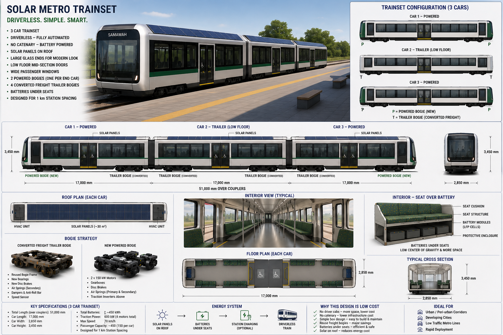
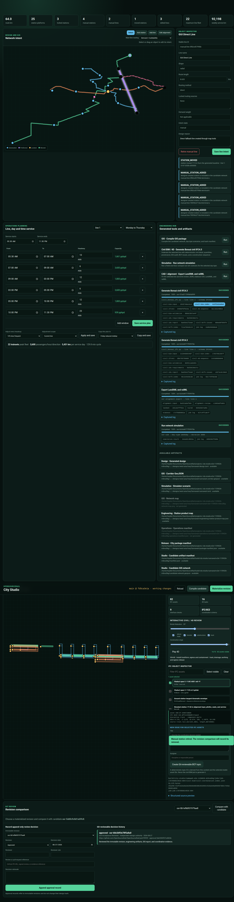
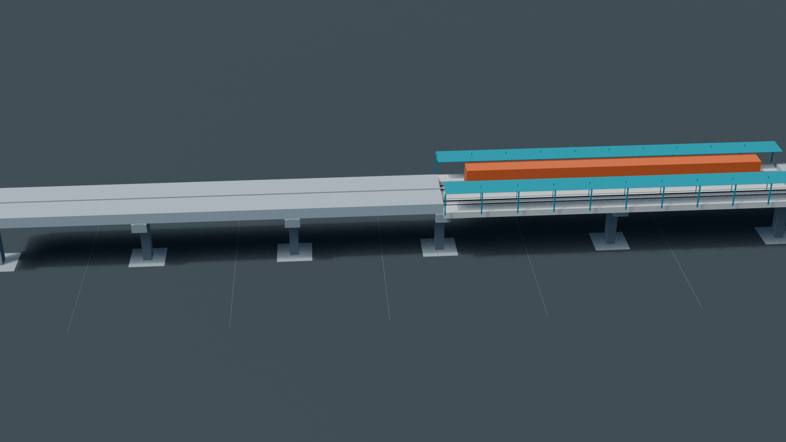
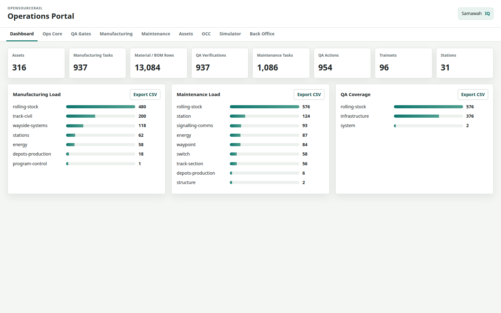
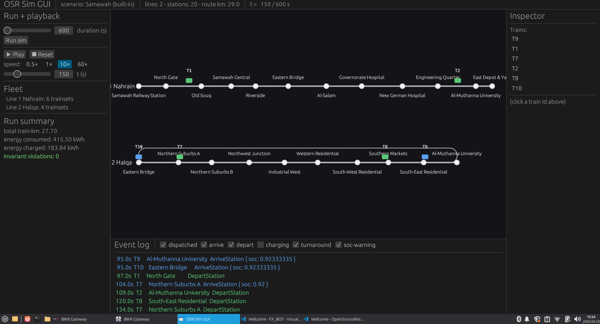
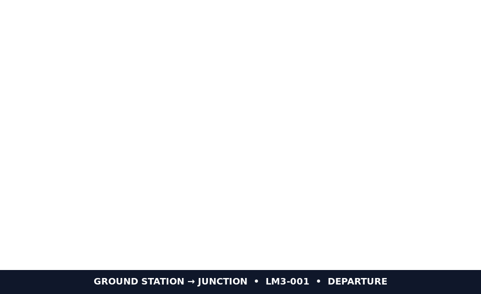

# OpenSourceRail

OpenSourceRail is an open-source, deterministic platform for designing,
testing, building and operating affordable urban rail systems. It connects
city and service planning, GIS, CAD/IFC, rolling stock, embedded software,
simulation, operations, costs and assurance in one Git-reviewable workflow.

> [!IMPORTANT]
> Repository outputs are planning and engineering-screening evidence. They are
> not feasibility studies, supplier bids, construction releases, safety
> certificates, funding approvals or government endorsements.



The public evidence scope covers **265 cities in 43 developing countries**.
The engineering catalogue contains 266 models; one European comparison model
is retained for technical inspection but excluded from portfolio totals,
campaign metrics, examples, images and recipient packages.

## Feature Highlights

| Capability | Current implementation |
|---|---|
| Deterministic city generation | Reproducible network, station, fleet, energy, engineering, finance and operations packages under [designs/](designs/README.md). |
| Integrated Workbench | [City Studio, simulation, OCC training and Ops Core](docs/workbench/README.md) share city, actor, immutable revision, approved baseline, run and selected-asset context without merging authority boundaries. |
| Interactive network and service planning | Edit lines, stations, alignment intent, OD demand and service by line, day type and time period; compile content-addressed revisions for Git review. |
| Software in the loop | One deterministic simulation connects train, station, energy, wayside, point/crossing, regenerative-braking and depot components to OCC evidence. |
| Civil BIM and GIS | Generate OSR-ALN, GIS, IFC4.3, IDS/BCF, quantities, classifications and 4D construction review through the [Bonsai civil workflow](docs/civil/bonsai-ifc-workflow.md). |
| Buildable modular trainset | The LM3 product tree includes simplified captive fasteners, service rails, plug-in illumination, fixture adapters, adjustable doors and dry-serviceable windows. |
| Automatic cost propagation | CAD-indexed quantities feed the civil rate contract, city CAPEX, finance, IFC properties, national briefs and the developing-world [portfolio summary](docs/portfolio-summary.md). |
| Operations and assurance | Manufacturing, QA, maintenance, assets, work orders, acceptance evidence and a machine-checkable safety case remain linked to source artifacts. |
| Deterministic browser testing | Pinned Playwright acceptance verifies the integrated browser applications, adapters, engineering jobs and restart persistence. |
| Outreach generation | Reviewable packages cover governments, municipalities, universities, research groups, funders, nonprofits and specialist media without guessing addresses or sending messages. |

The current city cost model uses about **$0.9M per 3-car light-metro trainset**.
The generated LM3 build record currently estimates $885k before
rounding to that planning unit. Each country carries one shared lean railway
production setup at **$60k per supported vehicle/car module**; supplier
qualification, homologation, warranty, spares and deployment-specific work
remain separate evidence or cost gates.

## Current System

| City Studio | Civil IFC coordination | Operations and evidence |
|---|---|---|
|  |  |  |

| Trainset assembly | Simulation | Fabrication and civil sequence |
|---|---|---|
|  |  |  |

## Start Here

| Goal | Canonical entry point |
|---|---|
| Short public introduction | [Generated one-page overview](docs/brochures/open-source-rail-overview.html) |
| Documentation map | [Documentation hub](docs/README.md) and generated [document index](docs/INDEX.md) |
| Understand the system | [Architecture](docs/ARCHITECTURE.md) and [software diagrams](docs/software-architecture-diagrams.md) |
| Design a city or service plan | [Workbench](docs/workbench/README.md) and [City Studio](docs/city-studio/README.md) |
| Interpret city and country outputs | [Deployment planning reference](docs/deployment-planning-reference.md) |
| Review the city catalogue | [Design catalogue](designs/README.md) |
| Review developing-world capital totals | [Portfolio capital summary](docs/portfolio-summary.md) |
| Review costs and assumptions | [Cost model](docs/cost-model.md) |
| Review rolling stock | [LM3 reference](docs/rolling-stock/light-metro-3car/README.md) and [buildable handoff](mechanical-py/catalog/buildable-trainset/README.md) |
| Review civil and station engineering | [Civil package](docs/civil/README.md) and [station package](docs/stations/README.md) |
| Review software coverage | [Simulation coverage](docs/simulation-software-coverage.md) and [software diagrams](docs/software-architecture-diagrams.md) |
| Review hardware | [Hardware hosts](hardware/README.md) and [integration matrix](hardware/rolling-stock-integration.md) |
| Review operations | [Operations](docs/operations/README.md) and [Ops Core](docs/operations-portal/ops-core.md) |
| Review safety and release gaps | [Certification](docs/certification/README.md), [safety case](docs/safety-case/README.md) and [roadmap](docs/ROADMAP.md) |
| Prepare outreach | [Marketing guide](marketing/README.md) and [campaign catalogue](marketing/campaigns/README.md) |

## Run The Platform

Requirements depend on the component: Rust via `rustup`; Python for GIS,
engineering and CAD automation; Node.js 20+ for browser builds and tests.

Run the integrated Workbench:

```bash
npm run workbench
```

Open <http://127.0.0.1:8090/>. The local development server is not an
authenticated public deployment.

Run the deterministic simulator:

```bash
cargo run --release --bin osr-sim -- --duration 3600 --status-every 300
```

Run a different generated city:

```bash
cargo run --release --bin osr-sim -- \
  --config designs/south-asia/Pakistan/Karachi/karachi.toml \
  --duration 3600
```

Regenerate a city after installing the design package:

```bash
pip install -e 'design-py[geotiff,batch]'
cargo build --release --bin osr-design
scripts/regenerate-city.sh samawah
```

Generate or check the main engineering packages:

```bash
scripts/design-iterate.sh
scripts/buildable-trainset.sh
scripts/buildable-stations.sh
scripts/freecad-generate.sh --check
scripts/bonsai-civil.sh --check
```

## Evidence And Revision Model

```text
city/project sources
        ↓
validated candidate + source locks
        ↓
immutable Git-reviewable revision
        ↓
GIS / OSR-ALN / IFC / CAD / cost / simulation artifacts
        ↓
approval evidence → training/operations baseline
```

Planning and training views cannot emit live OCC commands. A revision hash is
not an approval; approval records are append-only and must reference independent
review evidence. Generated city packages still require survey, calibrated
demand, utility and ground data, supplier selection, first-article testing,
competent engineering review and national authorization.

## Repository Map

| Path | Responsibility |
|---|---|
| `crates/` | Rust simulation, control, operations and browser applications |
| `design-py/`, `designs/` | GIS/design automation and generated city packages |
| `mechanical-py/` | Parametric rolling stock, station, track and civil CAD |
| `engineering/` | Engineering toolchain, IFC/IDS/BCF and software coverage evidence |
| `hardware/` | Train, wayside and station/depot host references |
| `docs/` | Architecture, engineering, operations, certification and safety evidence |
| `marketing/` | Developing-world outreach packages and verified organisational routes |
| `projects/` | Git-backed City Studio source projects and immutable revisions |

## Verification

```bash
cargo fmt --all -- --check
cargo clippy --workspace --all-targets -- -D warnings
cargo test --workspace --all-targets
PYTHONPATH=mechanical-py/src pytest mechanical-py/tests -q
pytest design-py/tests -q
npm run test:frontend
python3 scripts/repo-health.py --quiet
python3 scripts/check-markdown-links.py
```

See [CONTRIBUTING.md](CONTRIBUTING.md), [GOVERNANCE.md](GOVERNANCE.md),
[CHANGELOG.md](CHANGELOG.md) and the [next release checklist](docs/releases/next.md).

## License

- Software: Apache 2.0
- Hardware designs: CERN-OHL-S v2
- Documentation: CC-BY-SA 4.0

See [LICENSE.md](LICENSE.md) and [LICENSES/](LICENSES/README.md) for the path
mapping and complete texts.
