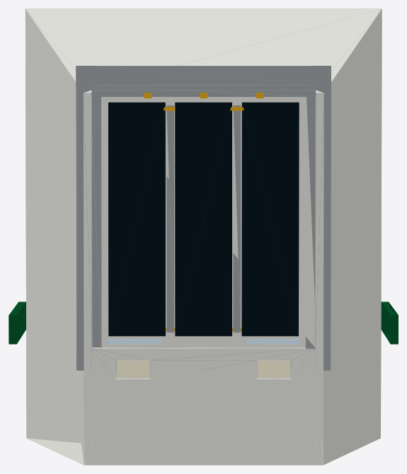

# OpenSourceRail


OpenSourceRail is an open-source stack for designing, building, and
operating affordable urban rail systems. It combines:

- city network generation from GIS data,
- a Rust simulator and control stack,
- parametric mechanical/CAD designs,
- hardware reference designs,
- operations and certification documentation,
- a machine-checkable safety case.

The default system is **GoA 4 driverless**, catenary-free, battery
electric, and designed around local manufacture: welded steel primary
structures, COTS rail/bus modules where sensible, commodity compute,
and regenerable documentation/CAD artifacts.

Current city CAPEX uses delivered rolling stock at about **$1.4M per
self-contained car** plus a separate lean **$100k per vehicle/car
module** railway production-plant setup allowance; **$200k per
vehicle/car module** is retained only as the high sensitivity check.
The machine-readable source is
[lib/templates/capex-costs.toml](lib/templates/capex-costs.toml), with
the audit trail in [docs/cost-model.md](docs/cost-model.md).

**Current milestone:** [v0.1](CHANGELOG.md), with active
[v0.2 work](docs/ROADMAP.md).

## Station And Track Renders

| At-grade station | Elevated station | Elevated interchange |
|---|---|---|
|  |  |  |

Generated from the FreeCAD station scene package in
[mechanical-py/catalog/freecad/station-scenes.FCStd](mechanical-py/catalog/freecad/station-scenes.FCStd);
see [docs/stations/README.md](docs/stations/README.md) for the station
artifact index.

## Start Here

| Goal | Go here |
|---|---|
| Read the short introduction brochure | [OpenSourceRail introduction PDF](docs/brochures/open-source-rail-introduction.pdf) |
| Understand the whole repo | [docs/README.md](docs/README.md) |
| Find any Markdown document | [docs/INDEX.md](docs/INDEX.md) |
| See generated city designs | [designs/README.md](designs/README.md) |
| Run the simulator | [Quick Start](#quick-start) |
| Generate a city network | [Designing Cities](#designing-cities) |
| Review rolling-stock design | [docs/rolling-stock/light-metro-3car/README.md](docs/rolling-stock/light-metro-3car/README.md) |
| Review station and track renders | [docs/stations/README.md](docs/stations/README.md#freecad-station-scene-renders) |
| Review mechanical CAD outputs | [mechanical-py/README.md](mechanical-py/README.md) |
| Review hardware host classes | [hardware/README.md](hardware/README.md) |
| Read the architecture | [docs/ARCHITECTURE.md](docs/ARCHITECTURE.md) |
| Read the RFCs | [docs/rfcs/README.md](docs/rfcs/README.md) |
| Review certification evidence | [docs/certification/](docs/certification/) and [docs/safety-case/](docs/safety-case/) |

## Repository Map

| Path | Purpose |
|---|---|
| [crates/](crates/) | Rust workspace: simulator, interlocking, ATP, brake, obstacle detection, TCMS, GUIs, design synthesis, safety-case compiler |
| [designs/](designs/) | Generated city models, maps, scenarios, and cost summaries |
| [design-py/](design-py/) | Python GIS/design sidecar for OSM, WorldPop, raster generation, maps, and batch tooling |
| [mechanical-py/](mechanical-py/) | Python parametric mechanical catalogue: rolling stock, track, civil, stations, depots, fixtures, generated FreeCAD review artifacts |
| [hardware/](hardware/) | Hardware reference designs and DIY assembly for T-ECU/S, T-ECU/A, T-OBS, W-SBC, S-SBC |
| [docs/](docs/) | Architecture, RFCs, certification pack, safety case, operations, civil, stations, rolling-stock docs |
| [lib/](lib/) | Machine-readable templates, recipes, examples, city batches, cost/finance inputs |
| [formal/](formal/) | TLA+ consensus specification and model-checking harnesses |
| [tools/](tools/) | Companion tools including LandXML to OSR-ALN and the Python MA reference interpreter |
| [scripts/](scripts/) | Regeneration, publishing, repository health, BOM, and book-builder helpers |

The generated PDF reader edition is [opensource-rail-docs-book.pdf](opensource-rail-docs-book.pdf).

## Quick Start

Requirements: Rust via `rustup`. Python is needed only for GIS and CAD
sidecars.

Run the bundled Samawah simulator scenario:

```bash
cargo run --release --bin osr-sim -- --duration 3600 --status-every 300
```

Run another generated city:

```bash
cargo run --release --bin osr-sim -- \
    --config designs/south-asia/Pakistan/Karachi/karachi.toml \
    --duration 3600
```

Check repository health and generated artifact drift:

```bash
python3 scripts/repo-health.py --quiet
```

## Designing Cities

Generated city models live under:

```text
designs/<region>/<country>/<City>/
```

Each city folder contains `design.toml`, a simulator scenario TOML,
route GeoJSON, a network map PNG, design-quality YAML, and a generated
README. The catalogue table is included in [designs/README.md](designs/README.md).

Regenerate one city:

```bash
pip install -e design-py[geotiff,batch]
cargo build --release --bin osr-design
scripts/regenerate-city.sh samawah
```

Regenerate the catalogue:

```bash
scripts/regenerate-all.sh --jobs 4
```

To add a city, add an entry to
[lib/city-batches/world-sample.toml](lib/city-batches/world-sample.toml),
then run `scripts/regenerate-city.sh <slug>`.


## Rolling Stock And CAD

The current reference train is the `light-metro-3car`: cabless,
driverless, battery electric, powered end cars plus an unpowered middle
car, under-seat sodium-ion batteries, mixed bonded/rail-mounted roof
solar feeding a per-car PV/station charge inverter, COTS
doors/windows/HVAC, two low-floor door pairs per side per car, and
T-OBS sensor packs behind segmented glass-pane noses at both ends.

Key links:

- [Rolling-stock package](docs/rolling-stock/light-metro-3car/README.md)
- [Rolling-stock section README](docs/rolling-stock/README.md)
- [BOM skeleton](docs/rolling-stock/light-metro-3car/bom-skeleton.md)
- [Marketplace price anchors](docs/rolling-stock/light-metro-3car/marketplace-price-anchors.md)
- [Civil marketplace cost anchors](docs/civil/marketplace-cost-anchors.md)
- [Fabrication plan](docs/rolling-stock/light-metro-3car/fabrication-plan.md)
- [Drawing register](docs/rolling-stock/light-metro-3car/drawing-register.md)
- [Mechanical package](mechanical-py/README.md)
- [Parametric rolling-stock source](mechanical-py/src/osr_mech/rolling_stock/)
- [Generated mechanical review catalogue](mechanical-py/catalog/)
- [Generated review catalogue README](mechanical-py/catalog/README.md)

Selected generated design views:


Final three-car reference consist with glass-pane end cowls, bodies, bogies, roof PV, and train-level systems.



Cabless front/rear cowl close-up showing three heated laminated glass panes with bonded frame, mullions, demist traces, and service hardware.


HVAC ducting, LV/data trays, lighting, HV/PV routing, coolant, and fire-vent paths inside one car.


Primary body structure with translucent shell, 10 m low-floor centre pan, raised bogie-end decks, side sills, and portal frames.


Single-car structure mounted over standard motor/trailer bogies, showing the ~3 m high-floor end decks and the 10 m low-floor centre zone.


Manufacturing-oriented sheet-metal kit for underframe, bolsters, coupler pockets, side posts, roof bows, and floor transitions.


Production concept board showing the repeated 17 m car module, welded datum frame, COTS module installation, and bogie marriage sequence.


One self-contained car equipment package: four door cassettes, platform safety interfaces, batteries, rooftop PV package, charging interface, traction/charge power rack, and accessibility/safety reservations.


Per-car rooftop PV package with bonded flexible laminates, raised rigid panels, mounting rails, edge clamps, junction boxes, fire isolators, MPPT combiner, and downlink gland.


Semi-permanent articulated gangway module with lower spherical joint, anti-lift keeper, upper links, bellows, turntable floor, trainline routing, and kinematic clearance frame.


Powered bogie assembly with frame, wheelsets, PMSM motors, gearboxes, suspension, and brakes.

Selected CalculiX FEA screening result plots:

| Chassis service gravity | Bogie brake/traction | Body lateral sway |
|---|---|---|
|  |  |  |

The full screening summary and raw solver outputs are in
[mechanical-py/catalog/fea](mechanical-py/catalog/fea/).

Generate CAD screenshots and STEP artifacts:

```bash
PYTHONPATH=mechanical-py/src python3 mechanical-py/scripts/render_screenshots.py
PYTHONPATH=mechanical-py/src python3 -m osr_mech.catalog --out mechanical-py/catalog
```

## Hardware

Hardware docs are consolidated under [hardware/](hardware/):

- [T-ECU/S](hardware/t-ecu-s/) train safety kernel,
- [T-ECU/A](hardware/t-ecu-a/) train application computer,
- [T-OBS](hardware/t-obs/) obstacle-detection ECU,
- [W-SBC](hardware/w-sbc/) wayside controller,
- [S-SBC](hardware/s-sbc/) station/depot host,
- [DIY assembly](hardware/diy-assembly/) for commodity-module pilots,
- [rolling-stock hardware integration](hardware/rolling-stock-integration.md).

## Safety And Certification

Important entry points:

- [Architecture](docs/ARCHITECTURE.md)
- [Operations rulebook](docs/operations/README.md)
- [Safety case](docs/safety-case/README.md)
- [Certification pack](docs/certification/README.md)
- [TLA+ consensus spec](formal/tla/README.md)
- [RFC 0005 software architecture](docs/rfcs/0005-sbc-software-architecture.md)
- [RFC 0015 driverless operation](docs/rfcs/0015-driverless-operation.md)
- [RFC 0016 wayside intrusion detection](docs/rfcs/0016-wayside-track-intrusion.md)

## Development Commands

```bash
# Rust workspace checks
cargo test --workspace

# Mechanical package tests
PYTHONPATH=mechanical-py/src pytest mechanical-py/tests -q

# Design-side tests
pytest design-py/tests -q

# Repository drift checks
python3 scripts/repo-health.py --quiet
```

See [CHANGELOG.md](CHANGELOG.md) for the current verification snapshot.

## License

Per [ARCHITECTURE §9](docs/ARCHITECTURE.md):

- Software: Apache 2.0
- Hardware designs: CERN-OHL-S v2
- Documentation: CC-BY-SA 4.0

OpenSourceRail is not a safety certifier or standards body. It produces
open artifacts suitable for independent assessment by deployment
partners and national authorities.
