# OpenSourceRail

> [!IMPORTANT]
> **The foreign-capital advantage is a cornerstone of OpenSourceRail.** The
> [generated portfolio summary](docs/portfolio-summary.md) aggregates all 266
> city models and 44 shared national factories. Its turnkey comparison is an
> editable planning sensitivity, not a vendor quote.


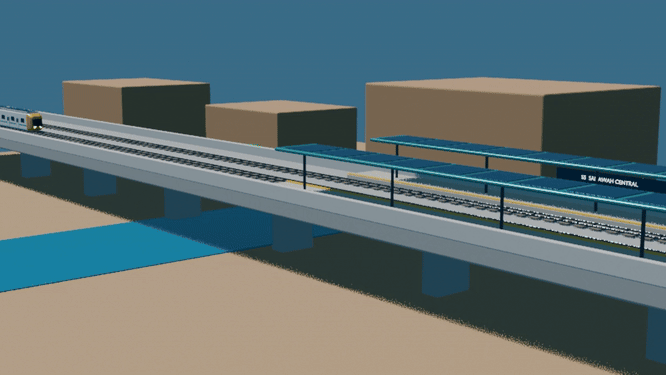

*Samawah Line 1 Blender digital twin: a refined 49.5 m driverless LM3 approaches
S5 at 36 km/h, brakes at 1.0 m/s², stops and opens its doors, then starts,
accelerates, and departs in real time. The source package includes the full-line
FreeCAD/JSON twin and Blender scene; the generator also produces an MP4.
Regenerate it with
`scripts/freecad-generate.sh --samawah-line-twin`.*

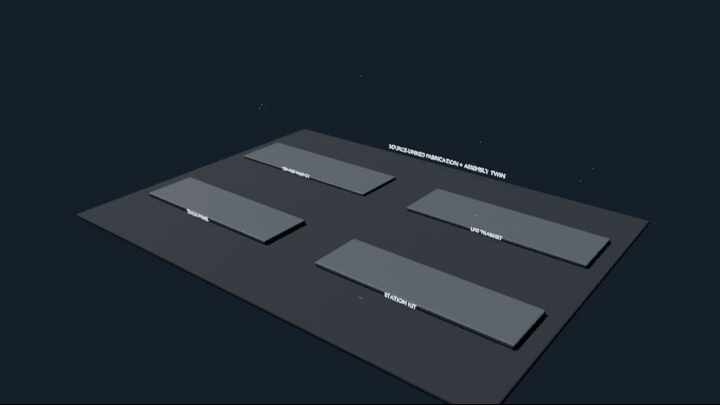

*The fabrication and assembly twin runs four synchronized production routes
from material release through assembly and QA handover. Its JSON register
contains 25 controlled work stages—including foundation-zone release,
two-lift Pi25 portal erection and the semi-continuous-unit connection—plus
predecessors, hold points, evidence, source hashes, and the interfaces between
rail, station, viaduct, and train.
Regenerate it with `scripts/freecad-generate.sh --fabrication-twin`.*


*The civil coordination model is generated deterministically from the checked
OSR geometry into IFC4.3, then imported and rendered through Bonsai 0.8.5. It
contains 95 stable rail/civil assets, quantities and provenance, nine interface
checks, 18 linked construction tasks, and 958/958 passing IDS checks. OSR
remains authoritative for route and engineering rules; Bonsai provides
federation, detail review, drawings, quantities, and 4D sequencing. See the
[Bonsai civil workflow](docs/civil/bonsai-ifc-workflow.md).*

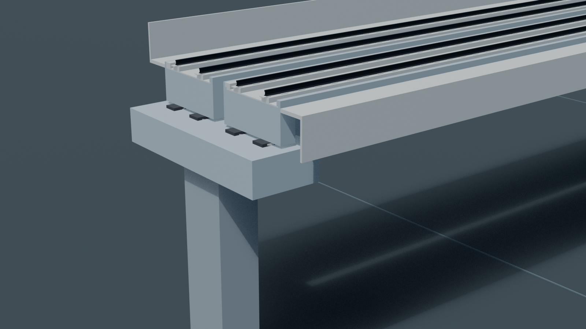

*The support-end view exposes the 3.5 m track centres, reduced 7 m common cap,
bearing interfaces, narrow decked beams and independent outer walkway/barrier
cassettes. The current ordinary-pier source uses one four-bearing line inside
a four-span unit; expansion boundaries retain two lines. It is coordination
geometry, not released reinforcement, continuity or prestress design.*

OpenSourceRail is an open-source stack for designing, building, and
operating affordable urban rail systems. It combines:

- city network generation from GIS data,
- a Rust simulator and control stack,
- parametric mechanical/CAD designs,
- hardware reference designs,
- operations and certification documentation,
- a machine-checkable safety case.

## Feature Highlights

| Capability | What is now available |
|---|---|
| **Deterministic city generation** | Reproducible GIS, network, fleet, energy, engineering and finance packages for [266 cities in 44 countries](designs/README.md). |
| **Interactive City Studio** | Create, move and retire stations and lines; edit routing control points; plan service by line, day and time; test OD capacity and atomic all-route scenarios in one [local GUI](docs/city-studio/README.md). |
| **Git-native revision control** | Content-addressed immutable revisions, semantic comparisons, append-only approvals and restart-tested persistence keep each city decision reviewable in GitHub. |
| **Civil BIM and 4D coordination** | Parametric Pi25/slipform/foundation geometry generates schema-checked IFC4.3 with native quantities, per-line survey/map conversion, IDS evidence, BCF 3.0 topics and linked construction sequencing through the [civil BIM workflow](docs/civil/bonsai-ifc-workflow.md). |
| **Automatic cost propagation** | Checked CAD quantities regenerate the [shared civil rate contract](lib/templates/civil-cost-model.toml), which feeds city CAPEX, finance, IFC properties, portfolio summaries and generated READMEs while retaining the original benchmark for comparison. |
| **Operations-to-assurance stack** | Simulation, GoA 4 control components, energy planning, manufacturing QA, maintenance, Ops Core, hardware references and a machine-checkable safety case share one repository and evidence model. |

City Studio persists civil construction methods in the same Git-reviewed
project as network and service intent. It displays derived deck-gap and bearing
counts and the current CAD-indexed planning-cost contract. The original
$3.0M/$12.0M/$18.0M per-kilometre benchmark stays visible; current at-grade and
elevated targets remain explicitly unquoted until prototype, foundation and
supplier evidence is available.

The default system is **GoA 4 driverless**, catenary-free, battery
electric, and designed around local manufacture: welded steel primary
structures, 1 m-wide clip-on fiberglass side/roof body modules, COTS
rail/bus modules where sensible, commodity compute, and regenerable
documentation/CAD artifacts. Six parallel two-person crews can install and
release the exterior bodies of a three-car train in one eight-hour shift once
the three painted frames pass their dimensional checks; doors, glazing,
equipment, bogies, commissioning, and certification remain separate work.

Current city CAPEX uses trainset-family rolling-stock units, for example
about **$0.9M per 3-car light-metro trainset**. The current explicit
build estimate is **$885k** per 3-car LM3 trainset: design-candidate
material/supplier modules plus **5,524 h** at **$10/h**, then a **20%**
unexpected-cost premium. That estimate already includes the named
passenger fit-out and openings: seats, floors, grab rails, interior
lighting, three roof HVAC units, 18 side windows, 12 powered side doors,
door sill/emergency kits, and two panoramic end-glass assemblies. City
CAPEX keeps the rounded $0.9M planning unit. Each country adds one shared,
lean **$60k per supported vehicle/car module** national railway
production-plant setup sized to its largest city fleet programme;
**$120k per supported vehicle/car module** is retained only as the high
sensitivity check. Individual cities do not duplicate the factory.
Distributed overnight stabling at powered stations
also removes fleet-wide parking roads from depot scope; depot CAPEX retains
inspection, defect repair, wheel, wash, and heavy-maintenance functions.
The machine-readable source is
[lib/templates/capex-costs.toml](lib/templates/capex-costs.toml), with
the civil quantity-index contract in
[lib/templates/civil-cost-model.toml](lib/templates/civil-cost-model.toml),
and the audit trail in [docs/cost-model.md](docs/cost-model.md).

## Foreign-Capital Advantage And Local Content

The generated catalogue separates imported/external capital from locally
fundable labour, materials, fabrication, installation and services. Current
totals, annual draws and the controlled foreign-turnkey sensitivity live in
the [portfolio capital summary](docs/portfolio-summary.md), regenerated from
all city models after cost changes. Each city README carries its own finance
evidence; every country has a shared-factory `NATIONAL-BRIEF.md`. Start with
the [Iraq national strategy](designs/west-asia/Iraq/NATIONAL-BRIEF.md) or the
[Nairobi city example](designs/east-africa/Kenya/Nairobi/README.md#capital-and-funding).

All figures remain planning screens pending supplier quotations, domestic
capability and origin audits, land/utility surveys, tax and duty treatment,
foreign-exchange paths and signed lender terms.

**Current milestone:** [v0.2 development baseline](CHANGELOG.md),
with remaining validation and hardening tracked in
[docs/ROADMAP.md](docs/ROADMAP.md).

## City Studio

City Studio centralizes deterministic network authoring, source-locked
demand/buildability routing, station placement, line/day/time service planning,
source-controlled origin–destination demand and scheduled-capacity screening,
simulation, alignment exchange, IFC4.3/Bonsai civil federation, verified
GIS/engineering object inspection, IDS delivery audit, BCF 3.0 issue review,
searchable multi-asset BCF topic authoring, atomic all-route headway scenarios and day-plan tools,
Git-reviewable coordination decisions, append-only revision approvals,
hash-verified interactive civil/4D review, artifact hashing, and revision review.


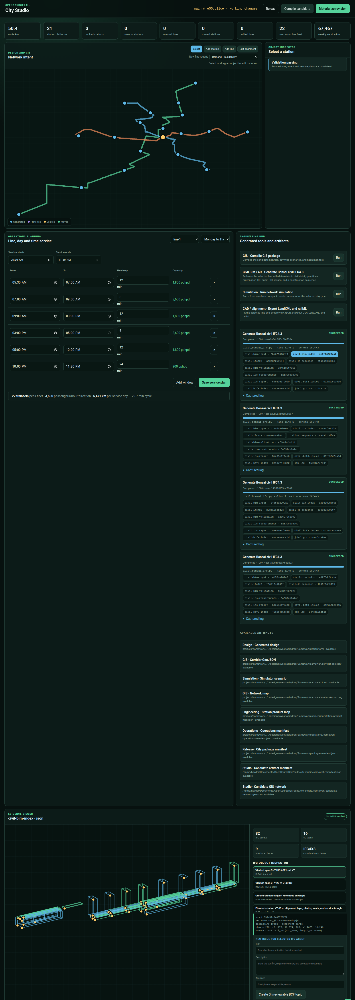


Run it locally with `cargo run -p osr-city-studio -- serve`, then open
<http://127.0.0.1:8090/>. See the
[City Studio guide](docs/city-studio/README.md) for the project and Git workflow.
Run the isolated Chrome acceptance suite with
`node scripts/test-city-studio-gui.mjs`; it edits a temporary project, runs
every engineering adapter, restarts the server, and verifies on-disk
persistence without modifying Samawah.

## Adoption And Assurance Path

OpenSourceRail is not asking a city to accept an uncertified full-stack
driverless metro as the first step. The practical first wedge is
owner-operator software that can run without controlling trains:
simulation/digital-twin studies, generated asset registers,
manufacturing and construction QA, maintenance scheduling, Ops Core work
orders, acceptance evidence, historian views, and depot CBM adapters.
Those can be used on an existing railway, depot, test track, or city
design study while the safety-critical train-control stack remains in
shadow mode.

| Step | Deployable result | Safety exposure |
|---|---|---|
| Planning / shadow mode | Simulator, cost/energy model, portal registers, QA/maintenance/evidence pack | No command of trains |
| Depot or closed test track | COTS hardware hosts, work orders, inspection forms, telemetry, restricted movement trials | Local rules and test authority only |
| Segregated pilot segment | Trial service with independent assessor review and deployment-specific safety case | Limited operational exposure |
| Revenue GoA 4 service | Certified train-control, rolling-stock, station, energy, and operations system | National authority acceptance required |

The GoA 4 train-control and rolling-stock stack is therefore a later
certification program, not a README promise. OpenSourceRail produces
reference designs, code, proofs, tests, operating rules, and evidence
packs. It does not itself carry the statutory safety certificate,
operating license, product liability, insurance, or sovereign finance
package. Those responsibilities sit with the deployment owner/operator,
prime integrator, independent safety assessor, insurer, and national
safety authority.

SIL names in this repository are target assurance and hazard-allocation
labels. Nothing here is certified SIL-4, SIL-2, or any other SIL until a
deployment-specific assessor and authority accept the evidence.

The battery-electric, catenary-free system is the default design target,
not a universal law. Every city model must include battery replacement,
charger dwell, fleet reserve, charger thermal limits, grid/PPA studies,
fire/egress constraints, and station/depot storage. Catenary or third
rail may still win for very high-frequency trunks, constrained dwell
times, difficult climates, or weak station power sites; the point of OSR
is to make that trade visible rather than bury it in vendor pricing.

## Station And Track Renders

| At-grade station | Elevated station | Elevated interchange |
|---|---|---|
| 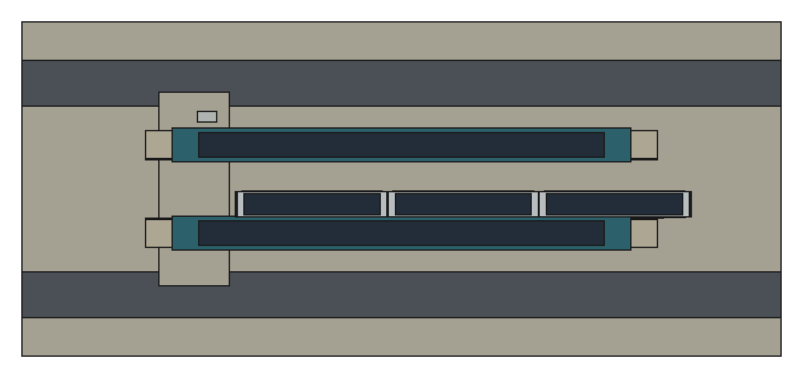 | 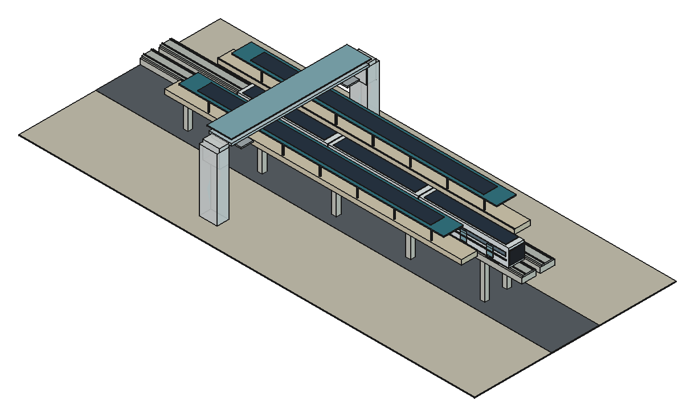 | 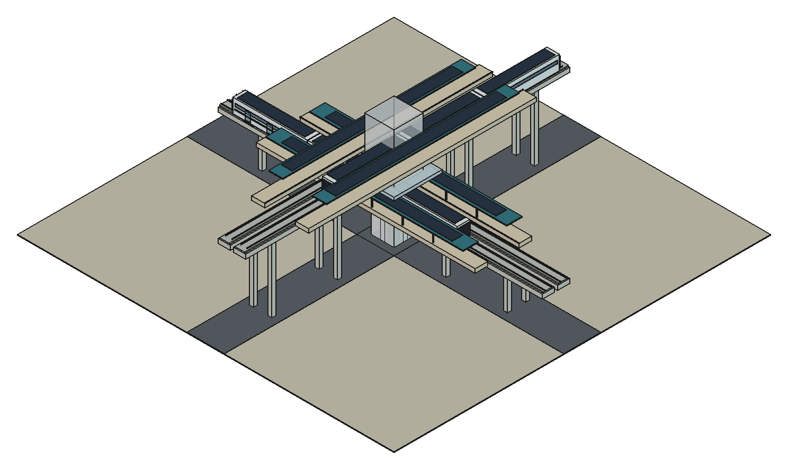 |

Generated from the FreeCAD station scene package in
[mechanical-py/catalog/freecad/station-scenes.FCStd](mechanical-py/catalog/freecad/station-scenes.FCStd);
see [docs/stations/README.md](docs/stations/README.md) for the station
artifact index.

## Start Here

| Goal | Go here |
|---|---|
| Read the short introduction brochure | [OpenSourceRail introduction HTML](docs/brochures/open-source-rail-introduction.html) |
| Understand the whole repo | [docs/README.md](docs/README.md) |
| Understand the unified deployment model | [docs/deployment-model.md](docs/deployment-model.md) |
| Interpret any generated city or country plan | [docs/deployment-planning-reference.md](docs/deployment-planning-reference.md) |
| Understand deployment responsibilities | [docs/deployment-roles.md](docs/deployment-roles.md) |
| Review the first adoptable product | [docs/first-adoptable-product.md](docs/first-adoptable-product.md) |
| Find any Markdown document | [docs/INDEX.md](docs/INDEX.md) |
| See generated city designs | [designs/README.md](designs/README.md) |
| Review national implementation and capital strategy | [Iraq national brief](designs/west-asia/Iraq/NATIONAL-BRIEF.md) and the other country-level `NATIONAL-BRIEF.md` files under [designs/](designs/) |
| Review imported versus local capital for a city | [Nairobi capital and funding](designs/east-africa/Kenya/Nairobi/README.md#capital-and-funding) |
| Run the simulator | [Quick Start](#quick-start) |
| Run the operations portal | [Operations Portal](#operations-portal) |
| Contribute or review governance | [CONTRIBUTING.md](CONTRIBUTING.md) and [GOVERNANCE.md](GOVERNANCE.md) |
| Prepare the next release | [docs/releases/next.md](docs/releases/next.md) |
| Generate a city network | [Designing Cities](#designing-cities) |
| Edit a city, station locations, and line/day/time service plans | [OSR City Studio](docs/city-studio/README.md) |
| Generate engineering screening packages | [Engineering Screening For All Cities](#engineering-screening-for-all-cities) |
| Review rolling-stock design | [docs/rolling-stock/light-metro-3car/README.md](docs/rolling-stock/light-metro-3car/README.md) |
| Use the buildable trainset handoff | [mechanical-py/catalog/buildable-trainset/README.md](mechanical-py/catalog/buildable-trainset/README.md) |
| Review station and track renders | [docs/stations/README.md](docs/stations/README.md#freecad-station-scene-renders) |
| Review mechanical CAD outputs | [mechanical-py/README.md](mechanical-py/README.md) |
| Review hardware host classes | [hardware/README.md](hardware/README.md) |
| Review deployable host compositions | [deployment/README.md](deployment/README.md) |
| Read the architecture | [docs/ARCHITECTURE.md](docs/ARCHITECTURE.md) |
| Review software architecture diagrams | [docs/software-architecture-diagrams.md](docs/software-architecture-diagrams.md) |
| Read the RFCs | [docs/rfcs/README.md](docs/rfcs/README.md) |
| Review certification evidence | [docs/certification/](docs/certification/) and [docs/safety-case/](docs/safety-case/) |

## Repository Map

| Path | Purpose |
|---|---|
| [crates/](crates/) | Rust workspace: simulator, interlocking, ATP, brake, obstacle detection, TCMS, GUIs, design synthesis, safety-case compiler |
| [designs/](designs/) | Complete 266-city / 44-country catalogue with city capital splits, engineering/operations evidence, package manifests, and one national strategy brief per country |
| [design-py/](design-py/) | Python GIS/design sidecar for OSM, WorldPop, raster generation, maps, and batch tooling |
| [mechanical-py/](mechanical-py/) | Python parametric mechanical catalogue: rolling stock, track, civil, stations, depots, fixtures, generated FreeCAD review artifacts |
| [hardware/](hardware/) | Hardware reference designs and DIY assembly for T-ECU/S, T-ECU/A, T-OBS, W-SBC, S-SBC |
| [docs/](docs/) | Architecture, RFCs, certification pack, safety case, operations, civil, stations, rolling-stock docs |
| [docs/operations-portal/](docs/operations-portal/) | Browser operations portal for asset registers, manufacturing schedules, QA gates, maintenance work orders, defects/NCR, audit, SQLite storage, and reconciliation |
| [projects/](projects/) | Git-backed City Studio project intent, source locks, weekly service plans, and immutable candidate revisions |
| [crates/osr-city-studio/](crates/osr-city-studio/) | Deterministic project compiler, validator, revision materializer, HTTP API, and browser design/service GUI |
| [lib/](lib/) | Machine-readable templates, recipes, examples, city batches, cost/finance inputs |
| [formal/](formal/) | TLA+ consensus specification and model-checking harnesses |
| [tools/](tools/) | Companion tools including LandXML to OSR-ALN and the Python MA reference interpreter |
| [scripts/](scripts/) | Regeneration, publishing, repository health, BOM, and book-builder helpers |
| [.github/repository-metadata.yml](.github/repository-metadata.yml) | Recommended GitHub description, homepage, and topics |

Generate the PDF reader edition with `python3 scripts/build-doc-book.py`; it is
written to `build/releases/`.

## Software Architecture Diagrams

Editable Mermaid diagrams for the backend, train, station, depot,
wayside waypoint, energy, manufacturing, QA, maintenance, and
safety/security layers are
collected in
[docs/software-architecture-diagrams.md](docs/software-architecture-diagrams.md).

| Diagram | Scope |
|---|---|
| [Deployment context](docs/software-architecture-diagrams.md#1-deployment-context) | OCC, depot, stations, wayside nodes, trains, passengers, utilities, and regulator evidence |
| [Backend / OCC services](docs/software-architecture-diagrams.md#2-backend--occ-services) | Event log, read models, historian, analytics, AFC back office, CBM, and Ops Core |
| [Onboard train software](docs/software-architecture-diagrams.md#3-onboard-train-software) | T-ECU/S, T-ECU/A, T-OBS, TCN-E, CAN-FD, sensors, traction, brakes, doors, BMS |
| [Station and depot software](docs/software-architecture-diagrams.md#4-station-and-depot-software) | S-SBC station/depot host, PIS, AFC, TVM, PSD, SCADA, energy, self-test, workshop tools |
| [Wayside / waypoint node software](docs/software-architecture-diagrams.md#5-wayside--waypoint-node-software) | W-SBC, consensus, interlocking, points, balises, intrusion, crossings, hot-axle detection |
| [Control and data flow](docs/software-architecture-diagrams.md#6-control-and-data-flow) | Dispatcher request through route safety, movement authority, telemetry, CBM, and work orders |
| [Energy and charging software](docs/software-architecture-diagrams.md#7-energy-and-charging-software) | Charging dispatch, train BMS, regen, station/depot PV, BESS, chargers, and grid tie |
| [Manufacturing, QA, maintenance, and evidence flow](docs/software-architecture-diagrams.md#8-manufacturing-qa-maintenance-and-evidence-flow) | Generated asset/manufacturing/QA/maintenance data into Ops Core, SQLite, evidence, NCR, and audit |
| [Safety and security boundaries](docs/software-architecture-diagrams.md#9-safety-and-security-boundaries) | Target assurance tiers, crypto, time sync, self-test, and signed firmware boundaries |

## Quick Start

Requirements: Rust via `rustup`. Python is needed only for GIS and CAD
sidecars.

Run the bundled Samawah simulator scenario:

```bash
cargo run --release --bin osr-sim -- --duration 3600 --status-every 300
```

Run another generated city:

```bash
cargo run --release --bin osr-sim -- \
    --config designs/south-asia/Pakistan/Karachi/karachi.toml \
    --duration 3600
```

Check repository health and generated artifact drift:

```bash
python3 scripts/repo-health.py --quiet
```

Check the FreeCAD bridge for CAD assemblies, FEM models, and screenshots:

```bash
scripts/freecad-generate.sh --check
```

The local FreeCAD Flatpak toolchain also has add-ons installed for
assembly review, mould/manufacturing checks, and high-quality renders:
Render, DFM, Assembly4, A2plus, and Blender/Cycles. The repeatable
README render path is:

```bash
scripts/freecad-generate.sh --high-quality-renders
```

Generate the IFC4.3 civil federation and Bonsai review/animation scene:

```bash
scripts/bonsai-civil.sh --check
scripts/bonsai-civil.sh --render
```

Run the top-down / bottom-up rolling-stock design iterator:

```bash
scripts/design-iterate.sh
scripts/buildable-trainset.sh
scripts/buildable-stations.sh
```

## Operations Portal

The browser portal gives each generated city an asset register,
manufacturing schedule, QA gate register, maintenance schedule,
lightweight Ops Core work-order loop, defects/NCR register, audit trail,
SQLite persistence, and a reconciliation path for browser-local fallback
records. Manufacturing rows include controlled material/BOM refs, QA
verification rows, resolved predecessor ids, and release blocking until
predecessor work is closed with pass evidence.

Run the SQLite-backed portal:

```bash
python3 scripts/generate-qa-maintenance-data.py
python3 scripts/ops-core-server.py --port 8008
```

Then open:

```text
http://127.0.0.1:8008/docs/operations-portal/
```

Key docs:

- [Operations portal](docs/operations-portal/README.md)
- [OSR Ops Core](docs/operations-portal/ops-core.md)
- [Acceptance evidence status](docs/certification/evidence-status.md)
- [Certification evidence register](docs/certification/evidence-register.md)
- [Operations portal gap analysis](docs/operations-portal/gap-analysis.md)
- [RFC 0028 construction QA](docs/rfcs/0028-construction-quality-assurance.md)
- [RFC 0029 maintenance schedule system](docs/rfcs/0029-maintenance-schedule-system.md)
- [RFC 0030 manufacturing schedule system](docs/rfcs/0030-manufacturing-schedule-system.md)

| Portal dashboard | Ops Core + SQLite | QA gates |
|---|---|---|
| 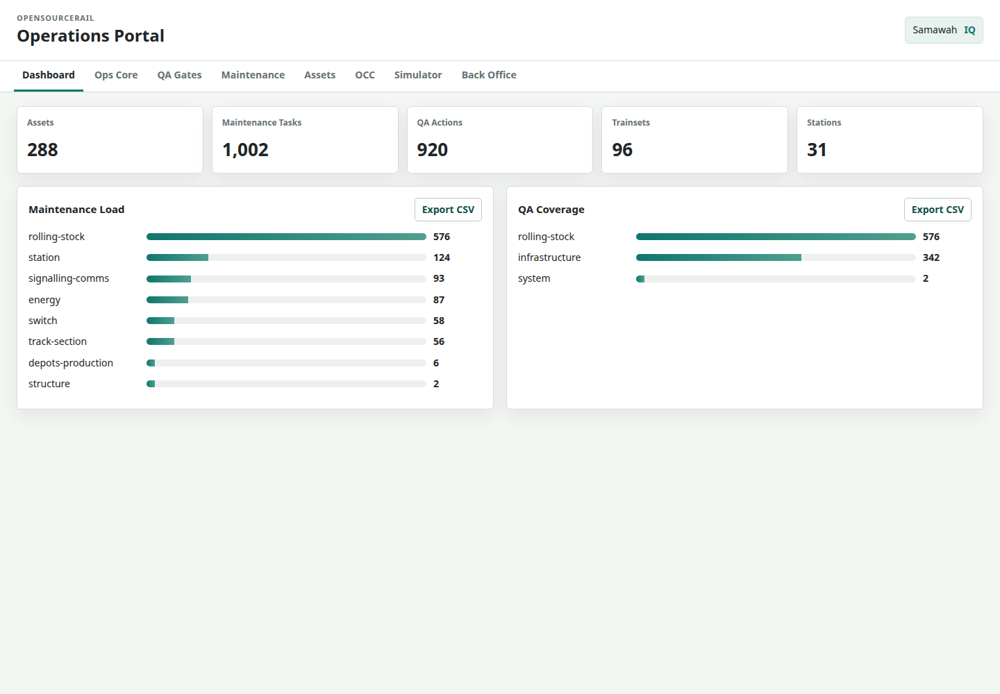 | 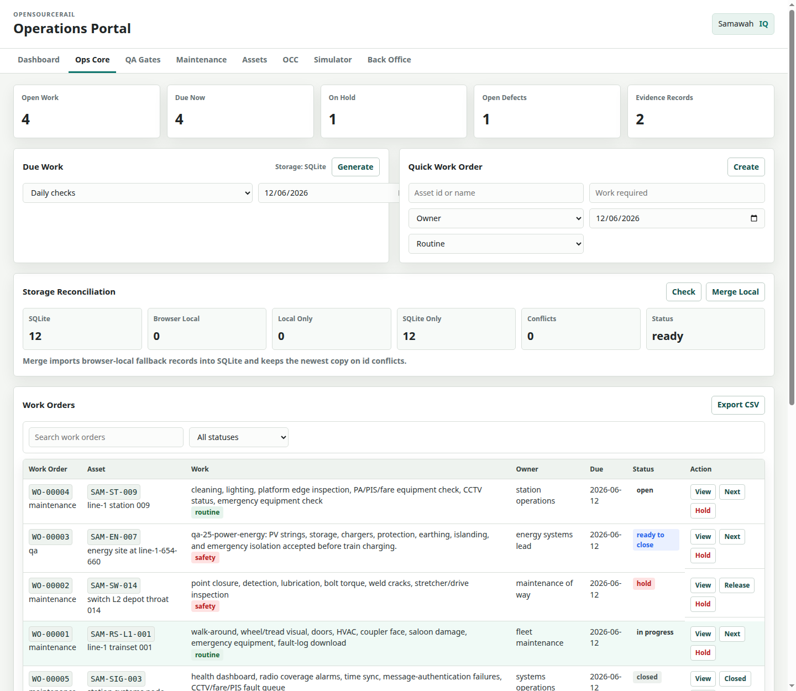 | 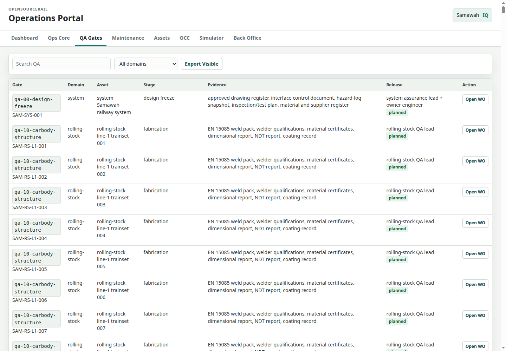 |

The acceptance/accreditation evidence basis is generated from the same
city operations bundle. It checks that every manufacturing row has
material/BOM refs, a QA verification row, a linked QA action, resolved
predecessor ids, and release blocking through Ops Core evidence.
Civil rows also carry their duration model, geometry quantity basis and active
resource count; the bundle exposes a separate Pi-beam/foundation/ST6
production plan for every line.

| Acceptance dashboard | Manufacturing controls |
|---|---|
|  | 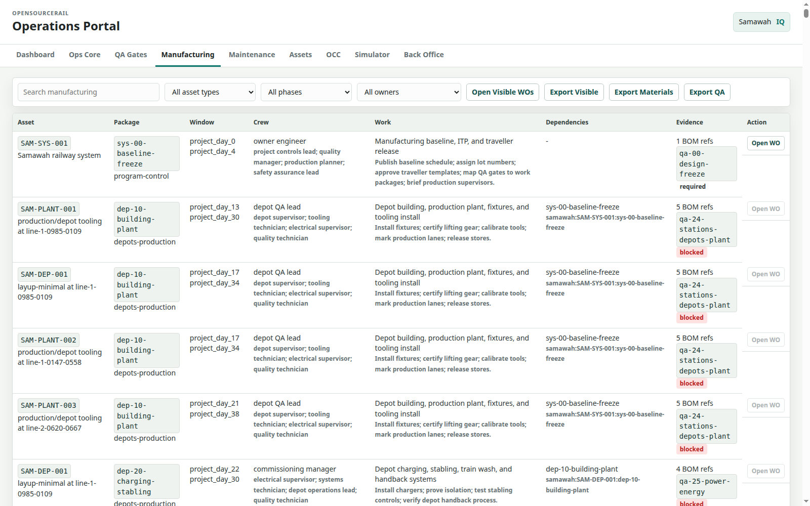 |

## Simulation Screenshots


Regenerate the current simulator screenshots:

```bash
python3 scripts/render-sim-screenshots.py
```

The Samawah reference was acceptance-tested on **2026-08-12** using the
generated 96-trainset, three-line scenario: 86 peak sets, 7 planned spares,
and 3 cold reserves. Morning and afternoon peaks retain quick turnarounds;
the 12-minute concurrent clean, safety inspection, diagnostics download, and
150 kW low-C recharge moves to 6- and 12-minute off-peak windows, so no
additional depot-service trainsets are required.
The corrected model uses a
**675 kWh nameplate / 540 kWh usable** pack, protects a 20% SoC reserve,
models 150 kW low-C top-up at all six depot/terminal layups, and uses a
3.0 kWh/car-km nominal base before the scenario climate uplift (the design
and infrastructure plan retains the conservative 4.0 kWh/car-km case).

| Verified run | Result |
|---|---|
| 2-hour screenshot trace | 2,343.09 train-km; 23,617.08 kWh consumed; 20,327.01 kWh charged; 34 depot services completed; minimum SoC 62%; 0 onboard emergencies; 0 invariant violations |
| Full 05:30–02:00 service-window soak | 24,839.54 train-km; 250,376.24 kWh consumed; 219,389.36 kWh charged; 453 depot services completed (3 still active at the cutoff); minimum SoC 20%; 0 onboard emergencies; 0 invariant violations |

The full-window result is the simulated movement actually completed, not the
27,177 train-km timetable-planning upper bound. Energy-reserve gating now
holds a train for charging instead of allowing motion at zero SoC.

## Designing Cities

Generated city models live under:

```text
designs/<region>/<country>/<City>/
```

Each city folder contains `README.md`, `design.toml`, a simulator scenario
TOML, corridor GeoJSON, station JSON, design-quality YAML, a reconciled finance
summary, engineering and operations evidence, and a hashed
`package-manifest.json`. Each country directory also contains one generated
`NATIONAL-BRIEF.md` containing its city, shared-factory and capital aggregation.
Shared interpretation lives in the
[deployment planning reference](docs/deployment-planning-reference.md), and the
catalogue table is in [designs/README.md](designs/README.md).

Regenerate one city:

```bash
pip install -e design-py[geotiff,batch]
cargo build --release --bin osr-design
scripts/regenerate-city.sh samawah
```

Regenerate the catalogue:

```bash
scripts/regenerate-all.sh --jobs 4
```

This fast default resynthesises each canonical design before refreshing the
complete package beside it. It reuses raster and corridor caches where they
exist, and creates missing source caches automatically. Use
`scripts/regenerate-all.sh --from-scratch` to force OSM, population raster,
and corridor rebuilding even when current caches are available.

To add a city, add an entry to
[lib/city-batches/world-sample.toml](lib/city-batches/world-sample.toml),
then run `scripts/regenerate-city.sh <slug>`.


## Engineering Screening For All Cities

The engineering toolchain generates GIS, SUMO, energy, procurement-origin finance,
station-product, nominal/degraded simulation, operations, and acceptance
evidence from the city source catalogue. Each full run ends with a hashed
`package-manifest.json` and fails unless the complete screening package is
present and passing. The retained city finance summaries reconcile total CAPEX
to imported/external and local funding, while the country briefs add the shared
national factory exactly once.

After installing the pinned tools in
[engineering/toolchain/README.md](engineering/toolchain/README.md), generate a
city and run its engineering screen:

```bash
scripts/regenerate-city.sh samawah
```

Generated evidence is written into the city folder:

| Output | Location |
|---|---|
| Full city package | `designs/<region>/<country>/<City>/` |
| GIS, SUMO, energy, and simulation evidence | that city package's `engineering/` directory |
| Operations, QA, maintenance, and acceptance tables | that city package's `operations/` directory |
| Engineering batch summary | `build/engineering/cities/batch-summary.json` |
| Complete-package summary | `build/engineering/cities/package-summary.json` |

These outputs are screening evidence, not automatically approved engineering.
Surveyed alignments, calibrated passenger demand and dwell, connected
interchange/junction topology, road interactions, local climate and fire
inputs, and competent deployment review remain required before release. The
detailed boundaries and remaining tasks are in
[docs/engineering-design-simulation-plan.md](docs/engineering-design-simulation-plan.md).

## Rolling Stock And CAD

The current reference train is the `light-metro-3car`: cabless,
driverless, battery electric, three repeated self-contained cars with
one powered bogie and one trailer bogie each, under-seat LFP batteries,
mixed bonded/rail-mounted roof solar feeding a per-car MPPT and protected DC
link, six independent traction controllers, direct-HV DC HVAC, COTS
doors/windows/HVAC, two low-floor door pairs per side per car, and
T-OBS sensor packs behind single dark panoramic-glass noses at both ends.

The current RFC 0021 electrical baseline defines
three 225 kWh gross LFP car packs on a 650–700 V nominal DC link, six
independent heavy-vehicle-class PMSM controllers, direct-HV DC HVAC, isolated
LV DC/DC domains, and a standard 500 kW station DC/DC cabinet backed by
repeatable 500 kWh stationary-LFP modules. The welded S355 datum skeleton is
the safety load path. Sixteen 1 m bays per 16.5 m car carry clipped fiberglass
side and roof modules fabricated in reusable short moulds, CNC-trimmed into
solid/window/door/roof variants, and installed on keyed hooks, captive
retainers, anti-lift locks, and dry replaceable EPDM seals; no full-length
mould or production adhesive cure is required.

Key links:

- [Rolling-stock package](docs/rolling-stock/light-metro-3car/README.md)
- [Rolling-stock section README](docs/rolling-stock/README.md)
- [BOM skeleton](docs/rolling-stock/light-metro-3car/bom-skeleton.md)
- [Marketplace price anchors](docs/rolling-stock/light-metro-3car/marketplace-price-anchors.md)
- [Civil marketplace cost anchors](docs/civil/marketplace-cost-anchors.md)
- [Foundation and resource-driven civil production system](docs/civil/foundation-and-production-system.md)
- [Civil construction-system selection](docs/civil/construction-system-selection.md)
- [Fabrication plan](docs/rolling-stock/light-metro-3car/fabrication-plan.md)
- [One-metre fiberglass body design](docs/rolling-stock/light-metro-3car/modular-fiberglass-body.md)
- [Generated body module manifest](mechanical-py/catalog/modular-fiberglass-body/)
- [Drawing register](docs/rolling-stock/light-metro-3car/drawing-register.md)
- [Mechanical package](mechanical-py/README.md)
- [Parametric rolling-stock source](mechanical-py/src/osr_mech/rolling_stock/)
- [Generated mechanical review catalogue](mechanical-py/catalog/)
- [Generated review catalogue README](mechanical-py/catalog/README.md)
- [Buildable trainset handoff](mechanical-py/catalog/buildable-trainset/)
- [Configurable train-end interface](mechanical-py/catalog/buildable-trainset/train-end-interface.md)
- [First-article fabrication critical path](mechanical-py/catalog/buildable-trainset/critical-path.md)
- [Pilot factory sizing and machinery plan](mechanical-py/catalog/buildable-trainset/factory-plan.md)
- [Product-tree definitions](mechanical-py/catalog/buildable-trainset/definitions/index.md)
- [Shop traveler templates](mechanical-py/catalog/buildable-trainset/travelers/index.md)

Buildable handoff quick path:

| Need | Use |
|---|---|
| See selected baseline and metrics | [design iteration summary](mechanical-py/catalog/design-system/design-iteration-summary.md) |
| See parts → subassemblies → assemblies → trainset | [buildable manifest](mechanical-py/catalog/buildable-trainset/buildable-trainset-manifest.md) |
| Select panoramic or open mid-train ends | [train-end interface](mechanical-py/catalog/buildable-trainset/train-end-interface.md) with the common end carrier, panoramic glass option, and train-to-train open connection |
| Start drawing/RFQ work | [definition pack](mechanical-py/catalog/buildable-trainset/definitions/index.md) with structured material/process specs |
| Start shop routing / QA planning | [shop traveler pack](mechanical-py/catalog/buildable-trainset/travelers/index.md) with material/process controls |
| Plan first-article fabrication and final assembly | [critical-path plan](mechanical-py/catalog/buildable-trainset/critical-path.md) with parts, subassemblies, furnishings, space, labour, float, and final commissioning |
| Size the pilot factory and machinery | [factory plan](mechanical-py/catalog/buildable-trainset/factory-plan.md) with enclosed-area, yard, cell, assembly-time, and machinery price estimates |
| Review trainset build cost | [build-cost estimate](mechanical-py/catalog/buildable-trainset/trainset-build-cost.md) with USD 10/h labour, 20% unexpected-cost premium, and explicit included seats/floors/lighting/HVAC/windows/doors scope |
| Review current buildability gaps | [buildability review](mechanical-py/catalog/buildable-trainset/current-design-buildability-review.md) |
| Review geometry and FEM evidence | [FreeCAD catalogue](mechanical-py/catalog/freecad/) and [FEA summary](mechanical-py/catalog/fea/screening-summary.md) |

First-article fabrication and final assembly rough order:

- The generated plan covers parts fabrication, chassis/body
  subassemblies, moulded glass-fibre exterior modules, bogies,
  electrical/HV equipment, final train assembly, internal furnishings, and
  static/dynamic commissioning.
- Rough elapsed time is **35 working days** with **5,524 h** of direct
  labour after design release and material availability.
- The current critical path is traveler/material release, structural steel
  prep, underframe welding, side/roof spaceframe build, paint,
  clip-on GFRP body installation, doors/windows/roof equipment, internal
  furnishings, articulation/gangways/couplers/trainlines, static
  commissioning, and dynamic trial release.
- Space is minimised by keeping one **55 m final assembly track** for
  accepted kits only. The generated pilot factory plan sizes a minimum
  **3,515 m2 enclosed factory**, about **2,200 m2** of outside yard/test
  apron, two underframe fixtures, two side/roof frame fixtures, one paint
  bay, three bogie stands, four short GFRP moulds, and one interior trim
  bench set.
- Rough-order pilot machinery/setup is **about $1.02M**, including a
  20% installation/adaptation contingency and excluding land, building
  shell, taxes, freight, duty, and full homologation lab equipment.
- Work deliberately runs in parallel: GFRP module moulding, bogie
  assembly, HV/electrical kit installation, and internal furnishing
  prebuild all have float. Furnishings are pre-kitted off-line by car and
  door zone, then installed after exterior leak-sensitive work closes.

Selected generated design views:


Final three-car reference consist with panoramic-glass end cowls, bodies, bogies, roof PV, and train-level systems.

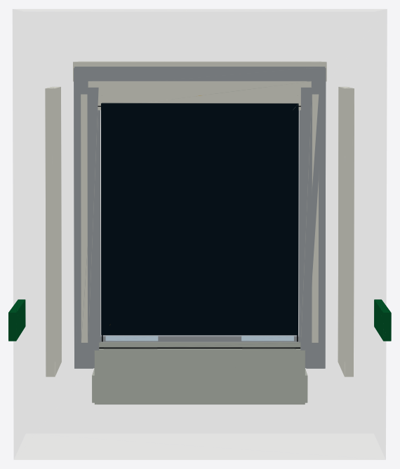

Cabless front/rear cowl close-up showing the identical multi-part
fiberglass end kit, one heated laminated panoramic glass pane, bonded
edge frame, demist busbars, and service hardware.

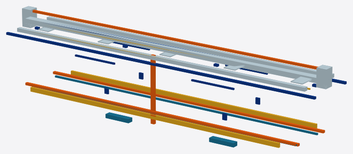

HVAC ducting, LV/data trays, lighting, HV/PV routing, coolant, and fire-vent paths inside one car.

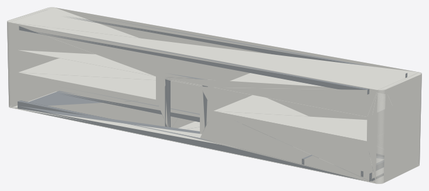

Primary body structure with translucent shell, 10 m low-floor centre pan, raised bogie-end decks, side sills, and portal frames.

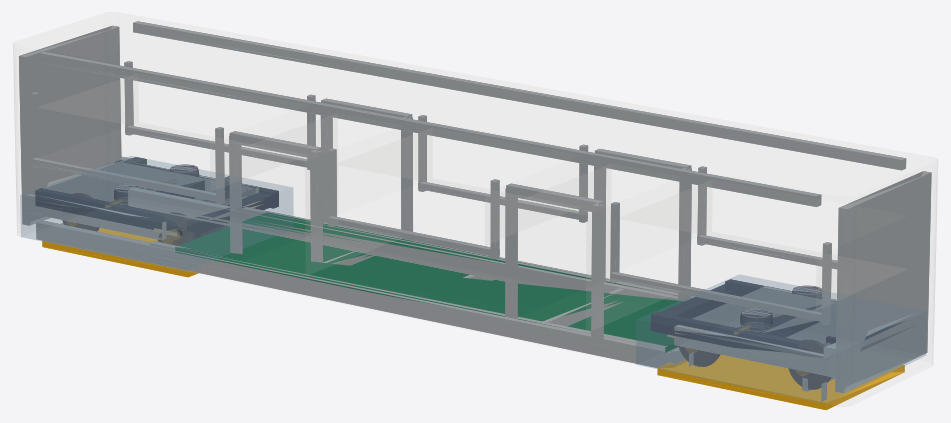

Single-car structure mounted over standard motor/trailer bogies, showing the ~3 m high-floor end decks and the 10 m low-floor centre zone.

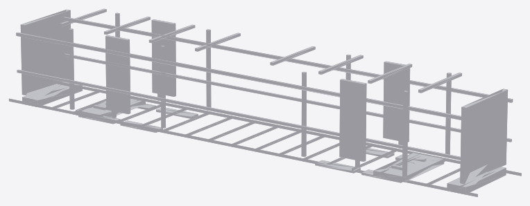

Manufacturing-oriented sheet-metal kit for underframe, bolsters, coupler pockets, side posts, roof bows, and floor transitions.


Production concept board showing the repeated 16.5 m car module, welded datum frame, COTS module installation, and bogie marriage sequence.


Pilot factory layout with one controlled 55 m final bay and off-line cells for chassis weld fixtures, GFRP moulding/trim, bogie assembly, interiors/HVAC kits, paint, stores, QA, yard staging, and short test access.


First-article work-stream plan showing the 35-working-day build network: chassis/body frame, GFRP modules, bogies, interior kits, door/window/roof work, HV/electrical installation, articulation/static testing, and dynamic release.


One-metre glass-fibre side/roof modules are moulded, cured, CNC-trimmed, sealed, dry-fit on a master frame, and clipped to the painted carbody without a full-length mould or production adhesive cure hold.

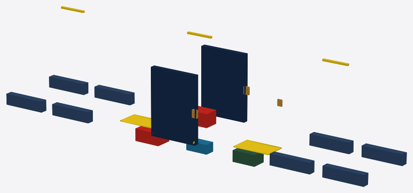

One self-contained car equipment package: four door cassettes, platform safety interfaces, batteries, rooftop PV package, charging interface, traction/charge power rack, and accessibility/safety reservations.

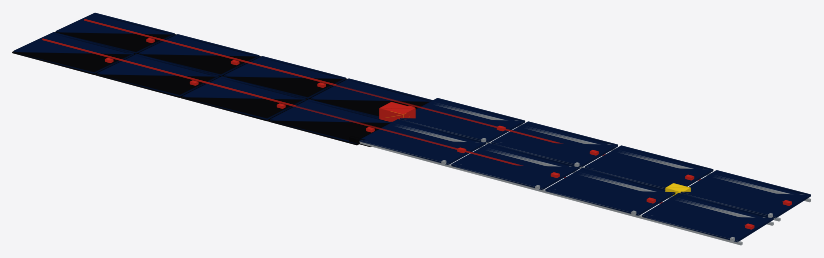

Per-car rooftop PV package with bonded flexible laminates, raised rigid panels, mounting rails, edge clamps, junction boxes, fire isolators, MPPT combiner, and downlink gland.


Semi-permanent articulated gangway module with lower spherical joint, anti-lift keeper, upper links, bellows, turntable floor, trainline routing, and kinematic clearance frame.


Final-bay marriage method showing accepted bogies rolled under a surveyed chassis datum, mobile lifting columns, centre-pivot/air-spring checks, shim records, and brake/static hold points.


Powered bogie assembly with frame, wheelsets, PMSM motors, gearboxes, suspension, and brakes.

Selected CalculiX FEA screening result plots:

| Chassis service gravity | Bogie brake/traction | Body lateral sway |
|---|---|---|
|  |  |  |

Selected Blender/Cycles engineering-clay renders generated from the
FreeCAD review documents:

| Trainset render | Full-body assembly render | Chassis/bogie render |
|---|---|---|
|  |  |  |

The full screening summary and raw solver outputs are in
[mechanical-py/catalog/fea](mechanical-py/catalog/fea/).

The rolling-stock design hierarchy and candidate-iteration workflow are
documented in [docs/rolling-stock/design-system.md](docs/rolling-stock/design-system.md);
generated scorecards are in
[mechanical-py/catalog/design-system](mechanical-py/catalog/design-system/).
The buildable trainset handoff is generated in
[mechanical-py/catalog/buildable-trainset](mechanical-py/catalog/buildable-trainset/).
It includes a manifest, buildability review, one definition per
product-tree node, and one unsigned shop-traveler template per node.
Definitions and travelers now carry structured material specs, process
specs, operation routers, estimated labor, tooling IDs, QA gates,
approval blocks, signoff blocks, and NCR/deviation logs.

Regenerate the design/buildable handoff and the CAD/FEM/screenshots:

```bash
scripts/design-iterate.sh
scripts/buildable-trainset.sh
scripts/freecad-generate.sh --check
scripts/freecad-generate.sh --models --assemblies --fem
scripts/freecad-generate.sh --screenshots --station-scenes
scripts/freecad-generate.sh --high-quality-renders
scripts/freecad-generate.sh --fabrication-twin
PYTHONPATH=mechanical-py/src python3 mechanical-py/scripts/render_screenshots.py
```

## Hardware

Hardware docs are consolidated under [hardware/](hardware/):

- [T-ECU/S](hardware/t-ecu-s/) train safety kernel,
- [T-ECU/A](hardware/t-ecu-a/) train application computer,
- [T-OBS](hardware/t-obs/) obstacle-detection ECU,
- [W-SBC](hardware/w-sbc/) wayside controller,
- [S-SBC](hardware/s-sbc/) station/depot host,
- [DIY assembly](hardware/diy-assembly/) for commodity-module pilots,
- [rolling-stock hardware integration](hardware/rolling-stock-integration.md).

## Safety And Certification

Important entry points:

- [Architecture](docs/ARCHITECTURE.md)
- [Operations rulebook](docs/operations/README.md)
- [Safety case](docs/safety-case/README.md)
- [Certification pack](docs/certification/README.md)
- [TLA+ consensus spec](formal/tla/README.md)
- [RFC 0005 software architecture](docs/rfcs/0005-sbc-software-architecture.md)
- [RFC 0015 driverless operation](docs/rfcs/0015-driverless-operation.md)
- [RFC 0016 wayside intrusion detection](docs/rfcs/0016-wayside-track-intrusion.md)

## Development Commands

```bash
# Rust workspace checks (including current stable Clippy)
cargo fmt --all -- --check
cargo clippy --workspace --all-targets -- -D warnings
cargo test --workspace --all-targets

# Mechanical package tests
PYTHONPATH=mechanical-py/src pytest mechanical-py/tests -q

# Design-side tests
pytest design-py/tests -q

# Repository drift checks
python3 scripts/repo-health.py --quiet
PYTHONPATH=design-py/src python3 scripts/generate-national-briefs.py --check
```

See [CHANGELOG.md](CHANGELOG.md) for the current verification snapshot.

## License

Project split, per [ARCHITECTURE §9](docs/ARCHITECTURE.md):

- Software: Apache 2.0
- Hardware designs: CERN-OHL-S v2
- Documentation: CC-BY-SA 4.0

OpenSourceRail is not a safety certifier or standards body. It produces
open artifacts suitable for independent assessment by deployment
partners and national authorities.

The contribution process and governance model are in
[CONTRIBUTING.md](CONTRIBUTING.md) and [GOVERNANCE.md](GOVERNANCE.md).
Complete license texts and the path mapping are in
[LICENSE.md](LICENSE.md) and [LICENSES/](LICENSES/README.md).
