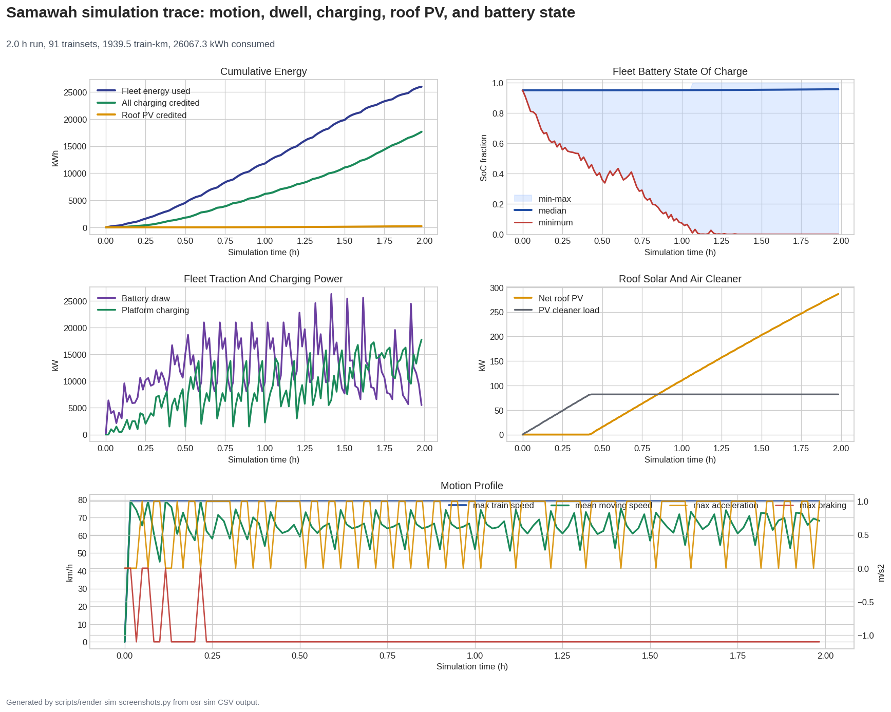
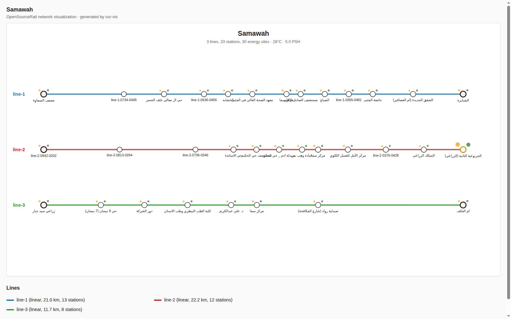

# OpenSourceRail


OpenSourceRail is an open-source stack for designing, building, and
operating affordable urban rail systems. It combines:

- city network generation from GIS data,
- a Rust simulator and control stack,
- parametric mechanical/CAD designs,
- hardware reference designs,
- operations and certification documentation,
- a machine-checkable safety case.

The default system is **GoA 4 driverless**, catenary-free, battery
electric, and designed around local manufacture: welded steel primary
structures, COTS rail/bus modules where sensible, commodity compute,
and regenerable documentation/CAD artifacts.

Current city CAPEX uses locally built rolling stock at about **$0.8M per
self-contained car** plus a separate lean **$100k per vehicle/car
module** railway production-plant setup allowance; **$200k per
vehicle/car module** is retained only as the high sensitivity check.
The machine-readable source is
[lib/templates/capex-costs.toml](lib/templates/capex-costs.toml), with
the audit trail in [docs/cost-model.md](docs/cost-model.md).

**Current milestone:** [v0.2 development baseline](CHANGELOG.md),
with remaining validation and hardening tracked in
[docs/ROADMAP.md](docs/ROADMAP.md).

## Adoption And Assurance Path

OpenSourceRail is not asking a city to accept an uncertified full-stack
driverless metro as the first step. The practical first wedge is
owner-operator software that can run without controlling trains:
simulation/digital-twin studies, generated asset registers,
manufacturing and construction QA, maintenance scheduling, Ops Core work
orders, acceptance evidence, historian views, and depot CBM adapters.
Those can be used on an existing railway, depot, test track, or city
design study while the safety-critical train-control stack remains in
shadow mode.

| Step | Deployable result | Safety exposure |
|---|---|---|
| Planning / shadow mode | Simulator, cost/energy model, portal registers, QA/maintenance/evidence pack | No command of trains |
| Depot or closed test track | COTS hardware hosts, work orders, inspection forms, telemetry, restricted movement trials | Local rules and test authority only |
| Segregated pilot segment | Trial service with independent assessor review and deployment-specific safety case | Limited operational exposure |
| Revenue GoA 4 service | Certified train-control, rolling-stock, station, energy, and operations system | National authority acceptance required |

The GoA 4 train-control and rolling-stock stack is therefore a later
certification program, not a README promise. OpenSourceRail produces
reference designs, code, proofs, tests, operating rules, and evidence
packs. It does not itself carry the statutory safety certificate,
operating license, product liability, insurance, or sovereign finance
package. Those responsibilities sit with the deployment owner/operator,
prime integrator, independent safety assessor, insurer, and national
safety authority.

SIL names in this repository are target assurance and hazard-allocation
labels. Nothing here is certified SIL-4, SIL-2, or any other SIL until a
deployment-specific assessor and authority accept the evidence.

The battery-electric, catenary-free system is the default design target,
not a universal law. Every city model must include battery replacement,
charger dwell, fleet reserve, charger thermal limits, grid/PPA studies,
fire/egress constraints, and station/depot storage. Catenary or third
rail may still win for very high-frequency trunks, constrained dwell
times, difficult climates, or weak station power sites; the point of OSR
is to make that trade visible rather than bury it in vendor pricing.

## Station And Track Renders

| At-grade station | Elevated station | Elevated interchange |
|---|---|---|
|  |  |  |

Generated from the FreeCAD station scene package in
[mechanical-py/catalog/freecad/station-scenes.FCStd](mechanical-py/catalog/freecad/station-scenes.FCStd);
see [docs/stations/README.md](docs/stations/README.md) for the station
artifact index.

## Start Here

| Goal | Go here |
|---|---|
| Read the short introduction brochure | [OpenSourceRail introduction PDF](docs/brochures/open-source-rail-introduction.pdf) |
| Understand the whole repo | [docs/README.md](docs/README.md) |
| Understand the unified deployment model | [docs/deployment-model.md](docs/deployment-model.md) |
| Understand deployment responsibilities | [docs/deployment-roles.md](docs/deployment-roles.md) |
| Review the first adoptable product | [docs/first-adoptable-product.md](docs/first-adoptable-product.md) |
| Find any Markdown document | [docs/INDEX.md](docs/INDEX.md) |
| See generated city designs | [designs/README.md](designs/README.md) |
| Run the simulator | [Quick Start](#quick-start) |
| Run the operations portal | [Operations Portal](#operations-portal) |
| Contribute or review governance | [CONTRIBUTING.md](CONTRIBUTING.md) and [GOVERNANCE.md](GOVERNANCE.md) |
| Prepare the v0.2 release | [docs/releases/v0.2.md](docs/releases/v0.2.md) |
| Generate a city network | [Designing Cities](#designing-cities) |
| Review rolling-stock design | [docs/rolling-stock/light-metro-3car/README.md](docs/rolling-stock/light-metro-3car/README.md) |
| Review station and track renders | [docs/stations/README.md](docs/stations/README.md#freecad-station-scene-renders) |
| Review mechanical CAD outputs | [mechanical-py/README.md](mechanical-py/README.md) |
| Review hardware host classes | [hardware/README.md](hardware/README.md) |
| Read the architecture | [docs/ARCHITECTURE.md](docs/ARCHITECTURE.md) |
| Review software architecture diagrams | [docs/software-architecture-diagrams.md](docs/software-architecture-diagrams.md) |
| Read the RFCs | [docs/rfcs/README.md](docs/rfcs/README.md) |
| Review certification evidence | [docs/certification/](docs/certification/) and [docs/safety-case/](docs/safety-case/) |

## Repository Map

| Path | Purpose |
|---|---|
| [crates/](crates/) | Rust workspace: simulator, interlocking, ATP, brake, obstacle detection, TCMS, GUIs, design synthesis, safety-case compiler |
| [designs/](designs/) | Generated city models, maps, scenarios, and cost summaries |
| [design-py/](design-py/) | Python GIS/design sidecar for OSM, WorldPop, raster generation, maps, and batch tooling |
| [mechanical-py/](mechanical-py/) | Python parametric mechanical catalogue: rolling stock, track, civil, stations, depots, fixtures, generated FreeCAD review artifacts |
| [hardware/](hardware/) | Hardware reference designs and DIY assembly for T-ECU/S, T-ECU/A, T-OBS, W-SBC, S-SBC |
| [docs/](docs/) | Architecture, RFCs, certification pack, safety case, operations, civil, stations, rolling-stock docs |
| [docs/operations-portal/](docs/operations-portal/) | Browser operations portal for asset registers, manufacturing schedules, QA gates, maintenance work orders, defects/NCR, audit, SQLite storage, and reconciliation |
| [lib/](lib/) | Machine-readable templates, recipes, examples, city batches, cost/finance inputs |
| [formal/](formal/) | TLA+ consensus specification and model-checking harnesses |
| [tools/](tools/) | Companion tools including LandXML to OSR-ALN and the Python MA reference interpreter |
| [scripts/](scripts/) | Regeneration, publishing, repository health, BOM, and book-builder helpers |
| [.github/repository-metadata.yml](.github/repository-metadata.yml) | Recommended GitHub description, homepage, and topics |

The generated PDF reader edition is [opensource-rail-docs-book.pdf](opensource-rail-docs-book.pdf).

## Software Architecture Diagrams

Editable Mermaid diagrams for the backend, train, station, depot,
wayside waypoint, energy, manufacturing, QA, maintenance, and
safety/security layers are
collected in
[docs/software-architecture-diagrams.md](docs/software-architecture-diagrams.md).

| Diagram | Scope |
|---|---|
| [Deployment context](docs/software-architecture-diagrams.md#1-deployment-context) | OCC, depot, stations, wayside nodes, trains, passengers, utilities, and regulator evidence |
| [Backend / OCC services](docs/software-architecture-diagrams.md#2-backend--occ-services) | Event log, read models, historian, analytics, AFC back office, CBM, and Ops Core |
| [Onboard train software](docs/software-architecture-diagrams.md#3-onboard-train-software) | T-ECU/S, T-ECU/A, T-OBS, TCN-E, CAN-FD, sensors, traction, brakes, doors, BMS |
| [Station and depot software](docs/software-architecture-diagrams.md#4-station-and-depot-software) | S-SBC station/depot host, PIS, AFC, TVM, PSD, SCADA, energy, self-test, workshop tools |
| [Wayside / waypoint node software](docs/software-architecture-diagrams.md#5-wayside--waypoint-node-software) | W-SBC, consensus, interlocking, points, balises, intrusion, crossings, hot-axle detection |
| [Control and data flow](docs/software-architecture-diagrams.md#6-control-and-data-flow) | Dispatcher request through route safety, movement authority, telemetry, CBM, and work orders |
| [Energy and charging software](docs/software-architecture-diagrams.md#7-energy-and-charging-software) | Charging dispatch, train BMS, regen, station/depot PV, BESS, chargers, and grid tie |
| [Manufacturing, QA, maintenance, and evidence flow](docs/software-architecture-diagrams.md#8-manufacturing-qa-maintenance-and-evidence-flow) | Generated asset/manufacturing/QA/maintenance data into Ops Core, SQLite, evidence, NCR, and audit |
| [Safety and security boundaries](docs/software-architecture-diagrams.md#9-safety-and-security-boundaries) | Target assurance tiers, crypto, time sync, self-test, and signed firmware boundaries |

## Quick Start

Requirements: Rust via `rustup`. Python is needed only for GIS and CAD
sidecars.

Run the bundled Samawah simulator scenario:

```bash
cargo run --release --bin osr-sim -- --duration 3600 --status-every 300
```

Run another generated city:

```bash
cargo run --release --bin osr-sim -- \
    --config designs/south-asia/Pakistan/Karachi/karachi.toml \
    --duration 3600
```

Check repository health and generated artifact drift:

```bash
python3 scripts/repo-health.py --quiet
```

## Operations Portal

The browser portal gives each generated city an asset register,
manufacturing schedule, QA gate register, maintenance schedule,
lightweight Ops Core work-order loop, defects/NCR register, audit trail,
SQLite persistence, and a reconciliation path for browser-local fallback
records. Manufacturing rows include controlled material/BOM refs, QA
verification rows, resolved predecessor ids, and release blocking until
predecessor work is closed with pass evidence.

Run the SQLite-backed portal:

```bash
python3 scripts/generate-qa-maintenance-data.py
python3 scripts/ops-core-server.py --port 8008
```

Then open:

```text
http://127.0.0.1:8008/docs/operations-portal/
```

Key docs:

- [Operations portal](docs/operations-portal/README.md)
- [OSR Ops Core](docs/operations-portal/ops-core.md)
- [Acceptance and accreditation evidence basis](docs/operations-portal/acceptance-evidence-report.md)
- [Acceptance evidence matrix CSV](docs/operations-portal/data/samawah-acceptance-evidence-matrix.csv)
- [Operations portal gap analysis](docs/operations-portal/gap-analysis.md)
- [RFC 0028 construction QA](docs/rfcs/0028-construction-quality-assurance.md)
- [RFC 0029 maintenance schedule system](docs/rfcs/0029-maintenance-schedule-system.md)
- [RFC 0030 manufacturing schedule system](docs/rfcs/0030-manufacturing-schedule-system.md)

| Portal dashboard | Ops Core + SQLite | QA gates |
|---|---|---|
|  |  |  |

The acceptance/accreditation evidence basis is generated from the same
city operations bundle. It checks that every manufacturing row has
material/BOM refs, a QA verification row, a linked QA action, resolved
predecessor ids, and release blocking through Ops Core evidence.

| Acceptance dashboard | Manufacturing controls |
|---|---|
|  |  |

## Simulation Screenshots

| Simulator playback GUI | Samawah run dashboard |
|---|---|
|  |  |



Regenerate the current simulator screenshots:

```bash
python3 scripts/render-sim-screenshots.py
```

## Designing Cities

Generated city models live under:

```text
designs/<region>/<country>/<City>/
```

Each city folder contains `design.toml`, a simulator scenario TOML,
route GeoJSON, a network map PNG, design-quality YAML, and a generated
README. The catalogue table is included in [designs/README.md](designs/README.md).

Regenerate one city:

```bash
pip install -e design-py[geotiff,batch]
cargo build --release --bin osr-design
scripts/regenerate-city.sh samawah
```

Regenerate the catalogue:

```bash
scripts/regenerate-all.sh --jobs 4
```

To add a city, add an entry to
[lib/city-batches/world-sample.toml](lib/city-batches/world-sample.toml),
then run `scripts/regenerate-city.sh <slug>`.


## Rolling Stock And CAD

The current reference train is the `light-metro-3car`: cabless,
driverless, battery electric, three repeated self-contained cars with
one powered bogie and one trailer bogie each, under-seat sodium-ion
batteries, mixed bonded/rail-mounted roof solar feeding a per-car
PV/station charge inverter, COTS
doors/windows/HVAC, two low-floor door pairs per side per car, and
T-OBS sensor packs behind single dark panoramic-glass noses at both ends.

Key links:

- [Rolling-stock package](docs/rolling-stock/light-metro-3car/README.md)
- [Rolling-stock section README](docs/rolling-stock/README.md)
- [BOM skeleton](docs/rolling-stock/light-metro-3car/bom-skeleton.md)
- [Marketplace price anchors](docs/rolling-stock/light-metro-3car/marketplace-price-anchors.md)
- [Civil marketplace cost anchors](docs/civil/marketplace-cost-anchors.md)
- [Fabrication plan](docs/rolling-stock/light-metro-3car/fabrication-plan.md)
- [Drawing register](docs/rolling-stock/light-metro-3car/drawing-register.md)
- [Mechanical package](mechanical-py/README.md)
- [Parametric rolling-stock source](mechanical-py/src/osr_mech/rolling_stock/)
- [Generated mechanical review catalogue](mechanical-py/catalog/)
- [Generated review catalogue README](mechanical-py/catalog/README.md)

Selected generated design views:


Final three-car reference consist with panoramic-glass end cowls, bodies, bogies, roof PV, and train-level systems.


Cabless front/rear cowl close-up showing the identical multi-part
fiberglass end kit, one heated laminated panoramic glass pane, bonded
edge frame, demist busbars, and service hardware.


HVAC ducting, LV/data trays, lighting, HV/PV routing, coolant, and fire-vent paths inside one car.


Primary body structure with translucent shell, 10 m low-floor centre pan, raised bogie-end decks, side sills, and portal frames.


Single-car structure mounted over standard motor/trailer bogies, showing the ~3 m high-floor end decks and the 10 m low-floor centre zone.


Manufacturing-oriented sheet-metal kit for underframe, bolsters, coupler pockets, side posts, roof bows, and floor transitions.


Production concept board showing the repeated 17 m car module, welded datum frame, COTS module installation, and bogie marriage sequence.


One self-contained car equipment package: four door cassettes, platform safety interfaces, batteries, rooftop PV package, charging interface, traction/charge power rack, and accessibility/safety reservations.


Per-car rooftop PV package with bonded flexible laminates, raised rigid panels, mounting rails, edge clamps, junction boxes, fire isolators, MPPT combiner, and downlink gland.


Semi-permanent articulated gangway module with lower spherical joint, anti-lift keeper, upper links, bellows, turntable floor, trainline routing, and kinematic clearance frame.


Powered bogie assembly with frame, wheelsets, PMSM motors, gearboxes, suspension, and brakes.

Selected CalculiX FEA screening result plots:

| Chassis service gravity | Bogie brake/traction | Body lateral sway |
|---|---|---|
|  |  |  |

The full screening summary and raw solver outputs are in
[mechanical-py/catalog/fea](mechanical-py/catalog/fea/).

Generate CAD screenshots and STEP artifacts:

```bash
PYTHONPATH=mechanical-py/src python3 mechanical-py/scripts/render_screenshots.py
PYTHONPATH=mechanical-py/src python3 -m osr_mech.catalog --out mechanical-py/catalog
```

## Hardware

Hardware docs are consolidated under [hardware/](hardware/):

- [T-ECU/S](hardware/t-ecu-s/) train safety kernel,
- [T-ECU/A](hardware/t-ecu-a/) train application computer,
- [T-OBS](hardware/t-obs/) obstacle-detection ECU,
- [W-SBC](hardware/w-sbc/) wayside controller,
- [S-SBC](hardware/s-sbc/) station/depot host,
- [DIY assembly](hardware/diy-assembly/) for commodity-module pilots,
- [rolling-stock hardware integration](hardware/rolling-stock-integration.md).

## Safety And Certification

Important entry points:

- [Architecture](docs/ARCHITECTURE.md)
- [Operations rulebook](docs/operations/README.md)
- [Safety case](docs/safety-case/README.md)
- [Certification pack](docs/certification/README.md)
- [TLA+ consensus spec](formal/tla/README.md)
- [RFC 0005 software architecture](docs/rfcs/0005-sbc-software-architecture.md)
- [RFC 0015 driverless operation](docs/rfcs/0015-driverless-operation.md)
- [RFC 0016 wayside intrusion detection](docs/rfcs/0016-wayside-track-intrusion.md)

## Development Commands

```bash
# Rust workspace checks
cargo test --workspace

# Mechanical package tests
PYTHONPATH=mechanical-py/src pytest mechanical-py/tests -q

# Design-side tests
pytest design-py/tests -q

# Repository drift checks
python3 scripts/repo-health.py --quiet
```

See [CHANGELOG.md](CHANGELOG.md) for the current verification snapshot.

## License

Intended project split, per [ARCHITECTURE §9](docs/ARCHITECTURE.md):

- Software: Apache 2.0
- Hardware designs: CERN-OHL-S v2
- Documentation: CC-BY-SA 4.0

OpenSourceRail is not a safety certifier or standards body. It produces
open artifacts suitable for independent assessment by deployment
partners and national authorities.

The contribution process and governance model are in
[CONTRIBUTING.md](CONTRIBUTING.md) and [GOVERNANCE.md](GOVERNANCE.md).
Formal top-level license files remain release-readiness work in
[docs/ROADMAP.md](docs/ROADMAP.md).
