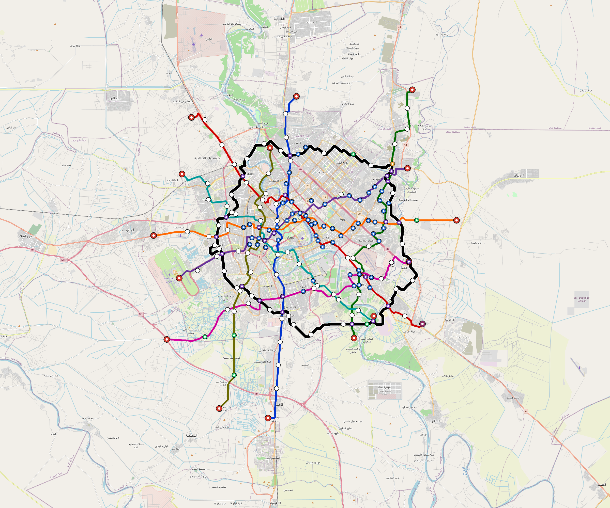
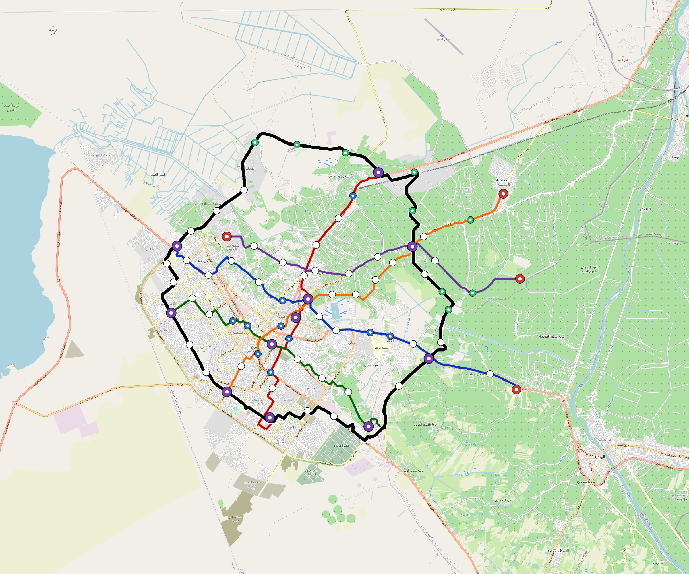

# OpenSourceRail


> An open-source technology stack for designing, building, and operating rail
> systems — built for the developing world, built to be owned by the countries
> that deploy it.

**Current milestone:** [**v0.1**](CHANGELOG.md) — first publishable
snapshot. See [CHANGELOG.md](CHANGELOG.md) for what's in tree.

**Status:** Rust workspace plus two Python sidecars (`design-py` for
GIS + network synthesis, `mechanical-py` for parametric mechanical +
civil + station components under build123d). Run
`python3 scripts/repo-health.py` for the generated-catalogue drift
gate and the test commands in [CHANGELOG.md](CHANGELOG.md) for the
current verification snapshot. Deployments ship as **GoA 4
(Unattended, driverless)** from day one per [RFC 0015](docs/rfcs/0015-driverless-operation.md)
— the driver cab is replaced by a nose-cone obstacle-detection sensor
suite (ultrasonic safety belt + solid-state LIDAR + mmWave radar +
stereo camera) on a dedicated T-OBS ECU, with **wayside track-
intrusion detection** ([RFC 0016](docs/rfcs/0016-wayside-track-intrusion.md))
covering the proactive half of the safety envelope between trains.
The rationalised rolling-stock baseline is a self-contained,
driverless battery car: standard bogies with **one powered bogie and
one trailer bogie per car**, **sodium-ion batteries under the
longitudinal seats**, a **low-floor centre door zone**, and
solar-buffered station charging during ~60 s dwells at roughly 1 km
stop spacing. The onboard pack is sized for about one route length
plus reserve, keeping mass and vehicle cost down while the station
PV + stationary battery system supplies normal service energy.
Reference rolling-stock cost is now **about €1.0M per self-contained
car / wagon**: body + interior, one powered bogie, one trailer bogie,
under-seat Na-ion pack, traction package, onboard sensors, and GoA 4
control electronics. A 3-car `light-metro-3car` trainset is therefore
budgeted at ~€3.0M before country multipliers.
The [Samawah pilot](docs/rfcs/0003-samawah-reference-deployment.md)
is a **brownfield deployment** anchored on the 300–800 dormant freight
wagons + rolling-stock workshop adjacent to Samawah Train Station per
[RFC 0027](docs/rfcs/0027-brownfield-pilot-asset-recovery.md), not a
greenfield reference scenario.

The design pipeline auto-synthesises a complete multi-line network for
any city listed in [`lib/city-batches/world-sample.toml`](lib/city-batches/world-sample.toml)
from real OpenStreetMap + WorldPop population data — population-tiered
topology, served-catchment bbox, country-specific cost + finance
multipliers. The catalogue currently covers **66 cities across 41
countries**, structured as:

- **Iraq launch corridor (18 cities)** — every governorate capital
  + Samawah, exercising the rolling-stock family bands on
  Iraqi soil.
- **Levant + Arabian Peninsula (9 cities)** — Sana'a, Aden, Taiz,
  Damascus, Aleppo, Homs, Amman, Beirut, Gaza City. Several are
  conflict-affected; financing assumptions reflect that.
- **Sub-Saharan Africa (15 cities)** — Nairobi, Dar es Salaam,
  Kampala, Antananarivo, Mogadishu, Kigali, Lusaka, Yaoundé,
  Kinshasa, Lubumbashi, Luanda, Maputo, Beira plus Niamey,
  Bamako, Dakar, Ouagadougou, Conakry from West Africa, plus
  Khartoum.
- **South Asia (6 cities)** — Coimbatore, Karachi, Faisalabad,
  Multan, Patna, Kabul, Kathmandu, Colombo.
- **Southeast Asia (6 cities)** — Yangon, Phnom Penh, Mandalay,
  Surabaya, Bandung, Davao, Vientiane.
- **Latin America + Europe (5 cities)** — Cuenca, La Paz, San
  Salvador (+ Lyon as a high-OSM-density solver test target).

Population bands cover 360 k (Duhok / Fallujah, light-metro-3car)
to 20.3 M (Karachi, metro-6car). One-command regeneration:
`scripts/regenerate-city.sh <slug>` for a single city or
`scripts/regenerate-all.sh --jobs 4` for the whole catalogue.


*Samawah (~374 k pop, Iraq 2024 census, As-Samawah Subdistrict per
[`lib/city-batches/world-sample.toml`](lib/city-batches/world-sample.toml))
— **a brownfield pilot, not a greenfield reference scenario.**
2026-04-26 satellite review ([RFC 0003 §2.1](docs/rfcs/0003-samawah-reference-deployment.md))
identifies **300–800 dormant freight wagons stored across two yards
adjacent to Samawah Train Station, plus a rolling-stock workshop
building** (the 2011 Iranian Waxon Park rehabilitation target). Iraqi
Republic Railways operates a fleet of 10,326 freight wagons + 255
passenger coaches on the active Baghdad–Basra mainline through the
city. Standard gauge (1 435 mm) matches RFC 0009. The OSR Samawah
pilot is specified by [RFC 0027 (brownfield asset-recovery
doctrine)](docs/rfcs/0027-brownfield-pilot-asset-recovery.md) as the
systematic conversion of this rail-yard + workshop complex into the
first OSR rolling-stock production site, with **~$8–15 M of
recoverable mechanical-component value** and **~$3–6 M of recoverable
workshop infrastructure** offsetting the greenfield CAPEX baseline.*

*Network — **auto-planned** end-to-end by `osr-design` against real
OSM data *plus* the WorldPop residential-population layer (so lines
reach population centres without mapped POIs). Three radial lines
all converging at a central elevated-junction interchange, 33 unique
stations at ~1.2 km inner / 2 km transitional / 4 km outer spacing,
54.9 km of double-track, **all soft gates passing**. Fleet 55 × 3-car
`light-metro-3car`. **OSR-discipline unit costs** throughout — prefab
portal-frame canopies, at-grade depots without overhead bridge cranes,
commodity Na-ion cells under the seats, one powered bogie per car,
tier-2 PMSM motors, DIY SiC inverters, station-dwell charging, open-
source CBTC on commodity SBCs, no overhead catenary, self-EPC overhead.
See [designs/west-asia/Iraq/Samawah/README.md](designs/west-asia/Iraq/Samawah/README.md)
for the full breakdown (per-line termini, fleet sizing, full cost
stack, country-anchored ticket pricing).*

### Auto-design catalogue at a glance

Same pipeline, every catalog city — population from a national-stats-
office source (Iraq 2024 General Population Census preliminary results
underpin every Iraqi figure; KRSO 2024 estimates for the three
KRI-administered cities), bbox sized to the served catchment, rolling-
stock family auto-selected per [RFC 0008 §5](docs/rfcs/0008-rolling-stock-reference-design.md),
finance section anchored to country-specific median income +
multilateral / sovereign rates from [`lib/templates/country-finance.toml`](lib/templates/country-finance.toml).
For cross-city comparison see the generated
[`designs/INDEX.md`](designs/INDEX.md). For the CAPEX audit trail see
[`docs/cost-model.md`](docs/cost-model.md).

**Iraq launch corridor** — 18 cities, every governorate capital +
Samawah; covers the full pilgrim circuit (Karbala / Najaf / Samawah)
plus the Kurdistan Regional capitals (Erbil / Sulaymaniyah / Duhok)
plus the post-conflict reconstruction set (Mosul / Ramadi / Fallujah):

| city | family | lines | stns | km | fleet | cov% |
|---|---|---:|---:|---:|---:|---:|
| [Baghdad](designs/west-asia/Iraq/Baghdad/) | metro-6car | 9 | 218 | 510 | 408 | 45 |
| [Basra](designs/west-asia/Iraq/Basra/) | metro-6car | 7 | 119 | 289 | 236 | 54 |
| [Mosul](designs/west-asia/Iraq/Mosul/) | metro-4car | 5 | 60 | 145 | 122 | 38 |
| [Sulaymaniyah](designs/west-asia/Iraq/Sulaymaniyah/) | metro-4car | 4 | 59 | 127 | 106 | 49 |
| [Erbil](designs/west-asia/Iraq/Erbil/) | metro-4car | 6 | 97 | 199 | 166 | 42 |
| [Kirkuk](designs/west-asia/Iraq/Kirkuk/) | metro-4car | 6 | 92 | 170 | 142 | 60 |
| [Najaf](designs/west-asia/Iraq/Najaf/) | metro-4car | 6 | 91 | 172 | 144 | 60 |
| [Karbala](designs/west-asia/Iraq/Karbala/) | metro-4car | 6 | 89 | 170 | 144 | 67 |
| [Hillah](designs/west-asia/Iraq/Hillah/) | light-metro-3car | 3 | 42 | 69 | 68 | 43 |
| [Nasiriyah](designs/west-asia/Iraq/Nasiriyah/) | light-metro-3car | 3 | 33 | 56 | 56 | 40 |
| [Amarah](designs/west-asia/Iraq/Amarah/) | light-metro-3car | 3 | 32 | 45 | 46 | 43 |
| [Ramadi](designs/west-asia/Iraq/Ramadi/) | light-metro-3car | 3 | 35 | 47 | 49 | 39 |
| [Baqubah](designs/west-asia/Iraq/Baqubah/) | light-metro-3car | 3 | 37 | 60 | 60 | 50 |
| [Kut](designs/west-asia/Iraq/Kut/) | light-metro-3car | 3 | 32 | 56 | 55 | 37 |
| [Diwaniyah](designs/west-asia/Iraq/Diwaniyah/) | light-metro-3car | 3 | 36 | 54 | 55 | 43 |
| [Duhok](designs/west-asia/Iraq/Duhok/) | light-metro-3car | 3 | 32 | 53 | 54 | 53 |
| [Fallujah](designs/west-asia/Iraq/Fallujah/) | light-metro-3car | 3 | 28 | 46 | 48 | 57 |
| [Samawah](designs/west-asia/Iraq/Samawah/) | light-metro-3car | 3 | 33 | 55 | 55 | 56 |

**Levant + Arabian Peninsula** — conflict-affected zones (Yemen,
Syria, Lebanon, Palestine) carry planning-grade financing
assumptions that reflect distressed sovereign access; OSR's mission
of low-CAPEX, locally-buildable rail is most acute here:

| city | ISO | family | lines | stns | km | fleet | cov% |
|---|---|---|---:|---:|---:|---:|---:|
| [Sana'a](designs/west-asia/Yemen/Sanaa/) | YE | metro-6car | 9 | 126 | 261 | 218 | 78 |
| [Aden](designs/west-asia/Yemen/Aden/) | YE | light-metro-3car | 3 | 28 | 44 | 46 | 43 |
| [Taiz](designs/west-asia/Yemen/Taiz/) | YE | light-metro-3car | 3 | 33 | 49 | 51 | 55 |
| [Damascus](designs/west-asia/Syria/Damascus/) | SY | metro-4car | 6 | 113 | 233 | 192 | 45 |
| [Aleppo](designs/west-asia/Syria/Aleppo/) | SY | metro-4car | 5 | 89 | 176 | 145 | 46 |
| [Homs](designs/west-asia/Syria/Homs/) | SY | light-metro-3car | 3 | 33 | 51 | 53 | 42 |
| [Amman](designs/west-asia/Jordan/Amman/) | JO | metro-6car | 8 | 172 | 354 | 286 | 51 |
| [Beirut](designs/west-asia/Lebanon/Beirut/) | LB | metro-4car | 6 | 83 | 160 | 134 | 70 |
| [Gaza City](designs/west-asia/Palestine/Gaza-City/) | PS | light-metro-3car | 1 | 15 | 24 | 24 | 30 |

**North Africa + Sub-Saharan Africa** — biggest single regional
bucket, covering megacities (Lagos-class catchments + Kinshasa /
Luanda / Khartoum), East African capitals (Nairobi / Dar / Addis-
class), Sahel + WAEMU bloc, and Indian-Ocean coastals (Maputo /
Antananarivo / Beira):

| city | ISO | family | lines | stns | km | fleet | cov% |
|---|---|---|---:|---:|---:|---:|---:|
| [Tunis](designs/north-africa/Tunisia/Tunis/) | TN | metro-4car | 5 | 118 | 240 | 194 | 48 |
| [Khartoum](designs/north-africa/Sudan/Khartoum/) | SD | metro-6car | 5 | 152 | 363 | 287 | 22 |
| [Nairobi](designs/east-africa/Kenya/Nairobi/) | KE | metro-6car | 8 | 191 | 476 | 378 | 43 |
| [Dar es Salaam](designs/east-africa/Tanzania/Dar-Es-Salaam/) | TZ | metro-6car | 7 | 163 | 393 | 314 | 28 |
| [Kampala](designs/east-africa/Uganda/Kampala/) | UG | metro-4car | 4 | 99 | 201 | 160 | 24 |
| [Antananarivo](designs/east-africa/Madagascar/Antananarivo/) | MG | metro-6car | 7 | 155 | 339 | 272 | 42 |
| [Mogadishu](designs/east-africa/Somalia/Mogadishu/) | SO | metro-4car | 4 | 68 | 128 | 106 | 40 |
| [Kigali](designs/east-africa/Rwanda/Kigali/) | RW | metro-4car | 4 | 86 | 171 | 139 | 34 |
| [Lusaka](designs/east-africa/Zambia/Lusaka/) | ZM | metro-6car | 6 | 123 | 236 | 192 | 34 |
| [Yaoundé](designs/east-africa/Cameroon/Yaounde/) | CM | metro-6car | 8 | 136 | 267 | 219 | 43 |
| [Kinshasa](designs/east-africa/DR%20Congo/Kinshasa/) | CD | metro-6car | 8 | 183 | 385 | 310 | 49 |
| [Lubumbashi](designs/east-africa/DR%20Congo/Lubumbashi/) | CD | metro-4car | 4 | 75 | 130 | 107 | 34 |
| [Luanda](designs/east-africa/Angola/Luanda/) | AO | metro-6car | 9 | 170 | 390 | 317 | 64 |
| [Maputo](designs/east-africa/Mozambique/Maputo/) | MZ | metro-4car | 6 | 83 | 186 | 156 | 71 |
| [Beira](designs/east-africa/Mozambique/Beira/) | MZ | light-metro-3car | 3 | 39 | 54 | 54 | 37 |
| [Niamey](designs/west-africa/Niger/Niamey/) | NE | metro-4car | 4 | 80 | 146 | 120 | 38 |
| [Bamako](designs/west-africa/Mali/Bamako/) | ML | metro-4car | 6 | 118 | 257 | 207 | 31 |
| [Dakar](designs/west-africa/Senegal/Dakar/) | SN | metro-6car | 5 | 107 | 204 | 167 | 52 |
| [Ouagadougou](designs/west-africa/Burkina%20Faso/Ouagadougou/) | BF | metro-4car | 6 | 138 | 264 | 213 | 37 |
| [Conakry](designs/west-africa/Guinea/Conakry/) | GN | metro-4car | 3 | 55 | 93 | 78 | 40 |

**South + Southeast Asia** — South-Asian megacities (Karachi
20.3 M, Patna 2.5 M), Indo-China twin-economy capitals (Yangon /
Mandalay / Phnom Penh / Vientiane), Indonesian island cities
(Surabaya / Bandung), and the Islamic-Asia archipelago (Davao):

| city | ISO | family | lines | stns | km | fleet | cov% |
|---|---|---|---:|---:|---:|---:|---:|
| [Coimbatore](designs/south-asia/India/Coimbatore/) | IN | metro-6car | 5 | 121 | 268 | 214 | 31 |
| [Patna](designs/south-asia/India/Patna/) | IN | metro-4car | 5 | 84 | 185 | 152 | 50 |
| [Karachi](designs/south-asia/Pakistan/Karachi/) | PK | metro-6car | 9 | 231 | 472 | 377 | 48 |
| [Faisalabad](designs/south-asia/Pakistan/Faisalabad/) | PK | metro-6car | 5 | 93 | 166 | 137 | 52 |
| [Multan](designs/south-asia/Pakistan/Multan/) | PK | metro-4car | 4 | 64 | 115 | 98 | 42 |
| [Kabul](designs/south-asia/Afghanistan/Kabul/) | AF | metro-6car | 7 | 137 | 261 | 215 | 53 |
| [Kathmandu](designs/south-asia/Nepal/Kathmandu/) | NP | metro-4car | 6 | 103 | 203 | 167 | 46 |
| [Colombo](designs/south-asia/Sri%20Lanka/Colombo/) | LK | metro-6car | 6 | 126 | 278 | 223 | 42 |
| [Yangon](designs/southeast-asia/Myanmar/Yangon/) | MM | metro-6car | 9 | 214 | 417 | 335 | 56 |
| [Mandalay](designs/southeast-asia/Myanmar/Mandalay/) | MM | metro-4car | 6 | 88 | 187 | 156 | 60 |
| [Phnom Penh](designs/southeast-asia/Cambodia/Phnom-Penh/) | KH | metro-4car | 6 | 107 | 228 | 186 | 48 |
| [Surabaya](designs/southeast-asia/Indonesia/Surabaya/) | ID | metro-6car | 7 | 143 | 294 | 240 | 40 |
| [Bandung](designs/southeast-asia/Indonesia/Bandung/) | ID | metro-4car | 6 | 126 | 258 | 208 | 41 |
| [Davao](designs/southeast-asia/Philippines/Davao/) | PH | metro-4car | 6 | 108 | 229 | 186 | 72 |
| [Vientiane](designs/southeast-asia/Laos/Vientiane/) | LA | light-metro-3car | 3 | 46 | 81 | 78 | 43 |

**Latin America + Europe**:

| city | ISO | family | lines | stns | km | fleet | cov% |
|---|---|---|---:|---:|---:|---:|---:|
| [Lyon](designs/europe/France/Lyon/) | FR | metro-4car | 6 | 122 | 287 | 232 | 45 |
| [Cuenca](designs/latin-america/Ecuador/Cuenca/) | EC | light-metro-3car | 3 | 48 | 79 | 77 | 57 |
| [La Paz](designs/latin-america/Bolivia/La-Paz/) | BO | metro-4car | 6 | 115 | 212 | 174 | 57 |
| [San Salvador](designs/latin-america/El%20Salvador/San-Salvador/) | SV | metro-4car | 6 | 121 | 255 | 207 | 50 |

A few representative auto-planned networks:



*Baghdad (~9.78 M, Baghdad Governorate) — megacity tier, nine radial
lines plus a circumferential ring at ~0.55 × urban radius, all
converging on the elevated-junction interchanges in the central
business district. 218 unique stations at ~2.1 km average spacing
(1.5 km inner / 3 km transitional / 5 km outer per the megacity
override of `SpacingConfig`); 510 km double-track; 408 trainsets
across the fleet. WorldPop residential layer + airport / suburb /
neighbourhood OSM anchors so radials reach Baghdad International
(BIAP), Basmaya New City, and other population centres beyond the
POI clusters.*



*Karbala (~1.39 M, Karbala Governorate) — the catalogue's strongest
coverage score (67%) thanks to a tightly clustered shrine-anchored
demand surface (Imam Hussein + Imam Abbas shrines anchor the
centre, with Hindiyah east-of-the-Euphrates and date-palm
outskirts south). Six metro-4car lines, 89 stations. Pilgrim
volume is the binding sizing constraint — Arba'een alone draws ~25
million pilgrims annually, an order of magnitude past the
resident catchment.*


*Karachi (~20.3 M, Karachi Division per the Pakistan 2023 Digital
Census) — the catalogue's largest catchment. Same nine-line topology
as Baghdad despite the very different street pattern, 231 stations,
377 trainsets. Demonstrates the pipeline scales past Iraqi-megacity
geography to South-Asian coastal megacity without rule-set tuning.*


*Lyon (~1.44 M, Métropole de Lyon) — kept in the catalogue
deliberately as a solver test target. Rich OSM data exercises bridge
classification (Rhône + Saône crossings), dense-anchor routing past
the Parc de la Tête d'Or, and the tightest civil-class corner cases.
Six lines, 122 stations, 287 km — comparable to the city's actual
operating metro + tram footprint (≈ 195 km), with the OSR pipeline
extending into the Métropole's outer 58 communes.*


*La Paz + El Alto, Bolivia (~1.82 M conurbation) — alpine-tropical
twin-city extending across a 1 000 m vertical drop from the
altiplano (~4 150 m, El Alto airport district) into the canyon
(~3 200 m, Río Abajo). Six lines, 115 stations. Severe terrain — the
civil classifier picks elevated for the cliff descent automatically.*


*Sana'a, Yemen (~3.94 M, Sana'a Capital Secretariat + Governorate) —
the catalogue's highest coverage score (78%). Mountain-plateau
geography (~2 250 m elevation) with a tightly clustered Old City
core driving the metric. Nine metro-6car lines, 126 stations,
261 km. Conflict-affected since 2014 — the financing model uses
distressed sovereign + IDA-eligible multilateral assumptions.*

Twenty-seven RFCs cover the full system from software
architecture through rail civil engineering to driverless operation; the
operations rulebook ([RFC 0013](docs/rfcs/0013-operations-rulebook.md)) is
drafted across four shipping role families (dispatcher / station-staff /
maintenance / control-centre) plus a historical driver section retained
for GoA 2 legacy fleets. Most of the
[RFC 0005](docs/rfcs/0005-sbc-software-architecture.md) crate map is in tree:

- **Onboard safety chain (SIL-4):** position fusion → ATP → brake + obstacle-
  detect (GoA 4 driverless) + derailment + fire + door-control, all pure
  functions, integrated into the simulator as a per-tick shadow stack. Zero
  spurious emergencies under nominal service. `osr-vigilance` and `osr-dmi`
  are kept in tree under the `goa2-cab` feature flag for legacy fleets but
  disabled by default.
- **Operator GUIs (RFC 0018), feature-complete + WASM:** two
  pure-Rust egui apps sharing
  [`osr-gui-shared`](crates/osr-gui-shared/) for rendering, both
  targeting native + browser (WebAssembly via trunk).

  [`osr-sim-gui`](crates/osr-sim-gui/) is the designer's workbench —
  load a scenario, run the sim once, then play back the resulting
  [`SimTimeline`](crates/osr-sim/src/timeline.rs) with scrubber +
  0.5×/1×/10×/60× speeds. Trains animate along the strip coloured
  by phase; click-to-inspect sidebar shows `station_m`, SoC, and
  last event; scrolling event log filters by kind; active faults
  surface as timestamped badges over the map.

  

  [`osr-occ-gui`](crates/osr-occ-gui/) is the dispatcher console —
  per-section `IntrusionState` overlay, train roster panel, alert
  feed with info/warn/crit filters, and **validated action
  modals** for S2.1 route grant, S5.1 `MaintenanceOverride`, and
  RFC 0013 §5 degraded-mode declaration. v1 is read-only; v3 of
  the RFC wires live consensus + RFC 0017 signed envelopes for
  revenue use.

  
- **Onboard obstacle detection (SIL-4, RFC 0015):** `osr-obstacle-detect`
  fuses a multi-physics sensor suite — 4× ultrasonic (close-range safety
  belt, 0.2–20 m), solid-state LIDAR (5–200 m primary 3D, affordable
  Chinese Livox / RoboSense / Leishen-class units), mmWave radar (all-
  weather validation), stereo camera (classification only) — into an
  `ObstacleVerdict` per tick: `Clear` / `RestrictedSpeed` (40 km/h cap,
  LIDAR degraded) / `CrawlOnly` (15 km/h cap, soft obstacle) /
  `EmergencyBrake`. **Two sensor packs per trainset, one at each end**;
  either nose can lead on a given run. Five SIL-4 properties O1–O5 with
  Kani harnesses + 8 proptests; 2oo2 peer cross-check fail-restrictive.
  The sim **injects sensor faults on a scenario schedule** (LIDAR
  offline, radar offline, ultrasonic channel stale, peer disagreement —
  per-train or fleet-wide) and the shadow stack produces the expected
  verdicts end-to-end. Wayside intrusion injection likewise — staged
  Present/Unknown verdicts on specific sections cause the interlocking's
  gate (d) to hold MA without any train entering.
- **Wayside track-intrusion detection (SIL-4, RFC 0016):**
  `osr-intrusion-detect` on the W-SBC fuses fence-line contact
  sensors, ROW-mounted solid-state LIDAR, ROW-mounted mmWave radar,
  and CCTV classifier into a per-section `IntrusionVerdict` —
  `Clear` / `Unknown` / `Present`. Fail-restrictive: a stale sensor
  yields `Unknown`, not `Clear`. The verdict flows into the consensus
  log as `EntryPayload::SectionIntrusion`, and
  `osr-interlocking::section_available_to` gate (d) withholds MA on
  any section whose verdict is not `Clear` (sections with no verdict
  are treated as "not instrumented" — backwards-compatible for
  partially-wired deployments). Five SIL-4 properties I1–I5 with
  Kani harnesses + 6 proptests; GSN goals G20–G24 close against real
  evidence. Complements the onboard obstacle-detect — wayside is
  proactive (before a train enters), onboard is reactive.
- **Integrator crate + feature-gated legacy stack:**
  [`osr-trainset-image`](crates/osr-trainset-image/) aggregates the
  onboard stack into one versioned deployment unit. Default build is
  **GoA 4 (Unattended)** per RFC 0015; `--features goa2-cab` opts in
  to legacy cabbed fleets by pulling `osr-dmi` + `osr-vigilance` into
  the image. `cab_profile()` is a compile-time witness for which
  profile the image was built with.
- **Parametric rolling stock in mechanical-py (RFC 0015 cabless):**
  sensor cowl, symmetric car body with door cutouts, 2-axle bogie
  simplified block, and the published trainset families
  (`urban-shuttle-1car`, `tram-2car`, `light-metro-3car`,
  `metro-4car`, `metro-6car`) all
  parametric on consist + track geometry. Every trainset fits
  inside its RFC 0008 §1 platform length with ≥ 1 m stopping margin.
  STEP artifacts round-trip into Revit / Tekla / Civil 3D.

  *Current rolling-stock design reference: self-contained driverless
  cars, one powered bogie + one trailer bogie per car, sodium-ion
  batteries under the longitudinal seats, low-floor centre door zones,
  and station-dwell charging from solar-buffered stops spaced around
  1 km apart. The solar train image at the top of this README is the
  public-facing visual reference; CAD screenshots are engineering
  checks only.*

  

  

  *Detailed bogie CAD per [RFC 0022](docs/rfcs/0022-bogie-traction-drive.md).
  **Motor bogie** (top): 2-axle Bo-Bo pivoting bogie with axle-hung
  PMSM traction motors (180 kW continuous / 320 kW peak per axle),
  single-stage 6.5:1 parallel-spur gearboxes, chevron rubber-metal
  primary suspension, air-spring secondary suspension, 760 mm forged
  wheels, one axle-mounted brake disc per axle. **Trailer bogie**
  (bottom): same frame + wheelsets + suspension SKU with the motor-
  gearbox drivetrains omitted — one single bogie pattern scales
  across every consist family with per-family motorisation.*
- **Onboard traction & power:** `osr-traction` + `osr-bms` + `osr-regen` +
  `osr-aux-power`, with signed-current sign convention enforced at the seam.
- **Onboard systems:** `osr-tcms`, `osr-hvac`, `osr-lighting`, `osr-dmi`,
  `osr-pis-onboard`, `osr-hot-axle`, `osr-odometry`, `osr-event-recorder`,
  `osr-tcn` (IEC 61375-style TSN trainbus, mock transport).
- **Wayside core:** `osr-interlocking` (MA computer) on top of `osr-consensus`
  (a Rust refinement of the TLA+ SMRaft spec, proptest-verified against all 5
  safety invariants; the sim can drive MA through a real 3-node Raft cluster
  via `--use-consensus`). `osr-wayside-points` controls power switches with
  dual-redundant sensor fusion and fail-restrictive Unknown detection.
- **Wayside infrastructure (Phase 2d):** `osr-balise`, `osr-level-crossing`
  (SIL-4 five-state barrier controller), `osr-hot-axle-wayside` (SIL-4 HABD),
  `osr-energy-site` (PV + battery + grid-tie dispatch).
- **Stations & fare:** `osr-psd` (platform screen doors), `osr-station-scada`,
  `osr-pis-station`, `osr-afc` (HMAC-signed account-based tokens), `osr-tvm`.
- **Back office:** `osr-occ` (dispatcher), `osr-historian` (ring-buffered
  per-metric storage with decimation), `osr-analytics`, `osr-t2g`.
- **Simulator:** multi-day runs, time-of-day dispatch, PV + trackside storage
  + grid tie energy model, fault injection, shadow onboard stack. Every
  section entry is gated by `osr-interlocking::section_available_to`
  against a synthesised log — the MA computer is the sim's only source of
  occupancy (RFC 0004 M5). Scenarios in TOML so anyone can design their
  own city.
- **Differential Python reference interpreter:** `tools/reference-ma/` —
  an independent stdlib-only Python twin of `osr-interlocking`. Every
  proptest run of `crates/osr-interlocking/tests/differential.rs`
  serialises a random log prefix, computes the MA in both Rust and
  Python, and asserts byte-identical JSON. Coverage extends to ring
  lines, switch observations, route grants, and speed restrictions.
  Catches bugs in either implementation (RFC 0004 M4).
- **GSN safety-case compiler:** `osr-safety-case` loads the TOML
  claim files in `docs/safety-case/gsn/` (19 goals, 5 strategies, 50
  solutions today — the G1/G2/G3 MA-computer claims, plus G4/G5
  covering every SIL-4 onboard and wayside evaluator, plus a
  regression guard for the 5-node Raft fix) and CI fails if any
  goal no longer traces to evidence. Adding a safety-relevant claim
  without linking it to a Kani harness / proptest / sim run breaks
  the build (RFC 0005 §4.9).
- **Kani harnesses on every SIL-4 evaluator:** ATP A1–A7, brake
  B1–B5, vigilance V1–V6, odometry O1–O5, wayside-points W1–W6, plus
  the MA computer's P1–P5 (scaled to a 3-section network with a
  mutation-style P4 companion) — the full pure-function surface of
  the onboard and wayside safety chains has bounded formal proofs in
  tree to match every proptest property.
- **Real network transport for TCN:** `osr-tcn::UdpTcn` — drop-in
  API replacement for the in-memory mock, running on commodity UDP
  (one datagram per message, 5-byte header, ≤ 1400-byte payload).
  Moves the on-train bus from simulator-only to multi-host bench
  without dragging in TSN hardware. Full TSN stays ahead on the
  RFC 0006 roadmap (v3).
- **Automatic design generation:** `design-py` (Overpass + raster synthesis) +
  `osr-routing` (cost/demand Dijkstra on a 20 m grid) + `osr-design` (emitter)
  compose a full multi-line network — corridor geometry, station placement,
  civil-class inference (at-grade / elevated / bridge — no tunnels per
  [RFC 0011](docs/rfcs/0011-civil-infrastructure-design-standard.md)),
  **rolling-stock + track-geometry + station-archetype selection under the
  RFC 0008/0009/0010 compatibility matrix** — from nothing but a bounding box
  and a population. Terminals are detected at line endpoints; interchanges
  are detected where two lines' stations land within 200 m of each other;
  every station gets a derived platform length consistent with the chosen
  consist family. Scales to a 500-city batch with a GeoNames-driven scanner
  that excludes any city already operating metro, tram, or light-rail.

- **Parametric mechanical + civil + station catalogue:** `mechanical-py`
  ships build123d assemblies for every non-trivial physical piece of
  the system — UIC 54E1 / 60E1 rail, EN 13230 B70-class sleeper,
  Pandrol-style fastener, precast U-girder (20/25/30 m), precast L-unit
  platform edge, and a prefab-bolt-together steel portal-frame bay
  with a factory-bonded solar-roof sandwich panel that composes into
  a full canopy by `(archetype, consist)`. `osr-mech-export`
  regenerates 33 STEP artifacts under `catalog/` that round-trip into
  Revit, Tekla, Civil 3D, and FreeCAD — deployment partners keep
  their existing structural tooling while the repository stays the
  canonical source. Design bias throughout: **prefab, bolt-together,
  no on-site welding, no wet concrete except pad footings** — a
  `standard` station canopy is ~11 t of steel in two lorry-loads,
  erected in 3–5 days.

  

  *Standard archetype canopy for a light-metro-3car consist: 13 × 6 m
  portal bays in hot-dip galvanised steel, topped by a factory-bonded
  sandwich panel that integrates the PV surface. One canopy covers the
  full platform — no separate station building, no catenary.*

- **OSR-ALN civil-tool bridge (RFC 0009 v3):**
  [`tools/osr-aln-convert/`](tools/osr-aln-convert/) is a
  stdlib-only Python converter from **LandXML 1.2** to
  [OSR-ALN TOML](docs/civil/osr-aln-format.md) — one CLI
  (`landxml-to-osr-aln`) covers Civil 3D, Bentley OpenRail,
  Trimble Business Center, and QGIS rail-path plugin exports.
  Reads tangents, circular curves, spirals, vertical PVIs +
  circular vertical curves, and station pin-points; emits
  placeholders for civil class + cant (not carried by
  LandXML). A companion `osr-aln-validate` CLI enforces the
  format spec's 8 hard gates + 3 soft gates against the
  deployment's design.toml (per-preset curve radius, gradient,
  cant maxima; civil-span contiguity; station-id cross-check;
  no tunnels). 21 passing tests. **Worked reference alignments
  for both Samawah lines** ship at
  [`docs/civil/west-asia/Iraq/Samawah/samawah-line1.aln.toml`](docs/civil/west-asia/Iraq/Samawah/samawah-line1.aln.toml)
  (13 km radial, 12 stations, 3 cant sections) and
  [`docs/civil/west-asia/Iraq/Samawah/samawah-line2.aln.toml`](docs/civil/west-asia/Iraq/Samawah/samawah-line2.aln.toml)
  (16 km ring, 10 stations, 4 cant sections, `is_ring = true`) —
  both pass every hard gate. This is the last-mile piece that
  lets a civil engineer import a real survey into the project.
- **EN 62267 type-certification pre-submission pack** at
  [`docs/certification/`](docs/certification/) — system
  description + SRS (SR-01..SR-24) + hazard log (17 hazards
  across 7 classes) + evidence register + clause-by-clause
  EN 62267 compliance matrix. Every safety requirement traces to
  a Kani harness / proptest / GSN goal / rulebook rule.
  Ready for an independent safety assessor (deployment-partner
  scope).
- **Consensus-log message authentication (SIL-2, RFC 0017):**
  `osr-crypto` now ships ed25519 sign + verify primitives alongside
  the existing HMAC-SHA256; `osr-secbus` wraps them with a per-
  deployment `KeyRegistry` and a `SignedBytes` envelope that carries
  issuer + signature alongside the opaque entry bytes. Verification
  happens before deserialisation so a hostile payload can't exploit a
  parser bug pre-auth. Three SIL-2 properties S1–S3 with Kani harnesses
  + 5 proptests; GSN goals G25–G27 close against real evidence.

---

## Why this project exists

Urban rail is the most efficient way to move people through a growing city,
and developing nations badly need more of it. But the global rail market is
dominated by a handful of vendors — Alstom, Siemens, Hitachi, CRRC, Thales —
whose turnkey systems lock countries into decades of imports, specialized
foreign labor, and capital flight.

OpenSourceRail is a complete, permissively licensed alternative, aimed at
national railway authorities and domestic engineering firms in target regions
(sub-Saharan Africa, MENA, South and Southeast Asia, most of Latin America).
The project succeeds when an operator in one of those markets can build and
run a modern rail network with imported content limited to raw steel, copper,
and specialty items that genuinely cannot be made locally — everything else is
produced by the people who will run the railway.

## What's different

OpenSourceRail is not a reimplementation of existing vendor practice in open
code. The architecture actively deprecates legacy approaches where cleaner
ones exist. The headline bets:

- **Catenary-free.** Trains run on onboard sodium-ion or LFP batteries with
  opportunity charging at stations. Eliminates the single largest capex line
  on new-build rail (€1–3M/km of catenary) and a major copper-theft target.
  [ARCHITECTURE §4 D7](docs/ARCHITECTURE.md) ·
  [RFC 0002](docs/rfcs/0002-energy-sizing.md)
- **Solar-first energy.** PV on station canopies, depot roofs, and along the
  right-of-way the railway already owns — netting positive daily generation
  against demand in the target climates.
- **Distributed train control, not centralized.** Wayside nodes run a formally
  verified consensus protocol maintaining authoritative track state. Replaces
  €10–50M centralized zone controllers with commodity SBCs at <€5k/site.
  [RFC 0001](docs/rfcs/0001-track-state-consensus.md) ·
  [TLA+ spec](formal/tla/SMRaft.tla)
- **Commodity SBCs + Rust, end to end.** One language from the SIL-4 safety
  kernel to the dispatcher web UI. Industrial PLCs, proprietary trainbuses,
  and Windows-based SCADA are out of the default design.
- **TSN Ethernet trainbus, not MVB/WTB.** Off-the-shelf switches, deterministic
  traffic, Rust stack.
- **Account-based fare, not smart cards.** Mobile money + QR + optional NFC;
  target markets have already leapfrogged card infrastructure.
- **Machine-checkable safety case.** GSN-structured, version-controlled,
  regenerated on every commit, linked to formal proofs and test evidence.

Each deviation from established rail practice is justified against a concrete
criterion: cost, simplicity, local manufacturability, or workforce transfer.
Not novelty for its own sake.

## Scope

Eight subsystems; treat as a system-of-systems:

| Domain | What it covers |
|---|---|
| D1. Operations & Dispatch | Timetable, incident management, event-sourced platform |
| D2. Train Control | Interlocking, movement authority, ATP — the SIL-4 core |
| D3. Communications | 5G + LoRa radio, TSN wayside backbone |
| D4. Passenger Services | Fare, info displays, announcements |
| D5. Rolling Stock | Unified Rust ECUs, TSN trainbus, onboard battery + inverter |
| D6. Infrastructure | Switches, track geometry, level crossings |
| D7. Energy | PV generation, trackside storage, station charging |
| D8. Depot & Maintenance | CBM, work orders, depot microgrid |

Full description: [docs/ARCHITECTURE.md](docs/ARCHITECTURE.md).

## Repository layout

```
OpenSourceRail/
├── README.md                 You are here.
├── Cargo.toml                Rust workspace.
├── docs/
│   ├── ARCHITECTURE.md       Scope, subsystem design, roadmap. Start here.
│   ├── operations/           Full operations rulebook (RFC 0013 v2): one-sentence
│   │   │                     rule + Why: paragraph per clause, every clause
│   │   │                     cross-referenced to the relevant crate and safety-case goal.
│   │   ├── driver/           D1–D8 (before-service → emergencies → end-of-service).
│   │   ├── dispatcher/       S1–S6 (shift start → incident handling → shift end).
│   │   ├── station-staff/    T1–T5 (opening → passenger incidents → closure).
│   │   ├── maintenance/      M1–M6 (depot safety → work-on-track → fleet MX).
│   │   └── control-centre/   C1–C3 (watch roles, comms, shift handover).
│   ├── hardware/             Hardware bring-up runbooks (RFC 0007 v1).
│   │   └── bring-up/         Per-class procedures: t-ecu-s, t-ecu-a, w-sbc, s-sbc.
│   ├── rolling-stock/        Rolling-stock shop-drawing packages (RFC 0008 v1+).
│   │   └── light-metro-3car/ Fabrication plan, body, bogie, traction, BOM, compliance.
│   ├── civil/                Per-deployment civil alignment (RFC 0009 v1+).
│   │   └── samawah/          Line 1 + Line 2 segment table + compliance report.
│   ├── stations/             Per-archetype architectural envelopes (RFC 0010 v1+).
│   │   └── samawah-standard/ Envelope, canopy structural, accessibility, services.
│   └── rfcs/
│       ├── 0001-track-state-consensus.md   Distributed signaling core.
│       ├── 0002-energy-sizing.md           Solar+battery sizing.
│       ├── 0003-samawah-reference-deployment.md   Reference pilot.
│       ├── 0004-osr-interlocking-plan.md   MA computer implementation plan.
│       ├── 0005-sbc-software-architecture.md  Canonical software architecture + crate map.
│       ├── 0006-osr-tcn-design.md          On-train bus (TCN-E pub/sub).
│       ├── 0007-hardware-reference-designs.md  T-ECU/S, T-ECU/A, T-OBS, W-SBC, S-SBC.
│       ├── 0008-rolling-stock-reference-design.md  5 trainset families (urban shuttle → metro-6car).
│       ├── 0009-track-design-standard.md   4 geometry presets (gauge, radius, grade, cant).
│       ├── 0010-station-design-standard.md 6 station archetypes + passenger-flow model.
│       ├── 0011-civil-infrastructure-design-standard.md  At-grade + elevated only (NO tunnels).
│       ├── 0012-switches-and-crossings.md  3 turnout tangents + LX equipment envelope.
│       ├── 0013-operations-rulebook.md     ≤ 60-page per-role rulebook, 3 degraded modes.
│       ├── 0014-depot-design-standard.md   3 depot archetypes + fleet-sizing formula.
│       ├── 0015-driverless-operation.md    GoA 4 by default — sensor suite, T-OBS ECU, cab elimination.
│       ├── 0016-wayside-track-intrusion.md  Wayside intrusion detection — complements onboard detector.
│       ├── 0017-cybersecurity-message-authentication.md  Ed25519-signed consensus entries.
│       ├── 0018-operator-guis.md             egui-based sim + OCC consoles for designer + dispatcher.
│       ├── 0019-diy-electronics.md           Plug-and-play DIY electronics from commodity modules.
│       ├── 0020-crashworthiness.md           EN 15227 three-zone energy budget for the cabless body.
│       ├── 0021-battery-traction.md          Under-seat Na-ion packs + station/depot opportunity charging.
│       ├── 0022-bogie-traction-drive.md      Single-SKU 2-axle Bo-Bo bogie + axle-hung PMSM motorisation pattern.
│       ├── 0023-door-system-reference-design.md   Electric linear-actuator door operator (EN 14752, $20–40 k vendor → ~$2 k DIY).
│       ├── 0024-battery-thermal-high-ambient.md   PCM mass + dedicated chiller for ≥ 50 °C ambient envelopes.
│       ├── 0025-diy-switch-and-point-machine.md   Regional switch-shop bootstrap (~$580 k CAPEX, ~$10 k per 1:9 turnout vs $120 k vendor).
│       ├── 0026-charging-connector-reconciliation.md   Two-tier connector architecture (CCS2 depot + side-pin/pantograph terminal).
│       └── 0027-brownfield-pilot-asset-recovery.md   Three-phase doctrine for converting dormant rolling stock + dormant rail workshops into OSR production capacity (Samawah, Atbara, Karachi, Maputo, Luanda, Tashkent worked examples).
├── crates/                   56 Rust crates — grouped by role below.
│   ├── osr-core/             Shared domain types (topology, trains, IDs).
│   │   └── proto/track_state.proto         Interface definitions.
│   │
│   │   # Onboard safety (SIL-4)
│   ├── osr-odometry/         Onboard position fusion.
│   ├── osr-atp/              Automatic Train Protection.
│   ├── osr-ato/              Automatic Train Operation (GoA 4 default).
│   ├── osr-obstacle-detect/  NEW (RFC 0015): ultrasonic + LIDAR + radar fusion.
│   ├── osr-trainset-image/   NEW (RFC 0015): onboard-stack integrator, goa2-cab flag.
│   │
│   │
│   │   # Onboard safety (continued)
│   ├── osr-brake/            EP brake + WSP + park brake.
│   ├── osr-vigilance/        Driver alerter / dead-man (GoA 2 legacy only).
│   ├── osr-derailment/       2oo2 derailment detection.
│   ├── osr-fire-safety/      Onboard fire detection + suppression.
│   ├── osr-door-control/     Door interlock + enable gating.
│   │
│   │   # Operator GUIs (RFC 0018)
│   ├── osr-gui-shared/       Shared egui network-rendering helpers.
│   ├── osr-sim-gui/          Simulator GUI binary — designer workflow.
│   ├── osr-occ-gui/          OCC dispatcher console binary — live-ops workflow.
│   │
│   │   # Onboard traction & power
│   ├── osr-traction/         Motor control (signed-current convention).
│   ├── osr-bms/              Battery management (pack-level).
│   ├── osr-regen/            Regenerative braking arbitration.
│   ├── osr-aux-power/        Auxiliary / HVAC / lighting bus.
│   │
│   │   # Onboard systems
│   ├── osr-tcms/             Train Control & Management System.
│   ├── osr-hvac/             HVAC controller.
│   ├── osr-lighting/         Passenger/cab lighting.
│   ├── osr-dmi/              Driver-Machine Interface state.
│   ├── osr-pis-onboard/      Onboard Passenger Information System.
│   ├── osr-hot-axle/         Onboard hot-axle advisory.
│   ├── osr-event-recorder/   Black-box ring buffer.
│   ├── osr-tcn/              IEC 61375-style TSN trainbus (mock v1).
│   │
│   │   # Wayside core (SIL-4)
│   ├── osr-interlocking/     MA computer (RFC 0004 M1+M2 done).
│   ├── osr-intrusion-detect/ NEW (RFC 0016): wayside track-intrusion detection.
│   ├── osr-consensus/        Raft — refinement of formal/tla/SMRaft.tla.
│   ├── osr-wayside-points/   Power-switch (point) controller.
│   │
│   │   # Wayside infrastructure
│   ├── osr-balise/           Balise registry + sighting audit.
│   ├── osr-level-crossing/   SIL-4 five-state crossing controller.
│   ├── osr-hot-axle-wayside/ SIL-4 wayside HABD.
│   ├── osr-energy-site/      PV + battery + grid-tie dispatch.
│   │
│   │   # Stations & fare
│   ├── osr-psd/              Platform screen doors.
│   ├── osr-station-scada/    Station SCADA.
│   ├── osr-pis-station/      Station passenger information.
│   ├── osr-afc/              Automatic fare collection (HMAC tokens).
│   ├── osr-tvm/              Ticket vending machine.
│   │
│   │   # Back office
│   ├── osr-occ/              Operations Control Centre / dispatcher.
│   ├── osr-historian/        Ring-buffered metric storage w/ decimation.
│   ├── osr-analytics/        Fleet analytics (adherence, MDBF, energy/km).
│   ├── osr-t2g/              Train-to-ground radio adapter.
│   │
│   │   # Commissioning
│   ├── osr-selftest/         NEW (RFC 0019): per-role post-assembly self-test
│   │                         CLI — the DIY path's flying-probe substitute.
│   │
│   │
│   │   # Design pipeline
│   ├── osr-routing/          Cost/demand Dijkstra solver + civil-class
│   │                         inference + station placement on a 20 m grid.
│   ├── osr-design/           Orchestrator — reads rasters + anchors, emits
│   │                         design.toml + corridor.geojson + quality.yaml.
│   ├── osr-alignment/        Horizontal + vertical alignment artefact with
│   │                         cant schedule, LandXML + railML exports,
│   │                         stake-out CSV, earthworks quantities, and
│   │                         trackside-equipment placement.
│   │
│   └── osr-sim/              Time-stepped simulator + shadow onboard stack +
│                             HTML/SVG visualizer (osr-vis).
├── mechanical-py/            Python sidecar for parametric mechanical / civil /
│   │                         station components (build123d). Every RFC-level
│   │                         choice (consist, archetype, span) is a parameter;
│   │                         STEP artifacts under catalog/ round-trip into
│   │                         Revit / Tekla / Civil 3D.
│   ├── src/osr_mech/
│   │   ├── track/            Rail (54E1/60E1), sleeper (B70), fastener, panel.
│   │   ├── civil/            Precast U-girder (20/25/30 m), platform L-unit.
│   │   ├── station/          Portal-frame bay + solar-roof sandwich panel +
│   │   │                     multi-bay canopy — the full "prefab metal canopy
│   │   │                     with solar roof" reference station.
│   │   └── rolling_stock/    Cabless car body + sensor cowl + 2-axle bogie +
│   │                         full trainset (4 consist families) per RFC 0015.
│   └── catalog/              Regenerable STEP artifacts (run `osr-mech-export`).
├── design-py/                Python sidecar for GIS data + raster synthesis.
│   └── src/
│       ├── osr_osm/          Overpass fetcher w/ SHA256 disk cache (arterials,
│       │                     buildings, water, protected land, POI anchors).
│       ├── osr_geo/          Numpy raster synthesis — cost / demand /
│       │                     buildability surfaces, binary + JSON sidecar.
│       └── osr_batch/        Batch driver + GeoNames → cities.toml scanner
│                             with built-in existing-transit denylist.
├── hardware/                 Hardware reference designs (RFC 0007 v2-spec).
│   ├── t-ecu-s/              Train safety kernel (2 × RP2350 2oo2 + RPi CM5).
│   ├── t-ecu-a/              Train application (RPi CM5 carrier).
│   ├── t-obs/                Train obstacle-detect ECU (2 × RP2350 + CM5 + sensors).
│   ├── w-sbc/                Wayside (Radxa CM5 RK3588S, one SKU).
│   ├── s-sbc/                Station / depot (RPi CM5 + commodity carrier).
│   └── diy-assembly/         Per-host-class commodity-module BOMs (RFC 0019).
├── tools/
│   ├── reference-ma/         Python reference interpreter for osr-interlocking
│   │                         (differential twin against Rust, RFC 0004 M4).
│   └── osr-aln-convert/      LandXML → OSR-ALN converter (RFC 0009 v3) for
│                             Civil 3D / Bentley OpenRail / Trimble / QGIS exports.
├── lib/
│   ├── city-batches/         Canonical city catalogue (slug → bbox / country /
│   │                         population / climate). `world-sample.toml` is the
│   │                         19-city calibration set spanning 8 regions and
│   │                         the rolling-stock family bands; population
│   │                         fields source national-stats-office figures (Iraq
│   │                         2024 census, INSEE 2023, INEC 2022, NBS 2022,
│   │                         PBS 2023 Digital Census, etc.).
│   ├── templates/            Reusable Lego-block TOMLs (stations, switches,
│   │                         signalling, structures, fleets, energy-sites,
│   │                         country-costs, country-finance).
│   ├── recipes/              City-to-design generation rules (climate, topology,
│   │                         fleet sizing).
│   └── examples/             Generic template scenarios (`example-simple.toml`,
│                             `minimal-city.toml`).
├── designs/                  Per-city design artefacts (`design.toml` +
│   │                         scenario + map PNG + README + GeoJSON +
│   │                         design-quality YAML, all auto-generated by
│   │                         `scripts/regenerate-city.sh <slug>`). 19 cities
│   │                         today across west-asia / north-africa / east-
│   │                         africa / west-africa / south-asia / southeast-
│   │                         asia / europe / latin-america.
│   └── west-asia/Iraq/Samawah/
│                             The reference brownfield pilot per RFC 0003 +
│                             RFC 0027 — the bundled canonical Samawah
│                             scenario `osr-sim` defaults to is generated
│                             from this folder's design.toml.
├── scripts/
│   ├── regenerate-city.sh    Slug-driven end-to-end regeneration: OSM →
│   │                         rasterise (with WorldPop) → osr-design synthesis
│   │                         → scenario → map PNG → README → drift tests.
│   └── regenerate-all.sh     Batch driver — reads slugs from world-sample.toml
│                             and runs regenerate-city.sh per slug. Supports
│                             --jobs N (parallel), --only / --skip filters,
│                             and continue-on-error with a final OK / FAIL
│                             summary; per-slug logs in
│                             .cache/osr-pipeline/logs/.
└── formal/tla/
    ├── SMRaft.tla            Consensus protocol spec.
    ├── MCSmall.tla           Small TLC harness.
    └── MCSmall.cfg           TLC config.
```

## Quick start

Requirements: Rust 1.80+ via `rustup`.

```
cargo run --release --bin osr-sim -- --duration 3600 --status-every 300
```

When run with no `--config`, `osr-sim` loads the **bundled canonical
Samawah scenario** — the auto-generated [`designs/west-asia/Iraq/Samawah/samawah.toml`](designs/west-asia/Iraq/Samawah/samawah.toml)
is `include_str!`-baked into the binary at build time. The output
shows each train's position and state-of-charge at regular intervals,
per-line km, energy consumed vs. charged, dispatch hold time, and any
invariant violations (there should be none).

To simulate any other catalog city, point at its scenario file:

```
cargo run --release --bin osr-sim -- \
    --config designs/south-asia/Pakistan/Karachi/karachi.toml \
    --duration 3600
```

## Designing your own city

Two paths, depending on whether you want to author by hand or have the
pipeline auto-design from a bbox + population:

**Auto-designed (recommended).** Add a new entry to
[`lib/city-batches/world-sample.toml`](lib/city-batches/world-sample.toml)
with a slug, ISO-2 country, served-catchment bbox (see the BBOX-SIZING
POLICY in the file header), and a national-stats-office population.
Then:

```
scripts/regenerate-city.sh <slug>
```

The pipeline pulls OSM + WorldPop, synthesises lines / stations /
fleet / depots / costs, and emits `design.toml`, the simulator
scenario file, the network map PNG, and the per-network README under
`designs/<region>/<country>/<City>/`. See the **Auto-design catalogue
at a glance** table above for representative outputs.

**Hand-authored.** Scenarios are plain-text TOML files — copy a
reference and edit it:

```
cp lib/examples/example-simple.toml designs/my-city/my-city.toml
# edit my-city.toml — see lib/examples/README.md for the file format
cargo run --release --bin osr-sim -- --config designs/my-city/my-city.toml
```

[`example-simple.toml`](lib/examples/example-simple.toml) is a 3-
station shuttle with 1 train — the smallest viable config; the full
file-format reference is in [`lib/examples/README.md`](lib/examples/README.md).

Pass `--json-out trace.json` to `osr-sim` to capture the full event
trace for later analysis.

## Auto-designing networks from GIS data

The pipeline synthesises a complete network for any city listed in the
canonical catalogue at [`lib/city-batches/world-sample.toml`](lib/city-batches/world-sample.toml)
— or for any new city you add there — from real OpenStreetMap +
WorldPop population data. **One command per city, or one command for
the whole catalogue:**

```
# One-time: install the python sidecar.
pip install -e design-py[geotiff,batch]
cargo build --release --bin osr-design

# Per-city (slug must exist in lib/city-batches/world-sample.toml):
scripts/regenerate-city.sh karachi

# Whole catalogue, 4 cities in parallel (~17 min cold, faster on warm caches):
scripts/regenerate-all.sh --jobs 4

# Subset:
scripts/regenerate-all.sh --only tunis,lyon --jobs 2
scripts/regenerate-all.sh --skip baghdad
```

The per-city script chains eight steps:

1. **OSM pull** — Overpass query for arterials, buildings, water,
   protected land, demand-anchor POIs (universities, hospitals,
   `aeroway=*`, `place=*`, `railway=station`). Cache-keyed on query
   text.
2. **Raster bundle** — 20 m cost / demand / buildability grid via
   `osr_geo`. Demand blends a Gaussian POI-anchor layer with the
   WorldPop residential-population layer (so lines reach population
   centres without mapped POIs). Falls back to the unconstrained
   WorldPop tile for ISO-3s where the constrained layer is unavailable
   (KEN, NER, etc.).
3. **Design synthesis** — `osr-design` (rust) routes each line with a
   demand-rewarded Dijkstra against the [topology archetype](crates/osr-routing/src/topology.rs)
   for the population band (`SingleRadial` ≤ 300 k, `RadialPlusRing`
   ≤ 1 M, `CrossPlusRing` ≤ 3 M, `HubAndSpokeDualRing` above). Stations
   placed at 1.2 km inner / 2 km transitional / 4 km outer
   ([`SpacingConfig`](crates/osr-routing/src/station.rs); 1.5 / 3 / 5 km
   megacity override). Civil classification (at-grade / elevated /
   bridge — no tunnels per RFC 0011). Fleet sizing per RFC 0014 §4
   round-trip / 5-min headway. CAPEX per RFC 0011 §9 with OSR-discipline
   unit costs × the country's [`country-costs.toml`](lib/templates/country-costs.toml)
   multiplier.
4. **Scenario file** — expanded simulator scenario `<slug>.toml`.
5. **Network map PNG** — auto-fit map of every line on OSM arterials,
   one colour per line, interchange complexes flagged.
6. **Per-network README** — full breakdown with the [costs] block,
   [funding & affordability](lib/templates/country-finance.toml)
   anchored to country median income, station-archetype unit table,
   energy-infrastructure tier table.
7. **Stats summary** — drift-test inputs.
8. **Drift tests** — `tests/test_osr_scenario.py` +
   `tests/test_population_drift.py` against the catalogue.

For the production-scale path (eventual 500-city scan via
`python -m osr_batch`), the
[`osr_batch.existing_transit`](design-py/src/osr_batch/existing_transit.py)
denylist (~600 cities, 80 countries) keeps cities with operating metro
/ tram / LRT (Paris, Tokyo, Cairo, etc.) out of auto-generation unless
`--include-existing-transit` is passed for calibration. The 19-city
`world-sample.toml` is the calibration set in front of that scan.

## Reading order

If you have 10 minutes: read this README and
[ARCHITECTURE §1–3](docs/ARCHITECTURE.md) (mission, principles, system map).

If you have an hour: add [ARCHITECTURE §4–11](docs/ARCHITECTURE.md) and
whichever RFC is closest to your domain.

If you're considering contributing: read everything above, then
[RFC 0005](docs/rfcs/0005-sbc-software-architecture.md) for the full
crate map, the [TLA+ README](formal/tla/README.md), and the
[track_state.proto](crates/osr-core/proto/track_state.proto) header.

## Target hardware

Four physical host classes, specified in
[RFC 0007](docs/rfcs/0007-hardware-reference-designs.md) and
scaffolded under [`hardware/`](hardware/). **Two-vendor palette —
Raspberry Pi and Radxa only** — so domestic procurement and spares
aren't at the mercy of a dozen silicon suppliers:

- **T-ECU/S** — train safety kernel. Two **Raspberry Pi RP2350** MCUs
  in a 2-out-of-2 composite fail-safe voting arrangement, each
  running identical Rust `no_std` code and cross-checking over SPI
  every tick. A Raspberry Pi **CM5** app processor alongside handles
  non-safety work (TCN-E, logging, OTA). EN 50155 OT4,
  dual-redundant per consist. ~€280/board.
- **T-ECU/A** — train application. Raspberry Pi **CM5** on a custom
  baseboard (Radxa CM5 drop-in via same SO-DIMM). EN 50155 OT4.
- **T-OBS** — train obstacle-detection ECU (new in RFC 0015).
  Two modules per trainset (one at each nose). Two **RP2350**
  safety MCUs in a 2oo2 cross-check plus a **CM5** for sensor
  fusion. Sensor interfaces: 4× ultrasonic AFE, mmWave-radar
  CAN-FD, LIDAR 1000BASE-T, stereo-camera MIPI-CSI. ~€780/module,
  ~€1 560 per consist — a small fraction of the ~€140 k cab capex
  eliminated.
- **W-SBC** — wayside. **Radxa CM5** (RK3588S, industrial-temp
  variant) in an IP67 DIN enclosure — +85 °C rated for pole-mount
  cabinets in hot climates. Same one baseboard selectively populated
  for switch, crossing, HABD, or energy-site role.
- **S-SBC** — station / depot. Raspberry Pi **CM5** on a commodity
  carrier — no custom baseboard.
- **O-SRV** — ops server. Commodity x86-64 or ARM64 Linux.

Every reference PCB is 4-layer FR-4 with 0.15 mm trace/space and 0.3 mm
vias — routine at tier-2 fabs across the target deployment footprint.
No micro-vias, no 0201 passives, no exotic stackups, no fans, no
restricted-export components.

### DIY plug-and-play — no PCB fabrication required

For pilot deployments, community builds, and developing-world
DIY operators who can't fab custom PCBs at low volumes,
[RFC 0019](docs/rfcs/0019-diy-electronics.md) defines a
**parallel assembly path using commodity modules only**. Every
host class is built from Raspberry Pi Foundation boards +
off-the-shelf HATs + generic relay / ADC / isolator breakouts,
wired through DIN-rail terminal blocks, booted from a prepared
SD card. **No KiCad, no soldering iron.**

Per-host-class Bills of Materials with specific SKUs +
distributors live under [`hardware/diy-assembly/`](hardware/diy-assembly/)
and each host class's `diy-assembly/` subfolder. A first-article
Samawah trainset + 1 km of instrumented wayside totals
**~$16 800 in electronics** at single-unit retail — compared
to ~$50 M for a legacy-CBTC equivalent (two orders of magnitude,
dominated by legacy NRE).

The DIY path preserves the SIL-4 safety arguments: the RP2350
silicon and 2oo2 AND-gate relay pattern come from the same
parts populating the custom design; what changes is how they
get bolted together. See [RFC 0019 §7](docs/rfcs/0019-diy-electronics.md) for the safety-case mapping.

Per-unit commissioning is handled by the
[`osr-selftest`](crates/osr-selftest/) CLI: run
`sudo osr-selftest --role <role>` on each SoC after assembly and
it exercises the role's evaluators (brake, ATP, obstacle /
intrusion detect, secbus, HMAC) against known-good fixtures.
Non-zero exit halts the unit at a red-LED fault state until the
named check passes — the per-unit equivalent of a custom-PCB
flying-probe stamp.

Trainset interiors follow the same commodity-first pattern: the
car body is a welded steel primary frame with composite cladding,
and doors / windows / HVAC / LED lighting / passenger screens /
seats / grab poles / intercom are all COTS items with reserved
envelopes, power budgets, evidence requirements, and bolt patterns
documented in
[`hardware/trainset-interiors/cots-catalogue.md`](hardware/trainset-interiors/cots-catalogue.md).
The catalogue is supplier-neutral: a deployment can swap vendors
with adapter plates and harness tails as long as the primary steel
frame, mass/power budgets, and certification evidence still pass.

The visual reference remains the Solar Metro Trainset image above;
the fit-out screenshot is kept in [`docs/screenshots/`](docs/screenshots/)
as a CAD sanity check rather than a public design render.

## Rail civil engineering — the affordable bet

Two civil classes only: **at-grade and elevated**. No tunnels.
[RFC 0011](docs/rfcs/0011-civil-infrastructure-design-standard.md) fixes
this as a project invariant because tunnels cost 10–40× at-grade CAPEX
and 4–8× the build time — outside the mission of urban rail a
developing nation can finance domestically. One reference precast
U-girder for every viaduct and water-crossing bridge in the whole
catalogue; one spares pool, one CAD reuse, one formwork.

Complementary rail-engineering RFCs:
- [RFC 0008](docs/rfcs/0008-rolling-stock-reference-design.md) — 5 trainset families, unified architecture (welded steel primary frame, composite cladding, one powered bogie per car, SiC inverters, Na-ion battery, onboard driverless stack).
- [RFC 0009](docs/rfcs/0009-track-design-standard.md) — 4 track-geometry presets (gauge, radius, grade, cant, rail profile).
- [RFC 0010](docs/rfcs/0010-station-design-standard.md) — 6 station archetypes with platform geometry derived from the line's consist.
- [RFC 0012](docs/rfcs/0012-switches-and-crossings.md) — 3 turnout tangents (1:9 / 1:14 / 1:18.5) + level-crossing equipment envelope. No diamonds.
- [RFC 0013](docs/rfcs/0013-operations-rulebook.md) — one shared ≤ 60-page rulebook, three degraded modes (no ambiguous in-between states).
- [RFC 0014](docs/rfcs/0014-depot-design-standard.md) — 3 depot archetypes with a fleet-sizing formula, all at-grade.
- [RFC 0015](docs/rfcs/0015-driverless-operation.md) — GoA 4 (Unattended) by default; sensor-cowl nose replaces the driver cab.
- [RFC 0020](docs/rfcs/0020-crashworthiness.md) — EN 15227 Cat C-II three-zone crash envelope for the cabless body.
- [RFC 0021](docs/rfcs/0021-battery-traction.md) — Under-seat Na-ion packs, station/depot opportunity charging, no catenary anywhere.
- [RFC 0022](docs/rfcs/0022-bogie-traction-drive.md) — Single-SKU 2-axle Bo-Bo bogie shared across every consist family; per-family motorisation pattern.
- [RFC 0023](docs/rfcs/0023-door-system-reference-design.md) — Electric linear-actuator door operator, EN 14752 certified once at the project level.
- [RFC 0024](docs/rfcs/0024-battery-thermal-high-ambient.md) — PCM thermal mass + dedicated chiller for ≥ 50 °C ambient envelopes (Samawah-class).
- [RFC 0025](docs/rfcs/0025-diy-switch-and-point-machine.md) — Regional switch-shop bootstrap (~$10 k per 1:9 turnout vs $120 k vendor; ~15× CAPEX payback over 80 switches).
- [RFC 0026](docs/rfcs/0026-charging-connector-reconciliation.md) — Two-tier connector architecture: CCS2 at depots + side-pin / pantograph-down at terminals.
- [RFC 0027](docs/rfcs/0027-brownfield-pilot-asset-recovery.md) — Brownfield-pilot doctrine (asset assessment → component recovery → first-article OSR trainset). Anchored on Samawah's existing rail yard + workshop; applies to any country with a dormant rolling-stock stockpile.

## How to get involved

1. **Phase-1 brownfield assessment for Samawah** ([RFC 0027](docs/rfcs/0027-brownfield-pilot-asset-recovery.md))
   — site visit + fleet census + workshop tooling audit + IRR / Iraqi
   Ministry of Transport disposition MoU. The single highest-value
   next step on the OSR programme: turns the Samawah pilot from a
   satellite-image observation into a deployment proposal. Diaspora
   technical-community introductions are the gating channel.
2. **Architecture + RFC review** from people with real rail signalling,
   power-electronics, or safety-case experience. File issues with
   specific disagreements; the RFCs reward red-pen.
3. **Operator review of the [RFC 0013](docs/rfcs/0013-operations-rulebook.md)
   rulebook.** Practising dispatchers, station staff, and maintenance
   leads reading [`docs/operations/`](docs/operations/) against their
   real-world practice.
4. **Climate + grid data** for specific target corridors. The
   [RFC 0002](docs/rfcs/0002-energy-sizing.md) energy-sizing model uses
   planning-grade defaults; real deployments need real PSH and grid-
   reliability data.
5. **A new city in [`lib/city-batches/world-sample.toml`](lib/city-batches/world-sample.toml).**
   Add a slug + served-catchment bbox + country + verified population
   (national-stats-office source) and run
   `scripts/regenerate-city.sh <slug>`. The catalogue currently
   covers 66 cities across 41 countries (full Iraq corridor, Levant,
   most of Sub-Saharan Africa + South + SE Asia + Latin America);
   gaps worth filling next are the cold-continental climate
   (Sarajevo / Tirana / Ulaanbaatar / Dushanbe), the Caribbean
   (Havana / Port-au-Prince / Santo Domingo), and the remaining
   metro-less Indian Ocean island states.

## License

Per [ARCHITECTURE §9](docs/ARCHITECTURE.md):

- **Software:** Apache 2.0
- **Hardware designs:** CERN-OHL-S v2
- **Documentation:** CC-BY-SA 4.0

## Non-goals

To be clear about what this project is not:

- Not a standards body. Where good open standards exist (GTFS, NeTEx, IEEE
  802.1 TSN, IEEE 2030.5), we adopt them.
- Not a safety certifier. The project produces artifacts suitable for
  independent assessment; certification is done by national authorities.
- Not a museum. We do not aim for plug-in compatibility with every legacy
  vendor protocol. Migration paths are scoped; permanent legacy support is
  not.

---

*The railways a country builds outlive the governments that commission them.
The technology underneath should belong to the country, not be leased to it.*
