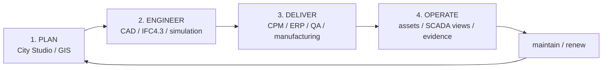

# OpenSourceRail

## Give your city a railway it can own

OpenSourceRail is an open urban-rail reference platform for countries that want to retain design authority, software, fabrication, integration, operations and maintenance capability in-country. It connects city planning, GIS, CAD/IFC, simulation, project controls, local manufacturing, ERP, equipment supervision and assurance around the same city, asset and engineering-revision identities.

This is not only a route visualizer, a train model or an operations dashboard. It is a reproducible **city → design → build → operate** workflow with source data, generators, applications, engineering models and verification evidence in one public repository.

This root README is the only human-facing front door; generated inventories are reference indexes, not a second navigation hierarchy.

> [!IMPORTANT]
> Repository outputs are planning and engineering-screening evidence—not bids, construction releases, safety certificates, approvals or endorsements. Open topography and water data do not replace survey, geotechnical or hydraulic evidence. Simulation and formal checks do not authorize live railway command.


**Start here:** [two-page brochure](OpenSourceRail-Brochure.pdf) · [complete PDF book](OpenSourceRail-Book.pdf) · [one-page overview](docs/open-source-rail-overview.md) · [architecture](docs/ARCHITECTURE.md) · [current roadmap and open work](docs/ROADMAP.md#reviewed-open-work)

## What is in the repository?

| Scope | Current public implementation |
|---|---|
| City portfolio | **265 cities in 43 developing countries**, plus one European comparison model excluded from the public programme evidence. |
| Planning | Interactive route, station, demand and service design over local GIS, open elevation/slope and water evidence, with reproducible source locks and content-addressed revisions. |
| Physical system | A 49.5 m, three-car, driverless light-metro reference with **360 AW2 / 480 AW3** capacity and **675 kWh gross / 540 kWh usable** onboard LFP storage; seven station archetypes; at-grade, viaduct and special bridge civil families. |
| Product definition | **120 LM3 product rows, 26 assembly nodes, 30 tooling/mould families, 146 native FreeCAD models and matching split IFC4.3 files** linked to BOMs, methods, QA gates and release evidence. |
| Delivery control | Finite-resource CPM, critical path, supplier/order-by planning, schedule of values, local/import cashflow, construction states, ERPNext projects, procurement, stock, manufacturing, quality, finance, HR and maintenance. |
| Operations | Deterministic Rust simulation and evaluators, OCC applications, observation-only supervision gateway, FUXA views, history/alarms, condition-to-maintenance cases and recovery-tested Workbench integration. |
| Assurance | Unit, property, cross-language, integration, browser, formal Kani and long-horizon test layers; IFC/IDS validation; source and result hashes; explicit human approval boundaries. |

The modelled civil strategy prefers simple construction—**at least 70% at grade, at most 25% elevated and at most 5% bridge, with no tunnel in the upstream reference system**—but the terrain/water planner now exposes where a real route cannot honestly keep that mix.

## Feature Highlights

The brochure summarizes the project as four stages. The implementation underneath each stage is deeper:


```mermaid
flowchart LR
  P[1. PLAN<br/>City Studio / GIS] --> E[2. ENGINEER<br/>CAD / IFC4.3 / simulation] --> D[3. DELIVER<br/>CPM / ERP / QA / manufacturing] --> O[4. OPERATE<br/>assets / SCADA views / evidence] --> R[maintain / renew] --> P
```

### 1. Plan the railway in its real city context

Edit lines, stations and service patterns in [City Studio](docs/city-studio.md) over 20 switchable layers: roads, buildings, existing rail, places, demand, buildability, engineering assets, water coverage, open-DEM elevation and slope. Inspect OD demand and line/day/time service; detect likely water crossings, bridge/viaduct segments and station exclusions; compile an immutable candidate revision; then generate a delivery twin describing what must be built, ordered and paid for, when it is needed and which work is critical.

Open DEM and mapped water are screening inputs. A likely bridge, viaduct or exclusion is a prompt for survey and engineering—not an automatically released structure or alignment.

### 2. Engineer the railway and its interfaces

Export OSR-ALN, GIS and IFC4.3 data for QGIS and Bonsai/IfcOpenShell; generate quantities, classifications, asset identities, 4D states, IDS requirements and BCF-oriented evidence; and use native FreeCAD train, station and civil geometry. System simulation connects trains, stations, energy, wayside, points/crossings, fares, regenerative braking and depots. Route changes flow into named compatibility checks for gradient, curvature, cant, platforms, clearances, braking, energy, crosswind, recovery and evacuation.

The latest [topography, BIM and mechanical design-detail register](engineering/models/bim/design-detail-register.md) controls 6 terrain/water impacts, 5 BIM requirement groups, 9 vehicle datums, 12 mechanical interfaces, 10 load-case families, 7 route-compatibility gates, 9 verification/closure rows and 39 mechanically controlled products/assemblies.

Every one of the 146 split LM3 IFC files carries design-detail provenance. Controlled objects also carry their mechanical interface property set. The buildingSMART [IDS requirements](engineering/models/bim/reference/lm3-information-requirements.ids) execute **4 specifications and 945 checks**, with a tracked [validation report](engineering/models/bim/reference/lm3-information-requirements.report.json) and negative mutation tests proving missing interface data is rejected.

That closes the information-delivery loop; it does **not** close supplier selection, calculations, tolerance stacks, structural proof, physical tests or competent-authority acceptance.

### 3. Deliver through local production and accountable project controls

Turn city design into asset registers, BOM demand, finite-resource schedules, supplier candidates, order-by dates, cash requirements, QA gates and construction states. ERPNext holds native projects, procurement, inventory, manufacturing, quality, finance, people and maintenance records. All 120 LM3 product rows and 30 tooling families feed factory methods, nested BOMs, travelers and hold points; controlled CAD/CalculiX changes can stop production and supersede evidence. Actual orders, receipts, serial/batch history, NCRs, invoices, payments and progress remain business records in ERP.

The locally manufactured first-article baseline controls 120 product rows and 26 assembly nodes. It has 472 fail-closed production-data slots across **62 locally made rows**, 16 [factory packages](design/component-catalogue/catalog/buildable-trainset/factory-release-work-packages.md) and 29 [drawing-definition seeds](design/component-catalogue/catalog/buildable-trainset/factory-drawings/index.md). Its [exterior finish](design/component-catalogue/catalog/buildable-trainset/exterior-finish-system.md) and [mass closure](design/component-catalogue/catalog/buildable-trainset/mass-closure-ledger.md) remain open until the required drawing, revision, material/process, tooling, inspection, verification and approval evidence exists.

### 4. Operate, maintain and retain evidence

One [Workbench](docs/workbench/README.md) joins City Studio, simulation, OCC, railway works, ERPNext/Frappe HR, FUXA and lifecycle views. Nine native Rust evaluator families publish exact units, identities and provenance through a versioned **observation-only** contract into durable history, alarms and read-only supervision. Reviewed conditions become ERP maintenance cases and Asset Repairs with parts, technicians, downtime and evidence. End-to-end CI exercises complete-city load, queued delivery, restart persistence, backup and clean-volume recovery.

ERP, FUXA and management automation have no path to movement authority, point/barrier command, safety release or engineering acceptance. Those remain separate human-controlled and independently assessed railway responsibilities.

## The newest cross-system capabilities

### Terrain- and water-aware route planning

The Rust routing path now validates source-locked raster metadata, bounds, geography, byte shape, finite values, water percentages, elevation, slope and anchors before use. The planner and City Studio consume the same verified bundle, so a map cannot claim locked evidence while routing different bytes. Property tests cover path bounds/connectivity and malformed or tampered inputs fail closed.

The output distinguishes likely at-grade, viaduct and bridge needs and prevents stations being treated as valid in mapped exclusions. It is designed to expose costly civil risk early; final vertical alignment, flood level, foundations, spans and station siting still require field evidence.

### Enforceable BIM and mechanical definition

The LM3 manufacturing federation is not just one large model. Each product and assembly has a separately reviewable IFC4.3 file linked back to the controlled product graph. Project-level design-detail hashes, interface properties and IDS rules make missing provenance or missing mechanical controls machine-detectable. See the [BIM reference package](engineering/models/bim/reference/README.md) and [model coverage](engineering/models/model-coverage.md).

The vehicle datum and interface model connects wheel/rail, carbody/bogie, doors/platforms, articulation, coupler/recovery, battery cassette, traction drive, HVAC, brakes, structure clearance and lifting/rerailing. Route evidence can therefore trigger a named compatibility gate instead of silently forcing an untracked train redesign.

The [supplier technical-support package](docs/commercial/supplier-technical-support-package.md) now turns potential industrial support into eight bounded LM3 work packages, eight cross-supplier interface closures, separated NRE/tooling/first-article/repeat/support costs and seven evidence gates. Public RailMac/SinoMac and related manufacturer pages remain catalogue leads only: the generated [readiness record](docs/commercial/supplier-technical-support-readiness.md) cannot count them as committed or compatible without legal authority, controlled configurations, named engineers and accepted evidence.

### Rust, ERP and SCADA integration with a hard authority boundary

The Rust workspace is a serious deterministic engineering and control-evaluation codebase, not a commissioned control product. Its evaluators are suitable for simulation, design review, shadow execution and HIL preparation. A dedicated `osr-supervision-contract` crate exports observations only; it contains no command, reset, movement-authority, protection, ERP-action or executive-decision type.

The [Rust review and integration plan](docs/rust-codebase-review-and-integration-plan.md) records the defects found and fixed: routing alias/bounds risks, release overflow behavior, raster path/source-lock weaknesses, invalid topography domains, an unstable Python serialization boundary and CI/security gaps. All-feature tests, Clippy, documentation tests, RustSec audit, WebAssembly builds, Kani jobs and scheduled soak/coverage work now protect that boundary.

### A governed multi-model executive council—not a single AI answer

The experimental [AI executive council](docs/operating/ai-executive-council.md) treats “AI CEO”, finance, operations, maintenance, procurement and workforce roles as software offices, not legal directors or railway duty holders.

For a recommendation to become an authorized ERP **draft packet**, the default constitution requires strategy, finance, operations and risk perspectives; independently authenticated identities spanning at least two providers and three model families; 75% endorsement with any rejection forcing human review; immutable ERP/SCADA context and proposal/ballot/policy hashes; a deterministic verifier; and an operator-keyed attestation checked again by ERPNext.

Models vote independently and do not see earlier ballots. Four wrappers around one model fail the diversity test. Even a successful council can only prepare allowlisted, unsubmitted budget scenarios, maintenance plans, material requests or work orders. It cannot submit ERP records, pay, contract, hire/fire, certify, release engineering, operate SCADA or command a railway.

This makes the proposed administrative-cost reduction measurable: time saved in evidence collation, draft preparation and routine coordination can be piloted while dissent, exceptions, provider cost, human review time and error rates remain visible.

The companion [lifecycle governance, HR/admin and QR templates](docs/operating/lifecycle-governance-and-qr.md) apply one controlled evidence model to every mechanical product/assembly, station variant, reusable civil type and Rust crate. Asset QR identities are lookup-only and remain unprintable until an operator provisions an HTTPS resolver and verifies each physical binding.

## What is ready for what?

OpenSourceRail deliberately contains products at different maturity levels:

| Product | Current maturity | Credible use now |
|---|---|---|
| Design and delivery platform | Serious demonstration | City GIS, alignment, service, cost, IFC, procurement, schedule, project twin and engineering coordination. |
| Train and infrastructure reference system | Engineering development | Local-manufacture planning, supplier RFQs, prototype definition, BIM coordination and civil option studies. |
| Open GoA 4 control system | R&D / pre-certification | Deterministic simulation, shadow mode, formal review and HIL preparation—not live railway command. |

The first adoptable product does not require a new autonomous railway. Start with an existing depot, workshop or pilot corridor and deploy the non-safety owner/operator stack: asset register, project controls, simulator, Ops Core, QA, maintenance and evidence portal. See the [first-adoptable-product boundary](docs/first-adoptable-product.md).

## See the current system

| Unified lifecycle workspace | ERPNext city execution | Embedded supervision |
|---|---|---|
|  |  |  |

| City Studio | Civil IFC coordination | Trainset assembly |
|---|---|---|
|  |  |  |

These are captures of the installed simulation platform and generated engineering models, not UI mockups. Reproduce the Workbench captures with [`capture-platform.mjs`](deployment/workbench/tests/capture-platform.mjs), or watch the [88-second product assembly](engineering/models/digital-twins/fabrication-assembly/fabrication-assembly-digital-twin.mp4) and [48-second civil IFC sequence](engineering/models/bim/reference/civil-construction-sequence.mp4).

## Generate a city delivery twin

Regenerating a city creates a connected planning baseline, not just a route drawing or cost total: **GIS, route, service and fleet → asset register and BOM demand → supplier/order-by plan → finite-resource CPM and schedule of values → local/import cashflow, QA and 4D states → reviewed ERP execution and lifecycle evidence**.

Workbench can generate any catalogue city and open its project twin without a shell. Each city publishes a compact `engineering/project-twin/summary.json`; the reproducible bundle contains the full task, procurement, cashflow and visualization records. Use ERPNext for issued business transactions and actuals.

The reference cost model uses about **$0.9M per 3-car light-metro trainset** as a local factory-gate planning target (the current build record is $885k) and **$60k per supported vehicle/car module** for a shared country factory. Homologation, supplier qualification, first-of-class engineering, warranty and deployment remain separate gates.

## The economic case

The platform is designed to let a public owner competitively procure ordinary civil works, vehicle structures, GFRP panels, interiors, wiring, installation and maintenance locally, importing specialist components where local suppliers are not yet qualified.

For an illustrative **$100M OpenSourceRail scope**, the editable default comparison applies a 2.0× foreign-turnkey price with 90% requiring foreign currency or international capital:

| Same modelled railway scope | Localisation-first OpenSourceRail | Foreign-turnkey sensitivity |
|---|---:|---:|
| Programme price | **$100.0M** | **$200.0M** |
| Value not requiring external capital | $75.4M | $20.0M |
| External-capital requirement | **$24.6M** | **$180.0M** |

In that scenario, the external-capital requirement is **$155.4M (86.3%)** lower before interest. Across the 265-city model, **about $203B—roughly 75% of programme value—is assigned to domestic activity**. These are reproducible planning sensitivities, not bids, audited origin claims or financing offers. Review the assumptions, low/default/high comparisons and financing cases in the [portfolio calculation](docs/portfolio-summary.md).

## Run it

On Debian, Ubuntu, Mint, Fedora, RHEL, Rocky, AlmaLinux, CentOS, openSUSE or Arch Linux, install, build and launch the Workbench; or run the deterministic simulator and test harness:

```bash
./install.sh
./osr build
./osr book
./osr
./osr sim --duration 3600 --status-every 300
./osr test
```

Open <http://127.0.0.1:8090/>. The local server is not an authenticated public deployment. The installer reports existing tools before changing anything and offers larger engineering applications separately. Disposable output goes under `build/` and `target/release/`; public review artifacts remain tracked outside those trees.

## Find Your Way

| If you are… | Start with… |
|---|---|
| A city or transport planner | [City Studio](docs/city-studio.md), [city catalogue](cities/catalogue/README.md), [cost model](docs/cost-model.md) and [portfolio](docs/portfolio-summary.md) |
| A civil/BIM engineer | [Civil system](docs/civil/README.md), [Bonsai IFC workflow](docs/civil/bonsai-ifc-workflow.md), [BIM reference package](engineering/models/bim/reference/README.md) and [survey gates](cities/catalogue/west-asia/Iraq/Samawah/engineering/survey/field-evidence-brief.md) |
| A rolling-stock, supplier or manufacturing engineer | [LM3 reference](docs/rolling-stock/light-metro-3car/README.md), [buildable trainset](design/component-catalogue/catalog/buildable-trainset/README.md), [supplier technical-support package](docs/commercial/supplier-technical-support-package.md), [CAD models](design/component-catalogue/models/cad/README.md) and [factory readiness](design/component-catalogue/catalog/buildable-trainset/factory-release-readiness.md) |
| An operator or maintainer | [Operations](docs/operations/README.md), [Workbench](docs/workbench/README.md), [connected lifecycle](docs/lifecycle/README.md) and [example-city deployment](deployment/example-city/README.md) |
| An ERP/SCADA integrator | [Operating platform](docs/operating/README.md), [ERPNext setup](deployment/erpnext/README.md), [supervision gateway](deployment/supervision/README.md) and [embedded contract](docs/lifecycle/embedded-integration.md) |
| A software or assurance reviewer | [Rust workspace](crates/README.md), [software architecture](docs/software-architecture-diagrams.md), [formal results](engineering/assurance/formal/results/README.md), [safety case](docs/safety-case/README.md) and [certification boundary](docs/certification/README.md) |
| A public owner, funder or delivery partner | [Competitive position and proof roadmap](docs/competitive-position-and-proof-roadmap.md), [owner–builder–operator plan](docs/owner-builder-operator-setup.md), [mobilisation status](docs/owner-builder-operator-mobilisation-status.md), [JV/development framework](docs/commercial/joint-development-framework.md), [partnership status](docs/commercial/partnership-readiness.md) and [supplier-support status](docs/commercial/supplier-technical-support-readiness.md) |
| A contributor | [Contributing guide](CONTRIBUTING.md), [governance](GOVERNANCE.md), [change log](CHANGELOG.md) and [release checklist](docs/releases.md) |

## Source Of Truth

```text
source-locked city and engineering inputs
                  ↓
validated candidate + deterministic generators
                  ↓
content-addressed, Git-reviewable revision
                  ↓
GIS / OSR-ALN / CAD / IFC / costs / simulation / project twin
                  ↓
independent evidence + named approval + operational baseline
```

A hash proves which bytes were reviewed; it does not approve them. Generated city packages still require survey, calibrated demand, utility and ground data, supplier qualification, first-article manufacture and testing, competent engineering review and national authorization.

The principal editable sources are:

| Concern | Source of truth | Generated/review output |
|---|---|---|
| Architecture and decisions | [`docs/ARCHITECTURE.md`](docs/ARCHITECTURE.md), accepted [`docs/rfcs/`](docs/rfcs/README.md) | Diagrams, guides and summaries |
| Rust behavior and simulation | [`crates/`](crates/README.md) and tests | Applications, traces and coverage evidence |
| City synthesis and shared assumptions | [`design/city-generation/`](design/city-generation/README.md), [`lib/templates/`](lib/templates/), [`lib/recipes/`](lib/recipes/), [`lib/city-batches/world-sample.toml`](lib/city-batches/world-sample.toml) | City catalogue, service, finance and engineering packages |
| Interactive city revisions | [`cities/workspaces/`](cities/workspaces/README.md) | Content-addressed candidates and exports |
| Mechanical/station/civil geometry | [`design/component-catalogue/src/osr_mech/`](design/component-catalogue/src/osr_mech/) | FreeCAD, IFC, BOM, traveler and image artifacts |
| ERP and supervision integration | [`deployment/erpnext/`](deployment/erpnext/README.md), [`deployment/supervision/`](deployment/supervision/README.md), [`services/integration/`](services/integration/) | ERP workflows, FUXA views, history and maintenance evidence |
| Survey and released alignment | Accepted deployment GIS and OSR-ALN sources | QGIS, GeoPackage, corridor and IFC alignment evidence |
| Assurance and approval | [`docs/certification/`](docs/certification/README.md), [`docs/safety-case/`](docs/safety-case/README.md), [`engineering/assurance/formal/`](engineering/assurance/formal/README.md) | Proof records, verification status and acceptance reports |

The [artifact policy](docs/repository-artifact-policy.md) explains what remains in Git. CI keeps useful CAD, IFC, PDF, image and animation evidence while enforcing a 50 MiB per-file ceiling.

## License

Software is Apache 2.0. Control electronics and open physical designs use CERN-OHL-S v2. Documentation is CC-BY-SA 4.0.

See [LICENSE.md](LICENSE.md) and [LICENSES/](LICENSES/README.md) for the full texts.
