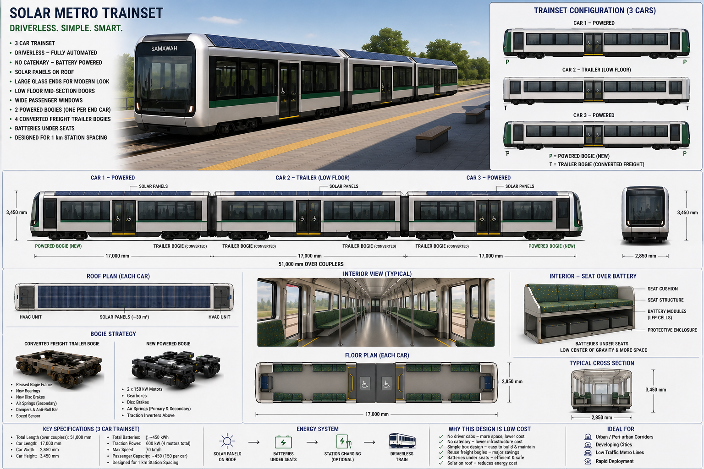
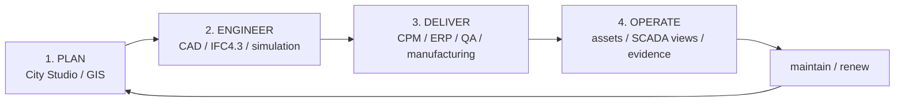
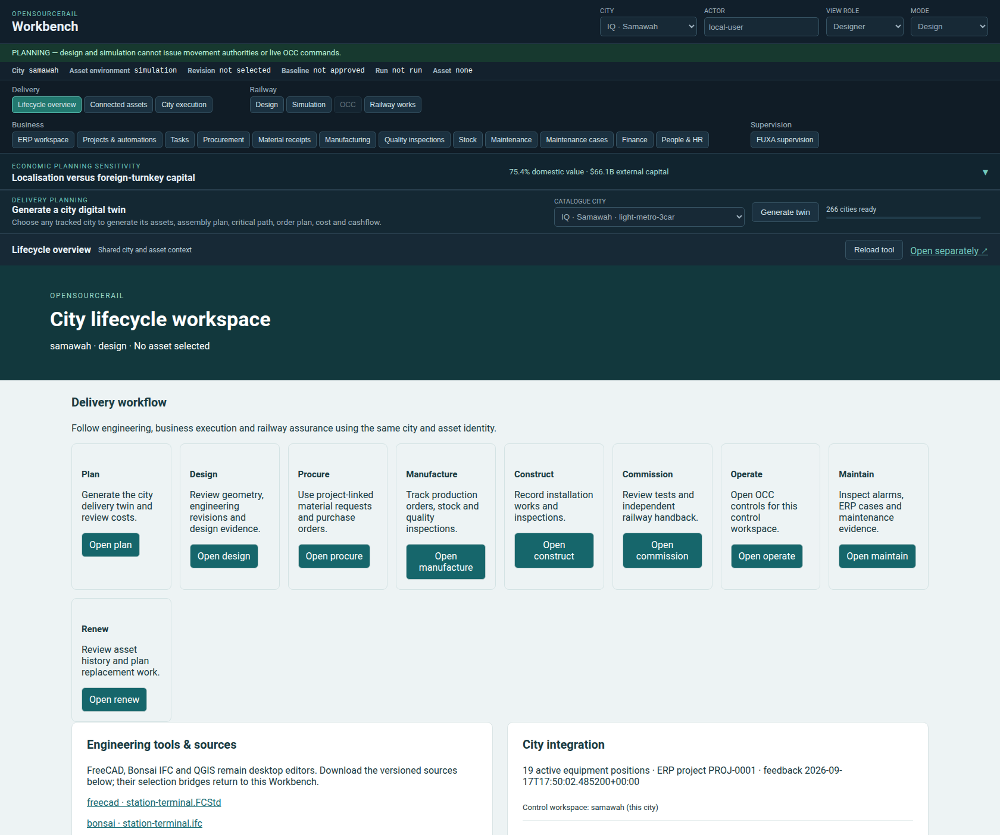
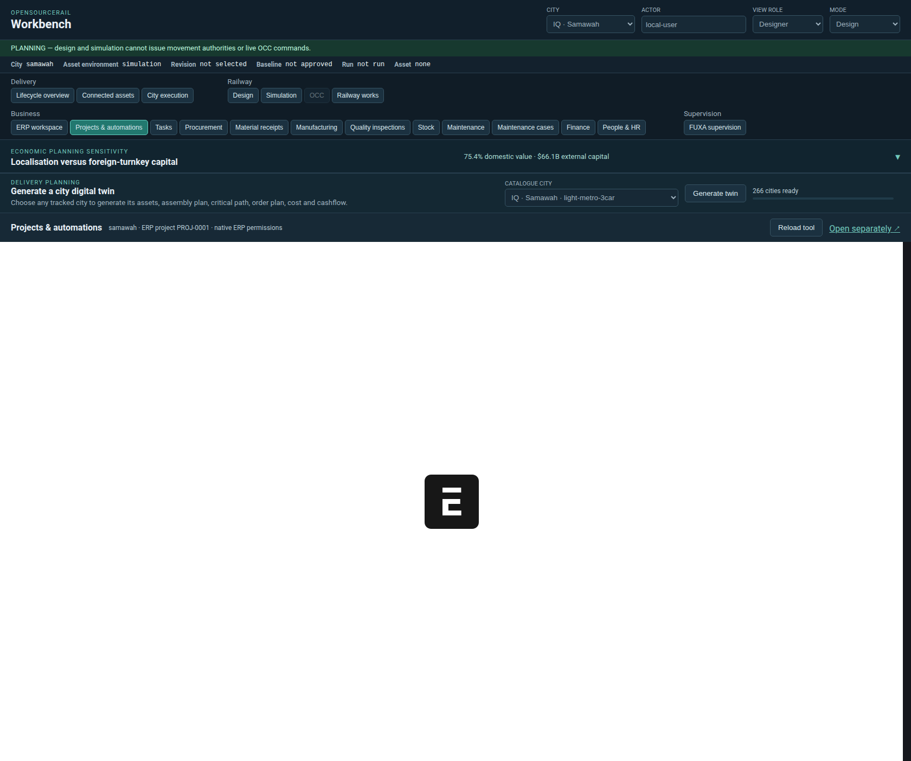
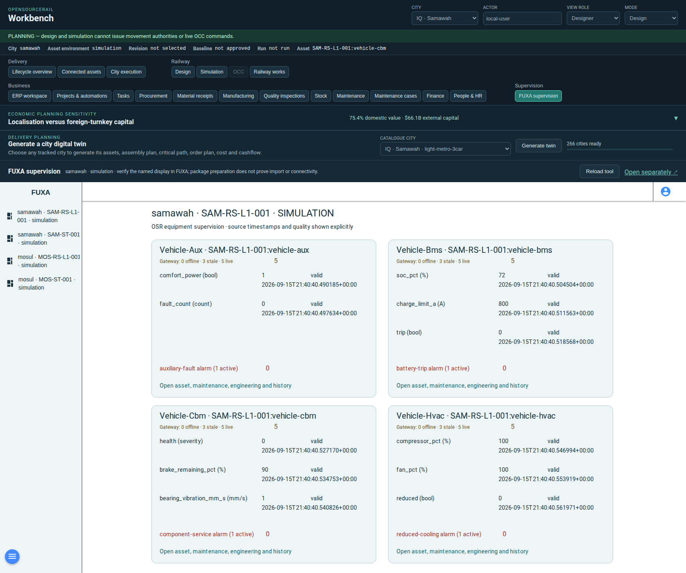
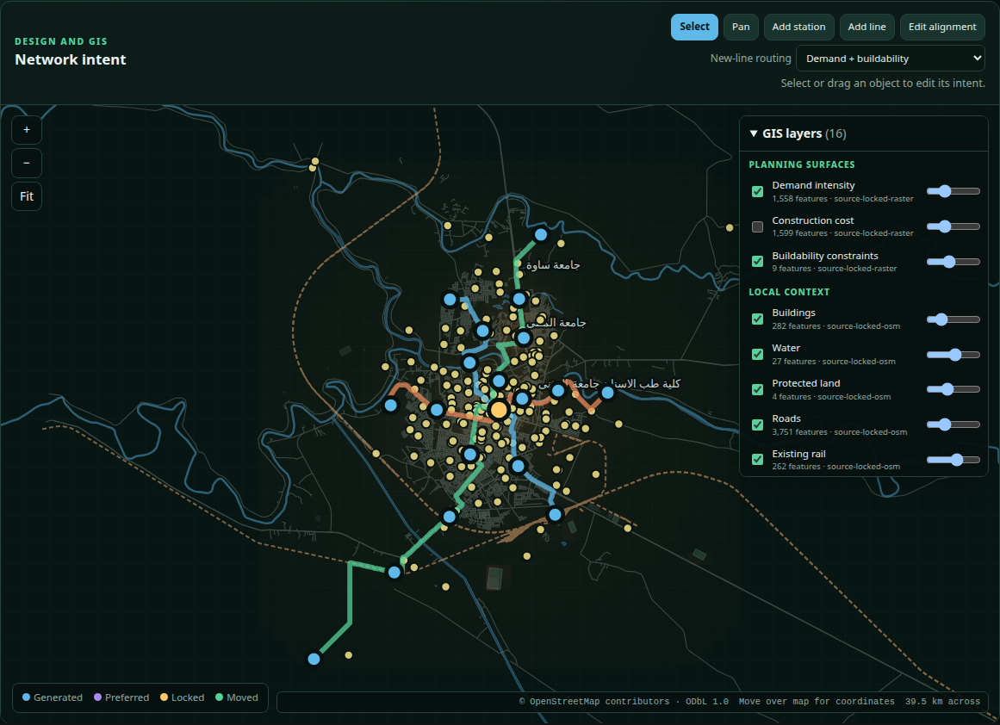
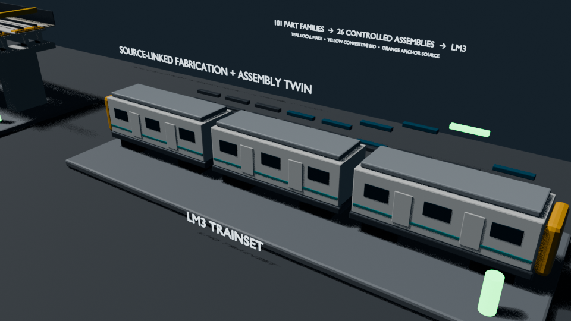

# OpenSourceRail

## Give your city a railway it can own

OpenSourceRail is an open urban-rail reference platform for countries that want to retain design authority, software, fabrication, integration, operations and maintenance capability in-country. It connects city planning, GIS, CAD/IFC, simulation, project controls, local manufacturing, ERP, equipment supervision and assurance around the same city, asset and engineering-revision identities.

This is not only a route visualizer, a train model or an operations dashboard. It is a reproducible **city → design → build → operate** workflow with source data, generators, applications, engineering models and verification evidence in one public repository.

This root README is the only human-facing front door; generated inventories are reference indexes, not a second navigation hierarchy.

> [!IMPORTANT]
> Repository outputs are planning and engineering-screening evidence—not bids, construction releases, safety certificates, approvals or endorsements. Open topography and water data do not replace survey, geotechnical or hydraulic evidence. Simulation and formal checks do not authorize live railway command.



**Start here:** [two-page brochure](OpenSourceRail-Brochure.pdf) · [complete PDF book](OpenSourceRail-Book.pdf) · [one-page overview](docs/open-source-rail-overview.md) · [architecture](docs/ARCHITECTURE.md) · [current roadmap and open work](docs/ROADMAP.md#reviewed-open-work)

## Functions at a glance

| Scope | Current public implementation |
|---|---|
| City portfolio | **265 cities in 43 developing countries**, plus one European comparison model excluded from the public programme evidence. |
| Planning | Interactive route, station, demand and service design over local GIS, open elevation/slope and water evidence, with reproducible source locks and content-addressed revisions. |
| Physical system | A 49.5 m, three-car, driverless light-metro reference with **360 AW2 / 480 AW3** capacity and **675 kWh gross / 540 kWh usable** onboard LFP storage; integrated battery-priority/cabin thermal control; seven station archetypes; at-grade, single-track, viaduct and special bridge civil families. |
| Product definition | **120 LM3 product rows, 26 assembly nodes, 30 tooling/mould families, 146 native FreeCAD models and matching split IFC4.3 files** linked to BOMs, methods, QA gates and release evidence. |
| Delivery control | Finite-resource CPM, critical path, supplier/order-by planning, schedule of values, local/import cashflow, construction states, ERPNext projects, procurement, stock, manufacturing, quality, finance, HR and maintenance. |
| Operations | Deterministic Rust simulation and evaluators, OCC applications, observation-only supervision gateway, FUXA views, history/alarms, condition-to-maintenance cases and recovery-tested Workbench integration. |
| Assurance | **286 G0 component passports** across engineering and owner/operator platforms; unit, property, cross-language, integration, browser, Kani and long-horizon tests; IFC/IDS validation; deterministic FMEA/standards reports; explicit physical-test and approval boundaries. |

The modelled civil strategy prefers simple construction—**at least 70% at grade, at most 25% elevated and at most 5% bridge, with no tunnel in the upstream reference system**—but the terrain/water planner now exposes where a real route cannot honestly keep that mix.

## Feature Highlights

The brochure summarizes the project as four stages. The implementation underneath each stage is deeper:


```mermaid
flowchart LR
  P[1. PLAN<br/>City Studio / GIS] --> E[2. ENGINEER<br/>CAD / IFC4.3 / simulation] --> D[3. DELIVER<br/>CPM / ERP / QA / manufacturing] --> O[4. OPERATE<br/>assets / SCADA views / evidence] --> R[maintain / renew] --> P
```

### 1. Plan the railway in its real city context

Edit lines, stations and service patterns in [City Studio](docs/city-studio.md) over 20 switchable layers: roads, buildings, existing rail, places, demand, buildability, engineering assets, water coverage, open-DEM elevation and slope. Inspect OD demand and line/day/time service; detect likely water crossings, bridge/viaduct segments and station exclusions; compile an immutable candidate revision; then generate a delivery twin describing what must be built, ordered and paid for, when it is needed and which work is critical. Open DEM and mapped water are screening inputs, not released alignment or structural evidence.

### 2. Engineer the railway and its interfaces

Export OSR-ALN, GIS and IFC4.3 data for QGIS and Bonsai/IfcOpenShell; generate quantities, classifications, asset identities, 4D states, IDS requirements and BCF-oriented evidence; and use native FreeCAD train, station and civil geometry. System simulation connects trains, stations, energy, wayside, points/crossings, fares, regenerative braking and depots. Route changes flow into named compatibility checks for gradient, curvature, cant, platforms, clearances, braking, energy, crosswind, recovery and evacuation. The [design-detail register](engineering/models/bim/design-detail-register.md) controls terrain/water impacts, BIM groups, vehicle datums, mechanical interfaces, load cases and route gates. All 146 split LM3 IFC files carry provenance and interface properties; the buildingSMART [IDS requirements](engineering/models/bim/reference/lm3-information-requirements.ids) execute **4 specifications and 945 checks**. This closes information delivery—not supplier selection, calculations, tolerance stacks, structural proof, physical tests or authority acceptance.

### 3. Deliver through local production and accountable project controls

Turn city design into asset registers, BOM demand, finite-resource schedules, supplier candidates, order-by dates, cash requirements, QA gates and construction states. ERPNext holds native projects, procurement, inventory, manufacturing, quality, finance, people and maintenance records. The first-article baseline controls 120 product rows and 26 assembly nodes; 30 tooling families, 16 [factory packages](design/component-catalogue/catalog/buildable-trainset/factory-release-work-packages.md) and 29 [drawing-definition seeds](design/component-catalogue/catalog/buildable-trainset/factory-drawings/index.md) feed nested BOMs, methods, travelers and hold points. Across 62 locally made rows, 472 fail-closed slots—including [exterior finish](design/component-catalogue/catalog/buildable-trainset/exterior-finish-system.md) and [mass closure](design/component-catalogue/catalog/buildable-trainset/mass-closure-ledger.md)—prevent first-article release without required production and approval evidence.

### 4. Operate, maintain and retain evidence

One [Workbench](docs/workbench/README.md) joins City Studio, simulation, OCC, railway works, ERPNext/Frappe HR, FUXA and lifecycle views. Nine native Rust evaluator families publish exact units, identities and provenance through a versioned **observation-only** contract into durable history, alarms and read-only supervision. Reviewed conditions become ERP maintenance cases and Asset Repairs with parts, technicians, downtime and evidence. End-to-end CI exercises complete-city load, queued delivery, restart persistence, backup and clean-volume recovery. ERP, FUXA and management automation have no path to movement authority, point/barrier command, safety release or engineering acceptance.

## Who uses it—and for what?

| Team | Practical use | Result they can review |
|---|---|---|
| City authority | Compare corridors, stations, demand, service and civil risk | Source-locked candidate, quantities, cost range and survey brief |
| Civil/BIM team | Coordinate alignment, structures, stations and construction sequence | GIS/OSR-ALN, split IFC4.3, IDS checks, 4D states and issue evidence |
| Vehicle/factory team | Localise a controlled trainset without losing interfaces | Product graph, CAD/IFC, BOMs, tooling, travelers, hold points and RFQ packages |
| Programme and finance team | Turn scope into an executable delivery plan | Critical path, order-by dates, schedule of values and local/import cashflow |
| Operator and maintainer | Observe condition and manage an auditable repair | History, alarm, ERP case, draft Asset Repair, parts/people plan and retained evidence |
| Assurance team | Test design changes against requirements before manufacture | FMEA, standards, simulation, formal-check and provenance reports with open gates |
| Executive/administrative team | Prepare routine proposals with independent model review | Attested, human-reviewed ERP drafts—never autonomous executive or railway action |

## Step-by-step use cases

These are implemented paths through the repository, not promises that simulation replaces survey, qualification, physical testing or approval.

### Scenario 1 — Compare two city corridors before funding survey work

1. Select a catalogue city in [City Studio](docs/city-studio.md), then inspect roads, buildings, demand, existing rail and places.
2. Draw candidate lines and stations; compare OD demand, fleet and timetable implications.
3. Add source-locked open DEM and water evidence. The router classifies likely at-grade, viaduct and bridge segments and rejects stations in mapped exclusions.
4. Model constrained single-track sections with passing at stations and recovery sidings where appropriate.
5. Compile each candidate into an immutable revision and generate its asset, quantity, cost, cashflow, critical-path and survey-gap outputs.
6. Use the comparison to commission field survey, geotechnical and hydraulic work—not to release a route or structure.

### Scenario 2 — Propagate an alignment change into engineering and delivery

1. Seal the revised GIS/OSR-ALN candidate so every downstream result refers to the same bytes.
2. Regenerate civil/station IFC4.3, quantities, classifications, asset IDs and 4D construction states.
3. Run route–vehicle gates for gradient, curvature, cant, platform, clearance, braking, energy, crosswind, evacuation and recovery interfaces.
4. Validate the 146-file LM3 federation against the [IDS requirements](engineering/models/bim/reference/lm3-information-requirements.ids), then run deterministic FMEA/standards and baseline-drift checks.
5. Recalculate BOM demand, finite-resource CPM, suppliers, order-by dates, QA gates and local/import cashflow; expose affected open ERP work for disposition.
6. Stop at unresolved calculations, supplier data, physical tests or approvals. A green digital report is design evidence, not construction release.

### Scenario 3 — Manufacture and commission a locally built subsystem

1. Start from one of 120 controlled product rows and follow its CAD/IFC, mechanical interfaces, material/process fields and nested BOM.
2. Issue a bounded supplier package separating NRE, tooling, first article, repeat units and support; treat catalogue vendors as leads until qualified.
3. Create the ERP project, purchase and receipt records; preserve batch/serial identity and inspection references.
4. Execute the factory traveler and hold points, record NCRs and accepted evidence, then install the serialized item against its planned asset identity.
5. Bind design, execution, inspection and simulation commissioning evidence. A later replacement keeps the removed serial's history and requires fresh evidence.
6. Provision a lookup-only QR only after an operator has configured a secure resolver and independently verified the physical binding; see the [governance templates](docs/operating/lifecycle-governance-and-qr.md).

### Scenario 4 — Turn a train or station fault into controlled maintenance

1. The Rust evaluator emits unit- and source-qualified observations through the command-free `osr-supervision-contract` boundary.
2. The gateway retains history and alarm state; FUXA shows condition but cannot grant movement authority or engineering release.
3. A reviewed actionable condition creates one durable ERP Issue, including response guidance and immutable incident provenance.
4. A maintainer previews the linked Asset, parts availability, technician and downtime, then creates one unsubmitted Asset Repair.
5. Native ERP records work, stock and actual downtime; separate inspection and handback evidence decide whether railway use may resume.
6. Restart, ERP outage and duplicate-delivery tests prove queued events and serial history recover without turning case closure into safety clearance.

### Scenario 5 — Rehearse degraded operation and recovery

1. Run normal, peak, continuously degraded and recovery profiles against the full 108-train Samawah model using the [multi-day soak harness](docs/certification/software-soak-report.md).
2. Exercise shared battery/cabin thermal control: pack cooling, traction derate and protection take priority over comfort.
3. Remove the network path. Stored plan plus sensor localisation may retain route intent only when two fresh, trusted inputs match exactly; disagreement holds.
4. Rehearse corridor recovery from every-third-station sidings with the fail-held shunt-robot model, while retaining separation, route locking, detected points, speed supervision and emergency braking requirements.
5. Review bounded queues, historian tiers, events, CBM state, work-order evidence and the [resilience report](docs/certification/software-resilience-report.md); proceed to HIL and physical trials before any safety claim.

### Scenario 6 — Use multi-model AI for administration without delegating authority

1. Freeze the ERP/SCADA context and ask the experimental [executive council](docs/operating/ai-executive-council.md) for an allowlisted budget, maintenance, material-request or work-order proposal.
2. Collect blind ballots from strategy, finance, operations and risk identities spanning at least two providers and three model families.
3. Require 75% endorsement; any rejection, missing perspective, stale context or diversity failure routes the proposal to human review.
4. Deterministically verify the policy, context, proposal and ballot hashes, then require an operator-keyed attestation.
5. Let ERPNext independently verify and map the result to an **unsubmitted draft**. Models cannot pay, contract, hire/fire, certify, release engineering, operate SCADA or command trains.

For a single runnable story joining planning, ERPNext, manufacturing, FUXA, native Rust evaluation, maintenance, restart and clean-volume recovery, follow the [Samawah example-city acceptance](deployment/example-city/README.md).

## What is ready for what?

| Product | Current maturity | Credible use now |
|---|---|---|
| Design and delivery platform | Serious demonstration | City GIS, alignment, service, cost, IFC, procurement, schedule, project twin and engineering coordination. |
| Train and infrastructure reference system | Engineering development | Local-manufacture planning, supplier RFQs, prototype definition, BIM coordination and civil option studies. |
| Open GoA 4 control system | R&D / pre-certification | Deterministic simulation, shadow mode, formal review and HIL preparation—not live railway command. |

The first adoptable product does not require a new autonomous railway. Start with an existing depot, workshop or pilot corridor and deploy the non-safety owner/operator stack: asset register, project controls, simulator, Ops Core, QA, maintenance and evidence portal. See the [first-adoptable-product boundary](docs/first-adoptable-product.md).

## See the current system

| Unified lifecycle workspace | ERPNext city execution | Embedded supervision |
|---|---|---|
|  |  |  |

| City Studio | Civil IFC coordination | Trainset assembly |
|---|---|---|
|  |  |  |

These are captures of the installed simulation platform and generated engineering models, not UI mockups. Reproduce the Workbench captures with [`capture-platform.mjs`](deployment/workbench/tests/capture-platform.mjs), or watch the [88-second product assembly](engineering/models/digital-twins/fabrication-assembly/fabrication-assembly-digital-twin.mp4) and [48-second civil IFC sequence](engineering/models/bim/reference/civil-construction-sequence.mp4).

## The economic case

The platform is designed to let a public owner competitively procure ordinary civil works, vehicle structures, GFRP panels, interiors, wiring, installation and maintenance locally, importing specialist components where local suppliers are not yet qualified. The reference model uses about **$0.9M per 3-car light-metro trainset** (current build record: $885k) and **$60k per supported vehicle/car module** for a shared country factory; qualification, homologation, warranty and deployment are separate gates.

For an illustrative **$100M OpenSourceRail scope**, the editable default comparison applies a 2.0× foreign-turnkey price with 90% requiring foreign currency or international capital:

| Same modelled railway scope | Localisation-first OpenSourceRail | Foreign-turnkey sensitivity |
|---|---:|---:|
| Programme price | **$100.0M** | **$200.0M** |
| Value not requiring external capital | $75.4M | $20.0M |
| External-capital requirement | **$24.6M** | **$180.0M** |

In that scenario, the external-capital requirement is **$155.4M (86.3%)** lower before interest. Across the 265-city model, **about $203B—roughly 75% of programme value—is assigned to domestic activity**. These are reproducible planning sensitivities, not bids, audited origin claims or financing offers. Review the assumptions, low/default/high comparisons and financing cases in the [portfolio calculation](docs/portfolio-summary.md).

## Run it

On Debian, Ubuntu, Mint, Fedora, RHEL, Rocky, AlmaLinux, CentOS, openSUSE or Arch Linux, install, build and launch the Workbench; or run the deterministic simulator and test harness:

```bash
./install.sh
./osr build
./osr book
./osr
./osr sim --duration 3600 --status-every 300
./osr test
```

Open <http://127.0.0.1:8090/>. The local server is not an authenticated public deployment. The installer reports existing tools before changing anything and offers larger engineering applications separately. Disposable output goes under `build/` and `target/release/`; public review artifacts remain tracked outside those trees.

## Find Your Way

| If you are… | Start with… |
|---|---|
| A city or transport planner | [City Studio](docs/city-studio.md), [city catalogue](cities/catalogue/README.md), [cost model](docs/cost-model.md) and [portfolio](docs/portfolio-summary.md) |
| A civil/BIM engineer | [Civil system](docs/civil/README.md), [Bonsai IFC workflow](docs/civil/bonsai-ifc-workflow.md), [BIM reference package](engineering/models/bim/reference/README.md) and [survey gates](cities/catalogue/west-asia/Iraq/Samawah/engineering/survey/field-evidence-brief.md) |
| A rolling-stock, supplier or manufacturing engineer | [LM3 reference](docs/rolling-stock/light-metro-3car/README.md), [buildable trainset](design/component-catalogue/catalog/buildable-trainset/README.md), [supplier technical-support package](docs/commercial/supplier-technical-support-package.md), [CAD models](design/component-catalogue/models/cad/README.md) and [factory readiness](design/component-catalogue/catalog/buildable-trainset/factory-release-readiness.md) |
| An operator or maintainer | [Operations](docs/operations/README.md), [Workbench](docs/workbench/README.md), [connected lifecycle](docs/lifecycle/README.md) and [example-city deployment](deployment/example-city/README.md) |
| An ERP/SCADA integrator | [Operating platform](docs/operating/README.md), [ERPNext setup](deployment/erpnext/README.md), [supervision gateway](deployment/supervision/README.md) and [embedded contract](docs/lifecycle/embedded-integration.md) |
| A software or assurance reviewer | [Rust workspace](crates/README.md), [software architecture](docs/software-architecture-diagrams.md), [formal results](engineering/assurance/formal/results/README.md), [safety case](docs/safety-case/README.md) and [assurance/authorization framework](docs/certification/README.md) |
| A public owner, funder or delivery partner | [Competitive position and proof roadmap](docs/competitive-position-and-proof-roadmap.md), [owner–builder–operator plan](docs/owner-builder-operator-setup.md), [mobilisation status](docs/owner-builder-operator-mobilisation-status.md), [JV/development framework](docs/commercial/joint-development-framework.md), [partnership status](docs/commercial/partnership-readiness.md) and [supplier-support status](docs/commercial/supplier-technical-support-readiness.md) |
| A contributor | [Contributing guide](CONTRIBUTING.md), [governance](GOVERNANCE.md), [change log](CHANGELOG.md) and [release checklist](docs/releases.md) |

## Source Of Truth

**Source-locked inputs → validated candidate and deterministic generators → content-addressed Git-reviewable revision → GIS/OSR-ALN/CAD/IFC/cost/simulation/project-twin outputs → independent evidence, named approval and operational baseline.**

A hash proves which bytes were reviewed; it does not approve them. Generated city packages still require survey, calibrated demand, utility and ground data, supplier qualification, first-article manufacture and testing, competent engineering review and national authorization.

The principal editable sources are:

| Concern | Source of truth | Generated/review output |
|---|---|---|
| Architecture and decisions | [`docs/ARCHITECTURE.md`](docs/ARCHITECTURE.md), accepted [`docs/rfcs/`](docs/rfcs/README.md) | Diagrams, guides and summaries |
| Rust behavior and simulation | [`crates/`](crates/README.md) and tests | Applications, traces and coverage evidence |
| City synthesis and shared assumptions | [`design/city-generation/`](design/city-generation/README.md), [`lib/templates/`](lib/templates/), [`lib/recipes/`](lib/recipes/), [`lib/city-batches/world-sample.toml`](lib/city-batches/world-sample.toml) | City catalogue, service, finance and engineering packages |
| Interactive city revisions | [`cities/workspaces/`](cities/workspaces/README.md) | Content-addressed candidates and exports |
| Mechanical/station/civil geometry | [`design/component-catalogue/src/osr_mech/`](design/component-catalogue/src/osr_mech/) | FreeCAD, IFC, BOM, traveler and image artifacts |
| ERP and supervision integration | [`deployment/erpnext/`](deployment/erpnext/README.md), [`deployment/supervision/`](deployment/supervision/README.md), [`services/integration/`](services/integration/) | ERP workflows, FUXA views, history and maintenance evidence |
| Survey and released alignment | Accepted deployment GIS and OSR-ALN sources | QGIS, GeoPackage, corridor and IFC alignment evidence |
| Assurance and approval | [`docs/certification/`](docs/certification/README.md), [`docs/safety-case/`](docs/safety-case/README.md), [`engineering/assurance/formal/`](engineering/assurance/formal/README.md) | Proof records, verification status and acceptance reports |

The [artifact policy](docs/repository-artifact-policy.md) explains what remains in Git. CI keeps useful CAD, IFC, PDF, image and animation evidence while enforcing a 50 MiB per-file ceiling.

## License

Software is Apache 2.0. Control electronics and open physical designs use CERN-OHL-S v2. Documentation is CC-BY-SA 4.0.

See [LICENSE.md](LICENSE.md) and [LICENSES/](LICENSES/README.md) for the full texts.
