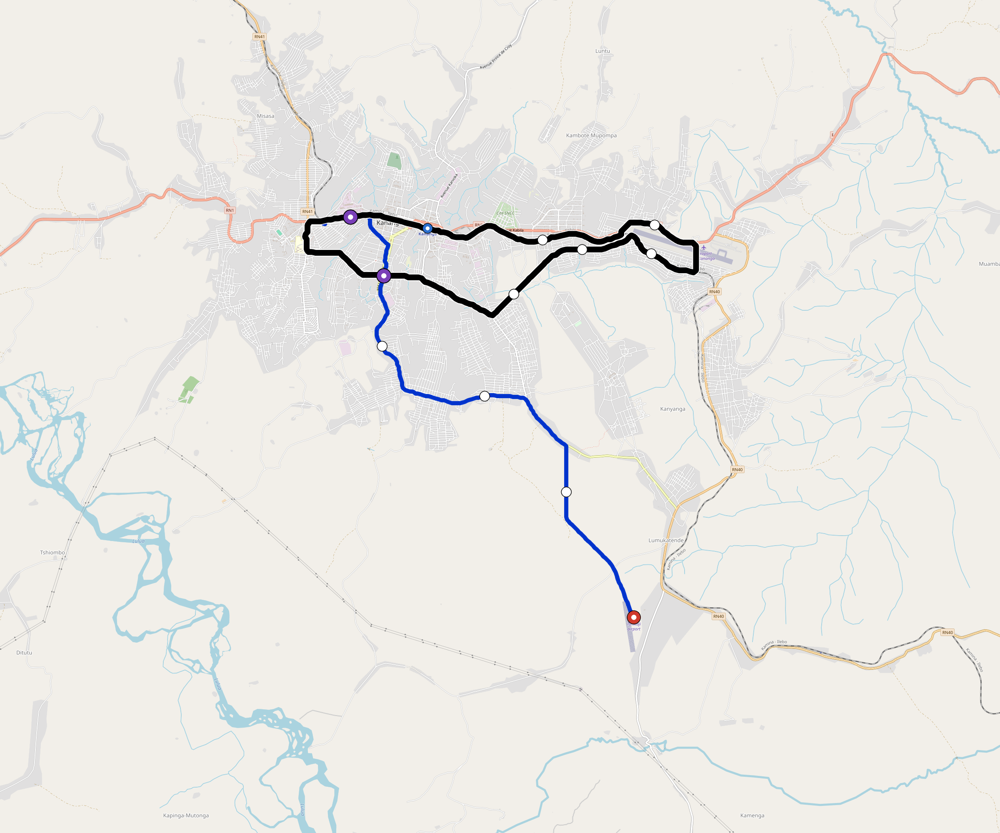

# Kananga — Urban Rail Network

**Country:** CD · **Population:** 1,200,000 · [National brief](../NATIONAL-BRIEF.md)

This page contains only Kananga-specific results. Shared routing, service, energy, civil, cost, finance, QA and validation methods are defined once in the [deployment planning reference](../../../../../docs/deployment-planning-reference.md).

> [!IMPORTANT]
> **Foreign-capital advantage:** against the default equivalent foreign-turnkey sensitivity, this local plan avoids **$468 M (87.2%) of external capital** and **$605 M of external interest**. Capital plus saved interest totals **$1.07 bn**. See the common reference for interpretation and limitations.

Auto-planned by the OpenSourceRail design pipeline from the controlled city catalogue, source-locked geospatial inputs and shared templates.

## Network



| Local measure | Value |
|---|---:|
| Lines / unique stations / interchanges | 2 / 14 / 2 |
| Route length | 38.1 km double track |
| Coverage / transfer reachability | 73.2% / 100% |
| Estimated station catchment | 878,400 residents |
| Service span / peak headway | 05:30–02:00 / 3 min |
| Fleet | 36 × 4-car `metro-4car` trainsets (31 peak revenue) |
| Peak network throughput | 38,400 passengers/hour |
| Practical service capacity | 267,840 passenger-trips/day |
| Annual paid-trip planning range | 48.9–78.2 M |

### Lines

| Line | Length | Stations | Trainsets | Termini |
|---|---:|---:|---:|---|
| line-1 | 15.9 km | 6 | 26 | SE Outer ↔ NW Mid |
| line-2 | 22.2 km | 8 | 10 | NW Inner ↔ NW Mid |
| **Total** | **38.1 km** | **14 unique** | **36** | |

## Energy

| Local measure | Value |
|---|---:|
| Scheduled service | 698 one-way journeys / 12,553 train-km/day |
| Annual traction demand | 79.2 GWh |
| Station/depot PV / storage | 8.9 MW / 59.5 MWh |
| Aggregate charging power | 21.0 MW |
| Dedicated solar plant | 41.7 MW |
| Residual grid/PPA import | 0.0 GWh/yr |
| Worst powered-stop gap | line-2: 3.7 km / 37 kWh |
| Lowest traversal charging margin | line-2: 148 kWh |

## Capital And Funding

| Local CAPEX bucket | Planning value |
|---|---:|
| Civil works | $123 M |
| Stations | $70 M |
| Depots | $8.0 M |
| Rolling stock | $40 M |
| Dedicated solar plant | $33 M |
| Residual train control | $1.9 M |
| Charging microgrids | $4.9 M |
| EPC / project services | $17 M |
| **Total city programme** | **$299 M** |

| Local funding measure | Planning value |
|---|---:|
| Imported / external capital | $69 M (23.1%) |
| Domestic / local capital | $229 M (76.9%) |
| Annual public construction commitment | $32 M / yr for 10 years |
| Annual post-grace debt service | $29 M / yr |
| External capital saved vs default turnkey sensitivity | $468 M |
| Capital + lifetime external interest saved | $1.07 bn |
| Annual OPEX | $6.6 M / yr |

## Local Evidence

**Evidence refresh required.** Retained passing results below are unverified.
The strict README generator rejected the evidence: engineering/simulation/validation-summary.json describes scenario SHA-256 31e05f07d724f242efc85b6fb7a7d15609d4f5d9f3aab9dae1c8abfceb969969, but kananga.toml is 62fec45e59df85a09ea2d18c28076599654595ca9c49cb8db45907d37cd1dfd7; rerun and update the validation evidence. This audit view does not accept or replace the retained solver results.

| Package | Current status | Evidence |
|---|---|---|
| Finance | unverified | [`summary.json`](engineering/finance/summary.json) |
| Native simulation + degraded cases | unverified | [`validation-summary.json`](engineering/simulation/validation-summary.json) |
| SUMO timetable | unverified | [`summary.json`](engineering/sumo/summary.json) |
| Independent OSR/SUMO running-time cross-check | unverified; junction/authority gate open | [`operations-crosscheck.md`](engineering/simulation/operations-crosscheck.md) |
| GIS package | unverified | [`summary.json`](engineering/gis/summary.json) |
| Solar/storage snapshot (operating duty unverified) | unverified; 0 findings; 8 grid-only diagnostics | [`summary.json`](engineering/energy/summary.json) |
| Operations, QA and maintenance | 115 assets / 577 tasks | [`kananga-operations-manifest.json`](operations/kananga-operations-manifest.json) |

## Local Files And Regeneration

| File | Local role |
|---|---|
| [`design.toml`](design.toml) | Authoritative generated city design |
| [`kananga.toml`](kananga.toml) | Expanded simulator scenario |
| [`kananga.corridor.geojson`](kananga.corridor.geojson) | GIS corridor and stations |
| [`kananga.design-quality.yaml`](kananga.design-quality.yaml) | Coverage, source and civil-quality gates |

```bash
tools/automation/regenerate-city.sh kananga
```
