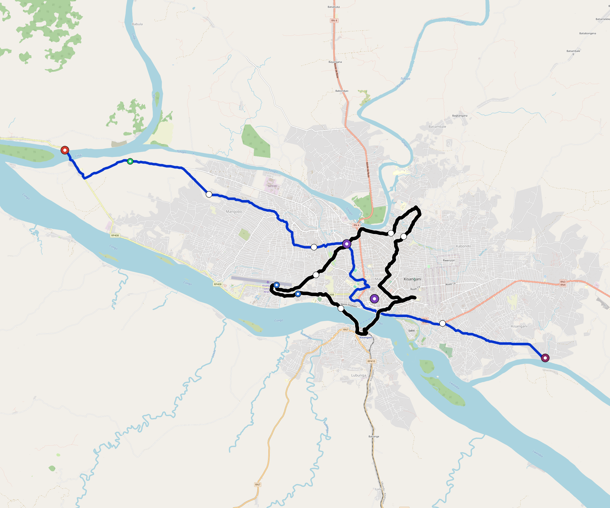

# Kisangani — Urban Rail Network

**Country:** CD · **Population:** 1,300,000 · [National brief](../NATIONAL-BRIEF.md)

This page contains only Kisangani-specific results. Shared routing, service, energy, civil, cost, finance, QA and validation methods are defined once in the [deployment planning reference](../../../../../docs/deployment-planning-reference.md).

> [!IMPORTANT]
> **Foreign-capital advantage:** against the default equivalent foreign-turnkey sensitivity, this local plan avoids **$635 M (87.0%) of external capital** and **$820 M of external interest**. Capital plus saved interest totals **$1.46 bn**. See the common reference for interpretation and limitations.

Auto-planned by the OpenSourceRail design pipeline from the controlled city catalogue, source-locked geospatial inputs and shared templates.

## Network



| Local measure | Value |
|---|---:|
| Lines / unique stations / interchanges | 2 / 18 / 2 |
| Route length | 47.5 km double track |
| Coverage / transfer reachability | 63.7% / 100% |
| Estimated station catchment | 828,100 residents |
| Service span / peak headway | 05:30–02:00 / 3 min |
| Fleet | 50 × 4-car `metro-4car` trainsets (44 peak revenue) |
| Peak network throughput | 38,400 passengers/hour |
| Practical service capacity | 267,840 passenger-trips/day |
| Annual paid-trip planning range | 48.9–78.2 M |

### Lines

| Line | Length | Stations | Trainsets | Termini |
|---|---:|---:|---:|---|
| line-1 | 25.8 km | 9 | 39 | NW Outer ↔ SE Outer |
| line-2 | 21.7 km | 9 | 11 | W Inner ↔ SW Inner |
| **Total** | **47.5 km** | **18 unique** | **50** | |

## Energy

| Local measure | Value |
|---|---:|
| Scheduled service | 698 one-way journeys / 17,038 train-km/day |
| Annual traction demand | 107.5 GWh |
| Station/depot PV / storage | 9.8 MW / 64.0 MWh |
| Aggregate charging power | 25.5 MW |
| Dedicated solar plant | 59.3 MW |
| Residual grid/PPA import | 0.0 GWh/yr |
| Worst powered-stop gap | line-1: 7.0 km / 70 kWh |
| Lowest traversal charging margin | line-1: 182 kWh |

## Capital And Funding

| Local CAPEX bucket | Planning value |
|---|---:|
| Civil works | $154 M |
| Stations | $109 M |
| Depots | $8.0 M |
| Rolling stock | $56 M |
| Dedicated solar plant | $47 M |
| Residual train control | $2.4 M |
| Charging microgrids | $6.0 M |
| EPC / project services | $23 M |
| **Total city programme** | **$405 M** |

| Local funding measure | Planning value |
|---|---:|
| Imported / external capital | $95 M (23.4%) |
| Domestic / local capital | $311 M (76.6%) |
| Annual public construction commitment | $43 M / yr for 10 years |
| Annual post-grace debt service | $39 M / yr |
| External capital saved vs default turnkey sensitivity | $635 M |
| Capital + lifetime external interest saved | $1.46 bn |
| Annual OPEX | $8.9 M / yr |

## Local Evidence

| Package | Current status | Evidence |
|---|---|---|
| Finance | pass | [`summary.json`](engineering/finance/summary.json) |
| Native simulation + degraded cases | pass | [`validation-summary.json`](engineering/simulation/validation-summary.json) |
| SUMO timetable | pass | [`summary.json`](engineering/sumo/summary.json) |
| GIS package | pass | [`summary.json`](engineering/gis/summary.json) |
| Grid/charging/solar | pass | [`summary.json`](engineering/energy/summary.json) |
| Operations, QA and maintenance | 150 assets / 620 tasks | [`kisangani-operations-manifest.json`](operations/kisangani-operations-manifest.json) |

## Local Files And Regeneration

| File | Local role |
|---|---|
| [`design.toml`](design.toml) | Authoritative generated city design |
| [`kisangani.toml`](kisangani.toml) | Expanded simulator scenario |
| [`kisangani.corridor.geojson`](kisangani.corridor.geojson) | GIS corridor and stations |
| [`kisangani.design-quality.yaml`](kisangani.design-quality.yaml) | Coverage, source and civil-quality gates |

```bash
tools/automation/regenerate-city.sh kisangani
```
