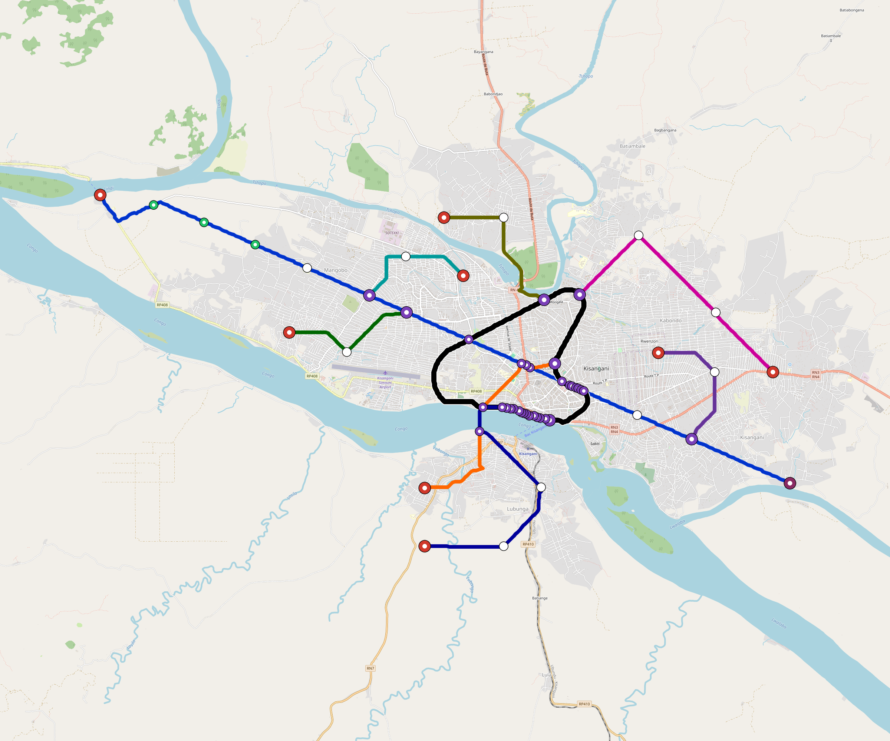

# Kisangani — Urban Rail Network

**Country:** CD · **Population:** 1,300,000 · [National brief](../NATIONAL-BRIEF.md)

This page contains only Kisangani-specific results. Shared routing, service, energy, civil, cost, finance, QA and validation methods are defined once in the [deployment planning reference](../../../../../docs/deployment-planning-reference.md).

> [!IMPORTANT]
> **Foreign-capital advantage:** against the default equivalent foreign-turnkey sensitivity, this local plan avoids **$2.95 bn (88.4%) of external capital** and **$3.81 bn of external interest**. Capital plus saved interest totals **$6.76 bn**. See the common reference for interpretation and limitations.

**Population-led network revision (2026-10-09).** The controlled planning inventory contains **9 lines**, including **7 additional residential lines**. **37.4%** of retained 2020 bbox residents are within a 1 km circle of the actual emitted station coordinates. The working target is 80%; remaining areas and station/access alternatives remain in the review. These are distance screens, not current census, surveyed walksheds or fare demand. New common corridor cells have identified junction/structure and access design requirements; no track switch or site approval is inferred. Country fleet, depot, civil, energy, staffing and financing models use the regenerated inventory, with installed quotations and operating acceptance still open. [Line additions and priorities](engineering/alignment/residential-line-expansion.json) · [Actual station coverage and source receipts](engineering/alignment/residential-expansion-evaluation.json).

**Current alignment, depot and production basis.** Core corridors change from **43.121 km to 69.196 km**, with elevated land sections, water-aware radial routes and separately engineered bridge candidates at short water crossings. 0 core fragments retain raster geometry for further curve review. The centre is a design-centroid screen; survey, property, obstacles, foundations and geometry releases remain open. All **89 platform points** pass the retained water-mask screen; footprints, bank stability and access remain open. [Alignment controls](engineering/alignment/core-realignment.json) · [Before/after map](engineering/alignment/core-alignment-comparison.png) · [Water screen](engineering/alignment/station-water-screen.json).

**9 line-local depots** provide **212 full-fleet storage slots**, separate from workshop bays. Fleet length and workload set quantities; PV/storage is included once in depot capital. Site acceptance and installed/land/utility quotations remain open. [Depot costs](engineering/line-depots/README.md). The factory requires **212 metro-4car trainsets / 848 cars**, with **18-month facility readiness**, then qualification and manufacture. Integrated openings wait for fleet readiness where production or test paths constrain them. Shared factory capital is counted once; concurrent national loading and supplier commitments remain open. [Factory and dates](engineering/factory/README.md).

Station staffing uses two posts, two normal eight-hour shifts, plus service-window, leave and training cover. Basic wages start at 1.5 times the retained country income proxy, with higher technical/management grades and employer allowances. [Staff](engineering/delivery/README.md) · [Finance](engineering/finance/summary.json). Finance retains country-specific fixed-price, steady-state assumptions; Baghdad’s indexed cashflows are separate.

Auto-planned by the OpenSourceRail design pipeline from the controlled city catalogue, source-locked geospatial inputs and shared templates. Population is counted once within the union of station circles; this is potential radial access, not a verified walkshed or fare-demand estimate. Reachable line pairs include transfers through intermediate lines. [Population radii, denominator and transfer paths](engineering/access/README.md) · [Viaduct beam, foundation and terrain checks](engineering/clearance/README.md). Capital figures are base planning allowances: route-search scores are excluded from money, while special structures and installed-price gaps remain open. [Cost boundary](../../../../../docs/finance/civil-allowance-boundary.md).

## Network



| Local measure | Value |
|---|---:|
| Lines / unique stations / interchanges | 9 / 89 / 14 |
| Route length | 72.8 km double track |
| Direct transfers / reachable line pairs | 27.8% / 100.0% |
| Residents within 800 m radial station catchments | 242,431 (2020 raster; 28.9% of bbox) |
| Service span / peak headway | 05:30–02:00 / 3 min |
| Fleet | 212 × 4-car `metro-4car` trainsets (187 peak revenue) |
| Peak network throughput | 172,800 passengers/hour |
| Practical service capacity | 1,517,760 passenger-trips/day |
| Annual paid-trip planning range | 277.0–443.2 M |

### Lines

| Line | Length | Stations | Trainsets | Termini |
|---|---:|---:|---:|---|
| line-1 | 22.2 km | 21 | 62 | NW Outer ↔ E Mid |
| line-2 | 13.8 km | 26 | 18 | NW Inner ↔ SW Inner |
| line-3 |  3.6 km | 3 | 11 | NW Inner ↔ W Mid |
| line-4 |  3.6 km | 3 | 11 | E Mid ↔ E Inner |
| line-5 |  5.9 km | 7 | 21 | E Inner ↔ SW Inner |
| line-6 |  3.4 km | 3 | 11 | NW Mid ↔ NW Inner |
| line-7 |  7.1 km | 4 | 16 | NE Inner ↔ E Mid |
| line-8 |  4.5 km | 3 | 12 | N Inner ↔ NW Mid |
| line-9 |  8.7 km | 19 | 50 | SE Inner ↔ SW Mid |
| **Total** | **72.8 km** | **89 unique** | **212** | |

## Energy

| Local measure | Value |
|---|---:|
| Scheduled service | 3,952 one-way journeys / 30,659 train-km/day |
| Annual traction demand | 193.4 GWh |
| Station/depot PV / storage | 68.1 MW / 475.5 MWh |
| Aggregate charging power | 129.0 MW |
| Dedicated solar plant | 48.6 MW |
| Residual grid/PPA import | 0.0 GWh/yr |
| Worst powered-stop gap | line-1: 7.2 km / 72 kWh |
| Lowest traversal charging margin | line-8: 147 kWh |

## Capital And Funding

| Local CAPEX bucket | Planning value |
|---|---:|
| Civil works | $706 M |
| Stations | $579 M |
| Depots | $145 M |
| Rolling stock | $237 M |
| Dedicated solar plant | $39 M |
| Residual train control | $3.6 M |
| Charging microgrids | $26 M |
| EPC / project services | $119 M |
| **Total city programme** | **$1.86 bn** |

| Local funding measure | Planning value |
|---|---:|
| Imported / external capital | $389 M (21.0%) |
| Domestic / local capital | $1.47 bn (79.0%) |
| Annual public construction commitment | $199 M / yr for 10 years |
| Annual post-grace debt service | $180 M / yr |
| External capital saved vs default turnkey sensitivity | $2.95 bn |
| Capital + lifetime external interest saved | $6.76 bn |
| Annual OPEX | $44 M / yr |

## Local Evidence

| Package | Current status | Evidence |
|---|---|---|
| Finance | pass | [`summary.json`](engineering/finance/summary.json) |
| Native simulation + degraded cases | pass | [`validation-summary.json`](engineering/simulation/validation-summary.json) |
| SUMO timetable | pass | [`summary.json`](engineering/sumo/summary.json) |
| Independent OSR/SUMO running-time cross-check | pass; junction/authority gate open | [`operations-crosscheck.md`](engineering/simulation/operations-crosscheck.md) |
| GIS package | pass | [`summary.json`](engineering/gis/summary.json) |
| Solar/storage snapshot (operating duty unverified) | pass; 0 findings; 10 grid-only diagnostics | [`summary.json`](engineering/energy/summary.json) |
| Operations, QA and maintenance | 703 assets / 3,501 tasks | [`kisangani-operations-manifest.json`](operations/kisangani-operations-manifest.json) |

## Local Files And Regeneration

| File | Local role |
|---|---|
| [`design.toml`](design.toml) | Authoritative generated city design |
| [`kisangani.toml`](kisangani.toml) | Expanded simulator scenario |
| [`kisangani.corridor.geojson`](kisangani.corridor.geojson) | GIS corridor and stations |
| [`kisangani.design-quality.yaml`](kisangani.design-quality.yaml) | Coverage, source and civil-quality gates |

```bash
tools/automation/regenerate-city.sh kisangani
```
