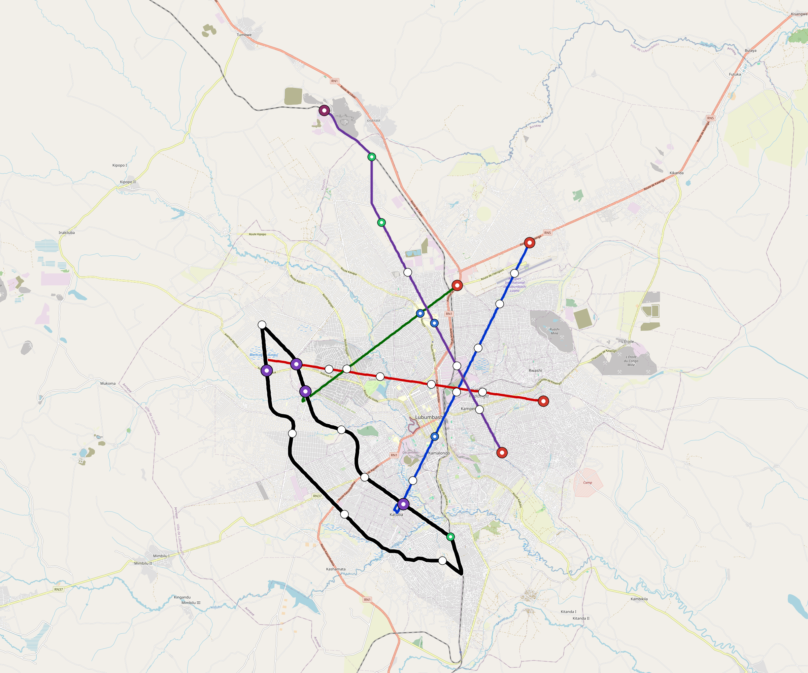

# Lubumbashi — Urban Rail Network

**Country:** CD · **Population:** 2,829,000 · [National brief](../NATIONAL-BRIEF.md)

This page contains only Lubumbashi-specific results. Shared routing, service, energy, civil, cost, finance, QA and validation methods are defined once in the [deployment planning reference](../../../../../docs/deployment-planning-reference.md).

> [!IMPORTANT]
> **Foreign-capital advantage:** against the default equivalent foreign-turnkey sensitivity, this local plan avoids **$2.85 bn (88.7%) of external capital** and **$3.69 bn of external interest**. Capital plus saved interest totals **$6.54 bn**. See the common reference for interpretation and limitations.

**Current alignment, depot and production basis.** Core corridors change from **110.198 km to 98.467 km**, with elevated land sections, water-aware radial routes and separately engineered bridge candidates at short water crossings. 0 core fragments retain raster geometry for further curve review. The centre is a design-centroid screen; survey, property, obstacles, foundations and geometry releases remain open. All **45 platform points** pass the retained water-mask screen; footprints, bank stability and access remain open. [Alignment controls](engineering/alignment/core-realignment.json) · [Before/after map](engineering/alignment/core-alignment-comparison.png) · [Water screen](engineering/alignment/station-water-screen.json).

**5 line-local depots** provide **154 full-fleet storage slots**, separate from workshop bays. Fleet length and workload set quantities; PV/storage is included once in depot capital. Site acceptance and installed/land/utility quotations remain open. [Depot costs](engineering/line-depots/README.md). The factory requires **154 metro-4car trainsets / 616 cars**, with **18-month facility readiness**, then qualification and manufacture. Integrated openings wait for fleet readiness where production or test paths constrain them. Shared factory capital is counted once; concurrent national loading and supplier commitments remain open. [Factory and dates](engineering/factory/README.md).

Station staffing uses two posts, two normal eight-hour shifts, plus service-window, leave and training cover. Basic wages start at 1.5 times the retained country income proxy, with higher technical/management grades and employer allowances. [Staff](engineering/delivery/README.md) · [Finance](engineering/finance/summary.json). Finance retains country-specific fixed-price, steady-state assumptions; Baghdad’s indexed cashflows are separate.

Auto-planned by the OpenSourceRail design pipeline from the controlled city catalogue, source-locked geospatial inputs and shared templates. Population is counted once within the union of station circles; this is potential radial access, not a verified walkshed or fare-demand estimate. Reachable line pairs include transfers through intermediate lines. [Population radii, denominator and transfer paths](engineering/access/README.md) · [Viaduct beam, foundation and terrain checks](engineering/clearance/README.md).

## Network



| Local measure | Value |
|---|---:|
| Lines / unique stations / interchanges | 5 / 45 / 7 |
| Route length | 116.5 km double track |
| Direct transfers / reachable line pairs | 80.0% / 100.0% |
| Residents within 800 m radial station catchments | 609,710 (2020 raster; 14.5% of bbox) |
| Service span / peak headway | 05:30–02:00 / 3 min |
| Fleet | 154 × 4-car `metro-4car` trainsets (138 peak revenue) |
| Peak network throughput | 96,000 passengers/hour |
| Practical service capacity | 803,520 passenger-trips/day |
| Annual paid-trip planning range | 146.6–234.6 M |

### Lines

| Line | Length | Stations | Trainsets | Termini |
|---|---:|---:|---:|---|
| line-1 | 19.5 km | 10 | 39 | NE Outer ↔ S Mid |
| line-2 | 16.4 km | 8 | 32 | W Mid ↔ E Mid |
| line-3 | 12.3 km | 5 | 23 | NE Mid ↔ W Inner |
| line-4 | 24.5 km | 9 | 42 | SE Mid ↔ N Outer |
| line-5 | 43.8 km | 13 | 18 | NW Mid ↔ W Mid |
| **Total** | **116.5 km** | **45 unique** | **154** | |

## Energy

| Local measure | Value |
|---|---:|
| Scheduled service | 2,092 one-way journeys / 44,003 train-km/day |
| Annual traction demand | 277.5 GWh |
| Station/depot PV / storage | 35.8 MW / 254.0 MWh |
| Aggregate charging power | 61.5 MW |
| Dedicated solar plant | 141.0 MW |
| Residual grid/PPA import | 0.0 GWh/yr |
| Worst powered-stop gap | line-4: 14.4 km / 144 kWh |
| Lowest traversal charging margin | line-3: 159 kWh |

## Capital And Funding

| Local CAPEX bucket | Planning value |
|---|---:|
| Civil works | $1.06 bn |
| Stations | $230 M |
| Depots | $88 M |
| Rolling stock | $172 M |
| Dedicated solar plant | $113 M |
| Residual train control | $5.8 M |
| Charging microgrids | $13 M |
| EPC / project services | $109 M |
| **Total city programme** | **$1.79 bn** |

| Local funding measure | Planning value |
|---|---:|
| Imported / external capital | $362 M (20.3%) |
| Domestic / local capital | $1.42 bn (79.7%) |
| Annual public construction commitment | $193 M / yr for 10 years |
| Annual post-grace debt service | $174 M / yr |
| External capital saved vs default turnkey sensitivity | $2.85 bn |
| Capital + lifetime external interest saved | $6.54 bn |
| Annual OPEX | $39 M / yr |

## Local Evidence

| Package | Current status | Evidence |
|---|---|---|
| Finance | pass | [`summary.json`](engineering/finance/summary.json) |
| Native simulation + degraded cases | pass | [`validation-summary.json`](engineering/simulation/validation-summary.json) |
| SUMO timetable | pass | [`summary.json`](engineering/sumo/summary.json) |
| Independent OSR/SUMO running-time cross-check | pass; junction/authority gate open | [`operations-crosscheck.md`](engineering/simulation/operations-crosscheck.md) |
| GIS package | pass | [`summary.json`](engineering/gis/summary.json) |
| Solar/storage snapshot (operating duty unverified) | pass; 0 findings; 11 grid-only diagnostics | [`summary.json`](engineering/energy/summary.json) |
| Operations, QA and maintenance | 408 assets / 2,187 tasks | [`lubumbashi-operations-manifest.json`](operations/lubumbashi-operations-manifest.json) |

## Local Files And Regeneration

| File | Local role |
|---|---|
| [`design.toml`](design.toml) | Authoritative generated city design |
| [`lubumbashi.toml`](lubumbashi.toml) | Expanded simulator scenario |
| [`lubumbashi.corridor.geojson`](lubumbashi.corridor.geojson) | GIS corridor and stations |
| [`lubumbashi.design-quality.yaml`](lubumbashi.design-quality.yaml) | Coverage, source and civil-quality gates |

```bash
tools/automation/regenerate-city.sh lubumbashi
```
