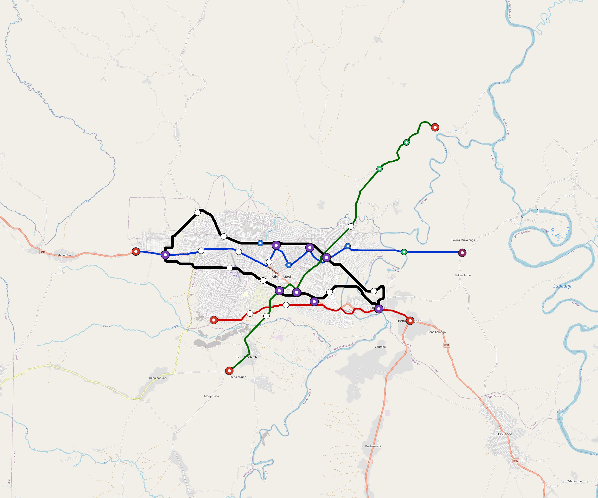

# Mbuji-Mayi — Urban Rail Network

**Country:** CD · **Population:** 2,500,000 · [National brief](../NATIONAL-BRIEF.md)

This page contains only Mbuji-Mayi-specific results. Shared routing, service, energy, civil, cost, finance, QA and validation methods are defined once in the [deployment planning reference](../../../../../docs/deployment-planning-reference.md).

> [!IMPORTANT]
> **Foreign-capital advantage:** against the default equivalent foreign-turnkey sensitivity, this local plan avoids **$1.67 bn (87.0%) of external capital** and **$2.16 bn of external interest**. Capital plus saved interest totals **$3.83 bn**. See the common reference for interpretation and limitations.

Auto-planned by the OpenSourceRail design pipeline from the controlled city catalogue, source-locked geospatial inputs and shared templates.

## Network



| Local measure | Value |
|---|---:|
| Lines / unique stations / interchanges | 4 / 42 / 8 |
| Route length | 118.8 km double track |
| Coverage / transfer reachability | 70.7% / 67% |
| Estimated station catchment | 1,767,500 residents |
| Service span / peak headway | 05:30–02:00 / 3 min |
| Fleet | 135 × 4-car `metro-4car` trainsets (121 peak revenue) |
| Peak network throughput | 76,800 passengers/hour |
| Practical service capacity | 624,960 passenger-trips/day |
| Annual paid-trip planning range | 114.1–182.5 M |

### Lines

| Line | Length | Stations | Trainsets | Termini |
|---|---:|---:|---:|---|
| line-1 | 29.3 km | 12 | 48 | W Outer ↔ E Outer |
| line-2 | 16.8 km | 6 | 27 | SW Mid ↔ SE Mid |
| line-3 | 28.9 km | 9 | 43 | NE Outer ↔ SW Mid |
| line-4 | 43.8 km | 15 | 17 | NW Mid ↔ W Outer |
| **Total** | **118.8 km** | **42 unique** | **135** | |

## Energy

| Local measure | Value |
|---|---:|
| Scheduled service | 1,628 one-way journeys / 45,061 train-km/day |
| Annual traction demand | 284.2 GWh |
| Station/depot PV / storage | 16.4 MW / 97.0 MWh |
| Aggregate charging power | 58.5 MW |
| Dedicated solar plant | 167.7 MW |
| Residual grid/PPA import | 0.0 GWh/yr |
| Worst powered-stop gap | line-3: 12.3 km / 123 kWh |
| Lowest traversal charging margin | line-3: 136 kWh |

## Capital And Funding

| Local CAPEX bucket | Planning value |
|---|---:|
| Civil works | $415 M |
| Stations | $279 M |
| Depots | $8.0 M |
| Rolling stock | $151 M |
| Dedicated solar plant | $134 M |
| Residual train control | $5.9 M |
| Charging microgrids | $13 M |
| EPC / project services | $61 M |
| **Total city programme** | **$1.07 bn** |

| Local funding measure | Planning value |
|---|---:|
| Imported / external capital | $251 M (23.5%) |
| Domestic / local capital | $817 M (76.5%) |
| Annual public construction commitment | $113 M / yr for 10 years |
| Annual post-grace debt service | $103 M / yr |
| External capital saved vs default turnkey sensitivity | $1.67 bn |
| Capital + lifetime external interest saved | $3.83 bn |
| Annual OPEX | $23 M / yr |

## Local Evidence

**Evidence refresh required.** Retained passing results below are unverified.
The strict README generator rejected the evidence: engineering/simulation/validation-summary.json describes scenario SHA-256 ea2a31ebd20a2edb0ea7c3a668764c5d45d94352300cfb757802f5ca407a1a1d, but mbuji-mayi.toml is 918dee861ef1e104b6ca9b89c53ce5522b8f51e793ab41054a79a4ab832d7576; rerun and update the validation evidence. This audit view does not accept or replace the retained solver results.

| Package | Current status | Evidence |
|---|---|---|
| Finance | unverified | [`summary.json`](engineering/finance/summary.json) |
| Native simulation + degraded cases | unverified | [`validation-summary.json`](engineering/simulation/validation-summary.json) |
| SUMO timetable | unverified | [`summary.json`](engineering/sumo/summary.json) |
| Independent OSR/SUMO running-time cross-check | unverified; junction/authority gate open | [`operations-crosscheck.md`](engineering/simulation/operations-crosscheck.md) |
| GIS package | unverified | [`summary.json`](engineering/gis/summary.json) |
| Solar/storage snapshot (operating duty unverified) | unverified; 0 findings; 13 grid-only diagnostics | [`summary.json`](engineering/energy/summary.json) |
| Operations, QA and maintenance | 372 assets / 1,979 tasks | [`mbuji-mayi-operations-manifest.json`](operations/mbuji-mayi-operations-manifest.json) |

## Local Files And Regeneration

| File | Local role |
|---|---|
| [`design.toml`](design.toml) | Authoritative generated city design |
| [`mbuji-mayi.toml`](mbuji-mayi.toml) | Expanded simulator scenario |
| [`mbuji-mayi.corridor.geojson`](mbuji-mayi.corridor.geojson) | GIS corridor and stations |
| [`mbuji-mayi.design-quality.yaml`](mbuji-mayi.design-quality.yaml) | Coverage, source and civil-quality gates |

```bash
tools/automation/regenerate-city.sh mbuji-mayi
```
