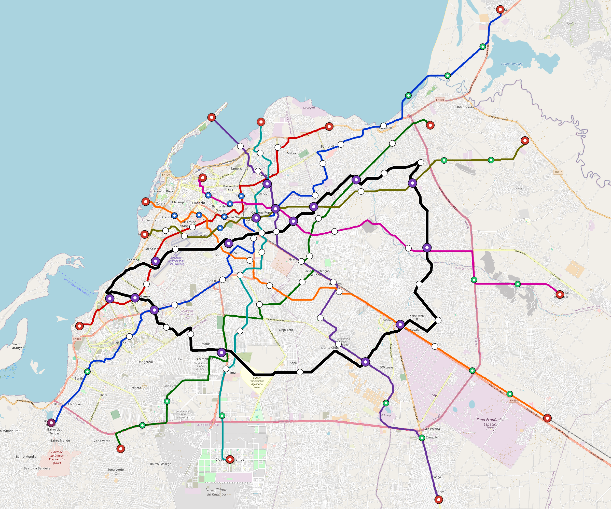

# Luanda — Urban Rail Network

**Country:** AO · **Population:** 9,085,000 · [National brief](../NATIONAL-BRIEF.md)

This page contains only Luanda-specific results. Shared routing, service, energy, civil, cost, finance, QA and validation methods are defined once in the [deployment planning reference](../../../../../docs/deployment-planning-reference.md).

> [!IMPORTANT]
> **Foreign-capital advantage:** against the default equivalent foreign-turnkey sensitivity, this local plan avoids **$6.20 bn (84.8%) of external capital** and **$7.63 bn of external interest**. Capital plus saved interest totals **$13.83 bn**. See the common reference for interpretation and limitations.

Auto-planned by the OpenSourceRail design pipeline from the controlled city catalogue, source-locked geospatial inputs and shared templates.

## Network



| Local measure | Value |
|---|---:|
| Lines / unique stations / interchanges | 9 / 127 / 16 |
| Route length | 390.4 km double track |
| Coverage / transfer reachability | 64.5% / 58% |
| Estimated station catchment | 5,859,825 residents |
| Service span / peak headway | 05:30–02:00 / 3 min |
| Fleet | 622 × 6-car `metro-6car` trainsets (561 peak revenue) |
| Peak network throughput | 259,200 passengers/hour |
| Practical service capacity | 2,276,640 passenger-trips/day |
| Annual paid-trip planning range | 415.5–664.8 M |

### Lines

| Line | Length | Stations | Trainsets | Termini |
|---|---:|---:|---:|---|
| line-1 | 58.6 km | 18 | 108 | NE Outer ↔ SW Outer |
| line-2 | 30.0 km | 12 | 58 | W Mid ↔ N Mid |
| line-3 | 43.9 km | 12 | 79 | SW Outer ↔ NE Mid |
| line-4 | 42.6 km | 14 | 78 | NW Mid ↔ SE Outer |
| line-5 | 39.9 km | 12 | 74 | SE Outer ↔ W Mid |
| line-6 | 31.1 km | 11 | 60 | N Mid ↔ S Mid |
| line-7 | 33.9 km | 11 | 65 | E Outer ↔ NW Mid |
| line-8 | 32.9 km | 12 | 63 | NE Outer ↔ W Mid |
| line-9 | 77.4 km | 25 | 37 | NE Mid ↔ NE Mid |
| **Total** | **390.4 km** | **127 unique** | **622** | |

## Energy

| Local measure | Value |
|---|---:|
| Scheduled service | 3,952 one-way journeys / 163,528 train-km/day |
| Annual traction demand | 1,547.1 GWh |
| Station/depot PV / storage | 38.3 MW / 262.0 MWh |
| Aggregate charging power | 224.0 MW |
| Dedicated solar plant | 971.5 MW |
| Residual grid/PPA import | 0.0 GWh/yr |
| Worst powered-stop gap | line-4: 14.9 km / 224 kWh |
| Lowest traversal charging margin | line-3: 257 kWh |

## Capital And Funding

| Local CAPEX bucket | Planning value |
|---|---:|
| Civil works | $1.21 bn |
| Stations | $736 M |
| Depots | $8.0 M |
| Rolling stock | $1.04 bn |
| Dedicated solar plant | $777 M |
| Residual train control | $20 M |
| Charging microgrids | $50 M |
| EPC / project services | $215 M |
| **Total city programme** | **$4.06 bn** |

| Local funding measure | Planning value |
|---|---:|
| Imported / external capital | $1.11 bn (27.3%) |
| Domestic / local capital | $2.95 bn (72.7%) |
| Annual public construction commitment | $440 M / yr for 5 years |
| Annual post-grace debt service | $341 M / yr |
| External capital saved vs default turnkey sensitivity | $6.20 bn |
| Capital + lifetime external interest saved | $13.83 bn |
| Annual OPEX | $101 M / yr |

## Local Evidence

| Package | Current status | Evidence |
|---|---|---|
| Finance | pass | [`summary.json`](engineering/finance/summary.json) |
| Native simulation + degraded cases | pass | [`validation-summary.json`](engineering/simulation/validation-summary.json) |
| SUMO timetable | pass | [`summary.json`](engineering/sumo/summary.json) |
| GIS package | pass | [`summary.json`](engineering/gis/summary.json) |
| Grid/charging/solar | pass | [`summary.json`](engineering/energy/summary.json) |
| Operations, QA and maintenance | 1,352 assets / 6,295 tasks | [`luanda-operations-manifest.json`](operations/luanda-operations-manifest.json) |

## Local Files And Regeneration

| File | Local role |
|---|---|
| [`design.toml`](design.toml) | Authoritative generated city design |
| [`luanda.toml`](luanda.toml) | Expanded simulator scenario |
| [`luanda.corridor.geojson`](luanda.corridor.geojson) | GIS corridor and stations |
| [`luanda.design-quality.yaml`](luanda.design-quality.yaml) | Coverage, source and civil-quality gates |

```bash
tools/automation/regenerate-city.sh luanda
```
