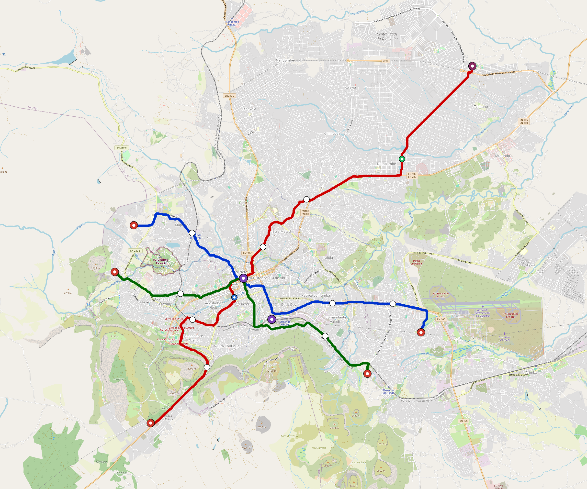

# Lubango — Urban Rail Network

**Country:** AO · **Population:** 700,000 · [National brief](../NATIONAL-BRIEF.md)

This page contains only Lubango-specific results. Shared routing, service, energy, civil, cost, finance, QA and validation methods are defined once in the [deployment planning reference](../../../../../docs/deployment-planning-reference.md).

> [!IMPORTANT]
> **Foreign-capital advantage:** against the default equivalent foreign-turnkey sensitivity, this local plan avoids **$690 M (86.7%) of external capital** and **$848 M of external interest**. Capital plus saved interest totals **$1.54 bn**. See the common reference for interpretation and limitations.

Auto-planned by the OpenSourceRail design pipeline from the controlled city catalogue, source-locked geospatial inputs and shared templates.

## Network



| Local measure | Value |
|---|---:|
| Lines / unique stations / interchanges | 3 / 22 / 2 |
| Route length | 53.8 km double track |
| Coverage / transfer reachability | 63.3% / 100% |
| Estimated station catchment | 443,100 residents |
| Service span / peak headway | 05:30–02:00 / 3 min |
| Fleet | 119 × 3-car `light-metro-3car` trainsets (107 peak revenue) |
| Peak network throughput | 43,200 passengers/hour |
| Practical service capacity | 401,760 passenger-trips/day |
| Annual paid-trip planning range | 73.3–117.3 M |

### Lines

| Line | Length | Stations | Trainsets | Termini |
|---|---:|---:|---:|---|
| line-1 | 15.8 km | 7 | 36 | NW Mid ↔ E Mid |
| line-2 | 24.0 km | 9 | 52 | SW Mid ↔ NE Outer |
| line-3 | 13.9 km | 6 | 31 | W Mid ↔ SE Mid |
| **Total** | **53.8 km** | **22 unique** | **119** | |

## Energy

| Local measure | Value |
|---|---:|
| Scheduled service | 1,395 one-way journeys / 24,999 train-km/day |
| Annual traction demand | 118.3 GWh |
| Station/depot PV / storage | 11.0 MW / 50.0 MWh |
| Aggregate charging power | 10.5 MW |
| Dedicated solar plant | 44.7 MW |
| Residual grid/PPA import | 0.0 GWh/yr |
| Worst powered-stop gap | line-2: 9.3 km / 78 kWh |
| Lowest traversal charging margin | line-3: 44 kWh |

## Capital And Funding

| Local CAPEX bucket | Planning value |
|---|---:|
| Civil works | $157 M |
| Stations | $103 M |
| Depots | $8.0 M |
| Rolling stock | $107 M |
| Dedicated solar plant | $36 M |
| Residual train control | $2.7 M |
| Charging microgrids | $2.3 M |
| EPC / project services | $27 M |
| **Total city programme** | **$442 M** |

| Local funding measure | Planning value |
|---|---:|
| Imported / external capital | $106 M (24.0%) |
| Domestic / local capital | $336 M (76.0%) |
| Annual public construction commitment | $49 M / yr for 5 years |
| Annual post-grace debt service | $38 M / yr |
| External capital saved vs default turnkey sensitivity | $690 M |
| Capital + lifetime external interest saved | $1.54 bn |
| Annual OPEX | $12 M / yr |

## Local Evidence

| Package | Current status | Evidence |
|---|---|---|
| Finance | pass | [`summary.json`](engineering/finance/summary.json) |
| Native simulation + degraded cases | pass | [`validation-summary.json`](engineering/simulation/validation-summary.json) |
| SUMO timetable | pass | [`summary.json`](engineering/sumo/summary.json) |
| GIS package | pass | [`summary.json`](engineering/gis/summary.json) |
| Grid/charging/solar | pass | [`summary.json`](engineering/energy/summary.json) |
| Operations, QA and maintenance | 250 assets / 1,171 tasks | [`lubango-operations-manifest.json`](operations/lubango-operations-manifest.json) |

## Local Files And Regeneration

| File | Local role |
|---|---|
| [`design.toml`](design.toml) | Authoritative generated city design |
| [`lubango.toml`](lubango.toml) | Expanded simulator scenario |
| [`lubango.corridor.geojson`](lubango.corridor.geojson) | GIS corridor and stations |
| [`lubango.design-quality.yaml`](lubango.design-quality.yaml) | Coverage, source and civil-quality gates |

```bash
tools/automation/regenerate-city.sh lubango
```
