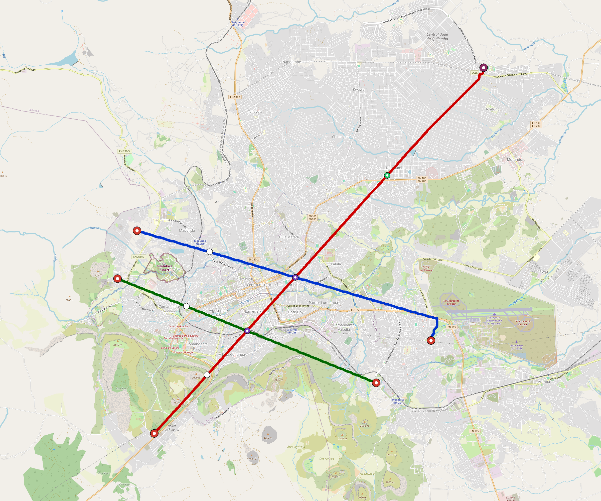

# Lubango — Urban Rail Network

**Country:** AO · **Population:** 700,000 · [National brief](../NATIONAL-BRIEF.md)

This page contains only Lubango-specific results. Shared routing, service, energy, civil, cost, finance, QA and validation methods are defined once in the [deployment planning reference](../../../../../docs/deployment-planning-reference.md).

> [!IMPORTANT]
> **Foreign-capital advantage:** against the default equivalent foreign-turnkey sensitivity, this local plan avoids **$2.71 bn (88.5%) of external capital** and **$3.34 bn of external interest**. Capital plus saved interest totals **$6.05 bn**. See the common reference for interpretation and limitations.

**Population-led network revision (2026-10-09).** The controlled planning inventory contains **10 lines**, including **7 additional residential lines**. **51.7%** of retained 2020 bbox residents are within a 1 km circle of the actual emitted station coordinates. The working target is 80%; remaining areas and station/access alternatives remain in the review. These are distance screens, not current census, surveyed walksheds or fare demand. New common corridor cells have identified junction/structure and access design requirements; no track switch or site approval is inferred. Country fleet, depot, civil, energy, staffing and financing models use the regenerated inventory, with installed quotations and operating acceptance still open. [Line additions and priorities](engineering/alignment/residential-line-expansion.json) · [Actual station coverage and source receipts](engineering/alignment/residential-expansion-evaluation.json).

**Current alignment, depot and production basis.** Core corridors change from **48.707 km to 69.964 km**, with elevated land sections, water-aware radial routes and separately engineered bridge candidates at short water crossings. 0 core fragments retain raster geometry for further curve review. The centre is a design-centroid screen; survey, property, obstacles, foundations and geometry releases remain open. All **62 platform points** pass the retained water-mask screen; footprints, bank stability and access remain open. [Alignment controls](engineering/alignment/core-realignment.json) · [Before/after map](engineering/alignment/core-alignment-comparison.png) · [Water screen](engineering/alignment/station-water-screen.json).

**10 line-local depots** provide **306 full-fleet storage slots**, separate from workshop bays. Fleet length and workload set quantities; PV/storage is included once in depot capital. Site acceptance and installed/land/utility quotations remain open. [Depot costs](engineering/line-depots/README.md). The factory requires **306 light-metro-3car trainsets / 918 cars**, with **18-month facility readiness**, then qualification and manufacture. Integrated openings wait for fleet readiness where production or test paths constrain them. Shared factory capital is counted once; concurrent national loading and supplier commitments remain open. [Factory and dates](engineering/factory/README.md).

Station staffing uses two posts, two normal eight-hour shifts, plus service-window, leave and training cover. Basic wages start at 1.5 times the retained country income proxy, with higher technical/management grades and employer allowances. [Staff](engineering/delivery/README.md) · [Finance](engineering/finance/summary.json). Finance retains country-specific fixed-price, steady-state assumptions; Baghdad’s indexed cashflows are separate.

Auto-planned by the OpenSourceRail design pipeline from the controlled city catalogue, source-locked geospatial inputs and shared templates. Population is counted once within the union of station circles; this is potential radial access, not a verified walkshed or fare-demand estimate. Reachable line pairs include transfers through intermediate lines. [Population radii, denominator and transfer paths](engineering/access/README.md) · [Viaduct beam, foundation and terrain checks](engineering/clearance/README.md). Capital figures are base planning allowances: route-search scores are excluded from money, while special structures and installed-price gaps remain open. [Cost boundary](../../../../../docs/finance/civil-allowance-boundary.md).

## Network



| Local measure | Value |
|---|---:|
| Lines / unique stations / interchanges | 10 / 62 / 17 |
| Route length | 89.0 km double track |
| Direct transfers / reachable line pairs | 37.8% / 100.0% |
| Residents within 800 m radial station catchments | 220,837 (2020 raster; 39.4% of bbox) |
| Service span / peak headway | 05:30–02:00 / 3 min |
| Fleet | 306 × 3-car `light-metro-3car` trainsets (272 peak revenue) |
| Peak network throughput | 144,000 passengers/hour |
| Practical service capacity | 1,339,200 passenger-trips/day |
| Annual paid-trip planning range | 244.4–391.0 M |

### Lines

| Line | Length | Stations | Trainsets | Termini |
|---|---:|---:|---:|---|
| line-1 | 13.4 km | 11 | 48 | W Outer ↔ SE Mid |
| line-2 | 20.1 km | 12 | 63 | SW Outer ↔ NE Outer |
| line-3 | 11.3 km | 8 | 37 | W Outer ↔ SE Mid |
| line-4 |  6.6 km | 5 | 23 | W Inner ↔ N Inner |
| line-5 |  2.0 km | 2 | 10 | SE Inner ↔ S Inner |
| line-6 |  7.0 km | 4 | 23 | SW Inner ↔ N Inner |
| line-7 | 10.4 km | 7 | 32 | NE Mid ↔ W Mid |
| line-8 |  5.8 km | 4 | 21 | SE Mid ↔ SE Outer |
| line-9 |  9.5 km | 6 | 35 | E Mid ↔ NE Mid |
| line-10 |  3.1 km | 3 | 14 | SE Mid ↔ SE Inner |
| **Total** | **89.0 km** | **62 unique** | **306** | |

## Energy

| Local measure | Value |
|---|---:|
| Scheduled service | 4,650 one-way journeys / 41,397 train-km/day |
| Annual traction demand | 195.8 GWh |
| Station/depot PV / storage | 63.5 MW / 445.0 MWh |
| Aggregate charging power | 55.0 MW |
| Dedicated solar plant | 21.9 MW |
| Residual grid/PPA import | 0.0 GWh/yr |
| Worst powered-stop gap | line-9: 9.5 km / 79 kWh |
| Lowest traversal charging margin | line-8: 78 kWh |

## Capital And Funding

| Local CAPEX bucket | Planning value |
|---|---:|
| Civil works | $811 M |
| Stations | $313 M |
| Depots | $160 M |
| Rolling stock | $275 M |
| Dedicated solar plant | $18 M |
| Residual train control | $4.5 M |
| Charging microgrids | $11 M |
| EPC / project services | $110 M |
| **Total city programme** | **$1.70 bn** |

| Local funding measure | Planning value |
|---|---:|
| Imported / external capital | $352 M (20.7%) |
| Domestic / local capital | $1.35 bn (79.3%) |
| Annual public construction commitment | $194 M / yr for 5 years |
| Annual post-grace debt service | $147 M / yr |
| External capital saved vs default turnkey sensitivity | $2.71 bn |
| Capital + lifetime external interest saved | $6.05 bn |
| Annual OPEX | $47 M / yr |

## Local Evidence

| Package | Current status | Evidence |
|---|---|---|
| Finance | pass | [`summary.json`](engineering/finance/summary.json) |
| Native simulation + degraded cases | pass | [`validation-summary.json`](engineering/simulation/validation-summary.json) |
| SUMO timetable | pass | [`summary.json`](engineering/sumo/summary.json) |
| Independent OSR/SUMO running-time cross-check | pass; junction/authority gate open | [`operations-crosscheck.md`](engineering/simulation/operations-crosscheck.md) |
| GIS package | pass | [`summary.json`](engineering/gis/summary.json) |
| Solar/storage snapshot (operating duty unverified) | pass; 0 findings; 12 grid-only diagnostics | [`summary.json`](engineering/energy/summary.json) |
| Operations, QA and maintenance | 676 assets / 3,858 tasks | [`lubango-operations-manifest.json`](operations/lubango-operations-manifest.json) |

## Local Files And Regeneration

| File | Local role |
|---|---|
| [`design.toml`](design.toml) | Authoritative generated city design |
| [`lubango.toml`](lubango.toml) | Expanded simulator scenario |
| [`lubango.corridor.geojson`](lubango.corridor.geojson) | GIS corridor and stations |
| [`lubango.design-quality.yaml`](lubango.design-quality.yaml) | Coverage, source and civil-quality gates |

```bash
tools/automation/regenerate-city.sh lubango
```
