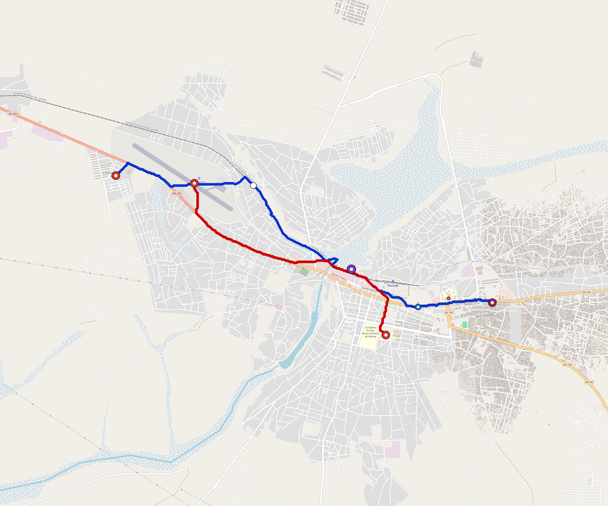

# Malanje — Urban Rail Network

**Country:** AO · **Population:** 500,000 · [National brief](../NATIONAL-BRIEF.md)

This page contains only Malanje-specific results. Shared routing, service, energy, civil, cost, finance, QA and validation methods are defined once in the [deployment planning reference](../../../../../docs/deployment-planning-reference.md).

> [!IMPORTANT]
> **Foreign-capital advantage:** against the default equivalent foreign-turnkey sensitivity, this local plan avoids **$256 M (87.2%) of external capital** and **$315 M of external interest**. Capital plus saved interest totals **$571 M**. See the common reference for interpretation and limitations.

Auto-planned by the OpenSourceRail design pipeline from the controlled city catalogue, source-locked geospatial inputs and shared templates.

## Network



| Local measure | Value |
|---|---:|
| Lines / unique stations / interchanges | 2 / 8 / 1 |
| Route length | 15.0 km double track |
| Coverage / transfer reachability | 56.9% / 100% |
| Estimated station catchment | 284,500 residents |
| Service span / peak headway | 05:30–02:00 / 3 min |
| Fleet | 34 × 3-car `light-metro-3car` trainsets (30 peak revenue) |
| Peak network throughput | 28,800 passengers/hour |
| Practical service capacity | 267,840 passenger-trips/day |
| Annual paid-trip planning range | 48.9–78.2 M |

### Lines

| Line | Length | Stations | Trainsets | Termini |
|---|---:|---:|---:|---|
| line-1 |  9.3 km | 5 | 20 | W Outer ↔ E Outer |
| line-2 |  5.8 km | 3 | 14 | SE Mid ↔ NW Mid |
| **Total** | **15.0 km** | **8 unique** | **34** | |

## Energy

| Local measure | Value |
|---|---:|
| Scheduled service | 930 one-way journeys / 6,997 train-km/day |
| Annual traction demand | 33.1 GWh |
| Station/depot PV / storage | 7.1 MW / 43.5 MWh |
| Aggregate charging power | 4.0 MW |
| Dedicated solar plant | 13.6 MW |
| Residual grid/PPA import | 0.0 GWh/yr |
| Worst powered-stop gap | line-2: 4.0 km / 30 kWh |
| Lowest traversal charging margin | line-2: 26 kWh |

## Capital And Funding

| Local CAPEX bucket | Planning value |
|---|---:|
| Civil works | $52 M |
| Stations | $50 M |
| Depots | $8.0 M |
| Rolling stock | $31 M |
| Dedicated solar plant | $11 M |
| Residual train control | $752 k |
| Charging microgrids | $1.0 M |
| EPC / project services | $10.0 M |
| **Total city programme** | **$163 M** |

| Local funding measure | Planning value |
|---|---:|
| Imported / external capital | $38 M (23.1%) |
| Domestic / local capital | $125 M (76.9%) |
| Annual public construction commitment | $18 M / yr for 5 years |
| Annual post-grace debt service | $14 M / yr |
| External capital saved vs default turnkey sensitivity | $256 M |
| Capital + lifetime external interest saved | $571 M |
| Annual OPEX | $4.3 M / yr |

## Local Evidence

| Package | Current status | Evidence |
|---|---|---|
| Finance | pass | [`summary.json`](engineering/finance/summary.json) |
| Native simulation + degraded cases | pass | [`validation-summary.json`](engineering/simulation/validation-summary.json) |
| SUMO timetable | pass | [`summary.json`](engineering/sumo/summary.json) |
| GIS package | pass | [`summary.json`](engineering/gis/summary.json) |
| Grid/charging/solar | pass | [`summary.json`](engineering/energy/summary.json) |
| Operations, QA and maintenance | 84 assets / 360 tasks | [`malanje-operations-manifest.json`](operations/malanje-operations-manifest.json) |

## Local Files And Regeneration

| File | Local role |
|---|---|
| [`design.toml`](design.toml) | Authoritative generated city design |
| [`malanje.toml`](malanje.toml) | Expanded simulator scenario |
| [`malanje.corridor.geojson`](malanje.corridor.geojson) | GIS corridor and stations |
| [`malanje.design-quality.yaml`](malanje.design-quality.yaml) | Coverage, source and civil-quality gates |

```bash
tools/automation/regenerate-city.sh malanje
```
