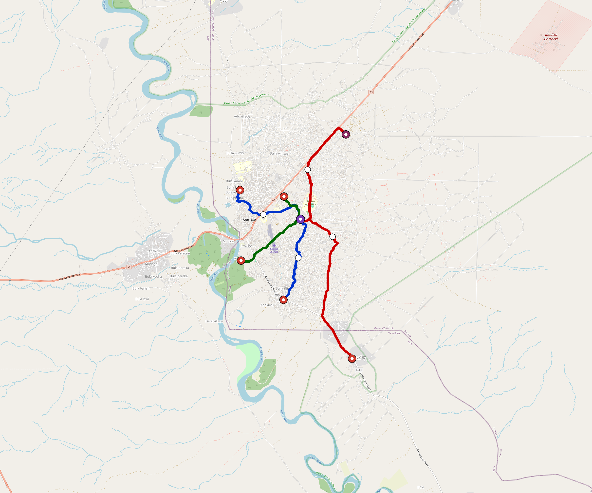

# Garissa — Urban Rail Network

**Country:** KE · **Population:** 300,000 · [National brief](../NATIONAL-BRIEF.md)

This page contains only Garissa-specific results. Shared routing, service, energy, civil, cost, finance, QA and validation methods are defined once in the [deployment planning reference](../../../../../docs/deployment-planning-reference.md).

> [!IMPORTANT]
> **Foreign-capital advantage:** against the default equivalent foreign-turnkey sensitivity, this local plan avoids **$343 M (88.2%) of external capital** and **$430 M of external interest**. Capital plus saved interest totals **$774 M**. See the common reference for interpretation and limitations.

Auto-planned by the OpenSourceRail design pipeline from the controlled city catalogue, source-locked geospatial inputs and shared templates.

## Network



| Local measure | Value |
|---|---:|
| Lines / unique stations / interchanges | 3 / 13 / 1 |
| Route length | 25.4 km double track |
| Coverage / transfer reachability | 69.8% / 100% |
| Estimated station catchment | 209,400 residents |
| Service span / peak headway | 05:30–02:00 / 3 min |
| Fleet | 57 × 2-car `tram-2car` trainsets (50 peak revenue) |
| Peak network throughput | 28,800 passengers/hour |
| Practical service capacity | 267,840 passenger-trips/day |
| Annual paid-trip planning range | 48.9–78.2 M |

### Lines

| Line | Length | Stations | Trainsets | Termini |
|---|---:|---:|---:|---|
| line-1 |  8.2 km | 5 | 19 | S Mid ↔ NW Mid |
| line-2 | 12.4 km | 5 | 26 | SE Outer ↔ NE Outer |
| line-3 |  4.7 km | 3 | 12 | N Inner ↔ SW Mid |
| **Total** | **25.4 km** | **13 unique** | **57** | |

## Energy

| Local measure | Value |
|---|---:|
| Scheduled service | 1,395 one-way journeys / 11,788 train-km/day |
| Annual traction demand | 37.2 GWh |
| Station/depot PV / storage | 8.6 MW / 46.0 MWh |
| Aggregate charging power | 6.5 MW |
| Dedicated solar plant | 8.1 MW |
| Residual grid/PPA import | 0.0 GWh/yr |
| Worst powered-stop gap | line-2: 5.7 km / 32 kWh |
| Lowest traversal charging margin | line-3: 36 kWh |

## Capital And Funding

| Local CAPEX bucket | Planning value |
|---|---:|
| Civil works | $80 M |
| Stations | $74 M |
| Depots | $8.0 M |
| Rolling stock | $32 M |
| Dedicated solar plant | $6.5 M |
| Residual train control | $1.3 M |
| Charging microgrids | $1.5 M |
| EPC / project services | $14 M |
| **Total city programme** | **$216 M** |

| Local funding measure | Planning value |
|---|---:|
| Imported / external capital | $46 M (21.3%) |
| Domestic / local capital | $170 M (78.7%) |
| Annual public construction commitment | $23 M / yr for 7 years |
| Annual post-grace debt service | $19 M / yr |
| External capital saved vs default turnkey sensitivity | $343 M |
| Capital + lifetime external interest saved | $774 M |
| Annual OPEX | $5.5 M / yr |

## Local Evidence

| Package | Current status | Evidence |
|---|---|---|
| Finance | pass | [`summary.json`](engineering/finance/summary.json) |
| Native simulation + degraded cases | pass | [`validation-summary.json`](engineering/simulation/validation-summary.json) |
| SUMO timetable | pass | [`summary.json`](engineering/sumo/summary.json) |
| GIS package | pass | [`summary.json`](engineering/gis/summary.json) |
| Grid/charging/solar | pass | [`summary.json`](engineering/energy/summary.json) |
| Operations, QA and maintenance | 135 assets / 596 tasks | [`garissa-operations-manifest.json`](operations/garissa-operations-manifest.json) |

## Local Files And Regeneration

| File | Local role |
|---|---|
| [`design.toml`](design.toml) | Authoritative generated city design |
| [`garissa.toml`](garissa.toml) | Expanded simulator scenario |
| [`garissa.corridor.geojson`](garissa.corridor.geojson) | GIS corridor and stations |
| [`garissa.design-quality.yaml`](garissa.design-quality.yaml) | Coverage, source and civil-quality gates |

```bash
tools/automation/regenerate-city.sh garissa
```
