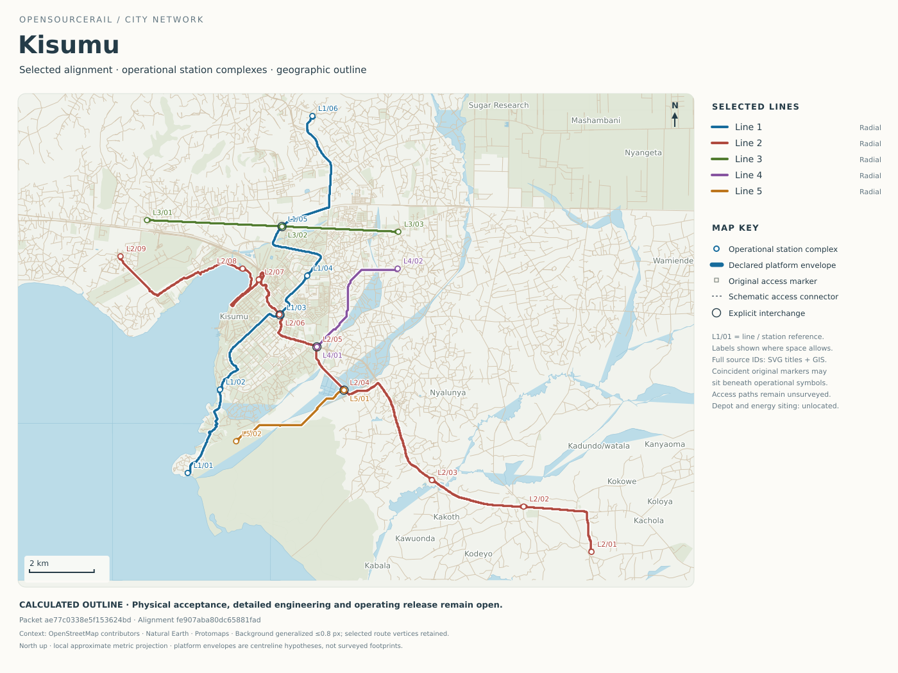

# Kisumu — railway design and city programme

**KE · Calculated outline complete · Class C estimates · Physical verification pending**

[City index](../../../README.md) · [National programme](../NATIONAL-BRIEF.md) · [Interactive map](../../../../../docs/workbench/current/index.html?outlineCity=kisumu) · [Planning workspace](../../../../../docs/workbench/planning/index.html?city=kisumu) · [Methods and assumptions](../../../../../docs/design-engine/city-dossiers/README.md)



[Open full-size map](engineering/outline/network.svg) · [Download GIS bundle](engineering/outline/gis.zip) · [Complete dossier data](engineering/outline/summary.json)

## City and network

This city programme uses its exact selected mapped alignment, vehicle reference, service calculation and cost ledger. Demand, site and unit-rate assumptions support a complete outline for comparison; they do not substitute for surveys, detailed engineering or operational approval.

| Network measure | Current outline |
|---|---|
| Population context | 600,000 — retained planning input; not a demand survey |
| Selected alignment | Original |
| Route length / trackways | 60.73 km / 2 trackways |
| Lines / operational platform groups | 5 / 22 |
| Original access markers / separately costed access sites | 22 / 18 |
| Explicit interchange references | 4 |
| Fleet including reserve | 76 six-car trainsets |
| Train distance | 39,352 train-km/day; 14,363,391 /year |
| Service span | 18 h/day, 365 days/year; clock timetable not yet assigned |
| Peak demand brief | 4,000 passengers/h/direction per line — assumed, not additive network ridership |
| Planning occupancy / availability | 85% / 99% — assumptions |

Operational platform groups are counted per line. Interchange access sites and original markers are separate quantities; none is silently treated as a unique city-wide station count. Catchment and access scenarios are described below; authenticated population coverage and demand forecasts remain open.

### Lines, service and fleet

| Line | Route km | Platform groups | Headway s | One-way / circuit min | Active + reserve | Usable pphpd | Mapped termini |
|---|---|---|---|---|---|---|---|
| line-1 | 16.91 | 6 | 200 | 28.0 | 19 + 3 | 4,181 | SW terminal ↔ N terminal |
| line-2 | 27.71 | 9 | 200 | 37.4 | 25 + 4 | 4,181 | SE terminal ↔ W terminal |
| line-3 | 7.92 | 3 | 200 | 11.9 | 9 + 2 | 4,181 | NW terminal ↔ NE terminal |
| line-4 | 4.13 | 2 | 200 | 5.6 | 6 + 1 | 4,181 | SE terminal ↔ NE terminal |
| line-5 | 4.06 | 2 | 200 | 5.4 | 6 + 1 | 4,181 | SE terminal ↔ SW terminal |

Compass termini describe mapped endpoint positions relative to the network centre; official station names require local planning. The six-car reference provides 276 normal passenger places, including wheelchair places, with no planned standing. Headway is a calculated service choice. Journey times are conditional calculations; protected signalling timetables and actual available thrust remain separate work.

[Line details and energy](engineering/outline/lines.csv) · [Station and access register](engineering/outline/stations.csv)

### Connections and access

Declared transfer graph: 1 connected line group(s): line-1, line-2, line-3, line-4, line-5. These are explicit planned connections; walking paths and accessible interchange layouts are not yet surveyed.

<details><summary>Access and catchment assumptions</summary>

Geometric access scenarios are separate from measured population coverage. Full assumptions and outputs are in the dossier data.

| Radius m | Straight line walk minutes | Station circle area sum km2 | Overlaps removed | Population coverage |
|---|---|---|---|---|
| 400.00 | 6.67 | 11.06 | False | Unestablished |
| 800.00 | 13.33 | 44.23 | False | Unestablished |

</details>

## Energy and propulsion

| Energy measure | Daily | Annual |
|---|---|---|
| Mechanical traction work | 126,715 kWh mechanical | 46.25 GWh mechanical |
| Nominal auxiliary load | 245,700 kWh | 89.68 GWh |
| Auxiliary supply including scenario charging losses | 258,632 kWh | 94.40 GWh |
| Reserve-fleet auxiliary supply scenario | See annual budget | 1.60 GWh |
| Total priced grid-supply scenario | See annual budget | 157.47 GWh |
| Physically supported total grid demand | Unestablished | Unestablished |

| Annual electricity budget | Low | Base | High |
|---|---|---|---|
| Priced supply/efficiency scenario | $10.11m | $26.07m | $77.83m |

Mechanical work is distinct from electricity purchased. The monetary electricity scenarios include declared efficiency and site-load assumptions; they do not establish a measured motor map, solar plant, storage installation or self-sufficient energy supply. Each line retains its candidate-specific launch, braking and recovery requirements in the complete record.

| Line | Propulsion research concept | Additional traction mass / car | Additional reserve / car |
|---|---|---|---|
| line-1 | Station launch reference | 0 kg | 250 kg |
| line-2 | Powered axle continuous research | 1,000 kg | 250 kg |
| line-3 | Station launch reference | 0 kg | 250 kg |
| line-4 | Station launch reference | 0 kg | 250 kg |
| line-5 | Station launch reference | 0 kg | 250 kg |

The city research configuration is separate from the selected passive reference vehicle. Onboard-traction comparisons carry their own additional mass and cost assumptions; they do not silently change that reference or establish complete installed equipment.

| Line | Motors/car / rated kW per car | Continuous feed | Required train force | Required mechanical peak | Station-fin comparison envelope | Actual force map |
|---|---|---|---|---|---|---|
| line-1 | 0 / 0.0 kW | 0.00 km | 156.1 kN | 3.12 MW | 316.5 m | Unestablished |
| line-2 | 4 / 749.2 kW | 27.71 km | 162.9 kN | 3.26 MW | Other interface | Unestablished |
| line-3 | 0 / 0.0 kW | 0.00 km | 156.1 kN | 3.12 MW | 316.5 m | Unestablished |
| line-4 | 0 / 0.0 kW | 0.00 km | 156.1 kN | 3.12 MW | 316.5 m | Unestablished |
| line-5 | 0 / 0.0 kW | 0.00 km | 156.1 kN | 3.12 MW | 316.5 m | Unestablished |

These are declared requirements and equipment hypotheses, not measured motor capability. A station-launch row retains an unselected wayside mechanism and priced equipment provision. The station-fin comparison envelope does not prescribe installed motor length or apply to an onboard-traction interface. Independent friction braking, collector/electrical protection and protected recovery remain required for every concept.

### Why some lines use a research alternative

The table retains the rejected station-only reference screen. An alternative is selected for conditional outline calculation where that reference cannot meet the declared leg; this does not prove every station-powered design impossible or qualify the replacement hardware.

| Line | Affected reference legs | Necessary-bound failure | Longest affected leg | Reference flat coast reach |
|---|---|---|---|---|
| line-2 | 1 | Coast stops before receiving zone | 5,797.3 m | 5,554.5 m |

## Civil works, depot and manufacture

| Quantity / resource | Calculated requirement |
|---|---|
| At grade route | 4.04 km |
| Bridge route | 3.90 km |
| Elevated route | 52.79 km |
| Tunnel route | 0.00 km |
| Precast span stock | 5,690 spans |
| Independent supports | 5,774 |
| Running rail | 242.91 rail-km / 14,626 t |
| Complete fastening sets | 425,097 |
| Protected at-grade crossing packages | 15 |
| Bridge runs / tunnel portals | 13 / 0 |
| Additional station track | 0 m |
| Access connector allowance | 0.0 m; actual accessible paths require survey |
| Pooled depot area | 53,456 m²; location and line connections require a site plan |
| Factory / civil working pattern | 2 / 2 shifts/day |

Civil classes and quantities follow the mapped scenario. Foundation capacities, bearings, erection stability, river crossings, utilities and ground conditions require site-specific design. The depot allowance includes pooled storage/workshop scope and budgeted connections; it does not identify an acquired or physically connected depot site.

### Factory capacity and make/buy

| Factory investment | Low | Base | High |
|---|---|---|---|
| Vehicle equipment, tooling and premises | $636,311 | $2.12m | $8.84m |
| Civil production campaign | $2.14m | $9.58m | $54.86m |

Factory capital is already included in the city capital ledger. It must not be added a second time. Make/buy comparisons use committed city volume, equipment/tooling, material, labour, yield and productive capacity; no speculative future-city discount is assumed.

| Component / process | Provisional route |
|---|---|
| located-stock/passive-bogie-pair/steel | buy |
| located-stock/passive-secondary/aluminium | buy |
| located-stock/retained-comfort/body/composite | buy |
| located-stock/retained-comfort/body/generic | make |
| located-stock/retained-comfort/doors/generic | Unestablished |
| located-stock/retained-comfort/glazing/generic | Unestablished |
| located-stock/retained-comfort/seating/generic | Unestablished |
| located-stock/wheel-underframe/aluminium | make |
| unlocated-account/attachments | Unestablished |
| unlocated-account/passive-bogie-pair | Unestablished |
| unlocated-account/retained-comfort/HVAC | Unestablished |
| unlocated-account/retained-comfort/body | buy |
| unlocated-account/retained-comfort/doors | Unestablished |
| unlocated-account/retained-comfort/frame-joints | Unestablished |
| unlocated-account/retained-comfort/glazing | Unestablished |
| unlocated-account/retained-comfort/seating | Unestablished |
| unlocated-account/roof-thermal | Unestablished |
| unlocated-account/services | Unestablished |
| six-car-final-vehicle-assembly | Unestablished |
| reference-factory-to-assembly-delivery | Unestablished |

| Precast case | Selected route | Parallel cells | Required cell-hours | Productive person-hours | Paid person-hours |
|---|---|---|---|---|---|
| low | make | 3 | 19,915 | 147,940 | 197,253 |
| base | make | 6 | 48,365 | 386,920 | 515,893 |
| high | make | 15 | 130,870 | 1,069,720 | 1,426,293 |

[Complete manufacturing routes and comparisons](engineering/outline/make_buy.csv) · [Quantities and delivery requirements](engineering/outline/delivery_requirements.csv) · [Vehicle, station and civil 3D models](../../../../../docs/engineering-models/README.md)

## Workforce and construction programme

Production and civil works use two shifts. The operating case uses 18 service hours/day and a 2-shift planning convention; named-worker rosters, shift lengths, relief and local employment requirements need an approved calendar. Extended operation can require three shifts.

| Domain / case | Covered positions per shift | Two-shift people floor | Paid person-hours | Paid FTE equivalent |
|---|---|---|---|---|
| Control room and access-site coverage / low | 20 | Unestablished | 144,540 | 72.3 |
| Vehicle production / low | 11 | 22 | Unestablished | Unestablished |
| Civil field / low | 21 | 42 | 213,323 | Unestablished |
| Civil other installation / low | 150 | 300 | 1,555,448 | Unestablished |
| Civil precast / low | 24 | 48 | 197,253 | Unestablished |
| Control room and access-site coverage / base | 40 | Unestablished | 328,500 | 164.2 |
| Vehicle production / base | 31 | 62 | Unestablished | Unestablished |
| Civil field / base | 77 | 154 | 670,315 | Unestablished |
| Civil other installation / base | 1,081 | 2,162 | 9,507,754 | Unestablished |
| Civil precast / base | 48 | 96 | 515,893 | Unestablished |
| Control room and access-site coverage / high | 80 | Unestablished | 788,400 | 394.2 |
| Vehicle production / high | 84 | 168 | Unestablished | Unestablished |
| Civil field / high | 332 | 664 | 1,858,315 | Unestablished |
| Civil other installation / high | 11,066 | 22,132 | 61,965,306 | Unestablished |
| Civil precast / high | 120 | 240 | 1,426,293 | Unestablished |

Paid FTE is a budgeting convention, distinct from simultaneous posts and named employees. Source labour and relief are already in the priced model; this staffing view does not add another payroll charge.

| Function / skills | Base coverage posts | Paid FTE | Authority / staffing boundary |
|---|---|---|---|
| Control room / dispatch / response | 4 | 16.4 | Source control/access coverage; operations authority requires separate assurance |
| Station and access-site service | 36 | 147.8 | Source access coverage; accessible assistance and local duties require roster design |
| Vehicle workshop / electrical / brakes | Unestablished | Unestablished | Maintenance budget envelope exists; detailed roles, competence and productive hours require routing |
| Civil infrastructure / track / inspections | Unestablished | Unestablished | Maintenance scope exists; inspection tasks and geographic workload require a site plan |
| Station power / propulsion / controls | Unestablished | Unestablished | Qualified equipment-specific maintenance and protection work |
| Cleaning / security / passenger emergencies | Unestablished | Unestablished | Site/service responsibilities and employee/contractor allocation remain to be sized |
| Programme management / procurement / finance / HR | Unestablished | Unestablished | Business entity, reporting lines and operating overhead allocation require review |
| Training / competence / independent assurance | Unestablished | Unestablished | Independent release authority and competence records remain mandatory |

**Staffing boundary:** the operations rows size control-room and access-site coverage only. They are not the complete operating company. Unallocated maintenance/support functions have budget envelopes or open allocation; their unknown FTE is not zero. No recruitment or complete-organisation claim follows from this table.

The provisional delivery sequence is: Survey and site investigation → Detailed design and independent review → Factory setup and procurement → Foundation and civil production → Transport and installation → Power controls and access installation → Integration testing and release. Factories, field crews and access must be checked together. Aggregate resource envelopes are distinct from resource-levelled, site-approved construction schedules.

[Workforce cases](engineering/outline/workforce.csv) · [Production and construction requirements](engineering/outline/delivery_requirements.csv)

## Capital, operating costs and whole-life economics

| Programme estimate | Low | Base | High |
|---|---|---|---|
| Installed capital | $284.69m | $1.055bn | $6.559bn |
| Installed capital / route-km | $4.69m | $17.37m | $108.01m |
| 30-year whole-life NPV | $577.48m | $2.095bn | $12.531bn |
| Annual operating provision | $13.82m | $46.28m | $244.70m |

US dollars, 4% real discount rate, 30-year horizon. Low/base/high are assumption cases, not statistical confidence intervals. Transferred sourcing and construction rates require local calibration.

| Scope | Installed capital · base | Whole-life NPV · base |
|---|---|---|
| Rolling stock | $212.28m | $212.28m |
| Guideway | $85.56m | $85.56m |
| Stations power | $169.55m | $169.55m |
| Factory tooling | $11.69m | $11.69m |
| Construction | $482.67m | $482.67m |
| Land utilities depot | $64.54m | $64.54m |
| Fleet | $20.29m | $20.29m |
| Energy | $0 | $450.81m |
| Operations | $0 | $44.44m |
| Maintenance | $0 | $275.94m |
| Renewals | $0 | $230.23m |
| Recovery | $8.28m | $16.87m |
| Reliability | $0 | $20.56m |
| Disposal | $0 | $9.76m |

[Full capital and lifecycle ledger](engineering/outline/costs.csv)

### Price inputs and confidence

These are calculated v0.6-derived outline prices. Country-specific demand, ground conditions, local contracts and supplier quotations are not established by this calculation. The price includes the declared mixed propulsion research configurations shown above; it is not a quotation for an already proven station-powered railway.

| Operating input | Low | Base | High |
|---|---|---|---|
| Electricity · US$/kWh | 0.066 | 0.166 | 0.464 |
| Loaded operating wage · US$/paid hour | 6.21 | 7.82 | 10.93 |

Input status: transferred-reference-estimates. Scoped local tariff/wage overrides can replace those accounts; they do not apply a blanket discount to imported equipment or civil quantities. Reserve-fleet auxiliary consumption and charging losses are included in the electricity budget.

| Largest capital allowance | Base estimate | Share of capital |
|---|---|---|
| City project risk contingency | $210.97m | 20.0% |
| Network delivered assembled fleet | $185.17m | 17.6% |
| Bridge special foundations deck temporary | $103.65m | 9.8% |
| Design prototypes independent review | $62.35m | 5.9% |
| Shared access and transfer complexes | $52.87m | 5.0% |

[Annual energy budget](engineering/outline/energy_budget.csv) · [Local operating inputs](engineering/outline/local_cost_inputs.csv)

### Civil classification comparison

The headline retains the mapped civil allowances. A separate alternative uses the retained WorldCover/OSM water evidence to distinguish water crossings from other bridge allowances. Dry land does not establish that a bridge is unnecessary: roads, utilities, clearances and ground conditions remain unsurveyed.

| Same-route, same-service estimate | Low | Base | High |
|---|---|---|---|
| Headline installed capital | $284.69m | $1.055bn | $6.559bn |
| Water-evidence alternative capital | $265.19m | $941.63m | $5.639bn |
| Alternative capital / route-km | $4.37m | $15.51m | $92.86m |
| Alternative whole-life NPV | $557.92m | $1.981bn | $11.588bn |
| Included non-water obstruction reserve | $266,243 | $1.77m | $12.42m |

3.55 km of legacy bridge allowance is represented as elevated construction plus an explicit obstruction reserve in this alternative. 0 water/civil interface holds require investigation. The reserve is a provisional estimate, not evidence that the crossing work is fully sized. Historical evidence revision: `a0389044828f`. This comparison does not select a new alignment, civil design or physical baseline.

### Passenger receipts and funding scenarios

The following sensitivities use explicitly assumed daily demand profiles, average trip length, transfers, paid-trip collection and fares. They are calculated planning scenarios, not surveyed ridership or an approved financing plan. Import origin and financing source are distinct: no local/import share or foreign-turnkey saving is asserted without an evidenced procurement allocation.

| Demand sensitivity | Assumed annual paid trips | Fare US$ | Annual receipts | Operating balance | 30-year receipts less costs NPV | Post-grace DSCR |
|---|---|---|---|---|---|---|
| 50% | 53.89m | 0.25 | $13.47m | $-32.81m | $-1.862bn | -0.48 |
| 50% | 53.89m | 0.50 | $26.95m | $-19.34m | $-1.629bn | -0.28 |
| 50% | 53.89m | 1.00 | $53.89m | $7.61m | $-1.163bn | 0.11 |
| 75% | 80.84m | 0.25 | $20.21m | $-26.07m | $-1.746bn | -0.38 |
| 75% | 80.84m | 0.50 | $40.42m | $-5.86m | $-1.396bn | -0.09 |
| 75% | 80.84m | 1.00 | $80.84m | $34.56m | $-697.25m | 0.51 |
| 100% | 107.79m | 0.25 | $26.95m | $-19.34m | $-1.629bn | -0.28 |
| 100% | 107.79m | 0.50 | $53.89m | $7.61m | $-1.163bn | 0.11 |
| 100% | 107.79m | 1.00 | $107.79m | $61.51m | $-231.27m | 0.90 |

This table holds the engineering cost case at **base** and varies demand and fare. A negative balance is retained as a financing/design warning. Operating balance excludes scheduled renewal capital and debt service; the whole-life NPV column uses the complete unfinanced cost.

| Demand hypothesis | Value |
|---|---|
| Counter-direction peak fraction | 60% |
| Mean section / peak section loading | 50% |
| Average trip / line length | 35% |
| Boardings per linked trip | 1.25 |
| Paid collection fraction | 95% |
| Daily profile | 22.2% of hours at 100% peak flow; 44.4% of hours at 45% peak flow; 33.3% of hours at 15% peak flow |

**Illustrative funding overlay:** 70% financed, 4% real annual interest, 20 years including 3 years without payments and with capitalised interest. The model draws the entire loan at year zero; a real construction draw schedule requires its own dated plan. DSCR compares annual receipts less operating provision with level post-grace debt service; no lender acceptance is implied.

| Cost case | Illustrative loan principal | Equity / grant requirement | Post-grace annual debt service |
|---|---|---|---|
| low | $199.28m | $85.41m | $18.43m |
| base | $738.40m | $316.46m | $68.27m |
| high | $4.592bn | $1.968bn | $424.55m |

[All demand, fare and funding sensitivities](engineering/outline/finance.csv). Assumptions, cost-covering fares and financing treatment are in [the complete dossier](engineering/outline/summary.json). Funding charges are separate from the canonical unfinanced engineering cost; a loan scenario does not change the railway capital ledger.

## Site, engineering and delivery evidence

| Work package | Current basis | Next evidence / action |
|---|---|---|
| Network and alignment | Mapped selected proposal and explicit interchange references | Survey alignment, land/access, gradients, clearances and crossing interfaces |
| Demand and accessibility | Declared peak-flow brief and outline passenger configuration | Local OD/demand validation, station naming, accessible walking and evacuation layouts |
| Ground, flood and utilities | Mapped civil classes and bounded site allowances | Survey control, utility records, geotechnical investigation, flood/drainage and foundation design |
| Vehicle and civil structure | Identified reference parts, mass allowances and priced quantities | Installed mass/CG, joints, fatigue, stability, bearings, moving loads and erection checks |
| Propulsion, energy and braking | Conditional force/energy/service model | Achievable force/thermal maps, independent braking, protected recovery and degraded journeys |
| Manufacturing and workforce | Calculated make/buy, tooling, shifts and resource envelopes | Detailed routing, QA, crew/workstation calendar, supplier confirmation and trial production |
| Business execution | Candidate-bound disabled procurement/BOM/HR drafts | Target-system schema validation, reviewed masters, permissions and approved release |

Outline completion is recorded positively. Physical engineering, prototype validation, procurement approval, manufacturing release and movement authority remain separate. [Candidate-bound physical evidence record](engineering/current/README.md).

## Files and reproduction

| File | Contents |
|---|---|
| [Summary](engineering/outline/summary.json) | Complete calculation-linked dossier and scenario policy |
| [Map](engineering/outline/network.svg) | Selected network over verified geographic context |
| [Lines](engineering/outline/lines.csv) / [stations](engineering/outline/stations.csv) | Service, fleet, section/stop/access references |
| [GIS bundle](engineering/outline/gis.zip) | Eight GeoJSON layers: routes, platforms, stations, original markers, interchanges, connectors, civil classes and unlocated requirements |
| [Costs](engineering/outline/costs.csv) / [finance](engineering/outline/finance.csv) | Canonical budgets and separate passenger/funding sensitivities |
| [Workforce](engineering/outline/workforce.csv) / [make-buy](engineering/outline/make_buy.csv) | Shift, resource and production comparisons |
| [Delivery requirements](engineering/outline/delivery_requirements.csv) | Provisional phase/resource and site tasks |
| [Delivery and business drafts](engineering/outline/delivery-draft.json.gz) | Source-bound procurement packages, provisional BOM/routing and disabled ERPNext/Frappe HR records |
| [Source identities](engineering/outline/manifest.json) | Presentation, atlas, outline, physical candidate and output hashes |
| [Current outline record](../../../../../docs/design-engine/city-atlas/cities/kisumu.json.gz) | Same-candidate service, costs and selected geometry |
| [Geographic source](city.json) / [context](map-context.json.gz) | Planning inputs and attribution |

```sh
python -m engineering.city_reports.publication publish
python -m engineering.city_reports.publication verify
```

A recalculated local study can be opened, edited and exported in the Workbench. The published city page remains bound to the selected published outline until regenerated.

[Earlier city source dossier](https://github.com/modernecotech/OpenSourceRail/tree/205e8dc158c83fcdc2dca9ceb8bad0a7e8b3f61e/cities/catalogue/east-africa/Kenya/Kisumu) preserves the former reports and downloads under their own vehicle, energy and finance assumptions. Those results are not used as current evidence.

<details><summary>Candidate and calculation identities</summary>

| Identity | Value |
|---|---|
| city_input_id | `bf6d26b2e2d88376a8fb2b456ff33c400fce358a045a2d525cde934026486ccc` |
| cost_evaluation_id | `d1b0a2f5c5d45cfb49302c4b05e21b01daa0ab1f524caab76998f70a2c5a38e3` |
| outline_evaluation_id | `d441825b5daa04ca4c6169c4d3eeccb96759f9ad326a2a8a55c548436d49f324` |
| research_configuration_id | `c79a7fda105fd720cbd5be21f1aafb0a64bab95edf89fea86cfe4848a5f0511b` |
| seed_id | `c5fe4f67187e6fb8df1f80fa937d5f6ce7506bc9e76f970079dd183452e81c31` |
| selected_alignment_id | `fe907aba80dc65881fad8b5f2c73f7bc6f5565735dd2a4e03c5bfc728099973f` |
| selected_alignment_kind | `original` |
| selection_id | `e56fd43277b64a1c40a30bc2f6c04b74498263b6e3945a6889b01af6f4394803` |
| service_evaluation_id | `5b84f2d2f2ff00535d8cbde127ab2158a9c3d985efe47f9a782eb4e18a277d17` |
| source_result_sha256 | `3012a4bf07bf074b61e93835402831cfa3665abd37a19e22b966662cc5dae278` |

Atlas packet `45f4c517818f64c7801e15055bb163ca7b13fc2b122d2870f63fa9ce542b69b7`. Physical reference `756a68870162f7559b052b05c9b201728c9f448e3bb61114f287848c02f2d3a3`.

</details>

[Project introduction](../../../../../README.md) · [Current engineering](../../../../../docs/design-engine/current/README.md)
