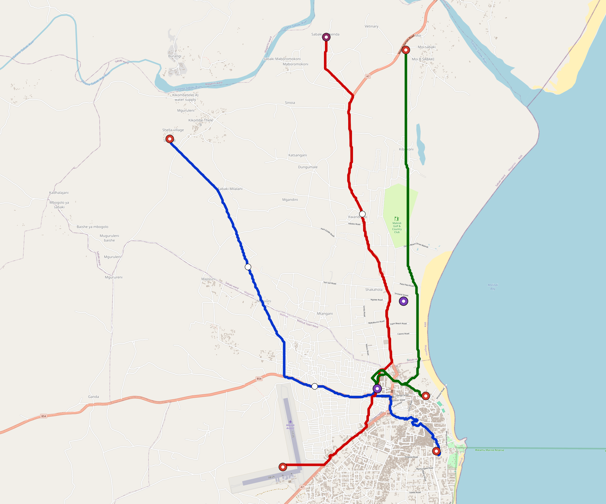

# Malindi — Urban Rail Network

**Country:** KE · **Population:** 300,000 · [National brief](../NATIONAL-BRIEF.md)

This page contains only Malindi-specific results. Shared routing, service, energy, civil, cost, finance, QA and validation methods are defined once in the [deployment planning reference](../../../../../docs/deployment-planning-reference.md).

> [!IMPORTANT]
> **Foreign-capital advantage:** against the default equivalent foreign-turnkey sensitivity, this local plan avoids **$406 M (88.0%) of external capital** and **$508 M of external interest**. Capital plus saved interest totals **$914 M**. See the common reference for interpretation and limitations.

Auto-planned by the OpenSourceRail design pipeline from the controlled city catalogue, source-locked geospatial inputs and shared templates.

## Network



| Local measure | Value |
|---|---:|
| Lines / unique stations / interchanges | 3 / 14 / 2 |
| Route length | 29.4 km double track |
| Coverage / transfer reachability | 79.1% / 100% |
| Estimated station catchment | 237,300 residents |
| Service span / peak headway | 05:30–02:00 / 3 min |
| Fleet | 61 × 2-car `tram-2car` trainsets (55 peak revenue) |
| Peak network throughput | 28,800 passengers/hour |
| Practical service capacity | 267,840 passenger-trips/day |
| Annual paid-trip planning range | 48.9–78.2 M |

### Lines

| Line | Length | Stations | Trainsets | Termini |
|---|---:|---:|---:|---|
| line-1 | 10.1 km | 5 | 21 | NW Outer ↔ SE Mid |
| line-2 | 10.4 km | 5 | 21 | S Outer ↔ N Outer |
| line-3 |  9.0 km | 4 | 19 | N Outer ↔ SE Mid |
| **Total** | **29.4 km** | **14 unique** | **61** | |

## Energy

| Local measure | Value |
|---|---:|
| Scheduled service | 1,395 one-way journeys / 13,690 train-km/day |
| Annual traction demand | 43.2 GWh |
| Station/depot PV / storage | 8.9 MW / 46.5 MWh |
| Aggregate charging power | 7.0 MW |
| Dedicated solar plant | 18.1 MW |
| Residual grid/PPA import | 0.0 GWh/yr |
| Worst powered-stop gap | line-3: 4.8 km / 24 kWh |
| Lowest traversal charging margin | line-3: 40 kWh |

## Capital And Funding

| Local CAPEX bucket | Planning value |
|---|---:|
| Civil works | $98 M |
| Stations | $83 M |
| Depots | $8.0 M |
| Rolling stock | $34 M |
| Dedicated solar plant | $14 M |
| Residual train control | $1.5 M |
| Charging microgrids | $1.6 M |
| EPC / project services | $16 M |
| **Total city programme** | **$256 M** |

| Local funding measure | Planning value |
|---|---:|
| Imported / external capital | $55 M (21.7%) |
| Domestic / local capital | $201 M (78.3%) |
| Annual public construction commitment | $27 M / yr for 7 years |
| Annual post-grace debt service | $22 M / yr |
| External capital saved vs default turnkey sensitivity | $406 M |
| Capital + lifetime external interest saved | $914 M |
| Annual OPEX | $6.4 M / yr |

## Local Evidence

**Evidence refresh required.** Retained passing results below are unverified.
The strict README generator rejected the evidence: engineering/simulation/validation-summary.json describes scenario SHA-256 c59ada40316f6fc7856d59c53bf210a361e7e79edfda9c111c64e3bb5ea90de5, but malindi.toml is d500153908efc709ce4b63f2641e4a6e363b06fac6bae48494d19451f9d04109; rerun and update the validation evidence. This audit view does not accept or replace the retained solver results.

| Package | Current status | Evidence |
|---|---|---|
| Finance | unverified | [`summary.json`](engineering/finance/summary.json) |
| Native simulation + degraded cases | unverified | [`validation-summary.json`](engineering/simulation/validation-summary.json) |
| SUMO timetable | unverified | [`summary.json`](engineering/sumo/summary.json) |
| Independent OSR/SUMO running-time cross-check | unverified; junction/authority gate open | [`operations-crosscheck.md`](engineering/simulation/operations-crosscheck.md) |
| GIS package | unverified | [`summary.json`](engineering/gis/summary.json) |
| Solar/storage snapshot (operating duty unverified) | unverified; 0 findings; 3 grid-only diagnostics | [`summary.json`](engineering/energy/summary.json) |
| Operations, QA and maintenance | 145 assets / 640 tasks | [`malindi-operations-manifest.json`](operations/malindi-operations-manifest.json) |

## Local Files And Regeneration

| File | Local role |
|---|---|
| [`design.toml`](design.toml) | Authoritative generated city design |
| [`malindi.toml`](malindi.toml) | Expanded simulator scenario |
| [`malindi.corridor.geojson`](malindi.corridor.geojson) | GIS corridor and stations |
| [`malindi.design-quality.yaml`](malindi.design-quality.yaml) | Coverage, source and civil-quality gates |

```bash
tools/automation/regenerate-city.sh malindi
```
