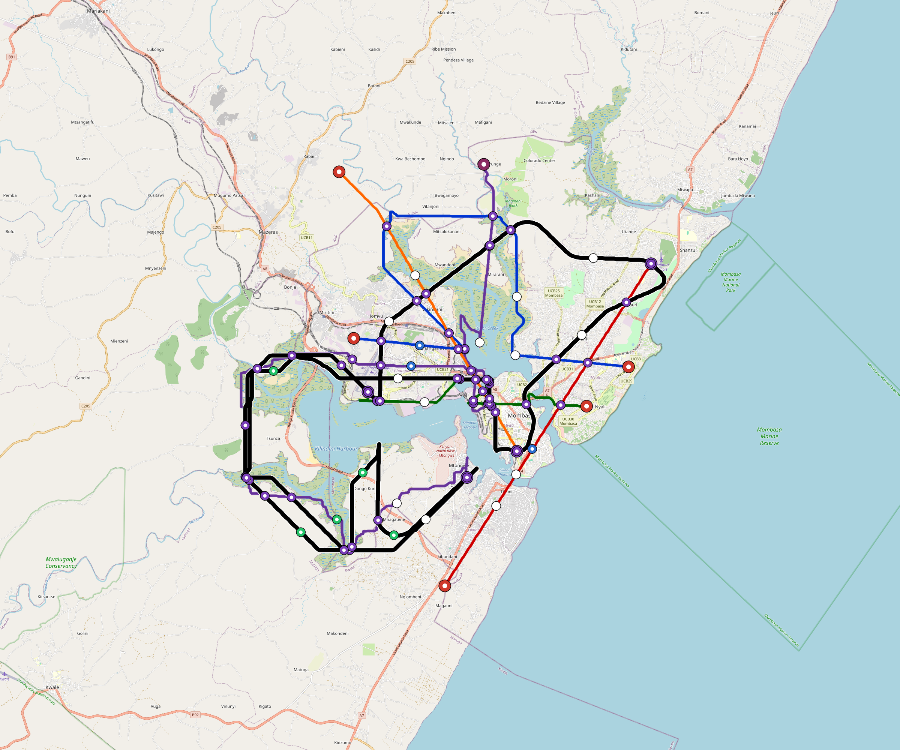

# Mombasa — Urban Rail Network

**Country:** KE · **Population:** 1,350,000 · [National brief](../NATIONAL-BRIEF.md)

This page contains only Mombasa-specific results. Shared routing, service, energy, civil, cost, finance, QA and validation methods are defined once in the [deployment planning reference](../../../../../docs/deployment-planning-reference.md).

> [!IMPORTANT]
> **Foreign-capital advantage:** against the default equivalent foreign-turnkey sensitivity, this local plan avoids **$10.81 bn (88.4%) of external capital** and **$13.56 bn of external interest**. Capital plus saved interest totals **$24.37 bn**. See the common reference for interpretation and limitations.

**Population-led network revision (2026-10-09).** The controlled planning inventory contains **17 lines**, including **11 additional residential lines**. **83.5%** of retained 2020 bbox residents are within a 1 km circle of the actual emitted station coordinates. The working target is 80%; remaining areas and station/access alternatives remain in the review. These are distance screens, not current census, surveyed walksheds or fare demand. New common corridor cells have identified junction/structure and access design requirements; no track switch or site approval is inferred. Country fleet, depot, civil, energy, staffing and financing models use the regenerated inventory, with installed quotations and operating acceptance still open. [Line additions and priorities](engineering/alignment/residential-line-expansion.json) · [Actual station coverage and source receipts](engineering/alignment/residential-expansion-evaluation.json).

**Current alignment, depot and production basis.** Core corridors change from **147.687 km to 272.360 km**, with elevated land sections, water-aware radial routes and separately engineered bridge candidates at short water crossings. 0 core fragments retain raster geometry for further curve review. The centre is a design-centroid screen; survey, property, obstacles, foundations and geometry releases remain open. All **273 platform points** pass the retained water-mask screen; footprints, bank stability and access remain open. [Alignment controls](engineering/alignment/core-realignment.json) · [Before/after map](engineering/alignment/core-alignment-comparison.png) · [Water screen](engineering/alignment/station-water-screen.json).

**17 line-local depots** provide **690 full-fleet storage slots**, separate from workshop bays. Fleet length and workload set quantities; PV/storage is included once in depot capital. Site acceptance and installed/land/utility quotations remain open. [Depot costs](engineering/line-depots/README.md). The factory requires **690 metro-4car trainsets / 2760 cars**, with **18-month facility readiness**, then qualification and manufacture. Integrated openings wait for fleet readiness where production or test paths constrain them. Shared factory capital is counted once; concurrent national loading and supplier commitments remain open. [Factory and dates](engineering/factory/README.md).

Station staffing uses two posts, two normal eight-hour shifts, plus service-window, leave and training cover. Basic wages start at 1.5 times the retained country income proxy, with higher technical/management grades and employer allowances. [Staff](engineering/delivery/README.md) · [Finance](engineering/finance/summary.json). Finance retains country-specific fixed-price, steady-state assumptions; Baghdad’s indexed cashflows are separate.

Auto-planned by the OpenSourceRail design pipeline from the controlled city catalogue, source-locked geospatial inputs and shared templates. Population is counted once within the union of station circles; this is potential radial access, not a verified walkshed or fare-demand estimate. Reachable line pairs include transfers through intermediate lines. [Population radii, denominator and transfer paths](engineering/access/README.md) · [Viaduct beam, foundation and terrain checks](engineering/clearance/README.md). Capital figures are base planning allowances: route-search scores are excluded from money, while special structures and installed-price gaps remain open. [Cost boundary](../../../../../docs/finance/civil-allowance-boundary.md).

## Network



| Local measure | Value |
|---|---:|
| Lines / unique stations / interchanges | 17 / 273 / 60 |
| Route length | 353.0 km double track |
| Direct transfers / reachable line pairs | 33.1% / 100.0% |
| Residents within 800 m radial station catchments | 1,071,789 (2020 raster; 69.2% of bbox) |
| Service span / peak headway | 05:30–02:00 / 3 min |
| Fleet | 690 × 4-car `metro-4car` trainsets (618 peak revenue) |
| Peak network throughput | 326,400 passengers/hour |
| Practical service capacity | 2,946,240 passenger-trips/day |
| Annual paid-trip planning range | 537.7–860.3 M |

### Lines

| Line | Length | Stations | Trainsets | Termini |
|---|---:|---:|---:|---|
| line-1 | 34.5 km | 22 | 75 | E Mid ↔ W Mid |
| line-2 | 21.6 km | 15 | 51 | S Mid ↔ NE Mid |
| line-3 | 17.0 km | 23 | 65 | W Inner ↔ E Mid |
| line-4 | 61.5 km | 42 | 139 | S Inner ↔ N Mid |
| line-5 | 18.5 km | 18 | 53 | NW Mid ↔ SE Inner |
| line-6 | 112.9 km | 81 | 67 | NW Inner ↔ W Inner |
| line-7 |  5.6 km | 4 | 15 | NE Inner ↔ E Mid |
| line-8 |  5.4 km | 5 | 17 | S Mid ↔ S Mid |
| line-9 |  6.6 km | 7 | 23 | NE Mid ↔ E Mid |
| line-10 |  7.3 km | 6 | 18 | NE Mid ↔ NE Outer |
| line-11 |  8.1 km | 7 | 24 | N Inner ↔ NW Mid |
| line-12 | 10.3 km | 8 | 27 | S Mid ↔ E Inner |
| line-13 |  8.3 km | 7 | 23 | NE Mid ↔ NE Outer |
| line-14 |  6.7 km | 6 | 20 | E Mid ↔ E Mid |
| line-15 | 10.5 km | 7 | 24 | W Mid ↔ NW Outer |
| line-16 | 10.9 km | 8 | 26 | NE Mid ↔ NE Outer |
| line-17 |  7.1 km | 7 | 23 | E Mid ↔ SE Mid |
| **Total** | **353.0 km** | **273 unique** | **690** | |

## Energy

| Local measure | Value |
|---|---:|
| Scheduled service | 7,672 one-way journeys / 137,881 train-km/day |
| Annual traction demand | 869.6 GWh |
| Station/depot PV / storage | 154.3 MW / 1,026.5 MWh |
| Aggregate charging power | 372.0 MW |
| Dedicated solar plant | 393.4 MW |
| Residual grid/PPA import | 0.0 GWh/yr |
| Worst powered-stop gap | line-15: 10.5 km / 105 kWh |
| Lowest traversal charging margin | line-15: 56 kWh |

## Capital And Funding

| Local CAPEX bucket | Planning value |
|---|---:|
| Civil works | $3.07 bn |
| Stations | $1.78 bn |
| Depots | $333 M |
| Rolling stock | $773 M |
| Dedicated solar plant | $315 M |
| Residual train control | $18 M |
| Charging microgrids | $77 M |
| EPC / project services | $424 M |
| **Total city programme** | **$6.79 bn** |

| Local funding measure | Planning value |
|---|---:|
| Imported / external capital | $1.42 bn (20.8%) |
| Domestic / local capital | $5.38 bn (79.2%) |
| Annual public construction commitment | $712 M / yr for 7 years |
| Annual post-grace debt service | $592 M / yr |
| External capital saved vs default turnkey sensitivity | $10.81 bn |
| Capital + lifetime external interest saved | $24.37 bn |
| Annual OPEX | $169 M / yr |

## Local Evidence

| Package | Current status | Evidence |
|---|---|---|
| Finance | pass | [`summary.json`](engineering/finance/summary.json) |
| Native simulation + degraded cases | pass | [`validation-summary.json`](engineering/simulation/validation-summary.json) |
| SUMO timetable | pass | [`summary.json`](engineering/sumo/summary.json) |
| Independent OSR/SUMO running-time cross-check | pass; junction/authority gate open | [`operations-crosscheck.md`](engineering/simulation/operations-crosscheck.md) |
| GIS package | pass | [`summary.json`](engineering/gis/summary.json) |
| Solar/storage snapshot (operating duty unverified) | pass; 0 findings; 37 grid-only diagnostics | [`summary.json`](engineering/energy/summary.json) |
| Operations, QA and maintenance | 2,167 assets / 11,075 tasks | [`mombasa-operations-manifest.json`](operations/mombasa-operations-manifest.json) |

## Local Files And Regeneration

| File | Local role |
|---|---|
| [`design.toml`](design.toml) | Authoritative generated city design |
| [`mombasa.toml`](mombasa.toml) | Expanded simulator scenario |
| [`mombasa.corridor.geojson`](mombasa.corridor.geojson) | GIS corridor and stations |
| [`mombasa.design-quality.yaml`](mombasa.design-quality.yaml) | Coverage, source and civil-quality gates |

```bash
tools/automation/regenerate-city.sh mombasa
```
