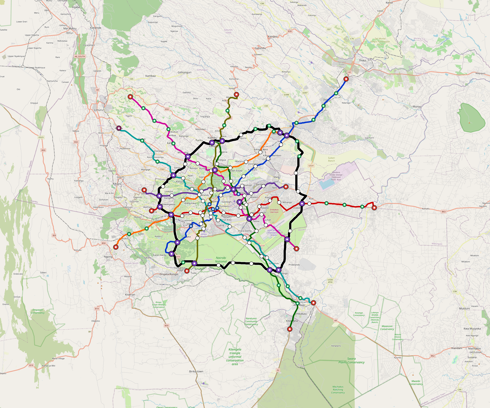

# Nairobi — Urban Rail Network

**Country:** KE · **Population:** 5,700,000 · [National brief](../NATIONAL-BRIEF.md)

This page contains only Nairobi-specific results. Shared routing, service, energy, civil, cost, finance, QA and validation methods are defined once in the [deployment planning reference](../../../../../docs/deployment-planning-reference.md).

> [!IMPORTANT]
> **Foreign-capital advantage:** against the default equivalent foreign-turnkey sensitivity, this local plan avoids **$7.62 bn (84.7%) of external capital** and **$9.55 bn of external interest**. Capital plus saved interest totals **$17.17 bn**. See the common reference for interpretation and limitations.

Auto-planned by the OpenSourceRail design pipeline from the controlled city catalogue, source-locked geospatial inputs and shared templates.

## Network



| Local measure | Value |
|---|---:|
| Lines / unique stations / interchanges | 9 / 151 / 20 |
| Route length | 505.8 km double track |
| Coverage / transfer reachability | 54.3% / 33% |
| Estimated station catchment | 3,095,100 residents |
| Service span / peak headway | 05:30–02:00 / 3 min |
| Fleet | 790 × 6-car `metro-6car` trainsets (714 peak revenue) |
| Peak network throughput | 259,200 passengers/hour |
| Practical service capacity | 2,276,640 passenger-trips/day |
| Annual paid-trip planning range | 415.5–664.8 M |

### Lines

| Line | Length | Stations | Trainsets | Termini |
|---|---:|---:|---:|---|
| line-1 | 57.9 km | 18 | 107 | NE Outer ↔ SW Mid |
| line-2 | 54.5 km | 19 | 102 | E Outer ↔ W Mid |
| line-3 | 52.2 km | 15 | 96 | N Mid ↔ SE Outer |
| line-4 | 32.5 km | 10 | 60 | E Mid ↔ W Mid |
| line-5 | 46.1 km | 13 | 87 | NE Mid ↔ SW Outer |
| line-6 | 59.9 km | 16 | 108 | SE Outer ↔ NW Outer |
| line-7 | 53.9 km | 18 | 104 | NW Outer ↔ SE Mid |
| line-8 | 43.6 km | 12 | 78 | SW Mid ↔ N Mid |
| line-9 | 105.1 km | 30 | 48 | W Mid ↔ W Mid |
| **Total** | **505.8 km** | **151 unique** | **790** | |

## Energy

| Local measure | Value |
|---|---:|
| Scheduled service | 3,952 one-way journeys / 210,750 train-km/day |
| Annual traction demand | 1,993.9 GWh |
| Station/depot PV / storage | 41.9 MW / 286.0 MWh |
| Aggregate charging power | 248.0 MW |
| Dedicated solar plant | 1,260.6 MW |
| Residual grid/PPA import | 0.0 GWh/yr |
| Worst powered-stop gap | line-7: 18.2 km / 273 kWh |
| Lowest traversal charging margin | line-8: 262 kWh |

## Capital And Funding

| Local CAPEX bucket | Planning value |
|---|---:|
| Civil works | $1.59 bn |
| Stations | $722 M |
| Depots | $8.0 M |
| Rolling stock | $1.33 bn |
| Dedicated solar plant | $1.01 bn |
| Residual train control | $25 M |
| Charging microgrids | $54 M |
| EPC / project services | $261 M |
| **Total city programme** | **$5.00 bn** |

| Local funding measure | Planning value |
|---|---:|
| Imported / external capital | $1.38 bn (27.5%) |
| Domestic / local capital | $3.62 bn (72.5%) |
| Annual public construction commitment | $499 M / yr for 7 years |
| Annual post-grace debt service | $423 M / yr |
| External capital saved vs default turnkey sensitivity | $7.62 bn |
| Capital + lifetime external interest saved | $17.17 bn |
| Annual OPEX | $124 M / yr |

## Local Evidence

| Package | Current status | Evidence |
|---|---|---|
| Finance | pass | [`summary.json`](engineering/finance/summary.json) |
| Native simulation + degraded cases | pass | [`validation-summary.json`](engineering/simulation/validation-summary.json) |
| SUMO timetable | pass | [`summary.json`](engineering/sumo/summary.json) |
| GIS package | pass | [`summary.json`](engineering/gis/summary.json) |
| Grid/charging/solar | pass | [`summary.json`](engineering/energy/summary.json) |
| Operations, QA and maintenance | 1,657 assets / 7,824 tasks | [`nairobi-operations-manifest.json`](operations/nairobi-operations-manifest.json) |

## Local Files And Regeneration

| File | Local role |
|---|---|
| [`design.toml`](design.toml) | Authoritative generated city design |
| [`nairobi.toml`](nairobi.toml) | Expanded simulator scenario |
| [`nairobi.corridor.geojson`](nairobi.corridor.geojson) | GIS corridor and stations |
| [`nairobi.design-quality.yaml`](nairobi.design-quality.yaml) | Coverage, source and civil-quality gates |

```bash
tools/automation/regenerate-city.sh nairobi
```
