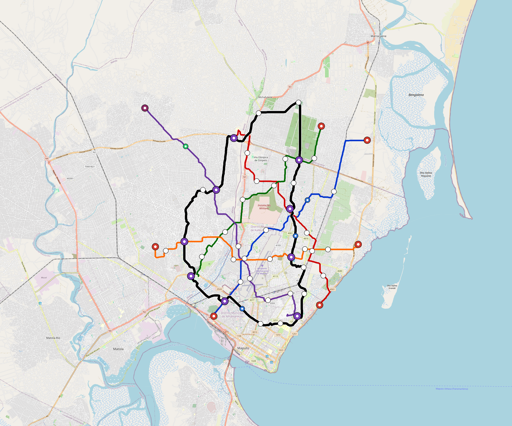

# Maputo — Urban Rail Network

**Country:** MZ · **Population:** 1,530,000 · [National brief](../NATIONAL-BRIEF.md)

This page contains only Maputo-specific results. Shared routing, service, energy, civil, cost, finance, QA and validation methods are defined once in the [deployment planning reference](../../../../../docs/deployment-planning-reference.md).

> [!IMPORTANT]
> **Foreign-capital advantage:** against the default equivalent foreign-turnkey sensitivity, this local plan avoids **$2.31 bn (86.6%) of external capital** and **$2.99 bn of external interest**. Capital plus saved interest totals **$5.30 bn**. See the common reference for interpretation and limitations.

Auto-planned by the OpenSourceRail design pipeline from the controlled city catalogue, source-locked geospatial inputs and shared templates.

## Network



| Local measure | Value |
|---|---:|
| Lines / unique stations / interchanges | 6 / 64 / 9 |
| Route length | 174.4 km double track |
| Coverage / transfer reachability | 69.0% / 40% |
| Estimated station catchment | 1,055,700 residents |
| Service span / peak headway | 05:30–02:00 / 3 min |
| Fleet | 214 × 4-car `metro-4car` trainsets (191 peak revenue) |
| Peak network throughput | 115,200 passengers/hour |
| Practical service capacity | 982,080 passenger-trips/day |
| Annual paid-trip planning range | 179.2–286.8 M |

### Lines

| Line | Length | Stations | Trainsets | Termini |
|---|---:|---:|---:|---|
| line-1 | 24.3 km | 9 | 39 | SW Mid ↔ NE Outer |
| line-2 | 21.7 km | 9 | 37 | SE Mid ↔ N Mid |
| line-3 | 21.9 km | 9 | 37 | NE Outer ↔ SW Mid |
| line-4 | 27.5 km | 8 | 41 | S Mid ↔ NW Outer |
| line-5 | 21.9 km | 9 | 37 | E Mid ↔ W Mid |
| line-6 | 57.0 km | 20 | 23 | NW Mid ↔ W Mid |
| **Total** | **174.4 km** | **64 unique** | **214** | |

## Energy

| Local measure | Value |
|---|---:|
| Scheduled service | 2,558 one-way journeys / 67,846 train-km/day |
| Annual traction demand | 427.9 GWh |
| Station/depot PV / storage | 23.6 MW / 133.0 MWh |
| Aggregate charging power | 94.5 MW |
| Dedicated solar plant | 253.7 MW |
| Residual grid/PPA import | 0.0 GWh/yr |
| Worst powered-stop gap | line-4: 9.6 km / 96 kWh |
| Lowest traversal charging margin | line-4: 175 kWh |

## Capital And Funding

| Local CAPEX bucket | Planning value |
|---|---:|
| Civil works | $568 M |
| Stations | $352 M |
| Depots | $8.0 M |
| Rolling stock | $240 M |
| Dedicated solar plant | $203 M |
| Residual train control | $8.7 M |
| Charging microgrids | $21 M |
| EPC / project services | $84 M |
| **Total city programme** | **$1.48 bn** |

| Local funding measure | Planning value |
|---|---:|
| Imported / external capital | $358 M (24.1%) |
| Domestic / local capital | $1.13 bn (75.9%) |
| Annual public construction commitment | $160 M / yr for 10 years |
| Annual post-grace debt service | $146 M / yr |
| External capital saved vs default turnkey sensitivity | $2.31 bn |
| Capital + lifetime external interest saved | $5.30 bn |
| Annual OPEX | $33 M / yr |

## Local Evidence

| Package | Current status | Evidence |
|---|---|---|
| Finance | pass | [`summary.json`](engineering/finance/summary.json) |
| Native simulation + degraded cases | pass | [`validation-summary.json`](engineering/simulation/validation-summary.json) |
| SUMO timetable | pass | [`summary.json`](engineering/sumo/summary.json) |
| GIS package | pass | [`summary.json`](engineering/gis/summary.json) |
| Grid/charging/solar | pass | [`summary.json`](engineering/energy/summary.json) |
| Operations, QA and maintenance | 575 assets / 2,477 tasks | [`maputo-operations-manifest.json`](operations/maputo-operations-manifest.json) |

## Local Files And Regeneration

| File | Local role |
|---|---|
| [`design.toml`](design.toml) | Authoritative generated city design |
| [`maputo.toml`](maputo.toml) | Expanded simulator scenario |
| [`maputo.corridor.geojson`](maputo.corridor.geojson) | GIS corridor and stations |
| [`maputo.design-quality.yaml`](maputo.design-quality.yaml) | Coverage, source and civil-quality gates |

```bash
tools/automation/regenerate-city.sh maputo
```
