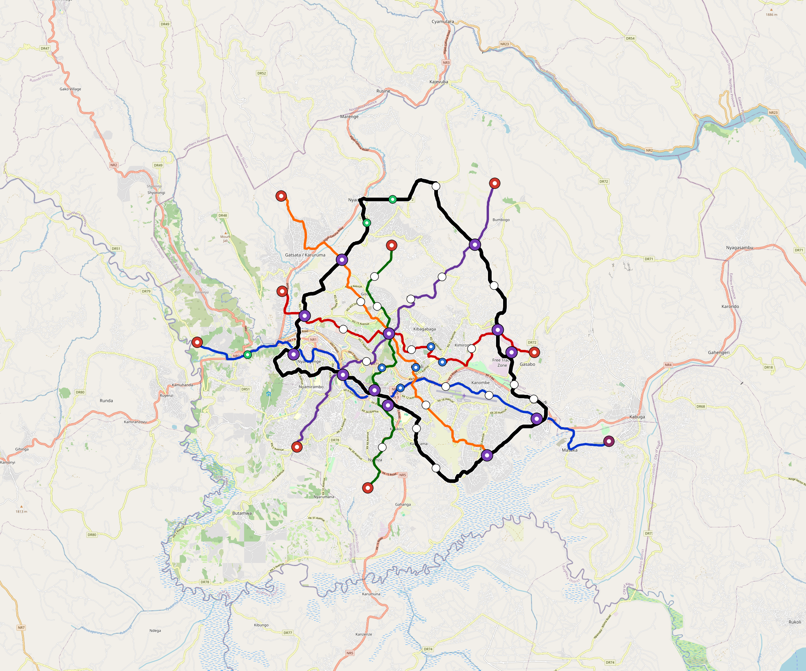

# Kigali — Urban Rail Network

**Country:** RW · **Population:** 1,208,000 · [National brief](../NATIONAL-BRIEF.md)

This page contains only Kigali-specific results. Shared routing, service, energy, civil, cost, finance, QA and validation methods are defined once in the [deployment planning reference](../../../../../docs/deployment-planning-reference.md).

> [!IMPORTANT]
> **Foreign-capital advantage:** against the default equivalent foreign-turnkey sensitivity, this local plan avoids **$2.72 bn (86.9%) of external capital** and **$3.41 bn of external interest**. Capital plus saved interest totals **$6.13 bn**. See the common reference for interpretation and limitations.

Auto-planned by the OpenSourceRail design pipeline from the controlled city catalogue, source-locked geospatial inputs and shared templates.

## Network



| Local measure | Value |
|---|---:|
| Lines / unique stations / interchanges | 6 / 68 / 12 |
| Route length | 183.2 km double track |
| Coverage / transfer reachability | 69.1% / 87% |
| Estimated station catchment | 834,727 residents |
| Service span / peak headway | 05:30–02:00 / 3 min |
| Fleet | 227 × 4-car `metro-4car` trainsets (203 peak revenue) |
| Peak network throughput | 115,200 passengers/hour |
| Practical service capacity | 982,080 passenger-trips/day |
| Annual paid-trip planning range | 179.2–286.8 M |

### Lines

| Line | Length | Stations | Trainsets | Termini |
|---|---:|---:|---:|---|
| line-1 | 32.5 km | 12 | 51 | W Outer ↔ SE Outer |
| line-2 | 22.8 km | 11 | 42 | NW Mid ↔ E Mid |
| line-3 | 18.5 km | 9 | 35 | S Mid ↔ N Mid |
| line-4 | 24.2 km | 8 | 37 | NE Outer ↔ SW Mid |
| line-5 | 24.9 km | 7 | 38 | NW Outer ↔ SE Mid |
| line-6 | 60.2 km | 21 | 24 | NW Mid ↔ W Mid |
| **Total** | **183.2 km** | **68 unique** | **227** | |

## Energy

| Local measure | Value |
|---|---:|
| Scheduled service | 2,558 one-way journeys / 71,196 train-km/day |
| Annual traction demand | 449.0 GWh |
| Station/depot PV / storage | 24.2 MW / 136.0 MWh |
| Aggregate charging power | 97.5 MW |
| Dedicated solar plant | 266.9 MW |
| Residual grid/PPA import | 0.0 GWh/yr |
| Worst powered-stop gap | line-6: 9.9 km / 99 kWh |
| Lowest traversal charging margin | line-4: 175 kWh |

## Capital And Funding

| Local CAPEX bucket | Planning value |
|---|---:|
| Civil works | $643 M |
| Stations | $489 M |
| Depots | $8.0 M |
| Rolling stock | $254 M |
| Dedicated solar plant | $214 M |
| Residual train control | $9.2 M |
| Charging microgrids | $22 M |
| EPC / project services | $100 M |
| **Total city programme** | **$1.74 bn** |

| Local funding measure | Planning value |
|---|---:|
| Imported / external capital | $410 M (23.6%) |
| Domestic / local capital | $1.33 bn (76.4%) |
| Annual public construction commitment | $147 M / yr for 7 years |
| Annual post-grace debt service | $121 M / yr |
| External capital saved vs default turnkey sensitivity | $2.72 bn |
| Capital + lifetime external interest saved | $6.13 bn |
| Annual OPEX | $39 M / yr |

## Local Evidence

| Package | Current status | Evidence |
|---|---|---|
| Finance | pass | [`summary.json`](engineering/finance/summary.json) |
| Native simulation + degraded cases | pass | [`validation-summary.json`](engineering/simulation/validation-summary.json) |
| SUMO timetable | pass | [`summary.json`](engineering/sumo/summary.json) |
| GIS package | pass | [`summary.json`](engineering/gis/summary.json) |
| Grid/charging/solar | pass | [`summary.json`](engineering/energy/summary.json) |
| Operations, QA and maintenance | 612 assets / 2,628 tasks | [`kigali-operations-manifest.json`](operations/kigali-operations-manifest.json) |

## Local Files And Regeneration

| File | Local role |
|---|---|
| [`design.toml`](design.toml) | Authoritative generated city design |
| [`kigali.toml`](kigali.toml) | Expanded simulator scenario |
| [`kigali.corridor.geojson`](kigali.corridor.geojson) | GIS corridor and stations |
| [`kigali.design-quality.yaml`](kigali.design-quality.yaml) | Coverage, source and civil-quality gates |

```bash
tools/automation/regenerate-city.sh kigali
```
