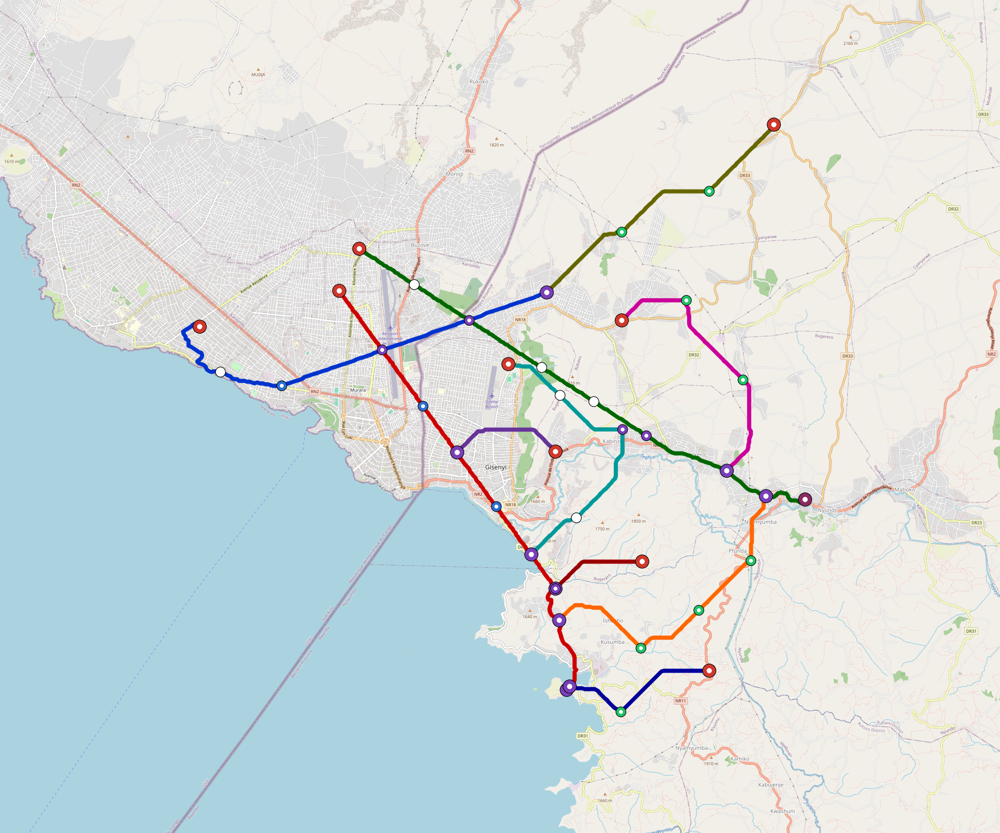

# Rubavu — Urban Rail Network

**Country:** RW · **Population:** 250,000 · [National brief](../NATIONAL-BRIEF.md)

This page contains only Rubavu-specific results. Shared routing, service, energy, civil, cost, finance, QA and validation methods are defined once in the [deployment planning reference](../../../../../docs/deployment-planning-reference.md).

> [!IMPORTANT]
> **Foreign-capital advantage:** against the default equivalent foreign-turnkey sensitivity, this local plan avoids **$807 M (89.3%) of external capital** and **$1.01 bn of external interest**. Capital plus saved interest totals **$1.82 bn**. See the common reference for interpretation and limitations.

**Current alignment, depot and production basis.** Core corridors change from **35.627 km to 26.188 km**, with elevated land sections, water-aware radial routes and separately engineered bridge candidates at short water crossings. 0 core fragments retain raster geometry for further curve review. The centre is a design-centroid screen; survey, property, obstacles, foundations and geometry releases remain open. All **16 platform points** pass the retained water-mask screen; footprints, bank stability and access remain open. [Alignment controls](engineering/alignment/core-realignment.json) · [Before/after map](engineering/alignment/core-alignment-comparison.png) · [Water screen](engineering/alignment/station-water-screen.json).

**3 line-local depots** provide **76 full-fleet storage slots**, separate from workshop bays. Fleet length and workload set quantities; PV/storage is included once in depot capital. Site acceptance and installed/land/utility quotations remain open. [Depot costs](engineering/line-depots/README.md). The factory requires **76 tram-2car trainsets / 152 cars**, with **18-month facility readiness**, then qualification and manufacture. Integrated openings wait for fleet readiness where production or test paths constrain them. Shared factory capital is counted once; concurrent national loading and supplier commitments remain open. [Factory and dates](engineering/factory/README.md).

Station staffing uses two posts, two normal eight-hour shifts, plus service-window, leave and training cover. Basic wages start at 1.5 times the retained country income proxy, with higher technical/management grades and employer allowances. [Staff](engineering/delivery/README.md) · [Finance](engineering/finance/summary.json). Finance retains country-specific fixed-price, steady-state assumptions; Baghdad’s indexed cashflows are separate.

Auto-planned by the OpenSourceRail design pipeline from the controlled city catalogue, source-locked geospatial inputs and shared templates. Population is counted once within the union of station circles; this is potential radial access, not a verified walkshed or fare-demand estimate. Reachable line pairs include transfers through intermediate lines. [Population radii, denominator and transfer paths](engineering/access/README.md) · [Viaduct beam, foundation and terrain checks](engineering/clearance/README.md).

## Network



| Local measure | Value |
|---|---:|
| Lines / unique stations / interchanges | 3 / 16 / 2 |
| Route length | 36.8 km double track |
| Direct transfers / reachable line pairs | 66.7% / 100.0% |
| Residents within 800 m radial station catchments | 69,990 (2020 raster; 23.1% of bbox) |
| Service span / peak headway | 05:30–02:00 / 3 min |
| Fleet | 76 × 2-car `tram-2car` trainsets (67 peak revenue) |
| Peak network throughput | 28,800 passengers/hour |
| Practical service capacity | 267,840 passenger-trips/day |
| Annual paid-trip planning range | 48.9–78.2 M |

### Lines

| Line | Length | Stations | Trainsets | Termini |
|---|---:|---:|---:|---|
| line-1 | 11.0 km | 5 | 23 | W Outer ↔ NE Mid |
| line-2 | 12.4 km | 6 | 26 | S Outer ↔ NW Mid |
| line-3 | 13.3 km | 5 | 27 | NW Mid ↔ E Outer |
| **Total** | **36.8 km** | **16 unique** | **76** | |

## Energy

| Local measure | Value |
|---|---:|
| Scheduled service | 1,395 one-way journeys / 17,106 train-km/day |
| Annual traction demand | 53.9 GWh |
| Station/depot PV / storage | 18.6 MW / 126.0 MWh |
| Aggregate charging power | 7.5 MW |
| Dedicated solar plant | 14.0 MW |
| Residual grid/PPA import | 0.0 GWh/yr |
| Worst powered-stop gap | line-3: 7.3 km / 36 kWh |
| Lowest traversal charging margin | line-3: 33 kWh |

## Capital And Funding

| Local CAPEX bucket | Planning value |
|---|---:|
| Civil works | $292 M |
| Stations | $77 M |
| Depots | $44 M |
| Rolling stock | $43 M |
| Dedicated solar plant | $11 M |
| Residual train control | $1.8 M |
| Charging microgrids | $1.6 M |
| EPC / project services | $32 M |
| **Total city programme** | **$502 M** |

| Local funding measure | Planning value |
|---|---:|
| Imported / external capital | $96 M (19.2%) |
| Domestic / local capital | $406 M (80.8%) |
| Annual public construction commitment | $44 M / yr for 7 years |
| Annual post-grace debt service | $35 M / yr |
| External capital saved vs default turnkey sensitivity | $807 M |
| Capital + lifetime external interest saved | $1.82 bn |
| Annual OPEX | $12 M / yr |

## Local Evidence

| Package | Current status | Evidence |
|---|---|---|
| Finance | pass | [`summary.json`](engineering/finance/summary.json) |
| Native simulation + degraded cases | pass | [`validation-summary.json`](engineering/simulation/validation-summary.json) |
| SUMO timetable | pass | [`summary.json`](engineering/sumo/summary.json) |
| Independent OSR/SUMO running-time cross-check | pass; junction/authority gate open | [`operations-crosscheck.md`](engineering/simulation/operations-crosscheck.md) |
| GIS package | pass | [`summary.json`](engineering/gis/summary.json) |
| Solar/storage snapshot (operating duty unverified) | pass; 0 findings; 3 grid-only diagnostics | [`summary.json`](engineering/energy/summary.json) |
| Operations, QA and maintenance | 174 assets / 971 tasks | [`rubavu-operations-manifest.json`](operations/rubavu-operations-manifest.json) |

## Local Files And Regeneration

| File | Local role |
|---|---|
| [`design.toml`](design.toml) | Authoritative generated city design |
| [`rubavu.toml`](rubavu.toml) | Expanded simulator scenario |
| [`rubavu.corridor.geojson`](rubavu.corridor.geojson) | GIS corridor and stations |
| [`rubavu.design-quality.yaml`](rubavu.design-quality.yaml) | Coverage, source and civil-quality gates |

```bash
tools/automation/regenerate-city.sh rubavu
```
