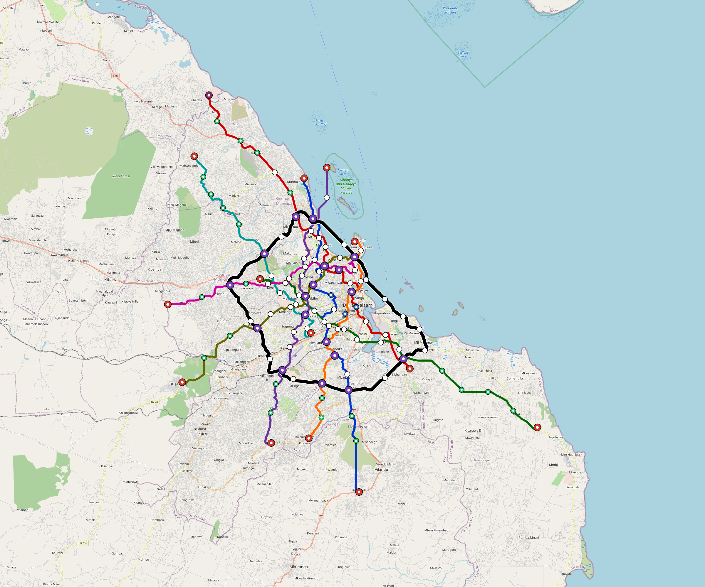

# Dar-Es-Salaam — Urban Rail Network

**Country:** TZ · **Population:** 7,404,689 · [National brief](../NATIONAL-BRIEF.md)

This page contains only Dar-Es-Salaam-specific results. Shared routing, service, energy, civil, cost, finance, QA and validation methods are defined once in the [deployment planning reference](../../../../../docs/deployment-planning-reference.md).

> [!IMPORTANT]
> **Foreign-capital advantage:** against the default equivalent foreign-turnkey sensitivity, this local plan avoids **$7.06 bn (84.9%) of external capital** and **$8.85 bn of external interest**. Capital plus saved interest totals **$15.90 bn**. See the common reference for interpretation and limitations.

Auto-planned by the OpenSourceRail design pipeline from the controlled city catalogue, source-locked geospatial inputs and shared templates.

## Network



| Local measure | Value |
|---|---:|
| Lines / unique stations / interchanges | 9 / 132 / 18 |
| Route length | 443.7 km double track |
| Coverage / transfer reachability | 56.8% / 56% |
| Estimated station catchment | 4,205,863 residents |
| Service span / peak headway | 05:30–02:00 / 3 min |
| Fleet | 709 × 6-car `metro-6car` trainsets (640 peak revenue) |
| Peak network throughput | 259,200 passengers/hour |
| Practical service capacity | 2,276,640 passenger-trips/day |
| Annual paid-trip planning range | 415.5–664.8 M |

### Lines

| Line | Length | Stations | Trainsets | Termini |
|---|---:|---:|---:|---|
| line-1 | 55.0 km | 16 | 102 | S Outer ↔ N Mid |
| line-2 | 59.0 km | 18 | 108 | SE Mid ↔ NW Outer |
| line-3 | 49.0 km | 15 | 95 | W Inner ↔ SE Outer |
| line-4 | 48.0 km | 13 | 85 | N Mid ↔ S Mid |
| line-5 | 35.9 km | 13 | 69 | S Mid ↔ NE Inner |
| line-6 | 39.5 km | 12 | 74 | NW Outer ↔ S Inner |
| line-7 | 34.2 km | 11 | 67 | NE Inner ↔ W Mid |
| line-8 | 37.4 km | 11 | 69 | NE Inner ↔ SW Mid |
| line-9 | 85.6 km | 23 | 40 | NW Inner ↔ W Mid |
| **Total** | **443.7 km** | **132 unique** | **709** | |

## Energy

| Local measure | Value |
|---|---:|
| Scheduled service | 3,952 one-way journeys / 186,424 train-km/day |
| Annual traction demand | 1,763.7 GWh |
| Station/depot PV / storage | 37.7 MW / 258.0 MWh |
| Aggregate charging power | 220.0 MW |
| Dedicated solar plant | 1,114.3 MW |
| Residual grid/PPA import | 0.0 GWh/yr |
| Worst powered-stop gap | line-3: 21.8 km / 327 kWh |
| Lowest traversal charging margin | line-6: 263 kWh |

## Capital And Funding

| Local CAPEX bucket | Planning value |
|---|---:|
| Civil works | $1.52 bn |
| Stations | $692 M |
| Depots | $8.0 M |
| Rolling stock | $1.19 bn |
| Dedicated solar plant | $891 M |
| Residual train control | $22 M |
| Charging microgrids | $48 M |
| EPC / project services | $244 M |
| **Total city programme** | **$4.62 bn** |

| Local funding measure | Planning value |
|---|---:|
| Imported / external capital | $1.25 bn (27.1%) |
| Domestic / local capital | $3.36 bn (72.9%) |
| Annual public construction commitment | $408 M / yr for 7 years |
| Annual post-grace debt service | $343 M / yr |
| External capital saved vs default turnkey sensitivity | $7.06 bn |
| Capital + lifetime external interest saved | $15.90 bn |
| Annual OPEX | $112 M / yr |

## Local Evidence

| Package | Current status | Evidence |
|---|---|---|
| Finance | pass | [`summary.json`](engineering/finance/summary.json) |
| Native simulation + degraded cases | pass | [`validation-summary.json`](engineering/simulation/validation-summary.json) |
| SUMO timetable | pass | [`summary.json`](engineering/sumo/summary.json) |
| GIS package | pass | [`summary.json`](engineering/gis/summary.json) |
| Grid/charging/solar | pass | [`summary.json`](engineering/energy/summary.json) |
| Operations, QA and maintenance | 1,470 assets / 6,971 tasks | [`dar-es-salaam-operations-manifest.json`](operations/dar-es-salaam-operations-manifest.json) |

## Local Files And Regeneration

| File | Local role |
|---|---|
| [`design.toml`](design.toml) | Authoritative generated city design |
| [`dar-es-salaam.toml`](dar-es-salaam.toml) | Expanded simulator scenario |
| [`dar-es-salaam.corridor.geojson`](dar-es-salaam.corridor.geojson) | GIS corridor and stations |
| [`dar-es-salaam.design-quality.yaml`](dar-es-salaam.design-quality.yaml) | Coverage, source and civil-quality gates |

```bash
tools/automation/regenerate-city.sh dar-es-salaam
```
