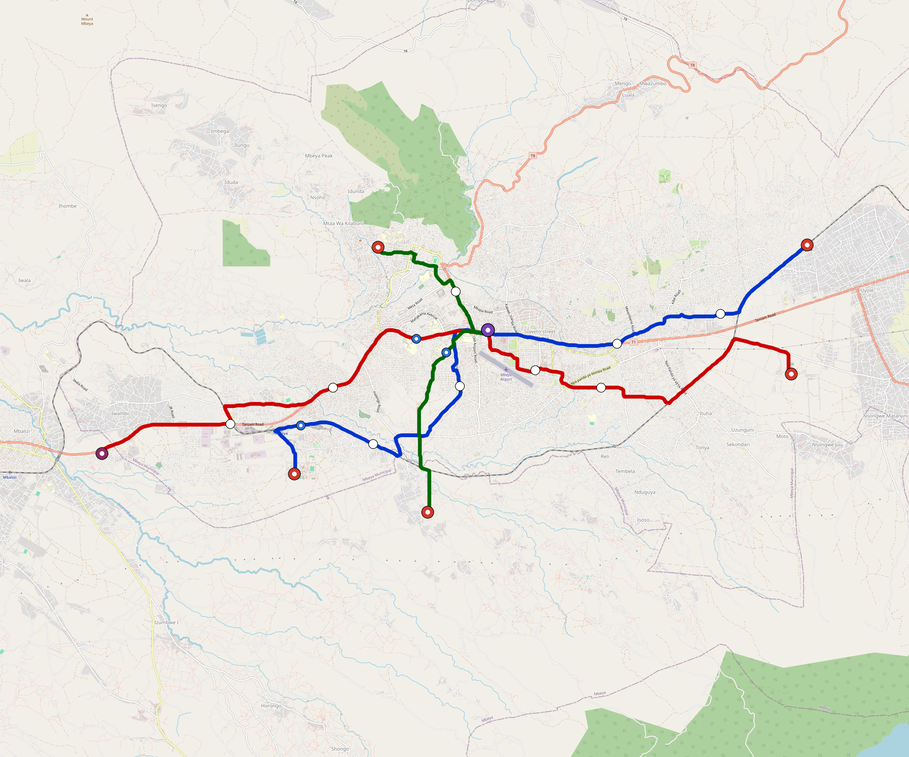

# Mbeya — Urban Rail Network

**Country:** TZ · **Population:** 550,000 · [National brief](../NATIONAL-BRIEF.md)

This page contains only Mbeya-specific results. Shared routing, service, energy, civil, cost, finance, QA and validation methods are defined once in the [deployment planning reference](../../../../../docs/deployment-planning-reference.md).

> [!IMPORTANT]
> **Foreign-capital advantage:** against the default equivalent foreign-turnkey sensitivity, this local plan avoids **$621 M (86.5%) of external capital** and **$778 M of external interest**. Capital plus saved interest totals **$1.40 bn**. See the common reference for interpretation and limitations.

Auto-planned by the OpenSourceRail design pipeline from the controlled city catalogue, source-locked geospatial inputs and shared templates.

## Network



| Local measure | Value |
|---|---:|
| Lines / unique stations / interchanges | 3 / 21 / 1 |
| Route length | 53.0 km double track |
| Coverage / transfer reachability | 63.0% / 100% |
| Estimated station catchment | 346,500 residents |
| Service span / peak headway | 05:30–02:00 / 3 min |
| Fleet | 112 × 3-car `light-metro-3car` trainsets (100 peak revenue) |
| Peak network throughput | 43,200 passengers/hour |
| Practical service capacity | 401,760 passenger-trips/day |
| Annual paid-trip planning range | 73.3–117.3 M |

### Lines

| Line | Length | Stations | Trainsets | Termini |
|---|---:|---:|---:|---|
| line-1 | 19.8 km | 8 | 41 | E Outer ↔ SW Mid |
| line-2 | 22.6 km | 8 | 47 | E Outer ↔ W Outer |
| line-3 | 10.6 km | 5 | 24 | NW Mid ↔ S Mid |
| **Total** | **53.0 km** | **21 unique** | **112** | |

## Energy

| Local measure | Value |
|---|---:|
| Scheduled service | 1,395 one-way journeys / 24,654 train-km/day |
| Annual traction demand | 116.6 GWh |
| Station/depot PV / storage | 11.0 MW / 50.0 MWh |
| Aggregate charging power | 10.5 MW |
| Dedicated solar plant | 43.9 MW |
| Residual grid/PPA import | 0.0 GWh/yr |
| Worst powered-stop gap | line-2: 6.4 km / 54 kWh |
| Lowest traversal charging margin | line-3: 25 kWh |

## Capital And Funding

| Local CAPEX bucket | Planning value |
|---|---:|
| Civil works | $139 M |
| Stations | $88 M |
| Depots | $8.0 M |
| Rolling stock | $101 M |
| Dedicated solar plant | $35 M |
| Residual train control | $2.7 M |
| Charging microgrids | $2.2 M |
| EPC / project services | $24 M |
| **Total city programme** | **$399 M** |

| Local funding measure | Planning value |
|---|---:|
| Imported / external capital | $97 M (24.4%) |
| Domestic / local capital | $302 M (75.6%) |
| Annual public construction commitment | $36 M / yr for 7 years |
| Annual post-grace debt service | $30 M / yr |
| External capital saved vs default turnkey sensitivity | $621 M |
| Capital + lifetime external interest saved | $1.40 bn |
| Annual OPEX | $10 M / yr |

## Local Evidence

| Package | Current status | Evidence |
|---|---|---|
| Finance | pass | [`summary.json`](engineering/finance/summary.json) |
| Native simulation + degraded cases | pass | [`validation-summary.json`](engineering/simulation/validation-summary.json) |
| SUMO timetable | pass | [`summary.json`](engineering/sumo/summary.json) |
| GIS package | pass | [`summary.json`](engineering/gis/summary.json) |
| Grid/charging/solar | pass | [`summary.json`](engineering/energy/summary.json) |
| Operations, QA and maintenance | 237 assets / 1,108 tasks | [`mbeya-operations-manifest.json`](operations/mbeya-operations-manifest.json) |

## Local Files And Regeneration

| File | Local role |
|---|---|
| [`design.toml`](design.toml) | Authoritative generated city design |
| [`mbeya.toml`](mbeya.toml) | Expanded simulator scenario |
| [`mbeya.corridor.geojson`](mbeya.corridor.geojson) | GIS corridor and stations |
| [`mbeya.design-quality.yaml`](mbeya.design-quality.yaml) | Coverage, source and civil-quality gates |

```bash
tools/automation/regenerate-city.sh mbeya
```
