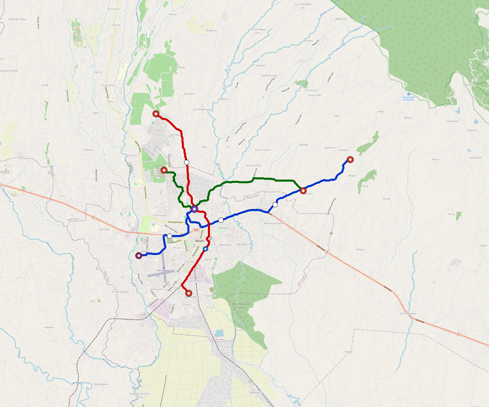

# Moshi — Urban Rail Network

**Country:** TZ · **Population:** 300,000 · [National brief](../NATIONAL-BRIEF.md)

This page contains only Moshi-specific results. Shared routing, service, energy, civil, cost, finance, QA and validation methods are defined once in the [deployment planning reference](../../../../../docs/deployment-planning-reference.md).

> [!IMPORTANT]
> **Foreign-capital advantage:** against the default equivalent foreign-turnkey sensitivity, this local plan avoids **$472 M (88.0%) of external capital** and **$591 M of external interest**. Capital plus saved interest totals **$1.06 bn**. See the common reference for interpretation and limitations.

Auto-planned by the OpenSourceRail design pipeline from the controlled city catalogue, source-locked geospatial inputs and shared templates.

## Network



| Local measure | Value |
|---|---:|
| Lines / unique stations / interchanges | 3 / 14 / 1 |
| Route length | 36.1 km double track |
| Coverage / transfer reachability | 76.1% / 100% |
| Estimated station catchment | 228,300 residents |
| Service span / peak headway | 05:30–02:00 / 3 min |
| Fleet | 73 × 2-car `tram-2car` trainsets (65 peak revenue) |
| Peak network throughput | 28,800 passengers/hour |
| Practical service capacity | 267,840 passenger-trips/day |
| Annual paid-trip planning range | 48.9–78.2 M |

### Lines

| Line | Length | Stations | Trainsets | Termini |
|---|---:|---:|---:|---|
| line-1 | 15.3 km | 6 | 31 | E Outer ↔ SW Mid |
| line-2 | 11.1 km | 5 | 23 | NW Outer ↔ S Mid |
| line-3 |  9.8 km | 3 | 19 | NW Mid ↔ E Mid |
| **Total** | **36.1 km** | **14 unique** | **73** | |

## Energy

| Local measure | Value |
|---|---:|
| Scheduled service | 1,395 one-way journeys / 16,778 train-km/day |
| Annual traction demand | 52.9 GWh |
| Station/depot PV / storage | 8.9 MW / 46.5 MWh |
| Aggregate charging power | 7.0 MW |
| Dedicated solar plant | 24.5 MW |
| Residual grid/PPA import | 0.0 GWh/yr |
| Worst powered-stop gap | line-3: 6.3 km / 32 kWh |
| Lowest traversal charging margin | line-3: 20 kWh |

## Capital And Funding

| Local CAPEX bucket | Planning value |
|---|---:|
| Civil works | $130 M |
| Stations | $78 M |
| Depots | $8.0 M |
| Rolling stock | $41 M |
| Dedicated solar plant | $20 M |
| Residual train control | $1.8 M |
| Charging microgrids | $1.6 M |
| EPC / project services | $18 M |
| **Total city programme** | **$298 M** |

| Local funding measure | Planning value |
|---|---:|
| Imported / external capital | $64 M (21.6%) |
| Domestic / local capital | $233 M (78.4%) |
| Annual public construction commitment | $27 M / yr for 7 years |
| Annual post-grace debt service | $22 M / yr |
| External capital saved vs default turnkey sensitivity | $472 M |
| Capital + lifetime external interest saved | $1.06 bn |
| Annual OPEX | $7.0 M / yr |

## Local Evidence

**Evidence refresh required.** Retained passing results below are unverified.
The strict README generator rejected the evidence: engineering/simulation/validation-summary.json describes scenario SHA-256 243d128122596ce9b175055b2181ed31feabce29bf9a547c438b4ea30180b478, but moshi.toml is d2c697e25e46003e4892e7925db691a55c6658f1a21c3e6c3d64e08f008adff8; rerun and update the validation evidence. This audit view does not accept or replace the retained solver results.

| Package | Current status | Evidence |
|---|---|---|
| Finance | unverified | [`summary.json`](engineering/finance/summary.json) |
| Native simulation + degraded cases | unverified | [`validation-summary.json`](engineering/simulation/validation-summary.json) |
| SUMO timetable | unverified | [`summary.json`](engineering/sumo/summary.json) |
| Independent OSR/SUMO running-time cross-check | unverified; junction/authority gate open | [`operations-crosscheck.md`](engineering/simulation/operations-crosscheck.md) |
| GIS package | unverified | [`summary.json`](engineering/gis/summary.json) |
| Solar/storage snapshot (operating duty unverified) | unverified; 0 findings; 4 grid-only diagnostics | [`summary.json`](engineering/energy/summary.json) |
| Operations, QA and maintenance | 158 assets / 911 tasks | [`moshi-operations-manifest.json`](operations/moshi-operations-manifest.json) |

## Local Files And Regeneration

| File | Local role |
|---|---|
| [`design.toml`](design.toml) | Authoritative generated city design |
| [`moshi.toml`](moshi.toml) | Expanded simulator scenario |
| [`moshi.corridor.geojson`](moshi.corridor.geojson) | GIS corridor and stations |
| [`moshi.design-quality.yaml`](moshi.design-quality.yaml) | Coverage, source and civil-quality gates |

```bash
tools/automation/regenerate-city.sh moshi
```
