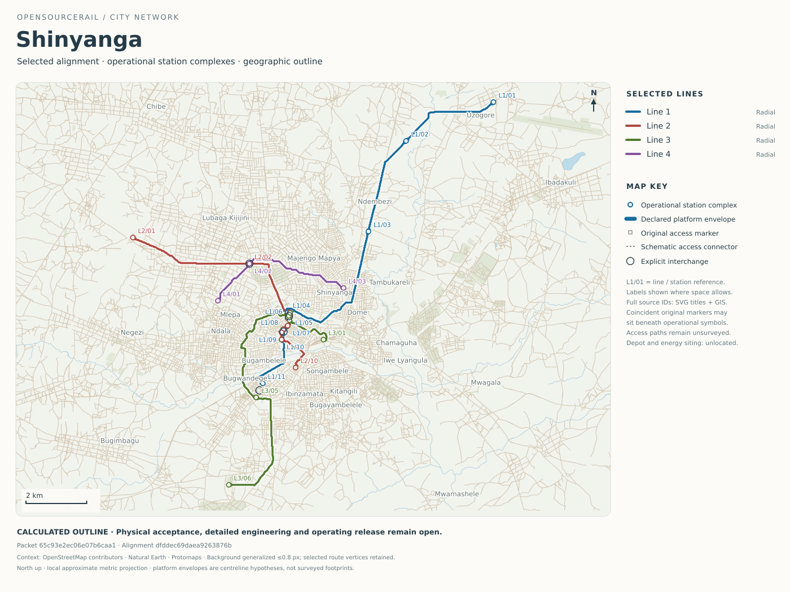

# Shinyanga — railway design and city programme

**TZ · Calculated outline complete · Class C estimates · Physical verification pending**

[City index](../../../README.md) · [National programme](../NATIONAL-BRIEF.md) · [Interactive map](../../../../../docs/workbench/current/index.html?outlineCity=shinyanga) · [Planning workspace](../../../../../docs/workbench/planning/index.html?city=shinyanga) · [Methods and assumptions](../../../../../docs/design-engine/city-dossiers/README.md)



[Open full-size map](engineering/outline/network.svg) · [Download GIS bundle](engineering/outline/gis.zip) · [Complete dossier data](engineering/outline/summary.json)

## City and network

This city programme uses its exact selected mapped alignment, vehicle reference, service calculation and cost ledger. Demand, site and unit-rate assumptions support a complete outline for comparison; they do not substitute for surveys, detailed engineering or operational approval.

| Network measure | Current outline |
|---|---|
| Population context | 250,000 — retained planning input; not a demand survey |
| Selected alignment | Original |
| Route length / trackways | 42.12 km / 2 trackways |
| Lines / operational platform groups | 4 / 30 |
| Original access markers / separately costed access sites | 37 / 13 |
| Explicit interchange references | 4 |
| Fleet including reserve | 72 six-car trainsets |
| Train distance | 27,292 train-km/day; 9,961,488 /year |
| Service span | 18 h/day, 365 days/year; clock timetable not yet assigned |
| Peak demand brief | 4,000 passengers/h/direction per line — assumed, not additive network ridership |
| Planning occupancy / availability | 85% / 99% — assumptions |

Operational platform groups are counted per line. Interchange access sites and original markers are separate quantities; none is silently treated as a unique city-wide station count. Catchment and access scenarios are described below; authenticated population coverage and demand forecasts remain open.

### Lines, service and fleet

| Line | Route km | Platform groups | Headway s | One-way / circuit min | Active + reserve | Usable pphpd | Mapped termini |
|---|---|---|---|---|---|---|---|
| line-1 | 15.94 | 11 | 200 | 34.5 | 23 + 4 | 4,181 | NE terminal ↔ S terminal |
| line-2 | 9.58 | 10 | 200 | 21.2 | 15 + 3 | 4,181 | NW terminal ↔ S terminal |
| line-3 | 11.34 | 6 | 200 | 21.1 | 15 + 3 | 4,181 | SE terminal ↔ S terminal |
| line-4 | 5.26 | 3 | 200 | 8.0 | 7 + 2 | 4,181 | W terminal ↔ NE terminal |

Compass termini describe mapped endpoint positions relative to the network centre; official station names require local planning. The six-car reference provides 276 normal passenger places, including wheelchair places, with no planned standing. Headway is a calculated service choice. Journey times are conditional calculations; protected signalling timetables and actual available thrust remain separate work.

[Line details and energy](engineering/outline/lines.csv) · [Station and access register](engineering/outline/stations.csv)

### Connections and access

Declared transfer graph: 1 connected line group(s): line-1, line-2, line-3, line-4. These are explicit planned connections; walking paths and accessible interchange layouts are not yet surveyed.

<details><summary>Access and catchment assumptions</summary>

Geometric access scenarios are separate from measured population coverage. Full assumptions and outputs are in the dossier data.

| Radius m | Straight line walk minutes | Station circle area sum km2 | Overlaps removed | Population coverage |
|---|---|---|---|---|
| 400.00 | 6.67 | 15.08 | False | Unestablished |
| 800.00 | 13.33 | 60.32 | False | Unestablished |

</details>

## Energy and propulsion

| Energy measure | Daily | Annual |
|---|---|---|
| Mechanical traction work | 84,135 kWh mechanical | 30.71 GWh mechanical |
| Nominal auxiliary load | 226,800 kWh | 82.78 GWh |
| Auxiliary supply including scenario charging losses | 238,737 kWh | 87.14 GWh |
| Physically supported total grid demand | Unestablished | Unestablished |

| Annual electricity budget | Low | Base | High |
|---|---|---|---|
| Priced supply/efficiency scenario | $8.43m | $21.47m | $62.32m |

Mechanical work is distinct from electricity purchased. The monetary electricity scenarios include declared efficiency and site-load assumptions; they do not establish a measured motor map, solar plant, storage installation or self-sufficient energy supply. Each line retains its candidate-specific launch, braking and recovery requirements in the complete record.

| Line | Propulsion research concept | Additional traction mass / car | Additional reserve / car |
|---|---|---|---|
| line-1 | Station launch reference | 0 kg | 250 kg |
| line-2 | Station launch reference | 0 kg | 250 kg |
| line-3 | Station launch reference | 0 kg | 250 kg |
| line-4 | Station launch reference | 0 kg | 250 kg |

The city research configuration is separate from the selected passive reference vehicle. Onboard-traction comparisons carry their own additional mass and cost assumptions; they do not silently change that reference or establish complete installed equipment.

| Line | Motors/car / rated kW per car | Continuous feed | Required train force | Required mechanical peak | Station-fin comparison envelope | Actual force map |
|---|---|---|---|---|---|---|
| line-1 | 0 / 0.0 kW | 0.00 km | 156.1 kN | 3.12 MW | 316.5 m | Unestablished |
| line-2 | 0 / 0.0 kW | 0.00 km | 156.1 kN | 3.12 MW | 316.5 m | Unestablished |
| line-3 | 0 / 0.0 kW | 0.00 km | 156.1 kN | 3.12 MW | 316.5 m | Unestablished |
| line-4 | 0 / 0.0 kW | 0.00 km | 156.1 kN | 3.12 MW | 316.5 m | Unestablished |

These are declared requirements and equipment hypotheses, not measured motor capability. A station-launch row retains an unselected wayside mechanism and priced equipment provision. The station-fin comparison envelope does not prescribe installed motor length or apply to an onboard-traction interface. Independent friction braking, collector/electrical protection and protected recovery remain required for every concept.

## Civil works, depot and manufacture

| Quantity / resource | Calculated requirement |
|---|---|
| At grade route | 7.69 km |
| Bridge route | 0.02 km |
| Elevated route | 34.41 km |
| Tunnel route | 0.00 km |
| Precast span stock | 3,448 spans |
| Independent supports | 3,468 |
| Running rail | 168.47 rail-km / 10,143 t |
| Complete fastening sets | 294,819 |
| Protected at-grade crossing packages | 12 |
| Bridge runs / tunnel portals | 1 / 0 |
| Additional station track | 0 m |
| Access connector allowance | 555.8 m; actual accessible paths require survey |
| Pooled depot area | 51,168 m²; location and line connections require a site plan |
| Factory / civil working pattern | 2 / 2 shifts/day |

Civil classes and quantities follow the mapped scenario. Foundation capacities, bearings, erection stability, river crossings, utilities and ground conditions require site-specific design. The depot allowance includes pooled storage/workshop scope and budgeted connections; it does not identify an acquired or physically connected depot site.

### Factory capacity and make/buy

| Factory investment | Low | Base | High |
|---|---|---|---|
| Vehicle equipment, tooling and premises | $636,311 | $1.90m | $8.19m |
| Civil production campaign | $1.53m | $6.58m | $36.55m |

Factory capital is already included in the city capital ledger. It must not be added a second time. Make/buy comparisons use committed city volume, equipment/tooling, material, labour, yield and productive capacity; no speculative future-city discount is assumed.

| Component / process | Provisional route |
|---|---|
| located-stock/passive-bogie-pair/steel | buy |
| located-stock/passive-secondary/aluminium | buy |
| located-stock/retained-comfort/body/composite | buy |
| located-stock/retained-comfort/body/generic | make |
| located-stock/retained-comfort/doors/generic | Unestablished |
| located-stock/retained-comfort/glazing/generic | Unestablished |
| located-stock/retained-comfort/seating/generic | Unestablished |
| located-stock/wheel-underframe/aluminium | make |
| unlocated-account/attachments | Unestablished |
| unlocated-account/passive-bogie-pair | Unestablished |
| unlocated-account/retained-comfort/HVAC | Unestablished |
| unlocated-account/retained-comfort/body | buy |
| unlocated-account/retained-comfort/doors | Unestablished |
| unlocated-account/retained-comfort/frame-joints | Unestablished |
| unlocated-account/retained-comfort/glazing | Unestablished |
| unlocated-account/retained-comfort/seating | Unestablished |
| unlocated-account/roof-thermal | Unestablished |
| unlocated-account/services | Unestablished |
| six-car-final-vehicle-assembly | Unestablished |
| reference-factory-to-assembly-delivery | Unestablished |

| Precast case | Selected route | Parallel cells | Required cell-hours | Productive person-hours | Paid person-hours |
|---|---|---|---|---|---|
| low | make | 2 | 12,068 | 89,648 | 119,531 |
| base | make | 4 | 29,308 | 234,464 | 312,619 |
| high | make | 9 | 79,304 | 648,224 | 864,299 |

[Complete manufacturing routes and comparisons](engineering/outline/make_buy.csv) · [Quantities and delivery requirements](engineering/outline/delivery_requirements.csv) · [Vehicle, station and civil 3D models](../../../../../docs/engineering-models/README.md)

## Workforce and construction programme

Production and civil works use two shifts. The operating case uses 18 service hours/day and a 2-shift planning convention; named-worker rosters, shift lengths, relief and local employment requirements need an approved calendar. Extended operation can require three shifts.

| Domain / case | Covered positions per shift | Two-shift people floor | Paid person-hours | Paid FTE equivalent |
|---|---|---|---|---|
| Control room and access-site coverage / low | 15 | Unestablished | 108,405 | 54.2 |
| Vehicle production / low | 11 | 22 | Unestablished | Unestablished |
| Civil field / low | 13 | 26 | 128,939 | Unestablished |
| Civil other installation / low | 169 | 338 | 1,753,528 | Unestablished |
| Civil precast / low | 16 | 32 | 119,531 | Unestablished |
| Control room and access-site coverage / base | 30 | Unestablished | 246,375 | 123.2 |
| Vehicle production / base | 29 | 58 | Unestablished | Unestablished |
| Civil field / base | 47 | 94 | 405,205 | Unestablished |
| Civil other installation / base | 932 | 1,864 | 8,193,037 | Unestablished |
| Civil precast / base | 32 | 64 | 312,619 | Unestablished |
| Control room and access-site coverage / high | 60 | Unestablished | 591,300 | 295.6 |
| Vehicle production / high | 80 | 160 | Unestablished | Unestablished |
| Civil field / high | 201 | 402 | 1,123,456 | Unestablished |
| Civil other installation / high | 7,417 | 14,834 | 41,533,560 | Unestablished |
| Civil precast / high | 72 | 144 | 864,299 | Unestablished |

Paid FTE is a budgeting convention, distinct from simultaneous posts and named employees. Source labour and relief are already in the priced model; this staffing view does not add another payroll charge.

| Function / skills | Base coverage posts | Paid FTE | Authority / staffing boundary |
|---|---|---|---|
| Control room / dispatch / response | 4 | 16.4 | Source control/access coverage; operations authority requires separate assurance |
| Station and access-site service | 26 | 106.8 | Source access coverage; accessible assistance and local duties require roster design |
| Vehicle workshop / electrical / brakes | Unestablished | Unestablished | Maintenance budget envelope exists; detailed roles, competence and productive hours require routing |
| Civil infrastructure / track / inspections | Unestablished | Unestablished | Maintenance scope exists; inspection tasks and geographic workload require a site plan |
| Station power / propulsion / controls | Unestablished | Unestablished | Qualified equipment-specific maintenance and protection work |
| Cleaning / security / passenger emergencies | Unestablished | Unestablished | Site/service responsibilities and employee/contractor allocation remain to be sized |
| Programme management / procurement / finance / HR | Unestablished | Unestablished | Business entity, reporting lines and operating overhead allocation require review |
| Training / competence / independent assurance | Unestablished | Unestablished | Independent release authority and competence records remain mandatory |

**Staffing boundary:** the operations rows size control-room and access-site coverage only. They are not the complete operating company. Unallocated maintenance/support functions have budget envelopes or open allocation; their unknown FTE is not zero. No recruitment or complete-organisation claim follows from this table.

The provisional delivery sequence is: Survey and site investigation → Detailed design and independent review → Factory setup and procurement → Foundation and civil production → Transport and installation → Power controls and access installation → Integration testing and release. Factories, field crews and access must be checked together. Aggregate resource envelopes are distinct from resource-levelled, site-approved construction schedules.

[Workforce cases](engineering/outline/workforce.csv) · [Production and construction requirements](engineering/outline/delivery_requirements.csv)

## Capital, operating costs and whole-life economics

| Programme estimate | Low | Base | High |
|---|---|---|---|
| Installed capital | $249.07m | $846.37m | $4.618bn |
| Installed capital / route-km | $5.91m | $20.10m | $109.64m |
| 30-year whole-life NPV | $510.87m | $1.788bn | $9.893bn |
| Annual operating provision | $11.88m | $40.25m | $211.45m |

US dollars, 4% real discount rate, 30-year horizon. Low/base/high are assumption cases, not statistical confidence intervals. Transferred sourcing and construction rates require local calibration.

| Scope | Installed capital · base | Whole-life NPV · base |
|---|---|---|
| Rolling stock | $176.57m | $176.57m |
| Guideway | $53.84m | $53.84m |
| Stations power | $240.56m | $240.56m |
| Factory tooling | $8.48m | $8.48m |
| Construction | $290.91m | $290.91m |
| Land utilities depot | $53.30m | $53.30m |
| Fleet | $17.75m | $17.75m |
| Energy | $0 | $371.30m |
| Operations | $0 | $33.33m |
| Maintenance | $0 | $271.97m |
| Renewals | $0 | $237.73m |
| Recovery | $4.97m | $10.12m |
| Reliability | $0 | $14.26m |
| Disposal | $0 | $7.83m |

[Full capital and lifecycle ledger](engineering/outline/costs.csv)

### Passenger receipts and funding scenarios

The following sensitivities use explicitly assumed daily demand profiles, average trip length, transfers, paid-trip collection and fares. They are calculated planning scenarios, not surveyed ridership or an approved financing plan. Import origin and financing source are distinct: no local/import share or foreign-turnkey saving is asserted without an evidenced procurement allocation.

| Demand sensitivity | Assumed annual paid trips | Fare US$ | Annual receipts | Operating balance | 30-year receipts less costs NPV | Post-grace DSCR |
|---|---|---|---|---|---|---|
| 50% | 43.12m | 0.25 | $10.78m | $-29.47m | $-1.602bn | -0.54 |
| 50% | 43.12m | 0.50 | $21.56m | $-18.69m | $-1.415bn | -0.34 |
| 50% | 43.12m | 1.00 | $43.12m | $2.87m | $-1.042bn | 0.05 |
| 75% | 64.67m | 0.25 | $16.17m | $-24.08m | $-1.508bn | -0.44 |
| 75% | 64.67m | 0.50 | $32.34m | $-7.91m | $-1.229bn | -0.14 |
| 75% | 64.67m | 1.00 | $64.67m | $24.42m | $-669.60m | 0.45 |
| 100% | 86.23m | 0.25 | $21.56m | $-18.69m | $-1.415bn | -0.34 |
| 100% | 86.23m | 0.50 | $43.12m | $2.87m | $-1.042bn | 0.05 |
| 100% | 86.23m | 1.00 | $86.23m | $45.98m | $-296.82m | 0.84 |

This table holds the engineering cost case at **base** and varies demand and fare. A negative balance is retained as a financing/design warning. Operating balance excludes scheduled renewal capital and debt service; the whole-life NPV column uses the complete unfinanced cost.

| Demand hypothesis | Value |
|---|---|
| Counter-direction peak fraction | 60% |
| Mean section / peak section loading | 50% |
| Average trip / line length | 35% |
| Boardings per linked trip | 1.25 |
| Paid collection fraction | 95% |
| Daily profile | 22.2% of hours at 100% peak flow; 44.4% of hours at 45% peak flow; 33.3% of hours at 15% peak flow |

**Illustrative funding overlay:** 70% financed, 4% real annual interest, 20 years including 3 years without payments and with capitalised interest. The model draws the entire loan at year zero; a real construction draw schedule requires its own dated plan. DSCR compares annual receipts less operating provision with level post-grace debt service; no lender acceptance is implied.

| Cost case | Illustrative loan principal | Equity / grant requirement | Post-grace annual debt service |
|---|---|---|---|
| low | $174.35m | $74.72m | $16.12m |
| base | $592.46m | $253.91m | $54.78m |
| high | $3.233bn | $1.385bn | $298.89m |

[All demand, fare and funding sensitivities](engineering/outline/finance.csv). Assumptions, cost-covering fares and financing treatment are in [the complete dossier](engineering/outline/summary.json). Funding charges are separate from the canonical unfinanced engineering cost; a loan scenario does not change the railway capital ledger.

## Site, engineering and delivery evidence

| Work package | Current basis | Next evidence / action |
|---|---|---|
| Network and alignment | Mapped selected proposal and explicit interchange references | Survey alignment, land/access, gradients, clearances and crossing interfaces |
| Demand and accessibility | Declared peak-flow brief and outline passenger configuration | Local OD/demand validation, station naming, accessible walking and evacuation layouts |
| Ground, flood and utilities | Mapped civil classes and bounded site allowances | Survey control, utility records, geotechnical investigation, flood/drainage and foundation design |
| Vehicle and civil structure | Identified reference parts, mass allowances and priced quantities | Installed mass/CG, joints, fatigue, stability, bearings, moving loads and erection checks |
| Propulsion, energy and braking | Conditional force/energy/service model | Achievable force/thermal maps, independent braking, protected recovery and degraded journeys |
| Manufacturing and workforce | Calculated make/buy, tooling, shifts and resource envelopes | Detailed routing, QA, crew/workstation calendar, supplier confirmation and trial production |
| Business execution | Candidate-bound disabled procurement/BOM/HR drafts | Target-system schema validation, reviewed masters, permissions and approved release |

Outline completion is recorded positively. Physical engineering, prototype validation, procurement approval, manufacturing release and movement authority remain separate. [Candidate-bound physical evidence record](engineering/current/README.md).

## Files and reproduction

| File | Contents |
|---|---|
| [Summary](engineering/outline/summary.json) | Complete calculation-linked dossier and scenario policy |
| [Map](engineering/outline/network.svg) | Selected network over verified geographic context |
| [Lines](engineering/outline/lines.csv) / [stations](engineering/outline/stations.csv) | Service, fleet, section/stop/access references |
| [GIS bundle](engineering/outline/gis.zip) | Eight GeoJSON layers: routes, platforms, stations, original markers, interchanges, connectors, civil classes and unlocated requirements |
| [Costs](engineering/outline/costs.csv) / [finance](engineering/outline/finance.csv) | Canonical budgets and separate passenger/funding sensitivities |
| [Workforce](engineering/outline/workforce.csv) / [make-buy](engineering/outline/make_buy.csv) | Shift, resource and production comparisons |
| [Delivery requirements](engineering/outline/delivery_requirements.csv) | Provisional phase/resource and site tasks |
| [Delivery and business drafts](engineering/outline/delivery-draft.json.gz) | Source-bound procurement packages, provisional BOM/routing and disabled ERPNext/Frappe HR records |
| [Source identities](engineering/outline/manifest.json) | Presentation, atlas, outline, physical candidate and output hashes |
| [Current outline record](../../../../../docs/design-engine/city-atlas/cities/shinyanga.json.gz) | Same-candidate service, costs and selected geometry |
| [Geographic source](city.json) / [context](map-context.json.gz) | Planning inputs and attribution |

```sh
python -m engineering.city_reports.publication publish
python -m engineering.city_reports.publication verify
```

A recalculated local study can be opened, edited and exported in the Workbench. The published city page remains bound to the selected published outline until regenerated.

[Earlier city source dossier](https://github.com/modernecotech/OpenSourceRail/tree/205e8dc158c83fcdc2dca9ceb8bad0a7e8b3f61e/cities/catalogue/east-africa/Tanzania/Shinyanga) preserves the former reports and downloads under their own vehicle, energy and finance assumptions. Those results are not used as current evidence.

<details><summary>Candidate and calculation identities</summary>

| Identity | Value |
|---|---|
| city_input_id | `e869b4f374fd927145a009d0fd5b4812c3bde14428cf8af64569cd7655591e2b` |
| cost_evaluation_id | `95c25081e87a6caac011ef7aaaec5f41148f9dfd23f25eade0ae74b34f0dd461` |
| outline_evaluation_id | `8bbb16da34c4ac1e1baabb33355a104bff533427a95dc78093815c29be4684f0` |
| research_configuration_id | `12fd868d4192d7b5d6621db520696f241daefe77f558bf6c8e2e124e245d1687` |
| seed_id | `236b31548b21b5a95ad7c6a7dae1b8c5f01d19d370ea4654cbbf0745ddae237e` |
| selected_alignment_id | `dfddec69daea9263876bb06b045f900cf0ed1a1ad40efe1f47db0113dd971f81` |
| selected_alignment_kind | `original` |
| selection_id | `e56fd43277b64a1c40a30bc2f6c04b74498263b6e3945a6889b01af6f4394803` |
| service_evaluation_id | `8f8905f6b7f5275367dad4677f91704e5185e48fe8b3c03c03a8d1e9375b6e6c` |
| source_result_sha256 | `3379b748bfc5f002674bbd55167ab1f9d59999f61a77f300f55eaa775278f167` |

Atlas packet `ef1d29914fb8a7c4b386aa35e3a81bb53aa2217c2a457cfca3493bfa78cf5333`. Physical reference `756a68870162f7559b052b05c9b201728c9f448e3bb61114f287848c02f2d3a3`.

</details>

[Project introduction](../../../../../README.md) · [Current engineering](../../../../../docs/design-engine/current/README.md)
