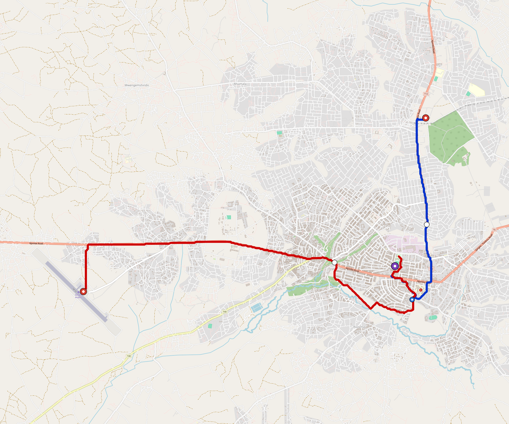

# Songea — Urban Rail Network

**Country:** TZ · **Population:** 250,000 · [National brief](../NATIONAL-BRIEF.md)

This page contains only Songea-specific results. Shared routing, service, energy, civil, cost, finance, QA and validation methods are defined once in the [deployment planning reference](../../../../../docs/deployment-planning-reference.md).

> [!IMPORTANT]
> **Foreign-capital advantage:** against the default equivalent foreign-turnkey sensitivity, this local plan avoids **$205 M (87.9%) of external capital** and **$257 M of external interest**. Capital plus saved interest totals **$462 M**. See the common reference for interpretation and limitations.

Auto-planned by the OpenSourceRail design pipeline from the controlled city catalogue, source-locked geospatial inputs and shared templates.

## Network



| Local measure | Value |
|---|---:|
| Lines / unique stations / interchanges | 2 / 7 / 1 |
| Route length | 16.8 km double track |
| Coverage / transfer reachability | 80.3% / 100% |
| Estimated station catchment | 200,750 residents |
| Service span / peak headway | 05:30–02:00 / 3 min |
| Fleet | 37 × 2-car `tram-2car` trainsets (32 peak revenue) |
| Peak network throughput | 19,200 passengers/hour |
| Practical service capacity | 178,560 passenger-trips/day |
| Annual paid-trip planning range | 32.6–52.1 M |

### Lines

| Line | Length | Stations | Trainsets | Termini |
|---|---:|---:|---:|---|
| line-1 |  5.7 km | 3 | 13 | SE Inner ↔ NE Mid |
| line-2 | 11.1 km | 4 | 24 | W Outer ↔ E Inner |
| **Total** | **16.8 km** | **7 unique** | **37** | |

## Energy

| Local measure | Value |
|---|---:|
| Scheduled service | 930 one-way journeys / 7,818 train-km/day |
| Annual traction demand | 24.7 GWh |
| Station/depot PV / storage | 6.8 MW / 43.0 MWh |
| Aggregate charging power | 3.5 MW |
| Dedicated solar plant | 8.4 MW |
| Residual grid/PPA import | 0.0 GWh/yr |
| Worst powered-stop gap | line-2: 6.8 km / 34 kWh |
| Lowest traversal charging margin | line-1: 34 kWh |

## Capital And Funding

| Local CAPEX bucket | Planning value |
|---|---:|
| Civil works | $56 M |
| Stations | $28 M |
| Depots | $8.0 M |
| Rolling stock | $21 M |
| Dedicated solar plant | $6.7 M |
| Residual train control | $841 k |
| Charging microgrids | $850 k |
| EPC / project services | $8.0 M |
| **Total city programme** | **$130 M** |

| Local funding measure | Planning value |
|---|---:|
| Imported / external capital | $28 M (21.8%) |
| Domestic / local capital | $101 M (78.2%) |
| Annual public construction commitment | $12 M / yr for 7 years |
| Annual post-grace debt service | $9.8 M / yr |
| External capital saved vs default turnkey sensitivity | $205 M |
| Capital + lifetime external interest saved | $462 M |
| Annual OPEX | $3.2 M / yr |

## Local Evidence

| Package | Current status | Evidence |
|---|---|---|
| Finance | pass | [`summary.json`](engineering/finance/summary.json) |
| Native simulation + degraded cases | pass | [`validation-summary.json`](engineering/simulation/validation-summary.json) |
| SUMO timetable | pass | [`summary.json`](engineering/sumo/summary.json) |
| GIS package | pass | [`summary.json`](engineering/gis/summary.json) |
| Grid/charging/solar | pass | [`summary.json`](engineering/energy/summary.json) |
| Operations, QA and maintenance | 82 assets / 366 tasks | [`songea-operations-manifest.json`](operations/songea-operations-manifest.json) |

## Local Files And Regeneration

| File | Local role |
|---|---|
| [`design.toml`](design.toml) | Authoritative generated city design |
| [`songea.toml`](songea.toml) | Expanded simulator scenario |
| [`songea.corridor.geojson`](songea.corridor.geojson) | GIS corridor and stations |
| [`songea.design-quality.yaml`](songea.design-quality.yaml) | Coverage, source and civil-quality gates |

```bash
tools/automation/regenerate-city.sh songea
```
