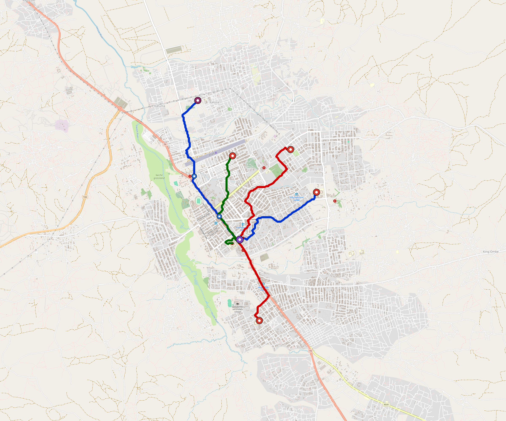

# Sumbawanga — Urban Rail Network

**Country:** TZ · **Population:** 250,000 · [National brief](../NATIONAL-BRIEF.md)

This page contains only Sumbawanga-specific results. Shared routing, service, energy, civil, cost, finance, QA and validation methods are defined once in the [deployment planning reference](../../../../../docs/deployment-planning-reference.md).

> [!IMPORTANT]
> **Foreign-capital advantage:** against the default equivalent foreign-turnkey sensitivity, this local plan avoids **$217 M (88.0%) of external capital** and **$272 M of external interest**. Capital plus saved interest totals **$490 M**. See the common reference for interpretation and limitations.

Auto-planned by the OpenSourceRail design pipeline from the controlled city catalogue, source-locked geospatial inputs and shared templates.

## Network



| Local measure | Value |
|---|---:|
| Lines / unique stations / interchanges | 3 / 10 / 1 |
| Route length | 15.7 km double track |
| Coverage / transfer reachability | 77.2% / 100% |
| Estimated station catchment | 193,000 residents |
| Service span / peak headway | 05:30–02:00 / 3 min |
| Fleet | 40 × 2-car `tram-2car` trainsets (34 peak revenue) |
| Peak network throughput | 28,800 passengers/hour |
| Practical service capacity | 267,840 passenger-trips/day |
| Annual paid-trip planning range | 48.9–78.2 M |

### Lines

| Line | Length | Stations | Trainsets | Termini |
|---|---:|---:|---:|---|
| line-1 |  6.6 km | 4 | 16 | E Mid ↔ NW Outer |
| line-2 |  5.7 km | 3 | 13 | S Outer ↔ NE Mid |
| line-3 |  3.3 km | 3 | 11 | N Mid ↔ S Mid |
| **Total** | **15.7 km** | **10 unique** | **40** | |

## Energy

| Local measure | Value |
|---|---:|
| Scheduled service | 1,395 one-way journeys / 7,285 train-km/day |
| Annual traction demand | 23.0 GWh |
| Station/depot PV / storage | 7.7 MW / 44.5 MWh |
| Aggregate charging power | 5.0 MW |
| Dedicated solar plant | 2.3 MW |
| Residual grid/PPA import | 0.0 GWh/yr |
| Worst powered-stop gap | line-2: 3.4 km / 19 kWh |
| Lowest traversal charging margin | line-2: 30 kWh |

## Capital And Funding

| Local CAPEX bucket | Planning value |
|---|---:|
| Civil works | $42 M |
| Stations | $52 M |
| Depots | $8.0 M |
| Rolling stock | $22 M |
| Dedicated solar plant | $1.8 M |
| Residual train control | $783 k |
| Charging microgrids | $1.1 M |
| EPC / project services | $8.9 M |
| **Total city programme** | **$137 M** |

| Local funding measure | Planning value |
|---|---:|
| Imported / external capital | $30 M (21.6%) |
| Domestic / local capital | $108 M (78.4%) |
| Annual public construction commitment | $13 M / yr for 7 years |
| Annual post-grace debt service | $10 M / yr |
| External capital saved vs default turnkey sensitivity | $217 M |
| Capital + lifetime external interest saved | $490 M |
| Annual OPEX | $3.5 M / yr |

## Local Evidence

**Evidence refresh required.** Retained passing results below are unverified.
The strict README generator rejected the evidence: engineering/simulation/validation-summary.json describes scenario SHA-256 46cf2bdff2ff20599d2dbd5b60ea5b0bb2f51adebbd8b0042a9196a06e6febbe, but sumbawanga.toml is 38ec94e6031731af08d1004cae22ae1d47b028688e70ad7d8ce17a1ec5fd95b4; rerun and update the validation evidence. This audit view does not accept or replace the retained solver results.

| Package | Current status | Evidence |
|---|---|---|
| Finance | unverified | [`summary.json`](engineering/finance/summary.json) |
| Native simulation + degraded cases | unverified | [`validation-summary.json`](engineering/simulation/validation-summary.json) |
| SUMO timetable | unverified | [`summary.json`](engineering/sumo/summary.json) |
| Independent OSR/SUMO running-time cross-check | unverified; junction/authority gate open | [`operations-crosscheck.md`](engineering/simulation/operations-crosscheck.md) |
| GIS package | unverified | [`summary.json`](engineering/gis/summary.json) |
| Solar/storage snapshot (operating duty unverified) | unverified; 0 findings; 0 grid-only diagnostics | [`summary.json`](engineering/energy/summary.json) |
| Operations, QA and maintenance | 99 assets / 535 tasks | [`sumbawanga-operations-manifest.json`](operations/sumbawanga-operations-manifest.json) |

## Local Files And Regeneration

| File | Local role |
|---|---|
| [`design.toml`](design.toml) | Authoritative generated city design |
| [`sumbawanga.toml`](sumbawanga.toml) | Expanded simulator scenario |
| [`sumbawanga.corridor.geojson`](sumbawanga.corridor.geojson) | GIS corridor and stations |
| [`sumbawanga.design-quality.yaml`](sumbawanga.design-quality.yaml) | Coverage, source and civil-quality gates |

```bash
tools/automation/regenerate-city.sh sumbawanga
```
