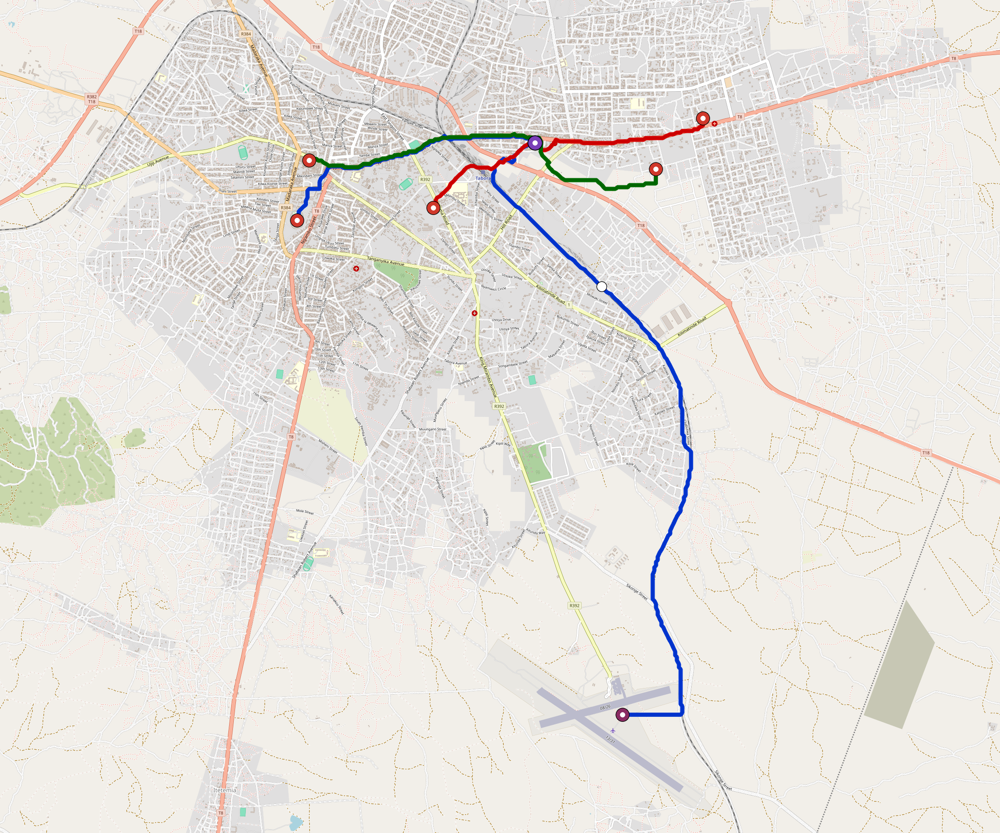

# Tabora — Urban Rail Network

**Country:** TZ · **Population:** 300,000 · [National brief](../NATIONAL-BRIEF.md)

This page contains only Tabora-specific results. Shared routing, service, energy, civil, cost, finance, QA and validation methods are defined once in the [deployment planning reference](../../../../../docs/deployment-planning-reference.md).

> [!IMPORTANT]
> **Foreign-capital advantage:** against the default equivalent foreign-turnkey sensitivity, this local plan avoids **$300 M (88.2%) of external capital** and **$376 M of external interest**. Capital plus saved interest totals **$675 M**. See the common reference for interpretation and limitations.

Auto-planned by the OpenSourceRail design pipeline from the controlled city catalogue, source-locked geospatial inputs and shared templates.

## Network



| Local measure | Value |
|---|---:|
| Lines / unique stations / interchanges | 3 / 10 / 1 |
| Route length | 21.1 km double track |
| Coverage / transfer reachability | 64.8% / 100% |
| Estimated station catchment | 194,400 residents |
| Service span / peak headway | 05:30–02:00 / 3 min |
| Fleet | 49 × 2-car `tram-2car` trainsets (42 peak revenue) |
| Peak network throughput | 28,800 passengers/hour |
| Practical service capacity | 267,840 passenger-trips/day |
| Annual paid-trip planning range | 48.9–78.2 M |

### Lines

| Line | Length | Stations | Trainsets | Termini |
|---|---:|---:|---:|---|
| line-1 | 12.3 km | 4 | 25 | W Mid ↔ S Outer |
| line-2 |  3.9 km | 3 | 12 | W Inner ↔ NE Mid |
| line-3 |  4.9 km | 3 | 12 | W Mid ↔ NE Inner |
| **Total** | **21.1 km** | **10 unique** | **49** | |

## Energy

| Local measure | Value |
|---|---:|
| Scheduled service | 1,395 one-way journeys / 9,835 train-km/day |
| Annual traction demand | 31.0 GWh |
| Station/depot PV / storage | 7.7 MW / 44.5 MWh |
| Aggregate charging power | 5.0 MW |
| Dedicated solar plant | 6.2 MW |
| Residual grid/PPA import | 0.0 GWh/yr |
| Worst powered-stop gap | line-1: 6.3 km / 35 kWh |
| Lowest traversal charging margin | line-1: 31 kWh |

## Capital And Funding

| Local CAPEX bucket | Planning value |
|---|---:|
| Civil works | $68 M |
| Stations | $66 M |
| Depots | $8.0 M |
| Rolling stock | $27 M |
| Dedicated solar plant | $4.9 M |
| Residual train control | $1.1 M |
| Charging microgrids | $1.2 M |
| EPC / project services | $12 M |
| **Total city programme** | **$189 M** |

| Local funding measure | Planning value |
|---|---:|
| Imported / external capital | $40 M (21.2%) |
| Domestic / local capital | $149 M (78.8%) |
| Annual public construction commitment | $17 M / yr for 7 years |
| Annual post-grace debt service | $14 M / yr |
| External capital saved vs default turnkey sensitivity | $300 M |
| Capital + lifetime external interest saved | $675 M |
| Annual OPEX | $4.6 M / yr |

## Local Evidence

| Package | Current status | Evidence |
|---|---|---|
| Finance | pass | [`summary.json`](engineering/finance/summary.json) |
| Native simulation + degraded cases | pass | [`validation-summary.json`](engineering/simulation/validation-summary.json) |
| SUMO timetable | pass | [`summary.json`](engineering/sumo/summary.json) |
| GIS package | pass | [`summary.json`](engineering/gis/summary.json) |
| Grid/charging/solar | pass | [`summary.json`](engineering/energy/summary.json) |
| Operations, QA and maintenance | 111 assets / 494 tasks | [`tabora-operations-manifest.json`](operations/tabora-operations-manifest.json) |

## Local Files And Regeneration

| File | Local role |
|---|---|
| [`design.toml`](design.toml) | Authoritative generated city design |
| [`tabora.toml`](tabora.toml) | Expanded simulator scenario |
| [`tabora.corridor.geojson`](tabora.corridor.geojson) | GIS corridor and stations |
| [`tabora.design-quality.yaml`](tabora.design-quality.yaml) | Coverage, source and civil-quality gates |

```bash
tools/automation/regenerate-city.sh tabora
```
