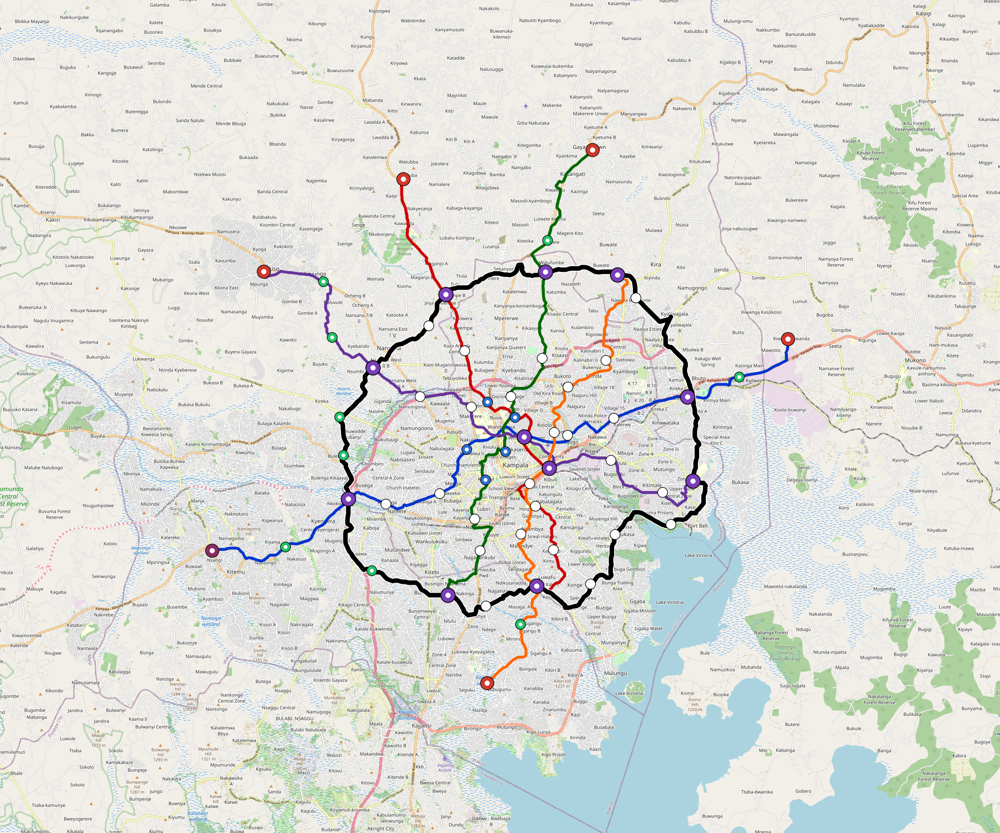

# Kampala — Urban Rail Network

**Country:** UG · **Population:** 1,875,000 · [National brief](../NATIONAL-BRIEF.md)

This page contains only Kampala-specific results. Shared routing, service, energy, civil, cost, finance, QA and validation methods are defined once in the [deployment planning reference](../../../../../docs/deployment-planning-reference.md).

> [!IMPORTANT]
> **Foreign-capital advantage:** against the default equivalent foreign-turnkey sensitivity, this local plan avoids **$2.84 bn (86.5%) of external capital** and **$3.56 bn of external interest**. Capital plus saved interest totals **$6.39 bn**. See the common reference for interpretation and limitations.

Auto-planned by the OpenSourceRail design pipeline from the controlled city catalogue, source-locked geospatial inputs and shared templates.

## Network



| Local measure | Value |
|---|---:|
| Lines / unique stations / interchanges | 6 / 70 / 11 |
| Route length | 221.6 km double track |
| Coverage / transfer reachability | 68.7% / 60% |
| Estimated station catchment | 1,288,125 residents |
| Service span / peak headway | 05:30–02:00 / 3 min |
| Fleet | 274 × 4-car `metro-4car` trainsets (245 peak revenue) |
| Peak network throughput | 115,200 passengers/hour |
| Practical service capacity | 982,080 passenger-trips/day |
| Annual paid-trip planning range | 179.2–286.8 M |

### Lines

| Line | Length | Stations | Trainsets | Termini |
|---|---:|---:|---:|---|
| line-1 | 36.1 km | 12 | 57 | E Outer ↔ W Outer |
| line-2 | 28.4 km | 10 | 45 | S Mid ↔ N Outer |
| line-3 | 31.6 km | 10 | 50 | S Mid ↔ N Outer |
| line-4 | 31.8 km | 11 | 51 | NW Outer ↔ E Mid |
| line-5 | 28.5 km | 9 | 45 | NE Mid ↔ S Outer |
| line-6 | 65.2 km | 18 | 26 | W Mid ↔ W Mid |
| **Total** | **221.6 km** | **70 unique** | **274** | |

## Energy

| Local measure | Value |
|---|---:|
| Scheduled service | 2,558 one-way journeys / 87,886 train-km/day |
| Annual traction demand | 554.3 GWh |
| Station/depot PV / storage | 23.0 MW / 130.0 MWh |
| Aggregate charging power | 91.5 MW |
| Dedicated solar plant | 337.4 MW |
| Residual grid/PPA import | 0.0 GWh/yr |
| Worst powered-stop gap | line-4: 9.8 km / 97 kWh |
| Lowest traversal charging margin | line-5: 202 kWh |

## Capital And Funding

| Local CAPEX bucket | Planning value |
|---|---:|
| Civil works | $727 M |
| Stations | $378 M |
| Depots | $8.0 M |
| Rolling stock | $307 M |
| Dedicated solar plant | $270 M |
| Residual train control | $11 M |
| Charging microgrids | $20 M |
| EPC / project services | $102 M |
| **Total city programme** | **$1.82 bn** |

| Local funding measure | Planning value |
|---|---:|
| Imported / external capital | $444 M (24.4%) |
| Domestic / local capital | $1.38 bn (75.6%) |
| Annual public construction commitment | $214 M / yr for 7 years |
| Annual post-grace debt service | $183 M / yr |
| External capital saved vs default turnkey sensitivity | $2.84 bn |
| Capital + lifetime external interest saved | $6.39 bn |
| Annual OPEX | $41 M / yr |

## Local Evidence

| Package | Current status | Evidence |
|---|---|---|
| Finance | pass | [`summary.json`](engineering/finance/summary.json) |
| Native simulation + degraded cases | pass | [`validation-summary.json`](engineering/simulation/validation-summary.json) |
| SUMO timetable | pass | [`summary.json`](engineering/sumo/summary.json) |
| GIS package | pass | [`summary.json`](engineering/gis/summary.json) |
| Grid/charging/solar | pass | [`summary.json`](engineering/energy/summary.json) |
| Operations, QA and maintenance | 669 assets / 2,975 tasks | [`kampala-operations-manifest.json`](operations/kampala-operations-manifest.json) |

## Local Files And Regeneration

| File | Local role |
|---|---|
| [`design.toml`](design.toml) | Authoritative generated city design |
| [`kampala.toml`](kampala.toml) | Expanded simulator scenario |
| [`kampala.corridor.geojson`](kampala.corridor.geojson) | GIS corridor and stations |
| [`kampala.design-quality.yaml`](kampala.design-quality.yaml) | Coverage, source and civil-quality gates |

```bash
tools/automation/regenerate-city.sh kampala
```
