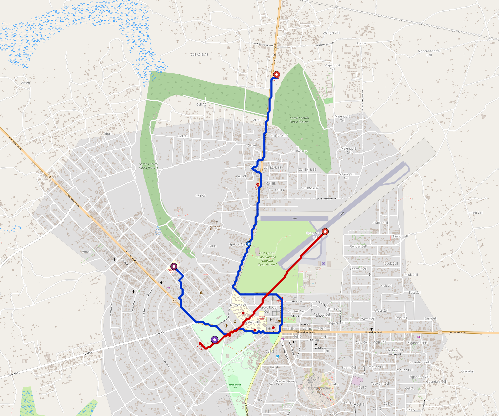

# Soroti — Urban Rail Network

**Country:** UG · **Population:** 200,000 · [National brief](../NATIONAL-BRIEF.md)

This page contains only Soroti-specific results. Shared routing, service, energy, civil, cost, finance, QA and validation methods are defined once in the [deployment planning reference](../../../../../docs/deployment-planning-reference.md).

> [!IMPORTANT]
> **Foreign-capital advantage:** against the default equivalent foreign-turnkey sensitivity, this local plan avoids **$154 M (88.5%) of external capital** and **$193 M of external interest**. Capital plus saved interest totals **$347 M**. See the common reference for interpretation and limitations.

Auto-planned by the OpenSourceRail design pipeline from the controlled city catalogue, source-locked geospatial inputs and shared templates.

## Network



| Local measure | Value |
|---|---:|
| Lines / unique stations / interchanges | 2 / 6 / 1 |
| Route length | 7.9 km double track |
| Coverage / transfer reachability | 69.0% / 100% |
| Estimated station catchment | 138,000 residents |
| Service span / peak headway | 05:30–02:00 / 3 min |
| Fleet | 23 × 2-car `tram-2car` trainsets (19 peak revenue) |
| Peak network throughput | 19,200 passengers/hour |
| Practical service capacity | 178,560 passenger-trips/day |
| Annual paid-trip planning range | 32.6–52.1 M |

### Lines

| Line | Length | Stations | Trainsets | Termini |
|---|---:|---:|---:|---|
| line-1 |  5.8 km | 4 | 15 | N Outer ↔ W Mid |
| line-2 |  2.1 km | 2 | 8 | SW Mid ↔ E Mid |
| **Total** | **7.9 km** | **6 unique** | **23** | |

## Energy

| Local measure | Value |
|---|---:|
| Scheduled service | 930 one-way journeys / 3,673 train-km/day |
| Annual traction demand | 11.6 GWh |
| Station/depot PV / storage | 6.5 MW / 42.5 MWh |
| Aggregate charging power | 3.0 MW |
| Dedicated solar plant | 0.1 MW |
| Residual grid/PPA import | 0.0 GWh/yr |
| Worst powered-stop gap | line-1: 2.3 km / 11 kWh |
| Lowest traversal charging margin | line-2: 37 kWh |

## Capital And Funding

| Local CAPEX bucket | Planning value |
|---|---:|
| Civil works | $33 M |
| Stations | $35 M |
| Depots | $8.0 M |
| Rolling stock | $13 M |
| Dedicated solar plant | $103 k |
| Residual train control | $395 k |
| Charging microgrids | $775 k |
| EPC / project services | $6.3 M |
| **Total city programme** | **$97 M** |

| Local funding measure | Planning value |
|---|---:|
| Imported / external capital | $20 M (20.7%) |
| Domestic / local capital | $77 M (79.3%) |
| Annual public construction commitment | $12 M / yr for 7 years |
| Annual post-grace debt service | $9.9 M / yr |
| External capital saved vs default turnkey sensitivity | $154 M |
| Capital + lifetime external interest saved | $347 M |
| Annual OPEX | $2.4 M / yr |

## Local Evidence

**Evidence refresh required.** Retained passing results below are unverified.
The strict README generator rejected the evidence: engineering/simulation/validation-summary.json describes scenario SHA-256 26428afc391daa30e20d4c9a79ef8e96665b78993043d14ada8a5ab92f15ca97, but soroti.toml is 464a1289642f4bf76e16f3d0a41a8d1426bd0be41ddd8b20e2e2ec976ac58c54; rerun and update the validation evidence. This audit view does not accept or replace the retained solver results.

| Package | Current status | Evidence |
|---|---|---|
| Finance | unverified | [`summary.json`](engineering/finance/summary.json) |
| Native simulation + degraded cases | unverified | [`validation-summary.json`](engineering/simulation/validation-summary.json) |
| SUMO timetable | unverified | [`summary.json`](engineering/sumo/summary.json) |
| Independent OSR/SUMO running-time cross-check | missing/fail; junction/authority gate open | not generated |
| GIS package | unverified | [`summary.json`](engineering/gis/summary.json) |
| Grid/charging/solar | unverified; 0 findings | [`summary.json`](engineering/energy/summary.json) |
| Operations, QA and maintenance | 61 assets / 251 tasks | [`soroti-operations-manifest.json`](operations/soroti-operations-manifest.json) |

## Local Files And Regeneration

| File | Local role |
|---|---|
| [`design.toml`](design.toml) | Authoritative generated city design |
| [`soroti.toml`](soroti.toml) | Expanded simulator scenario |
| [`soroti.corridor.geojson`](soroti.corridor.geojson) | GIS corridor and stations |
| [`soroti.design-quality.yaml`](soroti.design-quality.yaml) | Coverage, source and civil-quality gates |

```bash
tools/automation/regenerate-city.sh soroti
```
