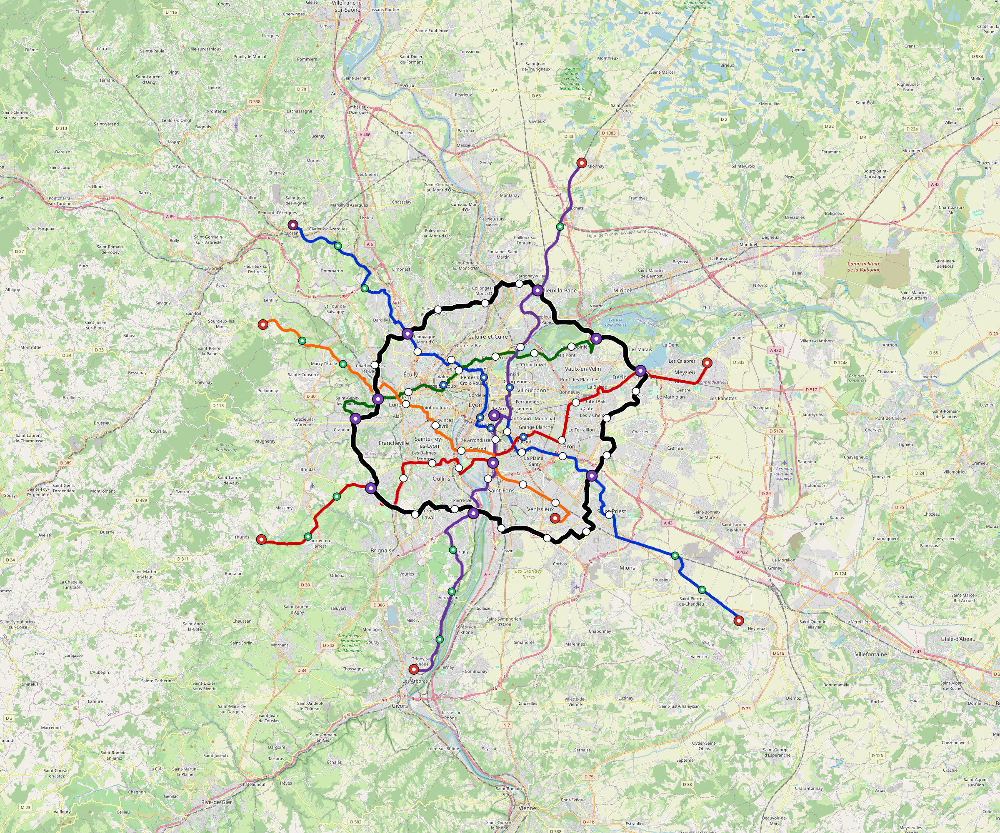

# Lyon — Urban Rail Network

**Country:** FR · **Population:** 1,436,354

This page contains only Lyon-specific results. Shared routing, service, energy, civil, cost, finance, QA and validation methods are defined once in the [deployment planning reference](../../../../../docs/deployment-planning-reference.md).

> [!NOTE]
> **Technical comparison only.** This model is retained for regression and
> engineering inspection. It is excluded from the developing-world programme,
> portfolio, national briefs, reader-book city evidence, and public examples.

Auto-planned by the OpenSourceRail design pipeline from the controlled city catalogue, source-locked geospatial inputs and shared templates.

## Network



| Local measure | Value |
|---|---:|
| Lines / unique stations / interchanges | 6 / 85 / 11 |
| Route length | 269.8 km double track |
| Coverage / transfer reachability | 53.5% / 53% |
| Estimated station catchment | 768,449 residents |
| Service span / peak headway | 05:30–02:00 / 3 min |
| Fleet | 347 × 4-car `metro-4car` trainsets (313 peak revenue) |
| Peak network throughput | 115,200 passengers/hour |
| Practical service capacity | 982,080 passenger-trips/day |
| Annual paid-trip planning range | 179.2–286.8 M |

### Lines

| Line | Length | Stations | Trainsets | Termini |
|---|---:|---:|---:|---|
| line-1 | 55.2 km | 18 | 87 | SE Outer ↔ NW Outer |
| line-2 | 43.6 km | 13 | 68 | SW Outer ↔ E Outer |
| line-3 | 24.0 km | 9 | 40 | NE Mid ↔ W Mid |
| line-4 | 45.6 km | 13 | 75 | S Outer ↔ N Outer |
| line-5 | 29.9 km | 11 | 48 | NW Outer ↔ SE Mid |
| line-6 | 71.7 km | 21 | 29 | NW Mid ↔ W Mid |
| **Total** | **269.8 km** | **85 unique** | **347** | |

## Energy

| Local measure | Value |
|---|---:|
| Scheduled service | 2,558 one-way journeys / 108,796 train-km/day |
| Annual traction demand | 686.2 GWh |
| Station/depot PV / storage | 26.6 MW / 148.0 MWh |
| Aggregate charging power | 109.5 MW |
| Dedicated solar plant | 484.2 MW |
| Residual grid/PPA import | 0.0 GWh/yr |
| Worst powered-stop gap | line-1: 14.3 km / 138 kWh |
| Lowest traversal charging margin | line-5: 175 kWh |

## Capital And Funding

| Local CAPEX bucket | Planning value |
|---|---:|
| Civil works | $878 M |
| Stations | $414 M |
| Depots | $8.0 M |
| Rolling stock | $389 M |
| Dedicated solar plant | $387 M |
| Residual train control | $13 M |
| Charging microgrids | $24 M |
| EPC / project services | $121 M |
| **Total city programme** | **$2.23 bn** |

| Local funding measure | Planning value |
|---|---:|
| Imported / external capital | $561 M (25.1%) |
| Domestic / local capital | $1.67 bn (74.9%) |
| Annual public construction commitment | $177 M / yr for 3 years |
| Annual post-grace debt service | $92 M / yr |
| External capital saved vs default turnkey sensitivity | $3.46 bn |
| Capital + lifetime external interest saved | $7.63 bn |
| Annual OPEX | $99 M / yr |

## Local Evidence

| Package | Current status | Evidence |
|---|---|---|
| Finance | pass | [`summary.json`](engineering/finance/summary.json) |
| Native simulation + degraded cases | pass | [`validation-summary.json`](engineering/simulation/validation-summary.json) |
| SUMO timetable | pass | [`summary.json`](engineering/sumo/summary.json) |
| GIS package | pass | [`summary.json`](engineering/gis/summary.json) |
| Grid/charging/solar | pass | [`summary.json`](engineering/energy/summary.json) |
| Operations, QA and maintenance | 824 assets / 3,712 tasks | [`lyon-operations-manifest.json`](operations/lyon-operations-manifest.json) |

## Local Files And Regeneration

| File | Local role |
|---|---|
| [`design.toml`](design.toml) | Authoritative generated city design |
| [`lyon.toml`](lyon.toml) | Expanded simulator scenario |
| [`lyon.corridor.geojson`](lyon.corridor.geojson) | GIS corridor and stations |
| [`lyon.design-quality.yaml`](lyon.design-quality.yaml) | Coverage, source and civil-quality gates |

```bash
tools/automation/regenerate-city.sh lyon
```
