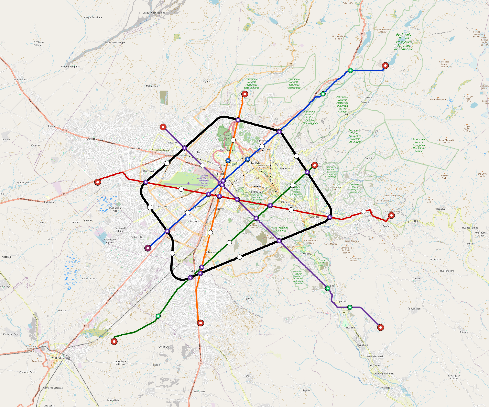

# La-Paz — Urban Rail Network

**Country:** BO · **Population:** 1,815,000 · [National brief](../NATIONAL-BRIEF.md)

This page contains only La-Paz-specific results. Shared routing, service, energy, civil, cost, finance, QA and validation methods are defined once in the [deployment planning reference](../../../../../docs/deployment-planning-reference.md).

> [!IMPORTANT]
> **Foreign-capital advantage:** against the default equivalent foreign-turnkey sensitivity, this local plan avoids **$10.08 bn (88.5%) of external capital** and **$12.39 bn of external interest**. Capital plus saved interest totals **$22.47 bn**. See the common reference for interpretation and limitations.

**Population-led network revision (2026-10-09).** The controlled planning inventory contains **24 lines**, including **18 additional residential lines**. **81.7%** of retained 2020 bbox residents are within a 1 km circle of the actual emitted station coordinates. The working target is 80%; remaining areas and station/access alternatives remain in the review. These are distance screens, not current census, surveyed walksheds or fare demand. New common corridor cells have identified junction/structure and access design requirements; no track switch or site approval is inferred. Country fleet, depot, civil, energy, staffing and financing models use the regenerated inventory, with installed quotations and operating acceptance still open. [Line additions and priorities](engineering/alignment/residential-line-expansion.json) · [Actual station coverage and source receipts](engineering/alignment/residential-expansion-evaluation.json).

**Current alignment, depot and production basis.** Core corridors change from **177.182 km to 243.416 km**, with elevated land sections, water-aware radial routes and separately engineered bridge candidates at short water crossings. 0 core fragments retain raster geometry for further curve review. The centre is a design-centroid screen; survey, property, obstacles, foundations and geometry releases remain open. All **227 platform points** pass the retained water-mask screen; footprints, bank stability and access remain open. [Alignment controls](engineering/alignment/core-realignment.json) · [Before/after map](engineering/alignment/core-alignment-comparison.png) · [Water screen](engineering/alignment/station-water-screen.json).

**24 line-local depots** provide **667 full-fleet storage slots**, separate from workshop bays. Fleet length and workload set quantities; PV/storage is included once in depot capital. Site acceptance and installed/land/utility quotations remain open. [Depot costs](engineering/line-depots/README.md). The factory requires **667 metro-4car trainsets / 2668 cars**, with **18-month facility readiness**, then qualification and manufacture. Integrated openings wait for fleet readiness where production or test paths constrain them. Shared factory capital is counted once; concurrent national loading and supplier commitments remain open. [Factory and dates](engineering/factory/README.md).

Station staffing uses two posts, two normal eight-hour shifts, plus service-window, leave and training cover. Basic wages start at 1.5 times the retained country income proxy, with higher technical/management grades and employer allowances. [Staff](engineering/delivery/README.md) · [Finance](engineering/finance/summary.json). Finance retains country-specific fixed-price, steady-state assumptions; Baghdad’s indexed cashflows are separate.

Auto-planned by the OpenSourceRail design pipeline from the controlled city catalogue, source-locked geospatial inputs and shared templates. Population is counted once within the union of station circles; this is potential radial access, not a verified walkshed or fare-demand estimate. Reachable line pairs include transfers through intermediate lines. [Population radii, denominator and transfer paths](engineering/access/README.md) · [Viaduct beam, foundation and terrain checks](engineering/clearance/README.md). Capital figures are base planning allowances: route-search scores are excluded from money, while special structures and installed-price gaps remain open. [Cost boundary](../../../../../docs/finance/civil-allowance-boundary.md).

## Network



| Local measure | Value |
|---|---:|
| Lines / unique stations / interchanges | 24 / 227 / 59 |
| Route length | 310.1 km double track |
| Direct transfers / reachable line pairs | 23.6% / 100.0% |
| Residents within 800 m radial station catchments | 1,228,805 (2020 raster; 65.3% of bbox) |
| Service span / peak headway | 05:30–02:00 / 3 min |
| Fleet | 667 × 4-car `metro-4car` trainsets (592 peak revenue) |
| Peak network throughput | 460,800 passengers/hour |
| Practical service capacity | 4,196,160 passenger-trips/day |
| Annual paid-trip planning range | 765.8–1225.3 M |

### Lines

| Line | Length | Stations | Trainsets | Termini |
|---|---:|---:|---:|---|
| line-1 | 30.5 km | 21 | 67 | NE Outer ↔ SW Mid |
| line-2 | 30.4 km | 20 | 69 | W Mid ↔ E Outer |
| line-3 | 27.9 km | 19 | 62 | NE Mid ↔ SW Outer |
| line-4 | 30.3 km | 19 | 62 | SE Outer ↔ NW Mid |
| line-5 | 23.1 km | 16 | 54 | S Mid ↔ N Mid |
| line-6 | 53.1 km | 36 | 31 | W Mid ↔ W Mid |
| line-7 |  4.2 km | 3 | 12 | NE Inner ↔ NE Inner |
| line-8 |  4.9 km | 5 | 16 | NW Inner ↔ W Mid |
| line-9 |  5.5 km | 7 | 21 | E Inner ↔ E Mid |
| line-10 |  5.0 km | 4 | 14 | SW Inner ↔ S Inner |
| line-11 |  4.5 km | 3 | 11 | E Mid ↔ E Mid |
| line-12 | 10.7 km | 7 | 26 | W Inner ↔ N Mid |
| line-13 |  4.2 km | 4 | 13 | SW Mid ↔ S Mid |
| line-14 |  4.6 km | 5 | 16 | NW Inner ↔ NW Mid |
| line-15 |  4.0 km | 3 | 12 | E Inner ↔ E Inner |
| line-16 |  5.1 km | 5 | 17 | SW Mid ↔ S Mid |
| line-17 |  7.6 km | 6 | 18 | W Inner ↔ SW Mid |
| line-18 |  5.0 km | 5 | 16 | NE Inner ↔ N Mid |
| line-19 |  4.4 km | 3 | 11 | W Mid ↔ NW Mid |
| line-20 | 12.4 km | 11 | 36 | NW Inner ↔ SW Inner |
| line-21 |  6.2 km | 7 | 21 | E Mid ↔ SE Mid |
| line-22 |  7.2 km | 5 | 16 | W Mid ↔ NW Mid |
| line-23 |  9.8 km | 7 | 23 | SW Mid ↔ W Inner |
| line-24 |  9.5 km | 6 | 23 | S Inner ↔ NW Inner |
| **Total** | **310.1 km** | **227 unique** | **667** | |

## Energy

| Local measure | Value |
|---|---:|
| Scheduled service | 10,928 one-way journeys / 131,832 train-km/day |
| Annual traction demand | 831.5 GWh |
| Station/depot PV / storage | 173.4 MW / 1,227.0 MWh |
| Aggregate charging power | 303.0 MW |
| Dedicated solar plant | 324.5 MW |
| Residual grid/PPA import | 0.0 GWh/yr |
| Worst powered-stop gap | line-1: 12.9 km / 124 kWh |
| Lowest traversal charging margin | line-11: 100 kWh |

## Capital And Funding

| Local CAPEX bucket | Planning value |
|---|---:|
| Civil works | $3.07 bn |
| Stations | $1.37 bn |
| Depots | $408 M |
| Rolling stock | $747 M |
| Dedicated solar plant | $260 M |
| Residual train control | $16 M |
| Charging microgrids | $62 M |
| EPC / project services | $397 M |
| **Total city programme** | **$6.32 bn** |

| Local funding measure | Planning value |
|---|---:|
| Imported / external capital | $1.31 bn (20.7%) |
| Domestic / local capital | $5.02 bn (79.3%) |
| Annual public construction commitment | $681 M / yr for 5 years |
| Annual post-grace debt service | $509 M / yr |
| External capital saved vs default turnkey sensitivity | $10.08 bn |
| Capital + lifetime external interest saved | $22.47 bn |
| Annual OPEX | $165 M / yr |

## Local Evidence

| Package | Current status | Evidence |
|---|---|---|
| Finance | pass | [`summary.json`](engineering/finance/summary.json) |
| Native simulation + degraded cases | pass | [`validation-summary.json`](engineering/simulation/validation-summary.json) |
| SUMO timetable | pass | [`summary.json`](engineering/sumo/summary.json) |
| Independent OSR/SUMO running-time cross-check | pass; junction/authority gate open | [`operations-crosscheck.md`](engineering/simulation/operations-crosscheck.md) |
| GIS package | pass | [`summary.json`](engineering/gis/summary.json) |
| Solar/storage snapshot (operating duty unverified) | pass; 0 findings; 24 grid-only diagnostics | [`summary.json`](engineering/energy/summary.json) |
| Operations, QA and maintenance | 1,925 assets / 10,016 tasks | [`la-paz-operations-manifest.json`](operations/la-paz-operations-manifest.json) |

## Local Files And Regeneration

| File | Local role |
|---|---|
| [`design.toml`](design.toml) | Authoritative generated city design |
| [`la-paz.toml`](la-paz.toml) | Expanded simulator scenario |
| [`la-paz.corridor.geojson`](la-paz.corridor.geojson) | GIS corridor and stations |
| [`la-paz.design-quality.yaml`](la-paz.design-quality.yaml) | Coverage, source and civil-quality gates |

```bash
tools/automation/regenerate-city.sh la-paz
```
