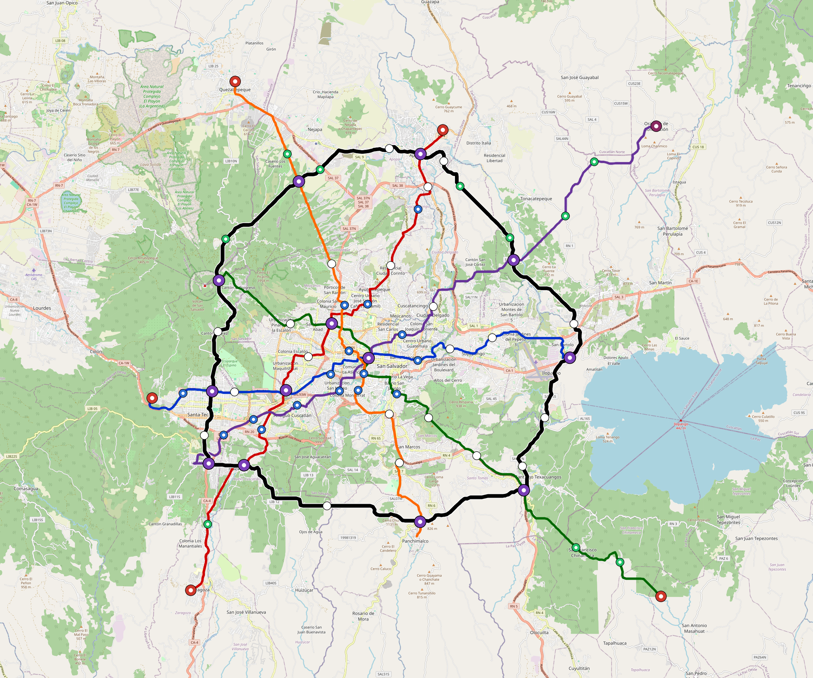

# San-Salvador — Urban Rail Network

**Country:** SV · **Population:** 1,800,000 · [National brief](../NATIONAL-BRIEF.md)

This page contains only San-Salvador-specific results. Shared routing, service, energy, civil, cost, finance, QA and validation methods are defined once in the [deployment planning reference](../../../../../docs/deployment-planning-reference.md).

> [!IMPORTANT]
> **Foreign-capital advantage:** against the default equivalent foreign-turnkey sensitivity, this local plan avoids **$3.29 bn (86.5%) of external capital** and **$4.05 bn of external interest**. Capital plus saved interest totals **$7.34 bn**. See the common reference for interpretation and limitations.

Auto-planned by the OpenSourceRail design pipeline from the controlled city catalogue, source-locked geospatial inputs and shared templates.

## Network



| Local measure | Value |
|---|---:|
| Lines / unique stations / interchanges | 6 / 81 / 13 |
| Route length | 256.6 km double track |
| Coverage / transfer reachability | 61.1% / 87% |
| Estimated station catchment | 1,099,800 residents |
| Service span / peak headway | 05:30–02:00 / 3 min |
| Fleet | 308 × 4-car `metro-4car` trainsets (277 peak revenue) |
| Peak network throughput | 115,200 passengers/hour |
| Practical service capacity | 982,080 passenger-trips/day |
| Annual paid-trip planning range | 179.2–286.8 M |

### Lines

| Line | Length | Stations | Trainsets | Termini |
|---|---:|---:|---:|---|
| line-1 | 30.2 km | 11 | 48 | W Mid ↔ E Mid |
| line-2 | 36.9 km | 13 | 57 | N Mid ↔ SW Outer |
| line-3 | 38.5 km | 12 | 59 | SE Outer ↔ NW Mid |
| line-4 | 40.4 km | 12 | 60 | SW Mid ↔ NE Outer |
| line-5 | 34.2 km | 11 | 54 | S Mid ↔ NW Outer |
| line-6 | 76.5 km | 22 | 30 | NW Mid ↔ NW Mid |
| **Total** | **256.6 km** | **81 unique** | **308** | |

## Energy

| Local measure | Value |
|---|---:|
| Scheduled service | 2,558 one-way journeys / 101,543 train-km/day |
| Annual traction demand | 640.5 GWh |
| Station/depot PV / storage | 26.0 MW / 145.0 MWh |
| Aggregate charging power | 106.5 MW |
| Dedicated solar plant | 390.5 MW |
| Residual grid/PPA import | 0.0 GWh/yr |
| Worst powered-stop gap | line-4: 12.9 km / 129 kWh |
| Lowest traversal charging margin | line-3: 215 kWh |

## Capital And Funding

| Local CAPEX bucket | Planning value |
|---|---:|
| Civil works | $832 M |
| Stations | $464 M |
| Depots | $8.0 M |
| Rolling stock | $345 M |
| Dedicated solar plant | $312 M |
| Residual train control | $13 M |
| Charging microgrids | $24 M |
| EPC / project services | $118 M |
| **Total city programme** | **$2.12 bn** |

| Local funding measure | Planning value |
|---|---:|
| Imported / external capital | $514 M (24.3%) |
| Domestic / local capital | $1.60 bn (75.7%) |
| Annual public construction commitment | $234 M / yr for 5 years |
| Annual post-grace debt service | $180 M / yr |
| External capital saved vs default turnkey sensitivity | $3.29 bn |
| Capital + lifetime external interest saved | $7.34 bn |
| Annual OPEX | $51 M / yr |

## Local Evidence

**Evidence refresh required.** Retained passing results below are unverified.
The strict README generator rejected the evidence: engineering/simulation/validation-summary.json describes scenario SHA-256 21c6a6d9b0cb7229062b6494607d1392940ea64f6f163bdc023246845332fed6, but san-salvador.toml is faac8273b46b7c31da932d79322d1ec916dae08b8ab61f1f44c8bb7e7d1808ec; rerun and update the validation evidence. This audit view does not accept or replace the retained solver results.

| Package | Current status | Evidence |
|---|---|---|
| Finance | unverified | [`summary.json`](engineering/finance/summary.json) |
| Native simulation + degraded cases | unverified | [`validation-summary.json`](engineering/simulation/validation-summary.json) |
| SUMO timetable | unverified | [`summary.json`](engineering/sumo/summary.json) |
| Independent OSR/SUMO running-time cross-check | unverified; junction/authority gate open | [`operations-crosscheck.md`](engineering/simulation/operations-crosscheck.md) |
| GIS package | unverified | [`summary.json`](engineering/gis/summary.json) |
| Solar/storage snapshot (operating duty unverified) | unverified; 0 findings; 21 grid-only diagnostics | [`summary.json`](engineering/energy/summary.json) |
| Operations, QA and maintenance | 764 assets / 3,382 tasks | [`san-salvador-operations-manifest.json`](operations/san-salvador-operations-manifest.json) |

## Local Files And Regeneration

| File | Local role |
|---|---|
| [`design.toml`](design.toml) | Authoritative generated city design |
| [`san-salvador.toml`](san-salvador.toml) | Expanded simulator scenario |
| [`san-salvador.corridor.geojson`](san-salvador.corridor.geojson) | GIS corridor and stations |
| [`san-salvador.design-quality.yaml`](san-salvador.design-quality.yaml) | Coverage, source and civil-quality gates |

```bash
tools/automation/regenerate-city.sh san-salvador
```
