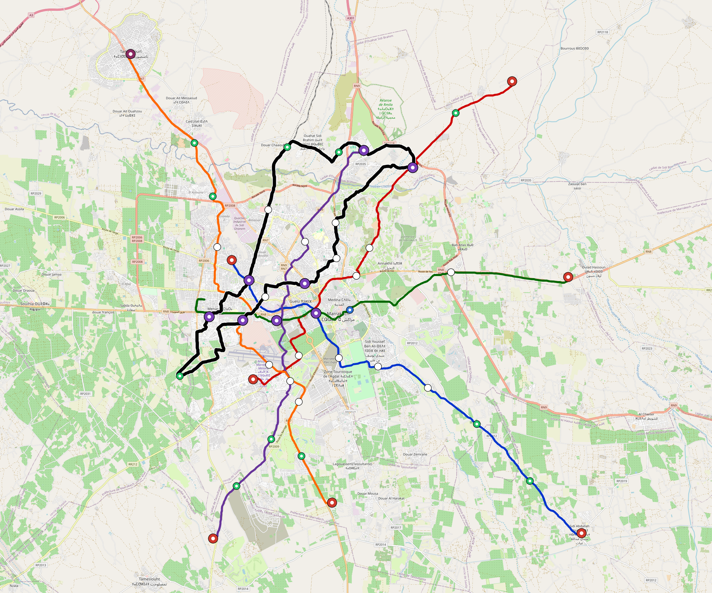

# Marrakech — Urban Rail Network

**Country:** MA · **Population:** 1,200,000 · [National brief](../NATIONAL-BRIEF.md)

This page contains only Marrakech-specific results. Shared routing, service, energy, civil, cost, finance, QA and validation methods are defined once in the [deployment planning reference](../../../../../docs/deployment-planning-reference.md).

> [!IMPORTANT]
> **Foreign-capital advantage:** against the default equivalent foreign-turnkey sensitivity, this local plan avoids **$2.41 bn (86.7%) of external capital** and **$2.97 bn of external interest**. Capital plus saved interest totals **$5.38 bn**. See the common reference for interpretation and limitations.

Auto-planned by the OpenSourceRail design pipeline from the controlled city catalogue, source-locked geospatial inputs and shared templates.

## Network



| Local measure | Value |
|---|---:|
| Lines / unique stations / interchanges | 6 / 57 / 8 |
| Route length | 194.1 km double track |
| Coverage / transfer reachability | 59.3% / 80% |
| Estimated station catchment | 711,600 residents |
| Service span / peak headway | 05:30–02:00 / 3 min |
| Fleet | 255 × 4-car `metro-4car` trainsets (229 peak revenue) |
| Peak network throughput | 115,200 passengers/hour |
| Practical service capacity | 982,080 passenger-trips/day |
| Annual paid-trip planning range | 179.2–286.8 M |

### Lines

| Line | Length | Stations | Trainsets | Termini |
|---|---:|---:|---:|---|
| line-1 | 29.2 km | 10 | 49 | NW Inner ↔ SE Outer |
| line-2 | 27.2 km | 9 | 46 | NE Outer ↔ SW Inner |
| line-3 | 26.4 km | 7 | 41 | W Inner ↔ E Outer |
| line-4 | 27.2 km | 8 | 45 | SW Outer ↔ N Mid |
| line-5 | 34.0 km | 9 | 54 | S Mid ↔ NW Outer |
| line-6 | 50.1 km | 14 | 20 | W Inner ↔ W Inner |
| **Total** | **194.1 km** | **57 unique** | **255** | |

## Energy

| Local measure | Value |
|---|---:|
| Scheduled service | 2,558 one-way journeys / 78,622 train-km/day |
| Annual traction demand | 495.9 GWh |
| Station/depot PV / storage | 18.5 MW / 107.5 MWh |
| Aggregate charging power | 69.0 MW |
| Dedicated solar plant | 239.1 MW |
| Residual grid/PPA import | 0.0 GWh/yr |
| Worst powered-stop gap | line-5: 13.7 km / 147 kWh |
| Lowest traversal charging margin | line-4: 119 kWh |

## Capital And Funding

| Local CAPEX bucket | Planning value |
|---|---:|
| Civil works | $624 M |
| Stations | $325 M |
| Depots | $8.0 M |
| Rolling stock | $286 M |
| Dedicated solar plant | $191 M |
| Residual train control | $9.7 M |
| Charging microgrids | $16 M |
| EPC / project services | $89 M |
| **Total city programme** | **$1.55 bn** |

| Local funding measure | Planning value |
|---|---:|
| Imported / external capital | $371 M (24.0%) |
| Domestic / local capital | $1.18 bn (76.0%) |
| Annual public construction commitment | $106 M / yr for 5 years |
| Annual post-grace debt service | $75 M / yr |
| External capital saved vs default turnkey sensitivity | $2.41 bn |
| Capital + lifetime external interest saved | $5.38 bn |
| Annual OPEX | $40 M / yr |

## Local Evidence

**Evidence refresh required.** Retained passing results below are unverified.
The strict README generator rejected the evidence: engineering/simulation/validation-summary.json describes scenario SHA-256 4779088d8f03e7321e6da8d4234f5dca2e6387005e4ef436b3d06a0f9cdf92ab, but marrakech.toml is fbf5986e875985a859a3ab96cc87cb5d8c5fb1278451982eb3825c8dc2ddf7ca; rerun and update the validation evidence. This audit view does not accept or replace the retained solver results.

| Package | Current status | Evidence |
|---|---|---|
| Finance | unverified | [`summary.json`](engineering/finance/summary.json) |
| Native simulation + degraded cases | unverified | [`validation-summary.json`](engineering/simulation/validation-summary.json) |
| SUMO timetable | unverified | [`summary.json`](engineering/sumo/summary.json) |
| Independent OSR/SUMO running-time cross-check | missing/fail; junction/authority gate open | not generated |
| GIS package | unverified | [`summary.json`](engineering/gis/summary.json) |
| Solar/storage snapshot (operating duty unverified) | unverified; 0 findings; 16 grid-only diagnostics | [`summary.json`](engineering/energy/summary.json) |
| Operations, QA and maintenance | 577 assets / 2,635 tasks | [`marrakech-operations-manifest.json`](operations/marrakech-operations-manifest.json) |

## Local Files And Regeneration

| File | Local role |
|---|---|
| [`design.toml`](design.toml) | Authoritative generated city design |
| [`marrakech.toml`](marrakech.toml) | Expanded simulator scenario |
| [`marrakech.corridor.geojson`](marrakech.corridor.geojson) | GIS corridor and stations |
| [`marrakech.design-quality.yaml`](marrakech.design-quality.yaml) | Coverage, source and civil-quality gates |

```bash
tools/automation/regenerate-city.sh marrakech
```
