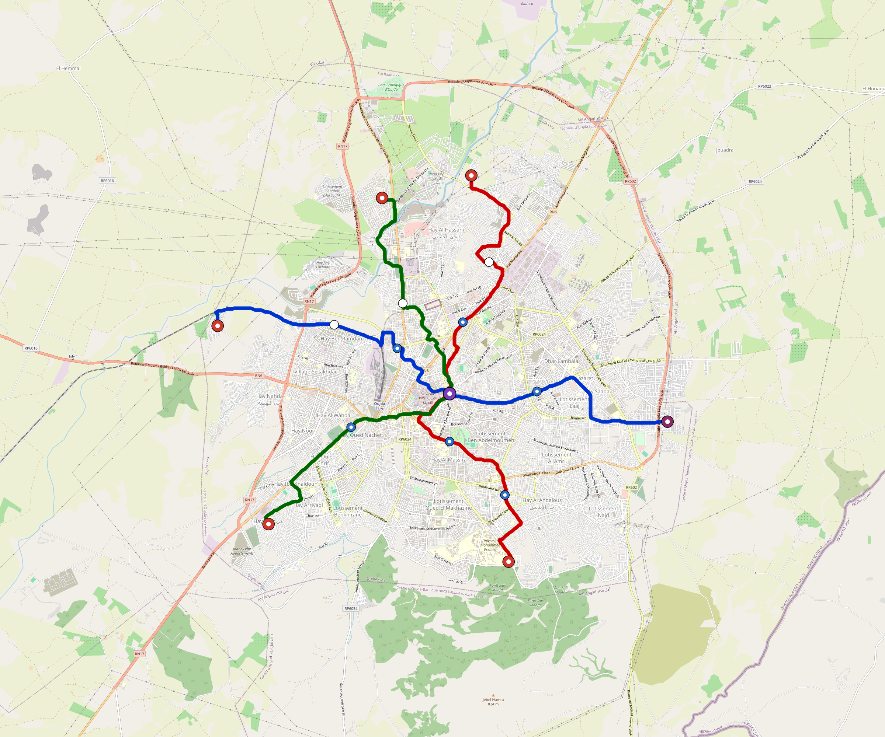

# Oujda — Urban Rail Network

**Country:** MA · **Population:** 600,000 · [National brief](../NATIONAL-BRIEF.md)

This page contains only Oujda-specific results. Shared routing, service, energy, civil, cost, finance, QA and validation methods are defined once in the [deployment planning reference](../../../../../docs/deployment-planning-reference.md).

> [!IMPORTANT]
> **Foreign-capital advantage:** against the default equivalent foreign-turnkey sensitivity, this local plan avoids **$531 M (86.9%) of external capital** and **$653 M of external interest**. Capital plus saved interest totals **$1.18 bn**. See the common reference for interpretation and limitations.

Auto-planned by the OpenSourceRail design pipeline from the controlled city catalogue, source-locked geospatial inputs and shared templates.

## Network



| Local measure | Value |
|---|---:|
| Lines / unique stations / interchanges | 3 / 18 / 1 |
| Route length | 37.5 km double track |
| Coverage / transfer reachability | 42.6% / 100% |
| Estimated station catchment | 255,600 residents |
| Service span / peak headway | 05:30–02:00 / 3 min |
| Fleet | 81 × 3-car `light-metro-3car` trainsets (72 peak revenue) |
| Peak network throughput | 43,200 passengers/hour |
| Practical service capacity | 401,760 passenger-trips/day |
| Annual paid-trip planning range | 73.3–117.3 M |

### Lines

| Line | Length | Stations | Trainsets | Termini |
|---|---:|---:|---:|---|
| line-1 | 13.0 km | 6 | 28 | W Outer ↔ E Outer |
| line-2 | 12.8 km | 7 | 27 | N Outer ↔ S Outer |
| line-3 | 11.7 km | 5 | 26 | N Outer ↔ SW Outer |
| **Total** | **37.5 km** | **18 unique** | **81** | |

## Energy

| Local measure | Value |
|---|---:|
| Scheduled service | 1,395 one-way journeys / 17,437 train-km/day |
| Annual traction demand | 82.5 GWh |
| Station/depot PV / storage | 10.1 MW / 48.5 MWh |
| Aggregate charging power | 9.0 MW |
| Dedicated solar plant | 31.7 MW |
| Residual grid/PPA import | 0.0 GWh/yr |
| Worst powered-stop gap | line-1: 3.7 km / 30 kWh |
| Lowest traversal charging margin | line-2: 37 kWh |

## Capital And Funding

| Local CAPEX bucket | Planning value |
|---|---:|
| Civil works | $111 M |
| Stations | $98 M |
| Depots | $8.0 M |
| Rolling stock | $73 M |
| Dedicated solar plant | $25 M |
| Residual train control | $1.9 M |
| Charging microgrids | $2.0 M |
| EPC / project services | $21 M |
| **Total city programme** | **$339 M** |

| Local funding measure | Planning value |
|---|---:|
| Imported / external capital | $80 M (23.6%) |
| Domestic / local capital | $259 M (76.4%) |
| Annual public construction commitment | $23 M / yr for 5 years |
| Annual post-grace debt service | $16 M / yr |
| External capital saved vs default turnkey sensitivity | $531 M |
| Capital + lifetime external interest saved | $1.18 bn |
| Annual OPEX | $9.7 M / yr |

## Local Evidence

**Evidence refresh required.** Retained passing results below are unverified.
The strict README generator rejected the evidence: engineering/simulation/validation-summary.json describes scenario SHA-256 27183629a8e5d64a3f26099671bdc33fa08db82aa7075aa2e58d578f1eb4c8be, but oujda.toml is bc5a9216a85593261826da7f02f5a4a4a798ca99342793dc1e9087d5de1f3a3c; rerun and update the validation evidence. This audit view does not accept or replace the retained solver results.

| Package | Current status | Evidence |
|---|---|---|
| Finance | unverified | [`summary.json`](engineering/finance/summary.json) |
| Native simulation + degraded cases | unverified | [`validation-summary.json`](engineering/simulation/validation-summary.json) |
| SUMO timetable | unverified | [`summary.json`](engineering/sumo/summary.json) |
| Independent OSR/SUMO running-time cross-check | unverified; junction/authority gate open | [`operations-crosscheck.md`](engineering/simulation/operations-crosscheck.md) |
| GIS package | unverified | [`summary.json`](engineering/gis/summary.json) |
| Solar/storage snapshot (operating duty unverified) | unverified; 0 findings; 3 grid-only diagnostics | [`summary.json`](engineering/energy/summary.json) |
| Operations, QA and maintenance | 188 assets / 843 tasks | [`oujda-operations-manifest.json`](operations/oujda-operations-manifest.json) |

## Local Files And Regeneration

| File | Local role |
|---|---|
| [`design.toml`](design.toml) | Authoritative generated city design |
| [`oujda.toml`](oujda.toml) | Expanded simulator scenario |
| [`oujda.corridor.geojson`](oujda.corridor.geojson) | GIS corridor and stations |
| [`oujda.design-quality.yaml`](oujda.design-quality.yaml) | Coverage, source and civil-quality gates |

```bash
tools/automation/regenerate-city.sh oujda
```
