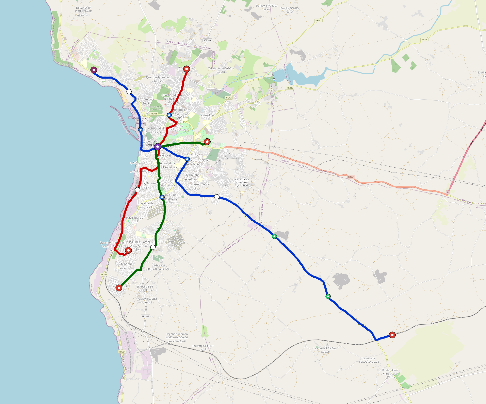

# Safi — Urban Rail Network

**Country:** MA · **Population:** 350,000 · [National brief](../NATIONAL-BRIEF.md)

This page contains only Safi-specific results. Shared routing, service, energy, civil, cost, finance, QA and validation methods are defined once in the [deployment planning reference](../../../../../docs/deployment-planning-reference.md).

> [!IMPORTANT]
> **Foreign-capital advantage:** against the default equivalent foreign-turnkey sensitivity, this local plan avoids **$542 M (86.7%) of external capital** and **$666 M of external interest**. Capital plus saved interest totals **$1.21 bn**. See the common reference for interpretation and limitations.

Auto-planned by the OpenSourceRail design pipeline from the controlled city catalogue, source-locked geospatial inputs and shared templates.

## Network



| Local measure | Value |
|---|---:|
| Lines / unique stations / interchanges | 3 / 19 / 1 |
| Route length | 39.3 km double track |
| Coverage / transfer reachability | 72.5% / 100% |
| Estimated station catchment | 253,750 residents |
| Service span / peak headway | 05:30–02:00 / 3 min |
| Fleet | 86 × 3-car `light-metro-3car` trainsets (77 peak revenue) |
| Peak network throughput | 43,200 passengers/hour |
| Practical service capacity | 401,760 passenger-trips/day |
| Annual paid-trip planning range | 73.3–117.3 M |

### Lines

| Line | Length | Stations | Trainsets | Termini |
|---|---:|---:|---:|---|
| line-1 | 19.8 km | 9 | 43 | SE Outer ↔ NW Mid |
| line-2 | 10.4 km | 5 | 23 | N Mid ↔ SW Mid |
| line-3 |  9.1 km | 5 | 20 | NE Inner ↔ SW Mid |
| **Total** | **39.3 km** | **19 unique** | **86** | |

## Energy

| Local measure | Value |
|---|---:|
| Scheduled service | 1,395 one-way journeys / 18,254 train-km/day |
| Annual traction demand | 86.3 GWh |
| Station/depot PV / storage | 9.8 MW / 48.0 MWh |
| Aggregate charging power | 8.5 MW |
| Dedicated solar plant | 38.2 MW |
| Residual grid/PPA import | 0.0 GWh/yr |
| Worst powered-stop gap | line-1: 10.0 km / 72 kWh |
| Lowest traversal charging margin | line-3: 38 kWh |

## Capital And Funding

| Local CAPEX bucket | Planning value |
|---|---:|
| Civil works | $114 M |
| Stations | $93 M |
| Depots | $8.0 M |
| Rolling stock | $77 M |
| Dedicated solar plant | $31 M |
| Residual train control | $2.0 M |
| Charging microgrids | $1.9 M |
| EPC / project services | $21 M |
| **Total city programme** | **$347 M** |

| Local funding measure | Planning value |
|---|---:|
| Imported / external capital | $83 M (24.0%) |
| Domestic / local capital | $264 M (76.0%) |
| Annual public construction commitment | $24 M / yr for 5 years |
| Annual post-grace debt service | $17 M / yr |
| External capital saved vs default turnkey sensitivity | $542 M |
| Capital + lifetime external interest saved | $1.21 bn |
| Annual OPEX | $10.0 M / yr |

## Local Evidence

| Package | Current status | Evidence |
|---|---|---|
| Finance | pass | [`summary.json`](engineering/finance/summary.json) |
| Native simulation + degraded cases | pass | [`validation-summary.json`](engineering/simulation/validation-summary.json) |
| SUMO timetable | pass | [`summary.json`](engineering/sumo/summary.json) |
| GIS package | pass | [`summary.json`](engineering/gis/summary.json) |
| Grid/charging/solar | pass | [`summary.json`](engineering/energy/summary.json) |
| Operations, QA and maintenance | 196 assets / 887 tasks | [`safi-operations-manifest.json`](operations/safi-operations-manifest.json) |

## Local Files And Regeneration

| File | Local role |
|---|---|
| [`design.toml`](design.toml) | Authoritative generated city design |
| [`safi.toml`](safi.toml) | Expanded simulator scenario |
| [`safi.corridor.geojson`](safi.corridor.geojson) | GIS corridor and stations |
| [`safi.design-quality.yaml`](safi.design-quality.yaml) | Coverage, source and civil-quality gates |

```bash
tools/automation/regenerate-city.sh safi
```
