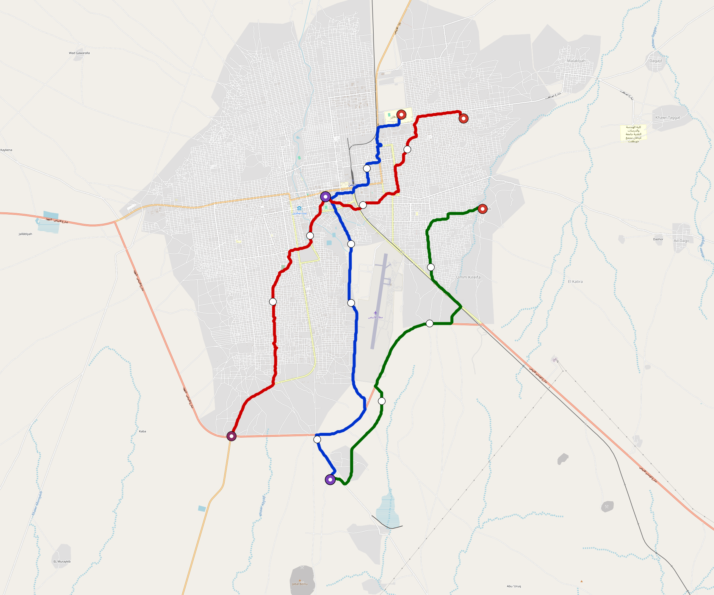

# El-Obeid — Urban Rail Network

**Country:** SD · **Population:** 500,000 · [National brief](../NATIONAL-BRIEF.md)

This page contains only El-Obeid-specific results. Shared routing, service, energy, civil, cost, finance, QA and validation methods are defined once in the [deployment planning reference](../../../../../docs/deployment-planning-reference.md).

> [!IMPORTANT]
> **Foreign-capital advantage:** against the default equivalent foreign-turnkey sensitivity, this local plan avoids **$601 M (86.7%) of external capital** and **$776 M of external interest**. Capital plus saved interest totals **$1.38 bn**. See the common reference for interpretation and limitations.

Auto-planned by the OpenSourceRail design pipeline from the controlled city catalogue, source-locked geospatial inputs and shared templates.

## Network



| Local measure | Value |
|---|---:|
| Lines / unique stations / interchanges | 3 / 19 / 2 |
| Route length | 47.2 km double track |
| Coverage / transfer reachability | 69.7% / 67% |
| Estimated station catchment | 348,500 residents |
| Service span / peak headway | 05:30–02:00 / 3 min |
| Fleet | 102 × 3-car `light-metro-3car` trainsets (91 peak revenue) |
| Peak network throughput | 43,200 passengers/hour |
| Practical service capacity | 401,760 passenger-trips/day |
| Annual paid-trip planning range | 73.3–117.3 M |

### Lines

| Line | Length | Stations | Trainsets | Termini |
|---|---:|---:|---:|---|
| line-1 | 16.3 km | 7 | 36 | N Outer ↔ S Outer |
| line-2 | 17.5 km | 7 | 37 | NE Outer ↔ SW Outer |
| line-3 | 13.4 km | 5 | 29 | S Outer ↔ NE Outer |
| **Total** | **47.2 km** | **19 unique** | **102** | |

## Energy

| Local measure | Value |
|---|---:|
| Scheduled service | 1,395 one-way journeys / 21,970 train-km/day |
| Annual traction demand | 103.9 GWh |
| Station/depot PV / storage | 10.4 MW / 49.0 MWh |
| Aggregate charging power | 9.5 MW |
| Dedicated solar plant | 42.6 MW |
| Residual grid/PPA import | 0.0 GWh/yr |
| Worst powered-stop gap | line-1: 5.7 km / 46 kWh |
| Lowest traversal charging margin | line-3: 44 kWh |

## Capital And Funding

| Local CAPEX bucket | Planning value |
|---|---:|
| Civil works | $145 M |
| Stations | $79 M |
| Depots | $8.0 M |
| Rolling stock | $92 M |
| Dedicated solar plant | $34 M |
| Residual train control | $2.4 M |
| Charging microgrids | $2.1 M |
| EPC / project services | $23 M |
| **Total city programme** | **$385 M** |

| Local funding measure | Planning value |
|---|---:|
| Imported / external capital | $92 M (24.0%) |
| Domestic / local capital | $293 M (76.0%) |
| Annual public construction commitment | $45 M / yr for 10 years |
| Annual post-grace debt service | $41 M / yr |
| External capital saved vs default turnkey sensitivity | $601 M |
| Capital + lifetime external interest saved | $1.38 bn |
| Annual OPEX | $9.5 M / yr |

## Local Evidence

**Evidence refresh required.** Retained passing results below are unverified.
The strict README generator rejected the evidence: engineering/simulation/validation-summary.json describes scenario SHA-256 57edb2793035346b8c33aa715181d5e6a88eb2fdb019f3a15125bc216a22f9a5, but el-obeid.toml is 09bf945b8711e5f56695184ce892c7ea10ac43d8ca5d8309b785dacb27d6dcb6; rerun and update the validation evidence. This audit view does not accept or replace the retained solver results.

| Package | Current status | Evidence |
|---|---|---|
| Finance | unverified | [`summary.json`](engineering/finance/summary.json) |
| Native simulation + degraded cases | unverified | [`validation-summary.json`](engineering/simulation/validation-summary.json) |
| SUMO timetable | unverified | [`summary.json`](engineering/sumo/summary.json) |
| Independent OSR/SUMO running-time cross-check | missing/fail; junction/authority gate open | not generated |
| GIS package | unverified | [`summary.json`](engineering/gis/summary.json) |
| Grid/charging/solar | missing/fail; 11 findings | [`summary.json`](engineering/energy/summary.json) |
| Operations, QA and maintenance | 218 assets / 1,009 tasks | [`el-obeid-operations-manifest.json`](operations/el-obeid-operations-manifest.json) |

## Local Files And Regeneration

| File | Local role |
|---|---|
| [`design.toml`](design.toml) | Authoritative generated city design |
| [`el-obeid.toml`](el-obeid.toml) | Expanded simulator scenario |
| [`el-obeid.corridor.geojson`](el-obeid.corridor.geojson) | GIS corridor and stations |
| [`el-obeid.design-quality.yaml`](el-obeid.design-quality.yaml) | Coverage, source and civil-quality gates |

```bash
tools/automation/regenerate-city.sh el-obeid
```
