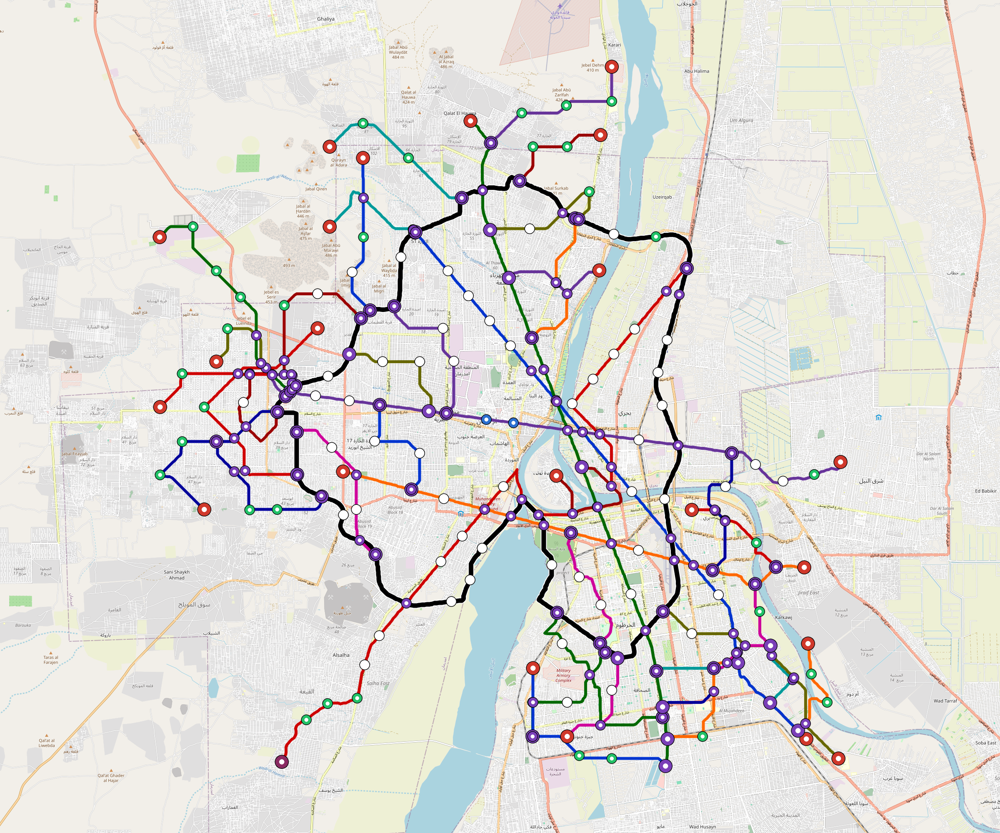

# Omdurman — Urban Rail Network

**Country:** SD · **Population:** 2,800,000 · [National brief](../NATIONAL-BRIEF.md)

This page contains only Omdurman-specific results. Shared routing, service, energy, civil, cost, finance, QA and validation methods are defined once in the [deployment planning reference](../../../../../docs/deployment-planning-reference.md).

> [!IMPORTANT]
> **Foreign-capital advantage:** against the default equivalent foreign-turnkey sensitivity, this local plan avoids **$30.72 bn (91.1%) of external capital** and **$39.68 bn of external interest**. Capital plus saved interest totals **$70.39 bn**. See the common reference for interpretation and limitations.

**Current alignment, depot and production basis.** Core corridors change from **193.147 km to 188.013 km**, with elevated land sections, water-aware radial routes and separately engineered bridge candidates at short water crossings. 0 core fragments retain raster geometry for further curve review. The centre is a design-centroid screen; survey, property, obstacles, foundations and geometry releases remain open. All **96 platform points** pass the retained water-mask screen; footprints, bank stability and access remain open. [Alignment controls](engineering/alignment/core-realignment.json) · [Before/after map](engineering/alignment/core-alignment-comparison.png) · [Water screen](engineering/alignment/station-water-screen.json).

**6 line-local depots** provide **316 full-fleet storage slots**, separate from workshop bays. Fleet length and workload set quantities; PV/storage is included once in depot capital. Site acceptance and installed/land/utility quotations remain open. [Depot costs](engineering/line-depots/README.md). The factory requires **316 metro-4car trainsets / 1264 cars**, with **18-month facility readiness**, then qualification and manufacture. Integrated openings wait for fleet readiness where production or test paths constrain them. Shared factory capital is counted once; concurrent national loading and supplier commitments remain open. [Factory and dates](engineering/factory/README.md).

Station staffing uses two posts, two normal eight-hour shifts, plus service-window, leave and training cover. Basic wages start at 1.5 times the retained country income proxy, with higher technical/management grades and employer allowances. [Staff](engineering/delivery/README.md) · [Finance](engineering/finance/summary.json). Finance retains country-specific fixed-price, steady-state assumptions; Baghdad’s indexed cashflows are separate.

Auto-planned by the OpenSourceRail design pipeline from the controlled city catalogue, source-locked geospatial inputs and shared templates. Population is counted once within the union of station circles; this is potential radial access, not a verified walkshed or fare-demand estimate. Reachable line pairs include transfers through intermediate lines. [Population radii, denominator and transfer paths](engineering/access/README.md) · [Viaduct beam, foundation and terrain checks](engineering/clearance/README.md).

## Network



| Local measure | Value |
|---|---:|
| Lines / unique stations / interchanges | 6 / 96 / 16 |
| Route length | 240.8 km double track |
| Direct transfers / reachable line pairs | 93.3% / 100.0% |
| Residents within 800 m radial station catchments | 458,287 (2020 raster; 16.6% of bbox) |
| Service span / peak headway | 05:30–02:00 / 3 min |
| Fleet | 316 × 4-car `metro-4car` trainsets (284 peak revenue) |
| Peak network throughput | 115,200 passengers/hour |
| Practical service capacity | 982,080 passenger-trips/day |
| Annual paid-trip planning range | 179.2–286.8 M |

### Lines

| Line | Length | Stations | Trainsets | Termini |
|---|---:|---:|---:|---|
| line-1 | 32.5 km | 15 | 60 | SE Outer ↔ NW Mid |
| line-2 | 40.1 km | 16 | 68 | NE Mid ↔ SW Outer |
| line-3 | 33.6 km | 14 | 59 | N Outer ↔ S Outer |
| line-4 | 29.6 km | 13 | 53 | W Mid ↔ E Outer |
| line-5 | 23.4 km | 11 | 45 | SE Outer ↔ W Mid |
| line-6 | 81.5 km | 27 | 31 | W Mid ↔ W Mid |
| **Total** | **240.8 km** | **96 unique** | **316** | |

## Energy

| Local measure | Value |
|---|---:|
| Scheduled service | 2,558 one-way journeys / 93,009 train-km/day |
| Annual traction demand | 586.6 GWh |
| Station/depot PV / storage | 56.4 MW / 372.0 MWh |
| Aggregate charging power | 141.0 MW |
| Dedicated solar plant | 243.2 MW |
| Residual grid/PPA import | 0.0 GWh/yr |
| Worst powered-stop gap | line-2: 11.0 km / 119 kWh |
| Lowest traversal charging margin | line-6: 310 kWh |

## Capital And Funding

| Local CAPEX bucket | Planning value |
|---|---:|
| Civil works | $16.24 bn |
| Stations | $550 M |
| Depots | $132 M |
| Rolling stock | $354 M |
| Dedicated solar plant | $195 M |
| Residual train control | $12 M |
| Charging microgrids | $29 M |
| EPC / project services | $1.21 bn |
| **Total city programme** | **$18.73 bn** |

| Local funding measure | Planning value |
|---|---:|
| Imported / external capital | $2.99 bn (16.0%) |
| Domestic / local capital | $15.74 bn (84.0%) |
| Annual public construction commitment | $2.34 bn / yr for 10 years |
| Annual post-grace debt service | $2.10 bn / yr |
| External capital saved vs default turnkey sensitivity | $30.72 bn |
| Capital + lifetime external interest saved | $70.39 bn |
| Annual OPEX | $362 M / yr |

## Local Evidence

| Package | Current status | Evidence |
|---|---|---|
| Finance | pass | [`summary.json`](engineering/finance/summary.json) |
| Native simulation + degraded cases | pass | [`validation-summary.json`](engineering/simulation/validation-summary.json) |
| SUMO timetable | pass | [`summary.json`](engineering/sumo/summary.json) |
| Independent OSR/SUMO running-time cross-check | pass; junction/authority gate open | [`operations-crosscheck.md`](engineering/simulation/operations-crosscheck.md) |
| GIS package | pass | [`summary.json`](engineering/gis/summary.json) |
| Solar/storage snapshot (operating duty unverified) | pass; 0 findings; 33 grid-only diagnostics | [`summary.json`](engineering/energy/summary.json) |
| Operations, QA and maintenance | 853 assets / 4,592 tasks | [`omdurman-operations-manifest.json`](operations/omdurman-operations-manifest.json) |

## Local Files And Regeneration

| File | Local role |
|---|---|
| [`design.toml`](design.toml) | Authoritative generated city design |
| [`omdurman.toml`](omdurman.toml) | Expanded simulator scenario |
| [`omdurman.corridor.geojson`](omdurman.corridor.geojson) | GIS corridor and stations |
| [`omdurman.design-quality.yaml`](omdurman.design-quality.yaml) | Coverage, source and civil-quality gates |

```bash
tools/automation/regenerate-city.sh omdurman
```
