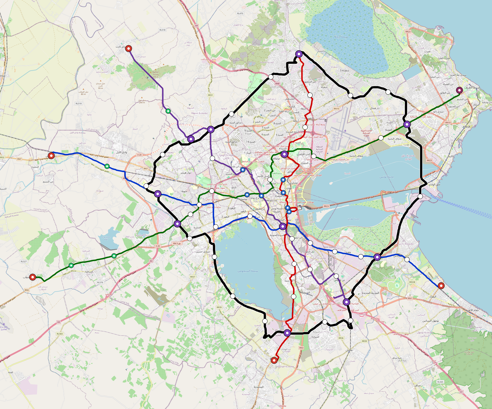

# Tunis — Urban Rail Network

**Country:** TN · **Population:** 2,900,000 · [National brief](../NATIONAL-BRIEF.md)

This page contains only Tunis-specific results. Shared routing, service, energy, civil, cost, finance, QA and validation methods are defined once in the [deployment planning reference](../../../../../docs/deployment-planning-reference.md).

> [!IMPORTANT]
> **Foreign-capital advantage:** against the default equivalent foreign-turnkey sensitivity, this local plan avoids **$2.79 bn (86.9%) of external capital** and **$3.43 bn of external interest**. Capital plus saved interest totals **$6.22 bn**. See the common reference for interpretation and limitations.

Auto-planned by the OpenSourceRail design pipeline from the controlled city catalogue, source-locked geospatial inputs and shared templates.

## Network



| Local measure | Value |
|---|---:|
| Lines / unique stations / interchanges | 5 / 73 / 11 |
| Route length | 221.1 km double track |
| Coverage / transfer reachability | 59.7% / 80% |
| Estimated station catchment | 1,731,300 residents |
| Service span / peak headway | 05:30–02:00 / 3 min |
| Fleet | 255 × 4-car `metro-4car` trainsets (230 peak revenue) |
| Peak network throughput | 96,000 passengers/hour |
| Practical service capacity | 803,520 passenger-trips/day |
| Annual paid-trip planning range | 146.6–234.6 M |

### Lines

| Line | Length | Stations | Trainsets | Termini |
|---|---:|---:|---:|---|
| line-1 | 37.0 km | 13 | 57 | SE Outer ↔ W Outer |
| line-2 | 31.2 km | 13 | 52 | S Mid ↔ N Mid |
| line-3 | 42.5 km | 13 | 64 | W Outer ↔ NE Outer |
| line-4 | 33.9 km | 12 | 52 | SE Mid ↔ NW Outer |
| line-5 | 76.6 km | 22 | 30 | W Mid ↔ W Mid |
| **Total** | **221.1 km** | **73 unique** | **255** | |

## Energy

| Local measure | Value |
|---|---:|
| Scheduled service | 2,092 one-way journeys / 84,995 train-km/day |
| Annual traction demand | 536.1 GWh |
| Station/depot PV / storage | 25.4 MW / 142.0 MWh |
| Aggregate charging power | 103.5 MW |
| Dedicated solar plant | 277.9 MW |
| Residual grid/PPA import | 0.0 GWh/yr |
| Worst powered-stop gap | line-3: 12.7 km / 122 kWh |
| Lowest traversal charging margin | line-4: 230 kWh |

## Capital And Funding

| Local CAPEX bucket | Planning value |
|---|---:|
| Civil works | $727 M |
| Stations | $405 M |
| Depots | $8.0 M |
| Rolling stock | $286 M |
| Dedicated solar plant | $222 M |
| Residual train control | $11 M |
| Charging microgrids | $23 M |
| EPC / project services | $102 M |
| **Total city programme** | **$1.78 bn** |

| Local funding measure | Planning value |
|---|---:|
| Imported / external capital | $422 M (23.7%) |
| Domestic / local capital | $1.36 bn (76.3%) |
| Annual public construction commitment | $171 M / yr for 5 years |
| Annual post-grace debt service | $127 M / yr |
| External capital saved vs default turnkey sensitivity | $2.79 bn |
| Capital + lifetime external interest saved | $6.22 bn |
| Annual OPEX | $44 M / yr |

## Local Evidence

| Package | Current status | Evidence |
|---|---|---|
| Finance | pass | [`summary.json`](engineering/finance/summary.json) |
| Native simulation + degraded cases | pass | [`validation-summary.json`](engineering/simulation/validation-summary.json) |
| SUMO timetable | pass | [`summary.json`](engineering/sumo/summary.json) |
| GIS package | pass | [`summary.json`](engineering/gis/summary.json) |
| Grid/charging/solar | pass | [`summary.json`](engineering/energy/summary.json) |
| Operations, QA and maintenance | 667 assets / 2,902 tasks | [`tunis-operations-manifest.json`](operations/tunis-operations-manifest.json) |

## Local Files And Regeneration

| File | Local role |
|---|---|
| [`design.toml`](design.toml) | Authoritative generated city design |
| [`tunis.toml`](tunis.toml) | Expanded simulator scenario |
| [`tunis.corridor.geojson`](tunis.corridor.geojson) | GIS corridor and stations |
| [`tunis.design-quality.yaml`](tunis.design-quality.yaml) | Coverage, source and civil-quality gates |

```bash
tools/automation/regenerate-city.sh tunis
```
