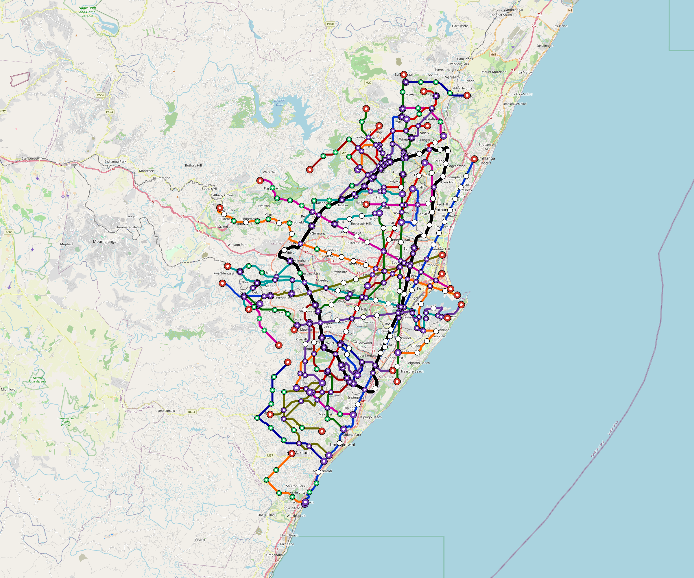

# Durban — Urban Rail Network

**Country:** ZA · **Population:** 3,900,000 · [National brief](../NATIONAL-BRIEF.md)

This page contains only Durban-specific results. Shared routing, service, energy, civil, cost, finance, QA and validation methods are defined once in the [deployment planning reference](../../../../../docs/deployment-planning-reference.md).

> [!IMPORTANT]
> **Foreign-capital advantage:** against the default equivalent foreign-turnkey sensitivity, this local plan avoids **$25.43 bn (89.9%) of external capital** and **$31.26 bn of external interest**. Capital plus saved interest totals **$56.69 bn**. See the common reference for interpretation and limitations.

**Current alignment, depot and production basis.** Core corridors change from **306.330 km to 280.304 km**, with elevated land sections, water-aware radial routes and separately engineered bridge candidates at short water crossings. 0 core fragments retain raster geometry for further curve review. The centre is a design-centroid screen; survey, property, obstacles, foundations and geometry releases remain open. All **161 platform points** pass the retained water-mask screen; footprints, bank stability and access remain open. [Alignment controls](engineering/alignment/core-realignment.json) · [Before/after map](engineering/alignment/core-alignment-comparison.png) · [Water screen](engineering/alignment/station-water-screen.json).

**9 line-local depots** provide **608 full-fleet storage slots**, separate from workshop bays. Fleet length and workload set quantities; PV/storage is included once in depot capital. Site acceptance and installed/land/utility quotations remain open. [Depot costs](engineering/line-depots/README.md). The factory requires **608 metro-6car trainsets / 3648 cars**, with **18-month facility readiness**, then qualification and manufacture. Integrated openings wait for fleet readiness where production or test paths constrain them. Shared factory capital is counted once; concurrent national loading and supplier commitments remain open. [Factory and dates](engineering/factory/README.md).

Station staffing uses two posts, two normal eight-hour shifts, plus service-window, leave and training cover. Basic wages start at 1.5 times the retained country income proxy, with higher technical/management grades and employer allowances. [Staff](engineering/delivery/README.md) · [Finance](engineering/finance/summary.json). Finance retains country-specific fixed-price, steady-state assumptions; Baghdad’s indexed cashflows are separate.

Auto-planned by the OpenSourceRail design pipeline from the controlled city catalogue, source-locked geospatial inputs and shared templates.

## Network



| Local measure | Value |
|---|---:|
| Lines / unique stations / interchanges | 9 / 161 / 21 |
| Route length | 358.9 km double track |
| Coverage / transfer reachability | 73.6% / 83% |
| Estimated station catchment | 2,870,400 residents |
| Service span / peak headway | 05:30–02:00 / 3 min |
| Fleet | 608 × 6-car `metro-6car` trainsets (548 peak revenue) |
| Peak network throughput | 259,200 passengers/hour |
| Practical service capacity | 2,276,640 passenger-trips/day |
| Annual paid-trip planning range | 415.5–664.8 M |

### Lines

| Line | Length | Stations | Trainsets | Termini |
|---|---:|---:|---:|---|
| line-1 | 50.9 km | 20 | 93 | NE Mid ↔ S Outer |
| line-2 | 36.1 km | 15 | 70 | SW Mid ↔ NE Mid |
| line-3 | 37.7 km | 17 | 74 | N Outer ↔ S Mid |
| line-4 | 27.5 km | 20 | 75 | SW Mid ↔ E Mid |
| line-5 | 35.9 km | 16 | 70 | E Inner ↔ NW Outer |
| line-6 | 33.5 km | 20 | 78 | W Mid ↔ SE Inner |
| line-7 | 28.9 km | 13 | 57 | NW Mid ↔ E Inner |
| line-8 | 24.7 km | 12 | 52 | W Mid ↔ E Inner |
| line-9 | 83.6 km | 28 | 39 | W Mid ↔ W Inner |
| **Total** | **358.9 km** | **161 unique** | **608** | |

## Energy

| Local measure | Value |
|---|---:|
| Scheduled service | 3,952 one-way journeys / 147,459 train-km/day |
| Annual traction demand | 1,395.1 GWh |
| Station/depot PV / storage | 86.4 MW / 636.0 MWh |
| Aggregate charging power | 294.0 MW |
| Dedicated solar plant | 816.4 MW |
| Residual grid/PPA import | 0.0 GWh/yr |
| Worst powered-stop gap | line-5: 13.9 km / 207 kWh |
| Lowest traversal charging margin | line-7: 308 kWh |

## Capital And Funding

| Local CAPEX bucket | Planning value |
|---|---:|
| Civil works | $11.80 bn |
| Stations | $907 M |
| Depots | $263 M |
| Rolling stock | $1.02 bn |
| Dedicated solar plant | $653 M |
| Residual train control | $18 M |
| Charging microgrids | $59 M |
| EPC / project services | $985 M |
| **Total city programme** | **$15.71 bn** |

| Local funding measure | Planning value |
|---|---:|
| Imported / external capital | $2.85 bn (18.1%) |
| Domestic / local capital | $12.86 bn (81.9%) |
| Annual public construction commitment | $1.72 bn / yr for 5 years |
| Annual post-grace debt service | $1.28 bn / yr |
| External capital saved vs default turnkey sensitivity | $25.43 bn |
| Capital + lifetime external interest saved | $56.69 bn |
| Annual OPEX | $353 M / yr |

## Local Evidence

| Package | Current status | Evidence |
|---|---|---|
| Finance | pass | [`summary.json`](engineering/finance/summary.json) |
| Native simulation + degraded cases | pass | [`validation-summary.json`](engineering/simulation/validation-summary.json) |
| SUMO timetable | pass | [`summary.json`](engineering/sumo/summary.json) |
| Independent OSR/SUMO running-time cross-check | pass; junction/authority gate open | [`operations-crosscheck.md`](engineering/simulation/operations-crosscheck.md) |
| GIS package | pass | [`summary.json`](engineering/gis/summary.json) |
| Solar/storage snapshot (operating duty unverified) | pass; 0 findings; 38 grid-only diagnostics | [`summary.json`](engineering/energy/summary.json) |
| Operations, QA and maintenance | 1,508 assets / 8,377 tasks | [`durban-operations-manifest.json`](operations/durban-operations-manifest.json) |

## Local Files And Regeneration

| File | Local role |
|---|---|
| [`design.toml`](design.toml) | Authoritative generated city design |
| [`durban.toml`](durban.toml) | Expanded simulator scenario |
| [`durban.corridor.geojson`](durban.corridor.geojson) | GIS corridor and stations |
| [`durban.design-quality.yaml`](durban.design-quality.yaml) | Coverage, source and civil-quality gates |

```bash
tools/automation/regenerate-city.sh durban
```
