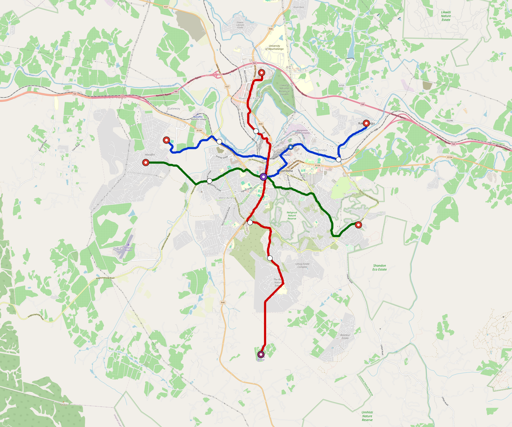

# Nelspruit — Urban Rail Network

**Country:** ZA · **Population:** 300,000 · [National brief](../NATIONAL-BRIEF.md)

This page contains only Nelspruit-specific results. Shared routing, service, energy, civil, cost, finance, QA and validation methods are defined once in the [deployment planning reference](../../../../../docs/deployment-planning-reference.md).

> [!IMPORTANT]
> **Foreign-capital advantage:** against the default equivalent foreign-turnkey sensitivity, this local plan avoids **$461 M (87.6%) of external capital** and **$567 M of external interest**. Capital plus saved interest totals **$1.03 bn**. See the common reference for interpretation and limitations.

Auto-planned by the OpenSourceRail design pipeline from the controlled city catalogue, source-locked geospatial inputs and shared templates.

## Network



| Local measure | Value |
|---|---:|
| Lines / unique stations / interchanges | 3 / 16 / 1 |
| Route length | 38.7 km double track |
| Coverage / transfer reachability | 71.6% / 100% |
| Estimated station catchment | 214,800 residents |
| Service span / peak headway | 05:30–02:00 / 3 min |
| Fleet | 80 × 2-car `tram-2car` trainsets (71 peak revenue) |
| Peak network throughput | 28,800 passengers/hour |
| Practical service capacity | 267,840 passenger-trips/day |
| Annual paid-trip planning range | 48.9–78.2 M |

### Lines

| Line | Length | Stations | Trainsets | Termini |
|---|---:|---:|---:|---|
| line-1 | 12.8 km | 6 | 26 | W Mid ↔ NE Outer |
| line-2 | 14.4 km | 6 | 30 | N Mid ↔ S Outer |
| line-3 | 11.4 km | 4 | 24 | W Mid ↔ SE Mid |
| **Total** | **38.7 km** | **16 unique** | **80** | |

## Energy

| Local measure | Value |
|---|---:|
| Scheduled service | 1,395 one-way journeys / 17,995 train-km/day |
| Annual traction demand | 56.7 GWh |
| Station/depot PV / storage | 9.5 MW / 47.5 MWh |
| Aggregate charging power | 8.0 MW |
| Dedicated solar plant | 26.3 MW |
| Residual grid/PPA import | 0.0 GWh/yr |
| Worst powered-stop gap | line-3: 5.8 km / 29 kWh |
| Lowest traversal charging margin | line-3: 35 kWh |

## Capital And Funding

| Local CAPEX bucket | Planning value |
|---|---:|
| Civil works | $114 M |
| Stations | $83 M |
| Depots | $8.0 M |
| Rolling stock | $45 M |
| Dedicated solar plant | $21 M |
| Residual train control | $1.9 M |
| Charging microgrids | $1.8 M |
| EPC / project services | $18 M |
| **Total city programme** | **$293 M** |

| Local funding measure | Planning value |
|---|---:|
| Imported / external capital | $65 M (22.3%) |
| Domestic / local capital | $227 M (77.7%) |
| Annual public construction commitment | $31 M / yr for 5 years |
| Annual post-grace debt service | $23 M / yr |
| External capital saved vs default turnkey sensitivity | $461 M |
| Capital + lifetime external interest saved | $1.03 bn |
| Annual OPEX | $8.5 M / yr |

## Local Evidence

**Evidence refresh required.** Retained passing results below are unverified.
The strict README generator rejected the evidence: engineering/simulation/validation-summary.json describes scenario SHA-256 17aa71e49775ee10edfab4fdce2e0495235f1b18550c14f2d275c0b8b8c85e60, but nelspruit.toml is 5f1bfe2ab1de8dd184308b69d6a0012aa380285d0bfba600c6ef59a92d19647a; rerun and update the validation evidence. This audit view does not accept or replace the retained solver results.

| Package | Current status | Evidence |
|---|---|---|
| Finance | unverified | [`summary.json`](engineering/finance/summary.json) |
| Native simulation + degraded cases | unverified | [`validation-summary.json`](engineering/simulation/validation-summary.json) |
| SUMO timetable | unverified | [`summary.json`](engineering/sumo/summary.json) |
| Independent OSR/SUMO running-time cross-check | missing/fail; junction/authority gate open | not generated |
| GIS package | unverified | [`summary.json`](engineering/gis/summary.json) |
| Solar/storage snapshot (operating duty unverified) | unverified; 0 findings; 6 grid-only diagnostics | [`summary.json`](engineering/energy/summary.json) |
| Operations, QA and maintenance | 176 assets / 805 tasks | [`nelspruit-operations-manifest.json`](operations/nelspruit-operations-manifest.json) |

## Local Files And Regeneration

| File | Local role |
|---|---|
| [`design.toml`](design.toml) | Authoritative generated city design |
| [`nelspruit.toml`](nelspruit.toml) | Expanded simulator scenario |
| [`nelspruit.corridor.geojson`](nelspruit.corridor.geojson) | GIS corridor and stations |
| [`nelspruit.design-quality.yaml`](nelspruit.design-quality.yaml) | Coverage, source and civil-quality gates |

```bash
tools/automation/regenerate-city.sh nelspruit
```
