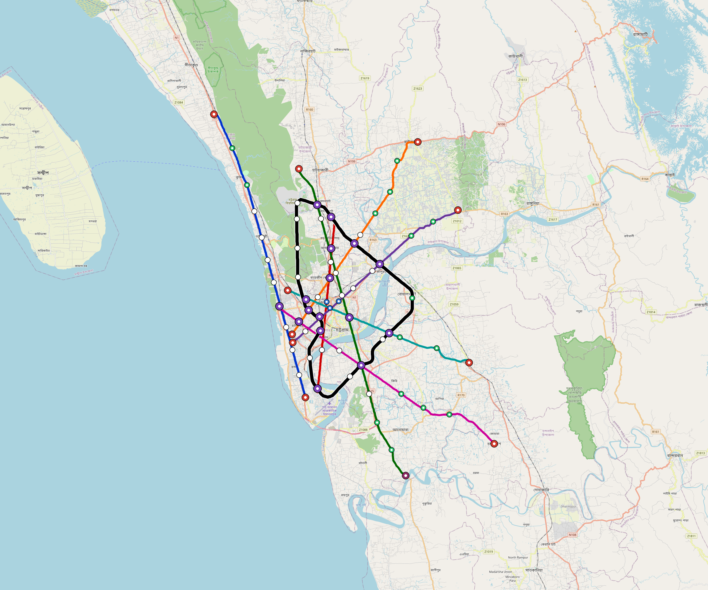

# Chittagong — Urban Rail Network

**Country:** BD · **Population:** 5,200,000 · [National brief](../NATIONAL-BRIEF.md)

This page contains only Chittagong-specific results. Shared routing, service, energy, civil, cost, finance, QA and validation methods are defined once in the [deployment planning reference](../../../../../docs/deployment-planning-reference.md).

> [!IMPORTANT]
> **Foreign-capital advantage:** against the default equivalent foreign-turnkey sensitivity, this local plan avoids **$9.49 bn (87.7%) of external capital** and **$11.89 bn of external interest**. Capital plus saved interest totals **$21.38 bn**. See the common reference for interpretation and limitations.

**Current alignment, depot and production basis.** Core corridors change from **257.102 km to 263.497 km**, with elevated land sections, water-aware radial routes and separately engineered bridge candidates at short water crossings. 0 core fragments retain raster geometry for further curve review. The centre is a design-centroid screen; survey, property, obstacles, foundations and geometry releases remain open. All **125 platform points** pass the retained water-mask screen; footprints, bank stability and access remain open. [Alignment controls](engineering/alignment/core-realignment.json) · [Before/after map](engineering/alignment/core-alignment-comparison.png) · [Water screen](engineering/alignment/station-water-screen.json).

**8 line-local depots** provide **523 full-fleet storage slots**, separate from workshop bays. Fleet length and workload set quantities; PV/storage is included once in depot capital. Site acceptance and installed/land/utility quotations remain open. [Depot costs](engineering/line-depots/README.md). The factory requires **523 metro-6car trainsets / 3138 cars**, with **18-month facility readiness**, then qualification and manufacture. Integrated openings wait for fleet readiness where production or test paths constrain them. Shared factory capital is counted once; concurrent national loading and supplier commitments remain open. [Factory and dates](engineering/factory/README.md).

Station staffing uses two posts, two normal eight-hour shifts, plus service-window, leave and training cover. Basic wages start at 1.5 times the retained country income proxy, with higher technical/management grades and employer allowances. [Staff](engineering/delivery/README.md) · [Finance](engineering/finance/summary.json). Finance retains country-specific fixed-price, steady-state assumptions; Baghdad’s indexed cashflows are separate.

Auto-planned by the OpenSourceRail design pipeline from the controlled city catalogue, source-locked geospatial inputs and shared templates. Population is counted once within the union of station circles; this is potential radial access, not a verified walkshed or fare-demand estimate. Reachable line pairs include transfers through intermediate lines. [Population radii, denominator and transfer paths](engineering/access/README.md) · [Viaduct beam, foundation and terrain checks](engineering/clearance/README.md). Capital figures are base planning allowances: route-search scores are excluded from money, while special structures and installed-price gaps remain open. [Cost boundary](../../../../../docs/finance/civil-allowance-boundary.md).

## Network



| Local measure | Value |
|---|---:|
| Lines / unique stations / interchanges | 8 / 125 / 24 |
| Route length | 320.2 km double track |
| Direct transfers / reachable line pairs | 75.0% / 100.0% |
| Residents within 800 m radial station catchments | 1,920,557 (2020 raster; 34.8% of bbox) |
| Service span / peak headway | 05:30–02:00 / 3 min |
| Fleet | 523 × 6-car `metro-6car` trainsets (470 peak revenue) |
| Peak network throughput | 230,400 passengers/hour |
| Practical service capacity | 2,008,800 passenger-trips/day |
| Annual paid-trip planning range | 366.6–586.6 M |

### Lines

| Line | Length | Stations | Trainsets | Termini |
|---|---:|---:|---:|---|
| line-1 | 40.9 km | 14 | 81 | S Mid ↔ NW Outer |
| line-2 | 22.0 km | 14 | 56 | S Mid ↔ N Mid |
| line-3 | 61.2 km | 21 | 114 | N Mid ↔ SE Outer |
| line-4 | 28.9 km | 11 | 57 | NE Outer ↔ SW Inner |
| line-5 | 31.8 km | 12 | 61 | SW Inner ↔ NE Outer |
| line-6 | 26.5 km | 10 | 51 | NW Inner ↔ E Mid |
| line-7 | 34.4 km | 14 | 68 | W Inner ↔ SE Outer |
| line-8 | 74.5 km | 29 | 35 | N Mid ↔ N Mid |
| **Total** | **320.2 km** | **125 unique** | **523** | |

## Energy

| Local measure | Value |
|---|---:|
| Scheduled service | 3,488 one-way journeys / 131,559 train-km/day |
| Annual traction demand | 1,244.7 GWh |
| Station/depot PV / storage | 69.7 MW / 518.0 MWh |
| Aggregate charging power | 214.0 MW |
| Dedicated solar plant | 736.8 MW |
| Residual grid/PPA import | 0.0 GWh/yr |
| Worst powered-stop gap | line-7: 20.9 km / 313 kWh |
| Lowest traversal charging margin | line-5: 244 kWh |

## Capital And Funding

| Local CAPEX bucket | Planning value |
|---|---:|
| Civil works | $3.18 bn |
| Stations | $714 M |
| Depots | $229 M |
| Rolling stock | $879 M |
| Dedicated solar plant | $589 M |
| Residual train control | $16 M |
| Charging microgrids | $43 M |
| EPC / project services | $354 M |
| **Total city programme** | **$6.01 bn** |

| Local funding measure | Planning value |
|---|---:|
| Imported / external capital | $1.33 bn (22.1%) |
| Domestic / local capital | $4.68 bn (77.9%) |
| Annual public construction commitment | $512 M / yr for 7 years |
| Annual post-grace debt service | $419 M / yr |
| External capital saved vs default turnkey sensitivity | $9.49 bn |
| Capital + lifetime external interest saved | $21.38 bn |
| Annual OPEX | $141 M / yr |

## Local Evidence

| Package | Current status | Evidence |
|---|---|---|
| Finance | pass | [`summary.json`](engineering/finance/summary.json) |
| Native simulation + degraded cases | pass | [`validation-summary.json`](engineering/simulation/validation-summary.json) |
| SUMO timetable | pass | [`summary.json`](engineering/sumo/summary.json) |
| Independent OSR/SUMO running-time cross-check | pass; junction/authority gate open | [`operations-crosscheck.md`](engineering/simulation/operations-crosscheck.md) |
| GIS package | pass | [`summary.json`](engineering/gis/summary.json) |
| Solar/storage snapshot (operating duty unverified) | pass; 0 findings; 19 grid-only diagnostics | [`summary.json`](engineering/energy/summary.json) |
| Operations, QA and maintenance | 1,224 assets / 6,938 tasks | [`chittagong-operations-manifest.json`](operations/chittagong-operations-manifest.json) |

## Local Files And Regeneration

| File | Local role |
|---|---|
| [`design.toml`](design.toml) | Authoritative generated city design |
| [`chittagong.toml`](chittagong.toml) | Expanded simulator scenario |
| [`chittagong.corridor.geojson`](chittagong.corridor.geojson) | GIS corridor and stations |
| [`chittagong.design-quality.yaml`](chittagong.design-quality.yaml) | Coverage, source and civil-quality gates |

```bash
tools/automation/regenerate-city.sh chittagong
```
