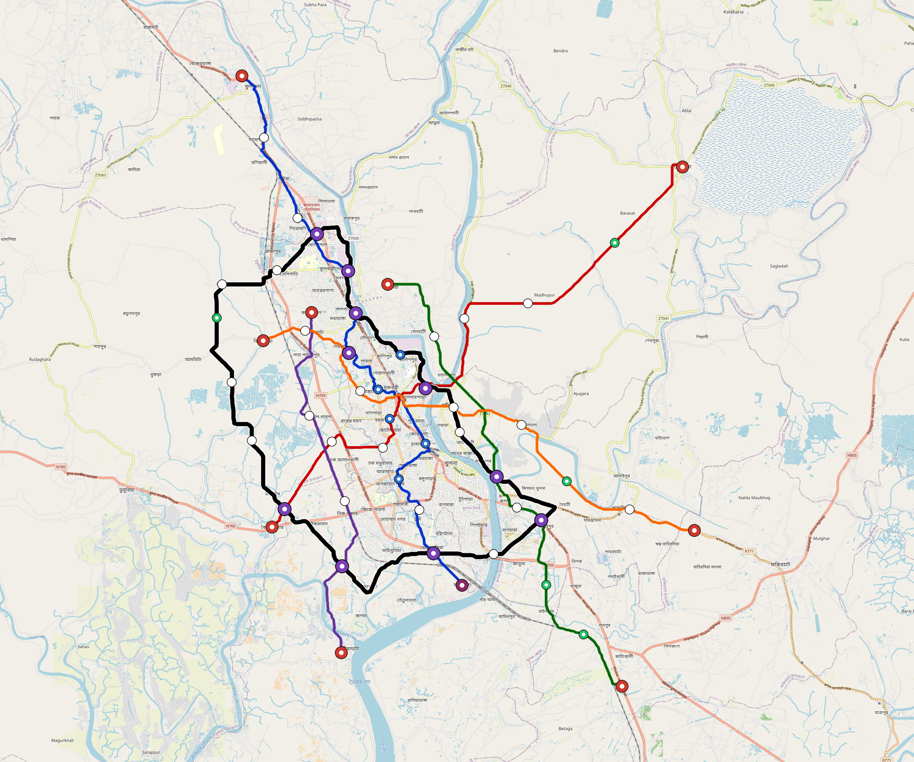

# Khulna — Urban Rail Network

**Country:** BD · **Population:** 1,500,000 · [National brief](../NATIONAL-BRIEF.md)

This page contains only Khulna-specific results. Shared routing, service, energy, civil, cost, finance, QA and validation methods are defined once in the [deployment planning reference](../../../../../docs/deployment-planning-reference.md).

> [!IMPORTANT]
> **Foreign-capital advantage:** against the default equivalent foreign-turnkey sensitivity, this local plan avoids **$2.83 bn (86.9%) of external capital** and **$3.55 bn of external interest**. Capital plus saved interest totals **$6.37 bn**. See the common reference for interpretation and limitations.

Auto-planned by the OpenSourceRail design pipeline from the controlled city catalogue, source-locked geospatial inputs and shared templates.

## Network



| Local measure | Value |
|---|---:|
| Lines / unique stations / interchanges | 6 / 68 / 10 |
| Route length | 196.4 km double track |
| Coverage / transfer reachability | 51.3% / 73% |
| Estimated station catchment | 769,500 residents |
| Service span / peak headway | 05:30–02:00 / 3 min |
| Fleet | 252 × 4-car `metro-4car` trainsets (227 peak revenue) |
| Peak network throughput | 115,200 passengers/hour |
| Practical service capacity | 982,080 passenger-trips/day |
| Annual paid-trip planning range | 179.2–286.8 M |

### Lines

| Line | Length | Stations | Trainsets | Termini |
|---|---:|---:|---:|---|
| line-1 | 34.5 km | 14 | 60 | NW Outer ↔ S Mid |
| line-2 | 32.1 km | 12 | 52 | SW Mid ↔ NE Outer |
| line-3 | 26.3 km | 9 | 43 | SE Outer ↔ N Mid |
| line-4 | 19.4 km | 5 | 30 | NW Mid ↔ S Outer |
| line-5 | 27.0 km | 10 | 43 | SE Outer ↔ NW Mid |
| line-6 | 57.1 km | 18 | 24 | NW Mid ↔ NW Mid |
| **Total** | **196.4 km** | **68 unique** | **252** | |

## Energy

| Local measure | Value |
|---|---:|
| Scheduled service | 2,558 one-way journeys / 78,053 train-km/day |
| Annual traction demand | 492.3 GWh |
| Station/depot PV / storage | 23.6 MW / 133.0 MWh |
| Aggregate charging power | 94.5 MW |
| Dedicated solar plant | 296.0 MW |
| Residual grid/PPA import | 0.0 GWh/yr |
| Worst powered-stop gap | line-3: 10.7 km / 106 kWh |
| Lowest traversal charging margin | line-4: 118 kWh |

## Capital And Funding

| Local CAPEX bucket | Planning value |
|---|---:|
| Civil works | $751 M |
| Stations | $398 M |
| Depots | $8.0 M |
| Rolling stock | $282 M |
| Dedicated solar plant | $237 M |
| Residual train control | $9.8 M |
| Charging microgrids | $21 M |
| EPC / project services | $103 M |
| **Total city programme** | **$1.81 bn** |

| Local funding measure | Planning value |
|---|---:|
| Imported / external capital | $428 M (23.7%) |
| Domestic / local capital | $1.38 bn (76.3%) |
| Annual public construction commitment | $153 M / yr for 7 years |
| Annual post-grace debt service | $126 M / yr |
| External capital saved vs default turnkey sensitivity | $2.83 bn |
| Capital + lifetime external interest saved | $6.37 bn |
| Annual OPEX | $42 M / yr |

## Local Evidence

**Evidence refresh required.** Retained passing results below are unverified.
The strict README generator rejected the evidence: engineering/simulation/validation-summary.json describes scenario SHA-256 78724b3d42d40a16a3ae815a66333dbc15d690611eab0d7e66b32f8a51355b34, but khulna.toml is 88f81aa09a1cef7360e6c59858d09392faac37209ac5c0dfe2d25dadb089964f; rerun and update the validation evidence. This audit view does not accept or replace the retained solver results.

| Package | Current status | Evidence |
|---|---|---|
| Finance | unverified | [`summary.json`](engineering/finance/summary.json) |
| Native simulation + degraded cases | unverified | [`validation-summary.json`](engineering/simulation/validation-summary.json) |
| SUMO timetable | unverified | [`summary.json`](engineering/sumo/summary.json) |
| Independent OSR/SUMO running-time cross-check | missing/fail; junction/authority gate open | not generated |
| GIS package | unverified | [`summary.json`](engineering/gis/summary.json) |
| Grid/charging/solar | missing/fail; 22 findings | [`summary.json`](engineering/energy/summary.json) |
| Operations, QA and maintenance | 634 assets / 2,796 tasks | [`khulna-operations-manifest.json`](operations/khulna-operations-manifest.json) |

## Local Files And Regeneration

| File | Local role |
|---|---|
| [`design.toml`](design.toml) | Authoritative generated city design |
| [`khulna.toml`](khulna.toml) | Expanded simulator scenario |
| [`khulna.corridor.geojson`](khulna.corridor.geojson) | GIS corridor and stations |
| [`khulna.design-quality.yaml`](khulna.design-quality.yaml) | Coverage, source and civil-quality gates |

```bash
tools/automation/regenerate-city.sh khulna
```
