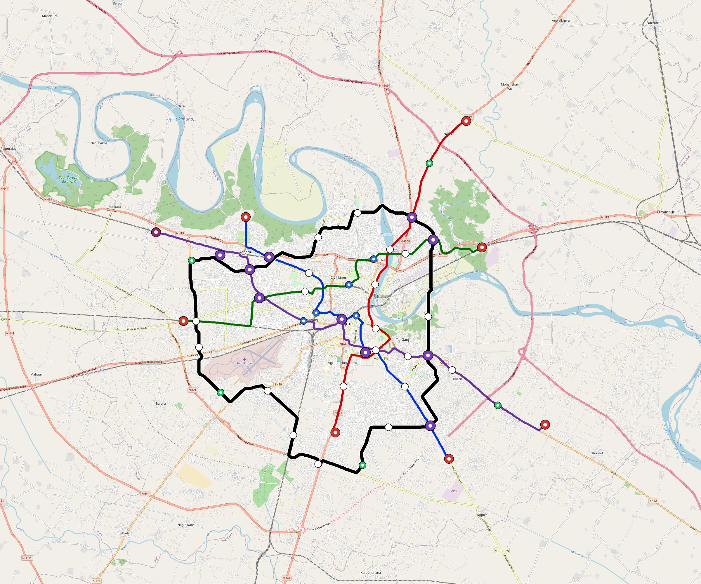

# Agra — Urban Rail Network

**Country:** IN · **Population:** 1,700,000 · [National brief](../NATIONAL-BRIEF.md)

This page contains only Agra-specific results. Shared routing, service, energy, civil, cost, finance, QA and validation methods are defined once in the [deployment planning reference](../../../../../docs/deployment-planning-reference.md).

> [!IMPORTANT]
> **Foreign-capital advantage:** against the default equivalent foreign-turnkey sensitivity, this local plan avoids **$2.23 bn (87.4%) of external capital** and **$2.74 bn of external interest**. Capital plus saved interest totals **$4.97 bn**. See the common reference for interpretation and limitations.

Auto-planned by the OpenSourceRail design pipeline from the controlled city catalogue, source-locked geospatial inputs and shared templates.

## Network



| Local measure | Value |
|---|---:|
| Lines / unique stations / interchanges | 5 / 58 / 10 |
| Route length | 160.2 km double track |
| Coverage / transfer reachability | 57.9% / 70% |
| Estimated station catchment | 984,299 residents |
| Service span / peak headway | 05:30–02:00 / 3 min |
| Fleet | 187 × 4-car `metro-4car` trainsets (167 peak revenue) |
| Peak network throughput | 96,000 passengers/hour |
| Practical service capacity | 803,520 passenger-trips/day |
| Annual paid-trip planning range | 146.6–234.6 M |

### Lines

| Line | Length | Stations | Trainsets | Termini |
|---|---:|---:|---:|---|
| line-1 | 23.3 km | 10 | 40 | NW Mid ↔ SE Outer |
| line-2 | 24.0 km | 9 | 38 | S Mid ↔ NE Outer |
| line-3 | 22.6 km | 8 | 36 | NE Mid ↔ W Outer |
| line-4 | 30.7 km | 12 | 49 | SE Outer ↔ NW Outer |
| line-5 | 59.7 km | 19 | 24 | W Outer ↔ W Mid |
| **Total** | **160.2 km** | **58 unique** | **187** | |

## Energy

| Local measure | Value |
|---|---:|
| Scheduled service | 2,092 one-way journeys / 60,629 train-km/day |
| Annual traction demand | 382.4 GWh |
| Station/depot PV / storage | 20.6 MW / 118.0 MWh |
| Aggregate charging power | 79.5 MW |
| Dedicated solar plant | 177.1 MW |
| Residual grid/PPA import | 0.0 GWh/yr |
| Worst powered-stop gap | line-2: 7.1 km / 77 kWh |
| Lowest traversal charging margin | line-2: 157 kWh |

## Capital And Funding

| Local CAPEX bucket | Planning value |
|---|---:|
| Civil works | $598 M |
| Stations | $352 M |
| Depots | $8.0 M |
| Rolling stock | $209 M |
| Dedicated solar plant | $142 M |
| Residual train control | $8.0 M |
| Charging microgrids | $18 M |
| EPC / project services | $84 M |
| **Total city programme** | **$1.42 bn** |

| Local funding measure | Planning value |
|---|---:|
| Imported / external capital | $323 M (22.8%) |
| Domestic / local capital | $1.10 bn (77.2%) |
| Annual public construction commitment | $121 M / yr for 5 years |
| Annual post-grace debt service | $88 M / yr |
| External capital saved vs default turnkey sensitivity | $2.23 bn |
| Capital + lifetime external interest saved | $4.97 bn |
| Annual OPEX | $33 M / yr |

## Local Evidence

| Package | Current status | Evidence |
|---|---|---|
| Finance | pass | [`summary.json`](engineering/finance/summary.json) |
| Native simulation + degraded cases | pass | [`validation-summary.json`](engineering/simulation/validation-summary.json) |
| SUMO timetable | pass | [`summary.json`](engineering/sumo/summary.json) |
| GIS package | pass | [`summary.json`](engineering/gis/summary.json) |
| Grid/charging/solar | pass | [`summary.json`](engineering/energy/summary.json) |
| Operations, QA and maintenance | 512 assets / 2,187 tasks | [`agra-operations-manifest.json`](operations/agra-operations-manifest.json) |

## Local Files And Regeneration

| File | Local role |
|---|---|
| [`design.toml`](design.toml) | Authoritative generated city design |
| [`agra.toml`](agra.toml) | Expanded simulator scenario |
| [`agra.corridor.geojson`](agra.corridor.geojson) | GIS corridor and stations |
| [`agra.design-quality.yaml`](agra.design-quality.yaml) | Coverage, source and civil-quality gates |

```bash
tools/automation/regenerate-city.sh agra
```
