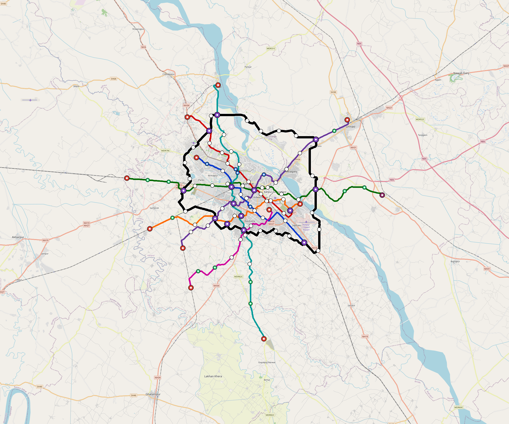

# Kanpur — Urban Rail Network

**Country:** IN · **Population:** 3,200,000 · [National brief](../NATIONAL-BRIEF.md)

This page contains only Kanpur-specific results. Shared routing, service, energy, civil, cost, finance, QA and validation methods are defined once in the [deployment planning reference](../../../../../docs/deployment-planning-reference.md).

> [!IMPORTANT]
> **Foreign-capital advantage:** against the default equivalent foreign-turnkey sensitivity, this local plan avoids **$5.23 bn (85.4%) of external capital** and **$6.42 bn of external interest**. Capital plus saved interest totals **$11.65 bn**. See the common reference for interpretation and limitations.

Auto-planned by the OpenSourceRail design pipeline from the controlled city catalogue, source-locked geospatial inputs and shared templates.

## Network



| Local measure | Value |
|---|---:|
| Lines / unique stations / interchanges | 8 / 113 / 14 |
| Route length | 352.5 km double track |
| Coverage / transfer reachability | 58.7% / 57% |
| Estimated station catchment | 1,878,400 residents |
| Service span / peak headway | 05:30–02:00 / 3 min |
| Fleet | 533 × 6-car `metro-6car` trainsets (481 peak revenue) |
| Peak network throughput | 230,400 passengers/hour |
| Practical service capacity | 2,008,800 passenger-trips/day |
| Annual paid-trip planning range | 366.6–586.6 M |

### Lines

| Line | Length | Stations | Trainsets | Termini |
|---|---:|---:|---:|---|
| line-1 | 27.3 km | 9 | 52 | SE Mid ↔ NW Mid |
| line-2 | 29.1 km | 12 | 57 | NW Outer ↔ E Inner |
| line-3 | 51.8 km | 17 | 98 | W Outer ↔ E Outer |
| line-4 | 43.1 km | 15 | 83 | SW Mid ↔ NE Outer |
| line-5 | 32.4 km | 12 | 59 | E Mid ↔ W Outer |
| line-6 | 51.4 km | 15 | 95 | N Outer ↔ S Outer |
| line-7 | 23.3 km | 8 | 46 | SW Outer ↔ SE Inner |
| line-8 | 94.2 km | 25 | 43 | NW Mid ↔ NW Mid |
| **Total** | **352.5 km** | **113 unique** | **533** | |

## Energy

| Local measure | Value |
|---|---:|
| Scheduled service | 3,488 one-way journeys / 142,027 train-km/day |
| Annual traction demand | 1,343.7 GWh |
| Station/depot PV / storage | 35.6 MW / 244.0 MWh |
| Aggregate charging power | 206.0 MW |
| Dedicated solar plant | 664.6 MW |
| Residual grid/PPA import | 0.0 GWh/yr |
| Worst powered-stop gap | line-3: 14.0 km / 226 kWh |
| Lowest traversal charging margin | line-7: 175 kWh |

## Capital And Funding

| Local CAPEX bucket | Planning value |
|---|---:|
| Civil works | $1.14 bn |
| Stations | $578 M |
| Depots | $8.0 M |
| Rolling stock | $895 M |
| Dedicated solar plant | $532 M |
| Residual train control | $18 M |
| Charging microgrids | $45 M |
| EPC / project services | $188 M |
| **Total city programme** | **$3.40 bn** |

| Local funding measure | Planning value |
|---|---:|
| Imported / external capital | $896 M (26.3%) |
| Domestic / local capital | $2.51 bn (73.7%) |
| Annual public construction commitment | $285 M / yr for 5 years |
| Annual post-grace debt service | $209 M / yr |
| External capital saved vs default turnkey sensitivity | $5.23 bn |
| Capital + lifetime external interest saved | $11.65 bn |
| Annual OPEX | $85 M / yr |

## Local Evidence

| Package | Current status | Evidence |
|---|---|---|
| Finance | pass | [`summary.json`](engineering/finance/summary.json) |
| Native simulation + degraded cases | pass | [`validation-summary.json`](engineering/simulation/validation-summary.json) |
| SUMO timetable | pass | [`summary.json`](engineering/sumo/summary.json) |
| GIS package | pass | [`summary.json`](engineering/gis/summary.json) |
| Grid/charging/solar | pass | [`summary.json`](engineering/energy/summary.json) |
| Operations, QA and maintenance | 1,183 assets / 5,465 tasks | [`kanpur-operations-manifest.json`](operations/kanpur-operations-manifest.json) |

## Local Files And Regeneration

| File | Local role |
|---|---|
| [`design.toml`](design.toml) | Authoritative generated city design |
| [`kanpur.toml`](kanpur.toml) | Expanded simulator scenario |
| [`kanpur.corridor.geojson`](kanpur.corridor.geojson) | GIS corridor and stations |
| [`kanpur.design-quality.yaml`](kanpur.design-quality.yaml) | Coverage, source and civil-quality gates |

```bash
tools/automation/regenerate-city.sh kanpur
```
